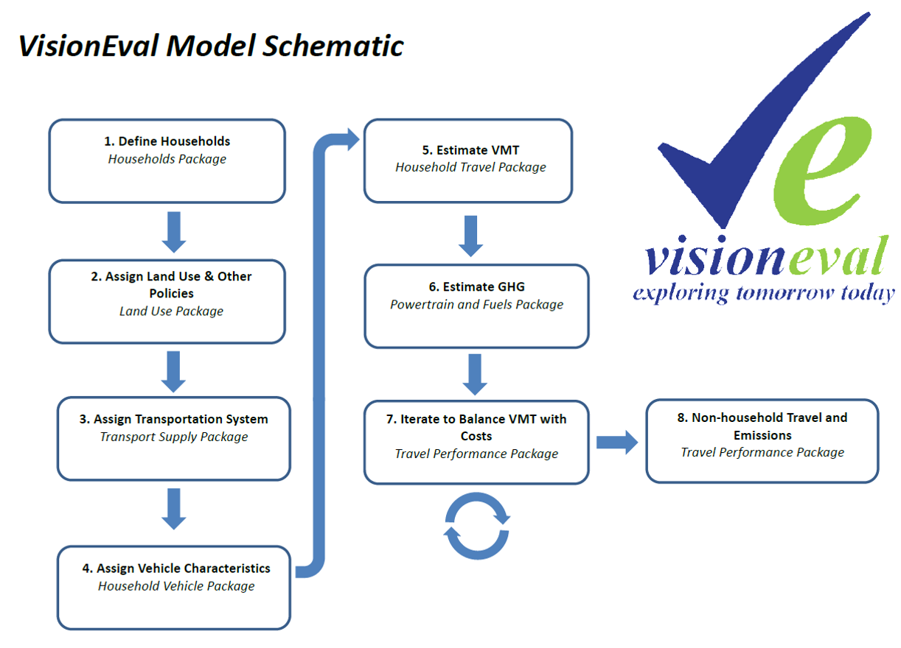
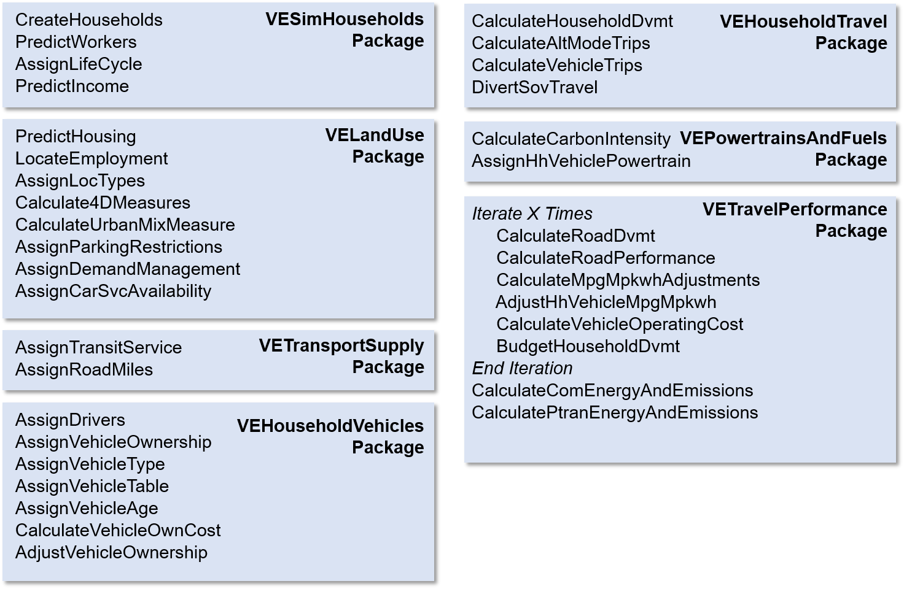
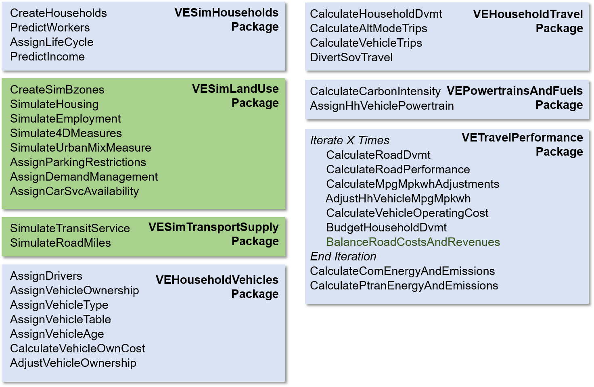
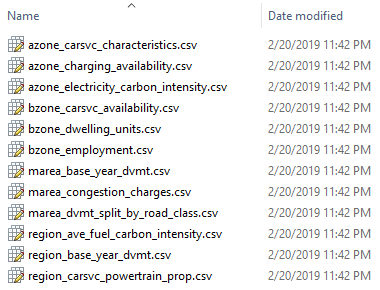
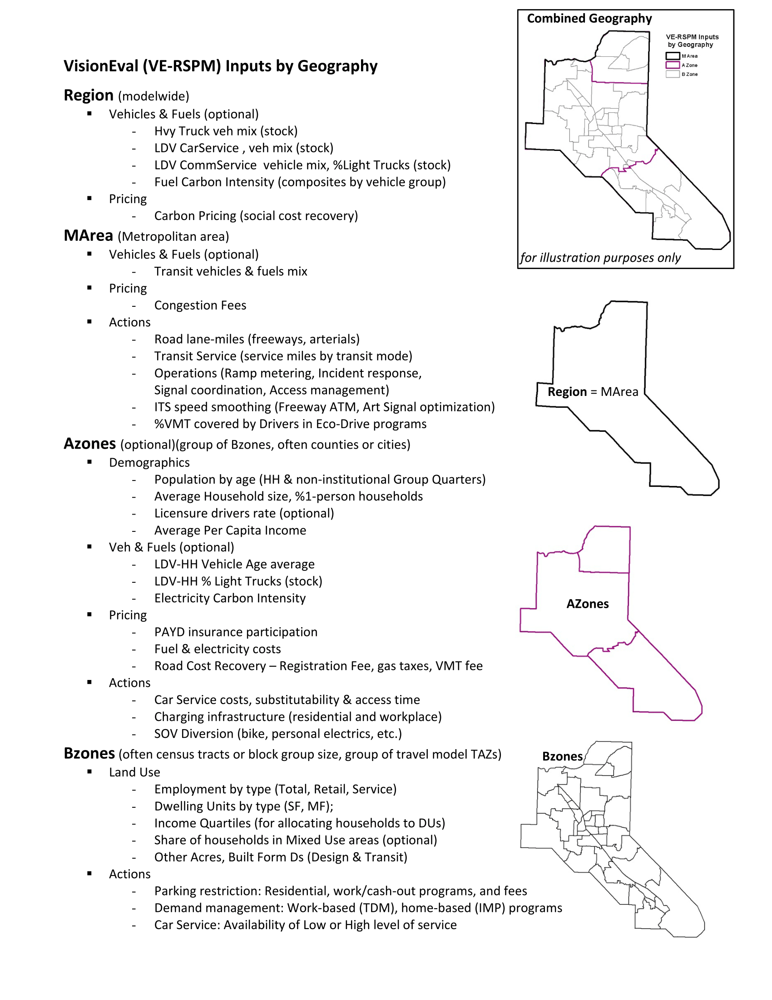

# 1. RSPM Design Considerations: Basic Concepts and Terminology

## 1.1. Model System Goals

- Support strategic modeling

    -   Broad scope

    -   Fast to support modeling many futures

- Modular

    -   Share components between models

    -   Can be modified and extended

- Open science approach

    -   Reproducible - data and source code included

    -   Open source licensing

- Customizable

    -   Regional data can be used in model estimation

- Built in error checking

    -   Detailed specifications for all data

    -   Check model and user inputs prior to running model

    -   Module test system

## 1.2. Basic Structure of Model System

- Modules are building blocks of models. Modules implement sub-models such as:

    -   Sub-model to predict number of drivers in household

    -   Sub-model to predict number of vehicles owned by household

- Modules are contained in R packages (more on this below)

    -   A package groups together related modules

    -   For example: VESimHouseholds package contains modules that create households and assign number of persons by age, number of workers by age, life cycle, and household income

- Models like VE-RSPM are composed of:

    -   A script that identifies the order of execution of modules

    -   A set of input files

    -   Several model definition files

- Model data is saved in a central datastore

**Structure of Datastore**

```    
|____Global
|    |____Model
|    |        ...
|    |
|    |____Azone
|    |        ...
|    :
|
|____2010  
|    |____Region
|    |        ...
|    |
|    |____Azone
|    |        Azone
|    |        Marea
|    |        Age0to14
|    |        Age15to19
|    |        Age20to29
|    |        Age30to54
|    |        Age55to64
|    |        Age65Plus
|    |        ...
|    |
|    |____Bzone
|    |        ...
|    |
|    |____Marea
|    |        ...
|    |
|    |____Household
|    |        ...
|    |
|    |____Worker
|    |        ...
|    |
|    |____Vehicle
|    |        ...
|    :
|
|
|____2050  
|    |____ ...
|    |        ...
:    :

```

## 1.3 Model System Implementation in R Language

-   VisionEval is implemented entirely in the R programming language  


-   R is one of the premier computer languages for data science (built for that purpose)  


-   Multi-OS (Windows, Apple, Linux)  


-   Packages are structured containers for R code and associated data

    -   Basically a hierarchical set of folders having defined structures

    -   Some required files

    -   Contains code and data

-   Key Terms

    -   Source Package

        -   Contains the source code (i.e. human readable programs)

        -   Can modify the source package to customize modules

        -   Is built (installed) before it can be used

    -   Installed Package

        -   Building a package runs the source code and saves data and functions

        -   Includes documentation of the data and functions

        -   Is ready to be used in programs

## 1.4 Module Documentation

-   Standard module documentation describes

    -   Model estimation

    -   How module works

    -   Module inputs

    -   Data module uses

    -   Data module produces

-   Where to find

    -   inst/module_docs folder in source package
    
    -   module_docs folder in installed package

    -   [Module documentation example](https://github.com/gregorbj/VisionEval/blob/master/sources/modules/VESimHouseholds/inst/module_docs/CreateHouseholds.md) 

## 1.5 Geographic Structure of a VisionEval Model

-   **Region**: The model area such as metropolitan planning area or state

    -   Inputs common to all places in model. For example:

        -   Heavy truck and other commercial vehicle characteristics

-   **Azone**: Large-scale zones such as cities, counties, or PUMAs

    -   Most inputs other than those related to land use or metropolitan area characteristics are at this level. For example:

        -   Population characteristics

-   **Bzone**: Subdivisions of Azones representing neighborhoods such as census block groups (can be synthesized)

    -   Inputs that represent land use characteristics or land use related policy. For example:

        -   Dwelling units by type and employment by type

-   **Czone**: Subdivisions of Bzones representing developmentS (*NOTE: NOT USED CURRENTLY*)

-   **Marea**: Groups of Azones that are associated with a common urbanized area

    -   Inputs that represent shared metropolitan characteristics. For example:

        -   Freeway lane-miles and transit revenue-miles

-   **Location Type**: Not a geographic area but defines whether households are located in an *Urban* (i.e. urbanized area), *Town*, or *Rural* area.

-   **Place Type**: Not a geographic area but defines the level of urbanization (area type) and the mixing of jobs and housing (development type)

    -   Used in Bzone synthesis

## 1.6 Modules and Packages Used in Models

### VisionEval Model Schematic


### VE-RSPM Modules and Packages


### VE-State Modules and Packages


## 1.7 Basic Model Setup

### Models like VE-RSPM are composed of:

-   A model run script that identifies the order of execution of modules

-   A set of input files

-   Several model definition files

### The model run script is readable even if you are not a programmer

```
#===========
#run_model.R
#===========

#--------------
#Load libraries
#--------------
library(visioneval)

#----------------
#Initialize model
#----------------
initializeModel(
  ParamDir = "defs",
  RunParamFile = "run_parameters.json",
  GeoFile = "geo.csv",
  ModelParamFile = "model_parameters.json",
  LoadDatastore = FALSE,
  DatastoreName = NULL,
  SaveDatastore = TRUE
  )  

#----------------------------------
#Run module for all model run years
#----------------------------------
for(Year in getYears()) {
  runModule(ModuleName = "CreateHouseholds", 
            PackageName = "VESimHouseholds",       
            RunFor = "AllYears", RunYear = Year)
  runModule(ModuleName = "PredictWorkers",  
            PackageName = "VESimHouseholds",
            RunFor = "AllYears", RunYear = Year)
  runModule(ModuleName = "AssignLifeCycle", 
            PackageName = "VESimHouseholds",
            RunFor = "AllYears", RunYear = Year)
  runModule(ModuleName = "PredictIncome", 
            PackageName = "VESimHouseholds",
            RunFor = "AllYears", RunYear = Year)
  runModule(ModuleName = "PredictHousing", 
            PackageName = "VELandUse",
            RunFor = "AllYears", RunYear = Year)
  runModule(ModuleName = "LocateEmployment", 
            PackageName = "VELandUse",
            RunFor = "AllYears", RunYear = Year)
  runModule(ModuleName = "AssignLocTypes", 
            PackageName = "VELandUse",
            RunFor = "AllYears", RunYear = Year)
  runModule(ModuleName = "Calculate4DMeasures", 
            PackageName = "VELandUse",
            RunFor = "AllYears", RunYear = Year)
  runModule(ModuleName = "CalculateUrbanMixMeasure", 
            PackageName = "VELandUse",
            RunFor = "AllYears", RunYear = Year)
  runModule(ModuleName = "AssignParkingRestrictions", 
            PackageName = "VELandUse",
            RunFor = "AllYears", RunYear = Year)
  runModule(ModuleName = "AssignDemandManagement", 
            PackageName = "VELandUse",
            RunFor = "AllYears", RunYear = Year)
  runModule(ModuleName = "AssignCarSvcAvailability", 
            PackageName = "VELandUse",
            RunFor = "AllYears", RunYear = Year)
  runModule(ModuleName = "AssignTransitService", 
            PackageName = "VETransportSupply",
            RunFor = "AllYears", RunYear = Year)
  runModule(ModuleName = "AssignRoadMiles", 
            PackageName = "VETransportSupply",
            RunFor = "AllYears", RunYear = Year)
  runModule(ModuleName = "AssignDrivers", 
            PackageName = "VEHouseholdVehicles",
            RunFor = "AllYears", RunYear = Year)
  runModule(ModuleName = "AssignVehicleOwnership", 
            PackageName = "VEHouseholdVehicles",
            RunFor = "AllYears", RunYear = Year)
  runModule(ModuleName = "AssignVehicleType", 
            PackageName = "VEHouseholdVehicles",
            RunFor = "AllYears", RunYear = Year)
  runModule(ModuleName = "CreateVehicleTable", 
            PackageName = "VEHouseholdVehicles",
            RunFor = "AllYears", RunYear = Year)
  runModule(ModuleName = "AssignVehicleAge", 
            PackageName = "VEHouseholdVehicles",
            RunFor = "AllYears", RunYear = Year)
  runModule(ModuleName = "CalculateVehicleOwnCost", 
            PackageName = "VEHouseholdVehicles",
            RunFor = "AllYears", RunYear = Year)
  runModule(ModuleName = "AdjustVehicleOwnership", 
            PackageName = "VEHouseholdVehicles",
            RunFor = "AllYears", RunYear = Year)
  runModule(ModuleName = "CalculateHouseholdDvmt", 
            PackageName = "VEHouseholdTravel",
            RunFor = "AllYears", RunYear = Year)
  runModule(ModuleName = "CalculateAltModeTrips", 
            PackageName = "VEHouseholdTravel",
            RunFor = "AllYears", RunYear = Year)
  runModule(ModuleName = "CalculateVehicleTrips", 
            PackageName = "VEHouseholdTravel",
            RunFor = "AllYears", RunYear = Year)
  runModule(ModuleName = "DivertSovTravel", 
            PackageName = "VEHouseholdTravel",
            RunFor = "AllYears", RunYear = Year)
  runModule(ModuleName = "CalculateCarbonIntensity", 
            PackageName = "VEPowertrainsAndFuels",
            RunFor = "AllYears", RunYear = Year)
  runModule(ModuleName = "AssignHhVehiclePowertrain", 
            PackageName = "VEPowertrainsAndFuels",
            RunFor = "AllYears", RunYear = Year)
  for (i in 1:2) {
    runModule(ModuleName = "CalculateRoadDvmt", 
            PackageName = "VETravelPerformance",
            RunFor = "AllYear", RunYear = Year)
    runModule(ModuleName = "CalculateRoadPerformance", 
            PackageName = "VETravelPerformance",
            RunFor = "AllYears", RunYear = Year)
    runModule(ModuleName = "CalculateMpgMpkwhAdjustments", 
            PackageName = "VETravelPerformance",
            RunFor = "AllYears", RunYear = Year)
    runModule(ModuleName = "AdjustHhVehicleMpgMpkwh", 
            PackageName = "VETravelPerformance",
            RunFor = "AllYears", RunYear = Year)
    runModule(ModuleName = "CalculateVehicleOperatingCost", 
            PackageName = "VETravelPerformance",
            RunFor = "AllYears", RunYear = Year)
    runModule(ModuleName = "BudgetHouseholdDvmt", 
            PackageName = "VETravelPerformance",
            RunFor = "AllYears", RunYear = Year)
    runModule(ModuleName = "BalanceRoadCostsAndRevenues", 
            PackageName = "VETravelPerformance",
            RunFor = "AllYears", RunYear = Year)
  }
  runModule(ModuleName = "CalculateComEnergyAndEmissions", 
            PackageName = "VETravelPerformance",
            RunFor = "AllYears", RunYear = Year)
  runModule(ModuleName = "CalculatePtranEnergyAndEmissions", 
            PackageName = "VETravelPerformance",
            RunFor = "AllYears", RunYear = Year)
}

```

## 1.7. Model Definition Files

### run_parameters.json 
**Defines parameters that control the model run**

```
{
  "Model": "RVMPO VERSPM Version 1",
  "Scenario": "Adopted Plans",
  "Description": "Base year and 2038 representing adopted plans",
  "Region": "RVMPO",
  "BaseYear": "2010",
  "Years": ["2010", "2038"],
  "DatastoreName": "Datastore",
  "DatastoreType": "RD",
  "Seed": 1,
  "RequiredVEPackages": [
    "VESimHouseholds",
    "VELandUse",
    "VETransportSupply",
    "VEHouseholdVehicles",
    "VEHouseholdTravel",
    "VEPowertrainsAndFuels",
    "VETravelPerformance"
  ]
}
```
---
### model_parameters.json
**Defines global model parameters**
```
[
  {"NAME": "ValueOfTime", 
   "VALUE": "16", 
   "TYPE": "currency", 
   "UNITS": "base cost year dollars per hour"
  }
]
```
---
### geo.csv
**Defines Azones, Bzones, Mareas and their relationships**

|Azone|Bzone        |Czone|Marea|
|:---:|:-----------:|:---:|:---:|
|RVMPO|D410290001001|NA   |RVMPO|
|RVMPO|D410290001002|NA   |RVMPO|
|RVMPO|D410290002011|NA   |RVMPO|
|RVMPO|D410290002012|NA   |RVMPO|
|RVMPO|D410290002013|NA   |RVMPO|
|RVMPO|D410290002021|NA   |RVMPO|
|RVMPO|D410290002022|NA   |RVMPO|
|RVMPO|D410290002023|NA   |RVMPO|
|RVMPO|D410290002031|NA   |RVMPO|
|RVMPO|D410290002032|NA   |RVMPO|
|RVMPO|D410290002033|NA   |RVMPO|
|...  |...          |...  |...  |

---
### deflators.csv
**Defines deflators used to converting money inputs (e.g. fuel price) for current and past years to base year values**

|Year|Value|
|:--:|:---:|
|2000|178  |
|2005|196  |
|2010|218.3|
|2015|244.2|

---
### units.csv
**Defines default units for complex data types**

|Type      |Units|
|:--------:|:---:|
|currency  |USD  |
|distance  |MI   |
|area      |SQMI |
|mass      |KG   |
|volume    |GAL  |
|time      |DAY  |
|energy    |GGE  |
|people    |PRSN |
|vehicles  |VEH  |
|trips     |TRIP |
|households|HH   |
|employment|JOB  |
|activity  |HHJOB|

## 1.8. Input Files

#### All input files are 'csv-formatted' text files


#### Names of files identify the level of geography that they apply to



#### Files have headers that identify dataset names. In addition they may have **Year** and **Geo** fields in the following circumstances:
-   Must have a **Year** column when inputs vary by model year
-   Must have a **Geo** column when inputs vary by geographic area (i.e. other than region inputs)

**Example: bzone_dwelling_units.csv**

|Geo          |Year|SFDU|MFDU|GQDU|
|-------------|----|----|----|----|
|D410290014002|2010|559 |0   |0   |
|D410290013012|2010|79  |8   |523 |
|D410290014001|2010|1398|180 |0   |
|D410290014003|2010|1385|172 |0   |
|D410290013021|2010|271 |0   |0   |
|D410290013025|2010|563 |0   |0   |
|...          |... |... |... |... |
|D410290014002|2038|825 |32  |0   |
|D410290013012|2038|105 |12  |523 |
|D410290014001|2038|3895|511 |0   |
|D410290014003|2038|3072|1052|0   |
|D410290013021|2038|218 |0   |0   |
|D410290013025|2038|992 |114 |0   |
|...          |... |... |... |... |

**Example: region_co2e_costs.csv**

|Year|CO2eCost.2010|
|----|-------------|
|2010|75           |
|2038|150          |


**Example: marea_base_year_dvmt.csv**

|Geo  |UzaNameLookup|UrbanLdvDvmt|UrbanHvyTrkDvmt|
|-----|-------------|------------|---------------|
|RVMPO|Medford/OR   |NA          |NA             |


#### Field names can have modifiers to denote money year (for converting input to base year money values) and magnitude

**Example: region_road_cost.csv**

|Year|RoadBaseModCost.2005|RoadPresOpMaintCost.2005|RoadOtherCost.2005|FwyLnMiCost.2005.1e3|ArtLnMiCost.2005.1e3|HvyTrkPCE|
|----|--------------------|------------------------|------------------|--------------------|--------------------|---------|
|2010|0.004               |0.01                    |0.015             |4900                |1800                |3        |
|2038|0.004               |0.01                    |0.015             |4900                |1800                |3        |

#### Things to watch out for

-   Inputs required for every combination of model run year and geographic area

-   Column names must exactly match specifications (*show where to look for input file specifications in documentation*)

-   No data for years other than model run year

-   No data for area other than those defined in **geo.csv** file
    
#### Summary of RSPM inputs by geography



Built in Model Checking and Input File Checking
-----------------------------------------------

-   VisionEval will check the model run script to determine that data used by each module will be available when the module is run

-   VisionEval reads in and checks all input files prior to executing any modules

-   Checking is carried out by the **initializeModel** function (*show in model run script*). There is no way to skip this.

-   Examples of error messages (*show examples*)

**Console error message**
```
[1] "2019-03-12 15:17:32 -- Initializing Model."
Error in initializeModel(ParamDir = "defs", RunParamFile = "run_parameters.json",  : 
  Input files have errors. Check the log for details.
```

**Error messages in log file**
```
2019-03-12 15:18:02 : Input file error for module 'AssignVehicleType' for input file 'azone_hh_lttrk_prop.csv'. Has one or more errors in the data inputs as follows: 

2019-03-12 15:18:02 : Data in data name 'LtTrkProp' includes values matching PROHIBIT condition (>= 1). 

2019-03-12 15:18:02 : The value of carbon intensity for Electricity is not supplied in 'model_fuel_co2.csv' so using the default values for carbon intensity 

2019-03-12 15:18:02 : Input file field name errors as follows: 

2019-03-12 15:18:02 : Field name PropGQ does not parse to a name that can be recognized as one of the names specified for the input file azone_charging_availability.csv 

2019-03-12 15:18:02 : One or more fields that must be in input file azone_charging_availability.csv are not present. The missing field(s) are: PropGQChargingAvail 

2019-03-12 15:18:02 : Input file error for module 'PredictHousing' for input file 'bzone_dwelling_units.csv'. Is missing inputs for the following Year/Bzone combinations: 2010/D410290013012, 2010/D410290013021, 2010/D410290013025, 2010/D410290014001, 2010/D410290014002, 2010/D410290014003 
```

Summary of VE-RSPM Changes from RSPM & GreenSTEP
================================================

1.  New module to simulate number of workers by age group in each household. Simulation method includes ability to adjust employment rate by age group. Done at the Azone (division) level. [***PredictWorkers module***]

2.  Improved model to simulate household income by using number of workers by age group instead of the number of persons by age group. [***PredictIncome module***]

3.  Improved model to assign households to housing types and to Bzones in the metropolitan area. This model runs much faster and unlike the previous method is repeatable (i.e. produces the same results every time). The number of housing types is reduced to 2 (single-family, multifamily). [***PredictHousing module***]

4.  New module which balances employment with workers and assigns household workers to Bzone job locations using a gravity model. Assigning work locations improves abilities to model parking and travel demand mangement policies. [***LocateEmployment module***]

5.  New module which calculates a number of 4D (density, diversity, design, destination accessibility) measures. The outputs provide useful performance measures. The module was created to support the new multi-modal travel module which is yet to be integrated into RSPM. [***Calculate4DMeasures module***]

6.  Improved model of parking pricing. The model includes parking restrictions/pricing for residential parking. Work parking pricing input at the Bzone level and assigned to households based on where household workers work. Gravity model used for non-work parking pricing to assign to households based on their likelihood to travel to destinations that have paid parking. [***AssignParkingRestrictions module***]

7.  Improved travel demand management policy assignment. Employee commute options programs assigned to Bzone work locations. This translates back to households based on where household workers work. [***AssignDemandManagement module***]

8.  Simpler model for assigning the availability of car services (e.g. car sharing, TNC, taxi). 'High' or 'Low' car service availability assigned at Bzone level. High car service means access is similar to access of private vehicle use. Low car service means that is not similar. [***AssignCarSvcAvailability module***]

9.  More straightforward method of establishing future transit service levels (revenue miles) which is the same as used in current GreenSTEP model. 8 transit modes are recognized. Bus-equivalents are automatically calculated. Transit service is converted into 3 transit vehicle types (van, bus, rail) which are used in calculation of transit emissions. [***AssignTransitService module***]

10. New model to simulate the number of drivers in each household by age group. The new driver variable replaces the driving age persons variable in several models. The user can input a relative change in driver licensing rate relative to the model estimation year (2001) to test the effect of reported or hypothesized change. For example, the user could test what effect the lower driver licensing rate of the Millenial generation would have on VMT. [***AssignDrivers module***]

11. Vehicle ownership model was reestimated using the new driver variable. The reestimated model also includes housing type variable (single-family vs. multifamily). [***AssignVehicleOwnership module***]

12. Vehicle type (auto vs. light truck) model was reestimated. The reestimated model includes housing type variable. [***AssignVehicleType module***]

13. Households are also assigned a number of virtual car-service vehicles for the difference between the number of owned vehicles and number of driving age persons in the household. These virtual vehicles are assigned the car-service level for the Bzone in which the household is located (High vs. Low). This is part of the new methodology in the model that was developed to support the modeling of future scenarios where the deployment and use of autonomous taxis is widespread. [***CreateVehicleTable module***]

14. Vehicle age model has a more understandable method for the user to specify changes to the fleet vehicle age. Instead of specifying changes to the base year 95th percentile age, the user simply specifies the average vehicle age. [***AssignVehicleAge module***]

15. Improved model for calculating vehicle ownership cost. This model also includes the cost of residential parking in the cost of vehicle ownership. [***CalculateVehicleOwnCost module***]

16. New model adjusts vehicle ownership by comparing the cost of owning each household vehicle per mile of travel with the cost of using car-services where the car-service level is 'High'. The cost of car-services is a user input. The user also inputs values for the assumed likelihood that a household would substitute car service use for a household vehicle where the cost is lower (separate values are specified for autos and light trucks). This approach is simpler and better than the approach developed for the ARC version of RSPM. [***AdjustVehicleOwnership module***]

17. DVMT model was reestimated to use the new drivers variable instead of driving age persons variable. The model also includes zero-vehicle and one-vehicle dummy variables to improve the modeling of the observed non-linear response of household DVMT to number of vehicles owned. Access to high-level car services is treated like vehicle ownership in the model. [***CalculateHouseholdDvmt module***]

18. Models are included for calculating the number of trips by public transit, by bicycling, and by walking (these models are also included in the newest RSPM version but not GreenSTEP). [***CalculateAltModeTrips module***]

19. New model to predict the number of household vehicle trips. This is used in the new model to calculate vehicle use costs. [***CalculateVehicleTrips module***]

20. Several improvements to the model to calculate diversion of single-occupant vehicle SOV travel to light-weight vehicles (bicycles, electric bicycles, electric scooters, etc.). Improved the model form and reestimated. Included a model to predict household average SOV trip length. Also improved how the reductions are allocated to households to be more sensible (based on average SOV trip length as well as the amount of SOV travel). Diverted trips are now added to the trip counts for bicycle mode. [***DivertSovTravel module***]

21. Simplified the user fuel and vehicle powertrain inputs by making vehicle model year inputs for autos and light-trucks part of package data. Alternate packages will be made available for different scenarios regarding how the light-duty vehicle fleet might evolve over time (e.g. business as usual, CAFE, zero-emission vehicle scenarios). The user will choose a scenario by choosing the package to use in the model run script. In addition several user inputs are available for specifying vehicle and fuel parameters for public transit vehicles, average fuel carbon intensity, etc. [***VEPowertrainsAndFuels package***]

22. The model for assigning vehicle powertrains (ICEV, HEV, PHEV, BEV) now includes consideration of charging availability in determining whether a household vehicle is a PHEV or BEV. The user provides predictions of the proportions of households that have charging availability by Azone and housing type (single-family, multifamily). [***AssignHhVehiclePowertrain module***]

23. Information is provided on roadway DVMT by state and urbanized areas including heavy truck DVMT per capita by state, heavy truck DVMT per capita by urbanized area, LDV DVMT per capita by urbanized area, and DVMT proportions by urbanized area, vehicle type (LDV, heavy truck, bus), and road class (freeway, arterial, other). These inputs were challenging to obtain in developing RSPM and GreenSTEP models. The user can now either provide the information or can specify a state and urbanized area and the model will use the built in data. [***VETravelPerformance package***]

24. Cleaned up and better documented procedures for predicting road performance (i.e. congestion and speeds). [***CalculateRoadPerformance module***]

25. Improved model for calculating vehicle use cost and model for allocating vehicle travel among household vehicles and between household vehicles and car services. Vehicle travel is allocated as a function of the inverse of the composite cost per mile for using each vehicle (including virtual car service vehicles). The composite cost includes all the out-of-pocket costs for each vehicle (e.g. gas, fuel tax, parking, car-service per-mile charge) and the value of time for time in transit and vehicle access. The overall weighted average cost is calculated for each household to use in the travel budget model. [***CalculateVehicleOperatingCost module***]

26. The travel budget model was improved by establishing budget percentages which vary with income rather than being a fixed percentage of income. In addition to updating household DVMT, this module computes the household vehicle trips, alternate mode trips, and the emissions from household vehicle travel. [***BudgetHouseholdDvmt module***]

27. Consistent input formats and methods were created for calculating emissions from commercial and public transit vehicles. [***VEPowertrainsAndFuels & VETravelPerformance packages***]

28. The model automatically handles deflation of money values. There is no need to pre-process money values to put in base year terms. The user just inputs a set of deflator values (Oregon data is included in example model) and specifies the data year in the input field name.

VESimHouseholds Package
=======================

-   Modules create a set of simulated households for model run years. Each household has:

    -   Number of persons by age group: 0-14, 15-19, 20-29, 30-54, 55-64, 65+

    -   Number of workers by age group: 15-19, 20-29, 30-54, 55-64, 65+

    -   Life cycle ...

    -   Annual income

-   Uses Census PUMS (public use micro-sample) data but rather than drawing samples from the PUMS dataset, a technique often used in population synthesis, it applies sequential models as explained below.

CreateHouseholds Module
-----------------------

### What the Module Does

-   Creates synthetic households having numbers of persons in each of the 6 age groups

-   Models two types of households:

    -   Regular households - related and unrelated persons living in the same dwelling unit but not including persons living in non-institutional group quarters

    -   Group quarters households - persons living in non-institutional group quarters such as college dorm

### User Inputs

-   Azone level forecast of number of persons by age group for regular households

-   Optional Azone level forecast of average household size for regular households (if value provided, model will adjust composition to match, enter NA if no target)

-   Optional Azone level forecast of proportion of regular households that are single-person households (if value provided, model will adjust composition to match, enter NA if no target)

-   Azone level forecast of number of persons by age group for group quarters households (can be 0)

### Model Estimation

-   Census PUMS (public use micro-sample) data are used to tabulate the probability that a person in one of the 6 age groups would be found in each of hundreds of household types.

    -   A household type is identified by the number of persons in each of the 6 age groups. For example:

        -   1-1-0-2-0-0 is a household in which there is one person age 0-14, one person age 15-19, and two persons age 30-54 in the household

        -   0-0-0-0-0-2 is a household in which there are 2 persons age 65+ in the household

    -   Very uncommon household types are not included (% cutoff)

-   The PUMs data in the VESimHousehold package is Oregon data. The user may substitute PUMs data for their region instead in the source package. Then when the package is built, the tabulation will reflect their region.

### How the Module Works

-   To create regular households, the module uses a iterative matrix balancing process to allocate persons by age to each of the household types identified in the estimated model such that all persons by age in the user inputs are accounted for and the number of persons by age group assigned to each household type are consistent. For example, for household type 2-0-2-0-0-0 is would be inconsistent to have an allocation of 30 persons age 0-14 and 40 persons age 20-29 assigned to the household type. Balancing process in summary is as follows:

    -   The model probabilities are used to allocate persons to each household type

    -   The number of households of each housing type is calculated from the number of persons assigned in each age group, Inconsistencies are reconciled by taking the mean. With the example above, the number of households of type 2-0-2-0-0-0 could be 15 or 20, The mean is 17.5 which is rounded to 18.

    -   The number of person by age assigned to each household type is recalculated.

    -   The probabilities of persons by age in each household type are updated.

    -   The total number of persons by age given the number of households by type is calculated and the difference with the inputs of persons by age is calculated.

    -   The process is repeated for allocating the difference in persons by age. This is done until the difference is very small. The resulting age distribution won't exactly equal the input, but will be very close.

-   If the user supplies targets for average household size and/or proportion of one person households, the algorithm adjusts the probabilities to arrive at a result that is close to the target(s).

-   Simulated regular households are created from the resulting number of households by type. So for example, if there are 42 households of type 2-0-2-0-0-0, 42 records would be created in the datastore with the characteristics of these households.

-   Simulated non-institutional group quarters households are simulated as single-person households

----

PredictWorkers Module
---------------------

### What the Module Does

-   Predicts the number of workers by age group in each simulated household

### User Inputs

-   Optional **azone_relative_employment.csv** file specifies the employment rate by age and Azone relative to the employment rate for the model estimation data year. For example if the model estimation year data is 2000 and in 2010 the employment rate for workers age 20-29 is 90% of the 2000 employment rate in 2000 then the input would be 0.9.

### Model Estimation

-   Census PUMS (public use micro-sample) data are used to tabulate the probability that a person in each age group in each household type is employed.

### How the Module Works

-   The number of workers in each age group of each household is determined through random sampling using the probability for the age group and household type. For example, if a household is of the type *2-0-2-0-0-0*, and the probability that a person of age 20-29 in this household type is a worker is 0.7, then two random samples are taken for this household with a probability of success of 0.7 to determine the number of workers in this age group in the household.

-   If the user has supplied optional inputs for the ratio of employment for the age group in the forecast year relative to the year of the model estimation dataset, that input is multiplied by the estimated worker probability to determine the sampling probability. For example, if the year of the model estimation data is 2000 and the forecast year is 2010, and if the user specifies that the employment rate of 20-29 year olds in 2010 was 95% of the employment rate of that age group in 2000, then the worker probability in the example above (0.7) is multiplied by 0.95 to calculate the sampling probability.

----

AssignLifeCycle Module
----------------------

### What the Module Does

-   Life cycle categorizes households by age structure and employment status.

-   Used in the forthcoming multi-modal travel module

-   VisionEval life cycle categories are a subset of the categories in the National Household Travel Survey (NHTS)

    -   01: one adult, no children

    -   02: 2+ adults, no children

    -   03: one adult, children (corresponds to NHTS 03, 05, and 07)

    -   04: 2+ adults, children (corresponds to NHTS 04, 06, and 08)

    -   09: one adult, retired, no children

    -   10: 2+ adults, retired, no children

### User Inputs

-   None

### Module Estimation

-   There are no estimated module parameters

### How the Module Works

-   Rules are used to determine the life cycle category of each household based on the number of persons by age category and number of workers by age category

-   Persons in the 15-19 age category are considered children is there are older persons in the household and adults if there are no older persons in the household

-   Households are considered to be populated with retired persons if all the adults are in the 65+ age category and there are no workers.

-   If children are present in the household with retired persons, then the life cycle category is 03 or 04 rather than 09 or 10.

PredictIncome Module
--------------------

### What the Module Does

-   This module predicts the income for each simulated household given the number of workers in each age group and the average per capita income for the Azone where the household resides.

### User Inputs

-   **azone_per_cap_inc.csv** file specifies the average per capita income for regular households and for persons in non-institutional group quarters by Azone and model run year

### Module Estimation

-   Household income models are estimated for regular households and for group quarters households.

-   The household income models are estimated using Census public use microsample (PUMS) data.

-   The household income models are linear regression models in which the dependent variable is a power transformation of income.

    -   Power transformation is needed in order to normalize the income data distribution which has a long right-hand tail.

    -   The power transform is found which minimizes the skewness of the income distribution.

-   Independent variables are:

    -   Power transformed average per capita income for the Azone

    -   Number of workers in each of the 20-29, 30-54, and 55-64 age categories

    -   Interaction of workers by age and average per capita income

    -   Interaction of persons in the 65+ age category and average per capita income

-   A random term (standard deviation) is estimated so that the distribution of estimated incomes matches the observed distribution

### How the Module Works

-   The linear model is applied to each household to predict the expected mean income value for the household characteristics, and then a sample is drawn from a normal distribution based on the expected mean is the random term.

-   The random term is adjusted so that the resulting per capita income for the synthetic households in the Azone matches the per capita income input.

VELandUse Package
=================

-   Modules assign households to Bzone residence locations and workers to Bzone job locations

-   Modules calculate land use attributes that are used in other modules (e.g. density of development, land use mixing)

-   Modules assign Bzone level policy inputs: parking, travel demand management, car service availability

PredictHousing Module
---------------------

### What the Module Does

-   This module assigns a housing type, either single-family (SF) or multifamily (MF) to regular households based on the respective supplies of SF and MF dwelling units in the Azone where the household resides.

-   Each household is assigned to a Bzone based on the supply of housing units by type in each Bzone and the relative costliness of housing (see below).

-   The module assigns non-institutional group quarters households to Bzones based on the supply of group quarters units by Bzone.

### User Inputs

-   **bzone_dwelling_units.csv** file identifies the numbers of single-family dwelling units, multifamily dwelling units, and group quarters units by Bzone and model run year.

-   **bzone_hh_inc_qrtl_prop.csv** file the distribution of households by Azone income quartile by Bzone and model run year.

### Module Estimation

-   A binomial logit model is used to assign housing types to households. The model is estimated using a Census Public Use Microsample (PUMS).

-   The binomial logit model predicts the likelihood that a household will reside in a single-family dwelling as a function of:

    -   Age group of the head of the household (oldest age group),

    -   Ratio of the natural log of the household income to the natural log of the mean household income (log income ratio),

    -   Household size,

    -   Interaction of the log income ratio and household size. The age group of the head of household is the oldest age group in the household.

### How the Module Works

-   The module carries out the following series of calculations to assign a housing type (SF or MF) to each regular household and to assign each household to a Bzone location.

    -   The proportions of SF and MF dwelling units in the Azone are calculated.

    -   The binomial logit is applied to each household in the Azone to determine the household's housing type. The model is applied multiple times using a binary search algorithm to successively adjust the model intercept until the housing type choice proportions equal the housing unit proportions in the Azone.

    -   The income quartile of each household in the Azone is calculated and a tabulation of households by income quartile and housing type is made.

    -   A matrix of the number of housing units by Bzone and housing type is created from the user inputs (e.g. resulting from a land use model or other allocation process). Because the number of housing units may not equal the number of households, the number of units by type and Bzone are adjusted so that the total number by type equals the number of households by housing type.

    -   A matrix of the proportions of households by income quartile and Bzone is created from the user inputs (e.g. resulting from Census tabulation with adjustments as deemed appropriate) and the tabulation of housing units by Bzone.

    -   An iterative proportional fitting (IPF) process is used to balance the number of housing units over 3 dimensions: Bzone, unit type, and income quartile. Two matrices are used as margin control totals for the balancing process. The first is the matrix of demand by housing type and income quartile. The second is a matrix of units by Bzone and housing type. The seed matrix for the IPF uses the matrix of household proportions by Bzone and income quartile. The IPF is constrained to produce whole numbers.

    -   After the number of housing units is allocated to each Bzone, housing type, and income quartile, households are allocated to Bzones to fill those units. This is done by iterating through each housing type and income quartile combination and doing the following:

        -   Extracting a vector of units by Bzone for the type and quartile combination;

        -   Using the vector as replication weights to replicate the Bzone names;

        -   Randomizing the Bzone name vector;

        -   Assigning the randomized Bzone name vector to households matching the type and quartile combination.

-   Non-institutionalized group-quarters households are assigned randomly to Bzones based on the number of group-quarters housing units in each Bzone.

LocateEmployment Module
-----------------------

### What the Module Does

-   This module places employment in Bzones based on input assumptions of employment by type and Bzone.

-   The model adjusts the employment numbers to balance with the number of workers in the region.

-   The module creates a worker table and assigns workers to Bzone employment locations as a function of the number of jobs in each Bzone and the inverse of distance between residence and employment Bzones.

### User Inputs

-   **bzone_employment.csv** file identifies the number of total jobs, retail jobs, and service jobs by Bzone and model run year.

-   **bzone_lat_lon.csv** file lists the latitudes and longitudes of the centroids of each Bzone.

### Module Estimation

-   This module has no estimated model parameters.

### How the Module Works

-   The number of workers by residence Bzone is tabulated.

-   The number of jobs by Bzone and category (retail, service, total) for the Marea are scaled so that the total jobs in the Marea equals the total workers residing in the Marea.

-   A matrix of distances between Bzones in the Marea is calculated from the latitude and longitude positions of the Bzone centroids.

-   An iterative proportional fitting (IPF) process is used to create a balanced matrix of the number of workers in each residence zone and employment zone pair. The IPF margins are the tabulations of workers by Bzone and jobs by Bzone . The IPF seed matrix is the inverse of the values of the distance matrix.

-   Create a dataset of workers identifying their residence locations and assign them a work location by randomly assigning them to Bzones as constrained by the allocation of workers to jobs.

-   Identify the Azone and Marea of the worker job location and the distance from home to work.

AssignLocTypes Module
---------------------

### What the Module Does

-   This module assigns households to location types:

    -   Urban - located within an urbanized area

    -   Town - located in a smaller urban area that does not have enough population to qualify as an urbanized area

    -   Rural - located in an area characterized by low density dispersed development

### User Inputs

-   **bzone_urban-town_du_proportions.csv** file lists the proportions for single-family, multifamily, and group quarters dwelling units in each Bzone in each model run year that are in *Urban* locations, and the proportions that are in *Town* locations.

### Model Estimation

-   This module has no estimated parameters.

### How the Module Works

-   Each household in each Bzone is randomly assigned as *Urban*, *Town*, or *Rural* based on its housing type and urban/town/rural proportions of housing units of that housing type in that Bzone.

Calculate4DMeasures Module
--------------------------

### What the Module Does

-   This module calculates several 4D measures by Bzone including density, diversity (i.e. mixing of land uses), transportation network design, and destination accessibility. These measures are the same as or are similar to measures included in the Environmental Protection Agency's (EPA) Smart Location Database (SLD).

### User Inputs

-   **bzone_unprotected_area.csv** file lists the *Urban* area, *Town* area, and *Rural* area in each Bzone that is developable by model run year. Land that is developable excludes large water bodies and areas that are protected from being developed (e.g. park land).

-   **bzone_network_design.csv** file tabulates pedestrian-oriented intersections per square mile by Bzone and model run year. Pedestrian-oriented intersections are intersections having four or more legs of low-speed roads (<= 30 MPH) which permit pedestrian travel and other pedestrian paths.

### Model Estimation

-   This module has no estimated model parameters.

### How the Module Works

-   3 development density measures identified in the SLD are calculated using population, employment, and housing datasets and developable area inputs:

    -   D1B - population density

    -   D1C - employment density

    -   D1D - activity density (employment + households)

-   3 development diversity measures identified in the SLD are calculated using household and employment datasets:

    -   D2A_JPHH is the ratio of jobs to households in each Bzone.

    -   D2A_WRKEMP is the ratio of workers living in the zone to jobs located in the zone.

    -   D2A_EPHHM is an entropy measure calculated from the number of jobs by sector and number of households.

-   A destination accessibility measure (D5) is calculated as the harmonic mean of jobs within 2 miles and population within 5 miles of the Bzone centroid.

    -   2 * EmpIn2Mi * PopIn5Mi / (EmpIn2Mi + PopIn5Mi)

-   One pedestrian-oriented network design measures (D3bpo4) is an input.

CalculateUrbanMixMeasure Module
-------------------------------

### What the Module Does

-   This module calculates an urban mixed-use measure based on the 2001 National Household Travel Survey measure of the block group level urban/rural indicator. This measure developed by Claritas uses the density of the tract and surrounding tracts to identify the urban/rural context of the tract and identified 4 categories: urban, suburban, second city, town and rural. The *urban* category roughly corresponds to the inner portions of urbanized areas that are generally characterized by more urban and mixed-use development.

### User Inputs

-   **bzone_urban-mixed-use_prop.csv** file allows users to establish targets for the proportion of households in each Bzone that are located in urban mixed use neighborhoods. If the value *NA* is entered, the model will calculate the proportion (see below).

### Model Estimation

-   A binary logit model is used to calculate the probability that a household is located in an urban mixed-use neighborhood as a function of the population density of the Bzone that household resides in and the housing type of the household.

-   This model is estimated using a household dataset prepared from 2001 National Household Travel Survey public use datasets by the VE2001NHTS package.

### How the Module Works

-   For each household in each Bzone, the binomial logit model predicts the probability that the household resides in an urban mixed-use neighborhood. Random sampling using the probability determines whether the household is identified as residing in an urban mixed-use neighborhood.

-   If a target urban mixed-use proportion for the Bzone has been supplied by the user, the model is run repeatedly for households in the Bzone using a binary search algorithm to adjust the model intercept so that the modeled proportion is equal to the target.

AssignParkingRestrictions Module
--------------------------------

### What the Module Does

-   This module identifies parking restrictions and prices affecting households at their residences, workplaces, and other places they are likely to visit in the urban area. The module takes user inputs on parking restrictions and prices by Bzone and calculates for each household:

    -   The number of free parking spaces available at the household's residence

    -   Which workers pay for parking and whether their payment is part of a cash-out-buy-back program

    -   The cost of residential parking for household vehicles that can't be parked in a free space

    -   The cost for workplace parking

    -   The cost of parking for other activities such as shopping

### User Inputs

-   **bzone_parking.csv** file identifies for each Bzone and model run year

    -   Average number of free parking spaces per single-family dwelling

    -   Average number of free parking spaces per multifamily dwelling unit

    -   Average number of free parking spaces per group quarters resident

    -   Proportion of workers working in the Bzone who pay for parking

    -   Proportion of workers paying for parking who are part of a cash-out program

    -   Average daily cost for long-term parking

### Model Estimation

-   This module has no estimated parameters.

### How the Module Works

-   A number of free residential parking spaces are assigned to each household based on the household Bzone and dwelling unit type. If the average number of free parking spaces for the Bzone and dwelling unit type is not an integer, the household is assigned the integer amount of spaces and a possible additional space determined through a random draw with the decimal portion serving as the probability of success.

-   A worker is assigned as paying or not paying for parking through a random draw with the probability of paying equal to the proportion of paying workers that is input for the Bzone of the worker's job location.

-   A worker identified as paying for parking is identified as being in a cash-out-buy-back program through a random draw with the participation probability being the input value for the Bzone of the worker's job location.

-   Other household parking costs (e.g. shopping) are assigned to households based on the daily parking cost assigned to each Bzone and the assumption that the likelihood that a household would visit the Bzone is directly proportional to the relative number of activities in the Bzone and the inverse of the distance to the Bzone from the household residence Bzone.

    -   The activity in the Bzone is measured with the total number of retail and service jobs in the Bzone. The number of Bzone attractions is scaled to equal the number of households.

    -   An iterative proportional fitting process (IPF) is used to allocate households to attractions where the margins are the numbers of households by Bzone and the scaled attractions by Bzone, and the seed matrix is the inverse of the values of the distance matrix.

    -   After a balanced matrix has been computed, the proportions of attractions from each residence Bzone to each attraction Bzone is calculated such that the total for each residence Bzone adds to 1.

    -   The average daily parking cost for residents of a Bzone is the sum of the product of the attraction proportion to each Bzone and the daily parking cost in each Bzone.

----

AssignDemandManagement Module
-----------------------------

### What the Module Does

-   This module assigns demand management program participation to households and to workers. Households are assigned to individualized marketing program participation. Workers are assigned to employee commute options participation. The module computes the net proportional reduction in household DVMT based on the participation in travel demand management programs.

### User Inputs

-   **bzone_travel_demand_mgt.csv** file identifies by Bzone and model run year the proportion of workers working in the Bzone who participate in a strong employee commute options program and the proportion of households residing the the Bzone who participate in a strong individualized marketing program.

### Model Estimation

-   This module has parameters for the proportional reduction in household vehicle miles traveled (VMT) for worker participation in employee commute options (ECO) program and for household participation in an individualized marketing program (IMP). The default VMT reduction values are contained in the tdm_parameters.csv file in the inst/extdata directory of this package: 9% for IMP, and 5.4% for ECO.

-   A model is also estimated to predicts the proportion of household VMT in work tours. The percentage reduction on household VMT as a function of employee commute options programs depends on the number of household workers participating and the proportion of household travel in work tours. A relationship between household size, the number of household workers, and the proportion of household DVMT in work tours is calculated using the HhTours_df dataset from the VE2001NHTS package.

### How the Module Works

-   Households are assigned as participating in IMP through random draws with the probability being the proportion that the user provided for the Bzone. Workers are assigned as participating in ECO in the same way. The number of ECO participating workers is summed for each household.

-   The proportional reduction in the DVMT of each household is calculated for IMP program participation and ECO program participation and the maximum of those is used to avoid double-counting effects.

    -   The proportional reduction in VMT due to IMP participation is the model value (see above).

    -   The proportional reduction in VMT due to ECO participation is product of the model value (see above), the modeled proportion of household VMT in work travel per worker for the household size, and the number of workers who participate.

AssignCarSvcAvailability Module
-------------------------------

### What the Module Does

-   This module reads in and assigns car service availability in Bzones. Car services include taxis, car sharing services (e.g. Car-To-Go, Zipcar), and future automated taxi services. A user input file identifies which Bzones have high or low levels of service. A high car service level is one that has access times that are competitive with private car use. High level of car service is considered to increase household car availability similar to owning a car. Low level car service does not have competitive access time and is not considered as increasing household car availability.

### User Inputs

-   **bzone_carsvc_availability.csv** file identifies the level of car service (high or low) by Bzone and model run year.

### Model Estimation

-   This module has no estimated parameters.

### How the Module Works

-   The module assigns the car service level to each household based on the Bzone the household resides in.

VETransportSupply Package
=========================

Modules in this package:

-   Process inputs on levels of transit service by mode and calculate

    -   Bus-equivalent revenue-miles

    -   Bus-equivalent revenue-miles per capita

    -   Vehicle miles by vehicle type

-   Process inputs on freeway lane-miles and arterial lane-miles and calculate freeway lane-miles per capita and arterial lane-miles per capita

AssignTransitService Module
---------------------------

### What the Module Does

-   This module assigns transit service level to the metropolitan area (Marea) and neighborhoods (Bzones). Annual revenue-miles (i.e. transit miles in revenue service) by transit mode type are read from an input file. The following 8 modes are recognized:

    -   DR = Demand-responsive

    -   VP = Vanpool and similar

    -   MB = Standard motor bus

    -   RB = Bus rapid transit and commuter bus

    -   MG = Monorail/automated guideway

    -   SR = Streetcar/trolley bus/inclined plane

    -   HR = Heavy Rail/Light Rail

    -   CR = Commuter Rail/Hybrid Rail/Cable Car/Aerial Tramway

-   Revenue miles are converted to bus (i.e. MB) equivalents using factors derived from urbanized are data from the National Transit Database (NTD).

-   Revenue miles by mode type are also translated (using NTD data) into vehicle miles by 3 vehicle types: van, bus, and rail.

-   The module also reads in user supplied data on relative public transit accessibility by Bzone as explained below.

### User Inputs

-   **marea_transit_service.csv** file identifies the annual revenue service miles for each of the 8 transit modes listed above by Marea and model run year.

-   **bzone_transit_service.csv** file identifies the aggregate peak period transit service by Bzone and model run year. This measure is the aggregate frequency of transit service within 0.25 miles of the Bzone boundary per hour during evening peak period consistent with the EPA Smart Location Database.

    -   "EPA analyzed GTFS data to calculate the frequency of service for each transit route between 4:00 and 7:00 PM on a weekday. Then, for each block group, EPA identified transit routes with service that stops within 0.4 km (0.25 miles). Finally EPA summed total aggregate service frequency by block group. Values for this metric are expressed as service frequency per hour of service."

### Model Estimation

-   Parameters are calculated to convert the revenue miles for each of the 8 recognized public transit modes into bus equivalents, and to convert revenue miles into vehicle miles.

-   Bus equivalent factors for each of the 8 modes is calculated on the basis of the average productivity of each mode as measured by the ratio of passenger miles to revenue miles. The bus-equivalency factor of each mode is the ratio of the average productivity of the mode to the average productivity of the bus (MB) mode.

-   Factors to compute vehicle miles by mode from revenue miles by mode are calculated from the NTD data on revenue miles and deadhead (i.e. out of service) miles. The vehicle mile factor is the sum of revenue and deadhead miles divided by the revenue miles. These factors vary by mode.

### How the Module Works

-   User supplied annual revenue miles of service by each of the 8 transit modes is converted to bus equivalents using the estimated bus-equivalency factors and summed to calculate total bus-equivalent revenue miles. This value is divided by the urbanized area population of the Marea to compute bus-equivalent revenue miles per capita.

-   The user supplied revenue miles by mode are translated into vehicle miles by mode using the estimated conversion factors. The results are then simplified into 3 vehicle types (Van, Bus, Rail) where the DR and VP modes are assumed to be served by vans, the MB and RB modes are assumed to be served by buses, and the MG, SR, HR, and CR modes are assumed to be served by rail.

-   The user supplied information on the aggregate frequency of peak period transit service within 0.25 miles of the Bzone boundary per hour during evening peak period is input.

----

AssignRoadMiles Module
----------------------

### What the Module Does

-   Users provide inputs on the numbers of freeway lane-miles and arterial lane-miles by Marea and year. In addition to saving these inputs, the module loads the urbanized area population of each Marea and year from the datastore and computes the value of freeway lane-miles per capita. This relative roadway supply measure is used by several other modules.

### User Inputs

-   **marea_lane_miles.csv** file identifies the lane-miles of freeways and lane-miles of arterials in the urbanized area portion of each Marea by model run year.

### Model Estimation

-   This module has no estimated parameters.

### How the Module Works

-   Users provide inputs on the numbers of freeway lane-miles and arterial lane-miles by Marea and year. In addition to saving these inputs, the module loads the urbanized area population of each Marea and year from the datastore and computes the value of freeway lane-miles per capita.

VEHouseholdVehicles Package
===========================

Modules in this package:

-   Identify number of drivers in each household

-   Identify number of vehicles owned or leased by each household

-   Determine the vehicle type (auto, light truck) of each household vehicle

-   Create and populate a vehicle table

-   Assign a vehicle age to each household vehicle

-   Calculate the cost of owning each household vehicle

-   Adjust household vehicle ownership based on the availability and cost of high level car service

AssignDrivers Module
--------------------

### What the Module Does

-   This module assigns drivers by age group to each household as a function of the numbers of persons and workers by age group, the household income, land use characteristics, and public transit availability. Users may specify the relative driver licensing rate relative to the model estimation data year in order to account for observed or projected changes in licensing rates.

### User Inputs

-   Optional **region_hh_driver_adjust_prop.csv** file identifies the driver licensing rate by age group and model year relative to the licensing rate in the model estimation data year (2001 for the 2001 NHTS estimation data):

    -   Licensing rate in model year / Licensing rate in 2001

### Model Estimation

-   Binary logit models are estimated to predict the probability that a person has a drivers license. Two versions of the model are estimated, one for persons in a metropolitan (i.e. urbanized) area, and another for persons located in non-metropolitan areas.

-   In both versions, the probability that a person has a drivers license increases if the person is a worker, household income is greater, and the household resides in a single-family dwelling. The probability decreases with household size, and population density.

-   In the metropolitan area model, the probability that a person is a driver decreases as bus-equivalent transit revenue miles increase and is lower if the household resides in an urban mixed-use neighborhood.

### How the Module Works

-   The module iterates through each age group excluding the 0-14 year age group and creates a temporary set of person records for households in the region. For each household there are as many person records as there are persons in the age group in the household.

-   A worker status attribute is added to each record based on the number of workers in the age group in the household. For example, if a household has 2 persons and 1 worker in the 20-29 year age group, one of the records would have its worker status attribute equal to 1 and the other would have its worker status attribute equal to 0.

-   The person records are also populated with the household characteristics used in the model.

-   The binomial logit model is applied to the person records to determine the probability that each person is a driver. The driver status of each person is determined by random draws with the modeled probability determining the likelihood that the person is determined to be a driver.

-   The resulting number of drivers in the age group is then tabulated by household.

AssignVehicleOwnership Module
-----------------------------

### What the Module Does

-   This module determines the number of vehicles owned or leased by each household as a function of household characteristics, land use characteristics, and transportation system characteristics.

### User Inputs

-   The module has no user inputs.

### Model Estimation

-   The vehicle ownership model is segmented for metropolitan and non-metropolitan households because additional information about transit supply and the presence of urban mixed-use neighborhoods is available for metropolitan households that is not available for non-metropolitan households.

-   There are two vehicle models.

    -   A binary logit model is used to predict which households own no vehicles.

    -   An ordered logit model is used to predict how many vehicles a household owns (up to a maximum of 6) if they own any vehicles.

-   The metropolitan and non-metropolitan zero-vehicle models have the same terms with the exception that the metropolitan model includes urban mixed-use and transit supply terms. As expected, the probability that a household is carless is greater for low income households (less than $20,000), households living in higher density and/or mixed-use neighborhoods, and households living in metropolitan areas having higher levels of transit service. The probability decreases as the number of drivers in the household increases, household income increases, and if the household lives in a single-family dwelling. The number of drivers has the greatest influence on car ownership. The number of workers increases the probability of no vehicle ownership, but since the model includes drivers, this coefficient probably reflects the effect of non-driving workers on vehicle ownership.

-   The metropolitan and non-metropolitan ordered logit models also have the same terms with the exception that the metropolitan model includes urban mixed-use and transit supply terms. Households are likely to own more vehicles if they live in a single-family dwelling, have higher incomes, have more workers, and have more drivers. Households are likely to own fewer vehicles if all household members are elderly, they live in a higher density and/or urban mixed-use neighborhood, they live in a metropolitan area with a higher level of transit service, and if more persons are in the household. The latter result is at surprising at first glance, but since the model also includes the number of drivers and number of workers, the household size coefficient is probably showing the effect of non-drivers non-workers in the household.

### How the Module Works

-   For each household, the metropolitan or non-metropolitan binary logit model is run to predict the probability that the household owns no vehicles. A random number is drawn from a uniform distribution in the interval from 0 to 1 and if the result is less than the probability of zero-vehicle ownership, the household is assigned no vehicles. Households that have no drivers are also assigned 0 vehicles. The metropolitan or non-metropolitan ordered logit model is run to predict the number of vehicles owned by the household if they own any.

----

AssignVehicleType
-----------------

### What the Module Does

-   This module identifies how many household vehicles are light trucks and how many are automobiles. Light trucks include pickup trucks, sport utility vehicles, vans, and any other vehicle not classified as a passenger car. Their classification of crossover vehicles as light trucks or automobiles needs to be consistent with the powertrain characteristics in the VEPowertrainsAndFuels package which by default considers them to be light trucks.

### User Inputs

-   **azone_hh_lttrk_prop.csv** file identifies the proportion of household vehicles that are light trucks by Azone and model run year.

### Model Estimation

-   A binary logit model is estimated to predict the probability that a household vehicle is a light truck.

-   The probability that a vehicle is a light truck increases if:

    -   The ratio of the number of persons in the household to the number of vehicles in the household increases

    -   The number of children in the household increases

    -   The ratio of vehicles to drivers increases, especially if the number of vehicles is greater than the number of drivers

    -   The household lives in a single-family dwelling

-   The probability that a vehicle is a light truck decreases if:

    -   The household only owns one vehicle

    -   The household has low income (less than $20,000 in year 2000 dollars)

    -   The household lives in a higher density neighborhood

    -   The household lives in an urban mixed-use neighborhood.

### How the Module Works

-   The user inputs the light truck proportion of vehicles observed or assumed each each Azone. The module calls the applyBinomialModel function (part of the visioneval framework package), passing it the estimated binomial logit model and a data frame of values for the independent variables, and the user-supplied light truck proportion. The applyBinomialModel function uses a binary search algorithm to adjust the intercept of the model so that the resulting light truck proportion of all household vehicles in the Azone equals the user input.

CreateVehicleTable
------------------

### What the Module Does

-   This module creates a vehicle table and populates it with household ID and geography fields.

### User Inputs

-   **azone_carsvc_characteristics.csv** file contains car service characteristics by Azone and model run year including:

    -   Average cost in dollars per mile for travel by high service level car service exclusive of the cost of fuel, road use taxes, and carbon taxes (and any other social costs charged to vehicle use).

    -   Average cost in dollars per mile for travel by low service level car service exclusive of the cost of fuel, road use taxes, and carbon taxes (and any other social costs charged to vehicle use).

    -   Average age of car service vehicles in years.

    -   The proportion of light-truck owners who would substitute a less-costly car service option for owning their light truck.

    -   The proportion of automobile owners who would substitute a less-costly car service option for owning their automobile.

### Model Estimation

-   This module has no estimated parameters.

### How the Module Works

-   This module initializes the 'Vehicle' table and populates it with the household ID (HhId), vehicle ID (VehID), Azone ID (Azone), Marea ID (Marea), and vehicle access type (VehicleAccess) datasets. The Vehicle table has a record for every vehicle owned by the household. If there are more driving age persons than vehicles in the household, there is also a record for each driving age person for which there is no vehicle. The VehicleAccess designation is Own for each vehicle owned by a household. The designation is either LowCarSvc or HighCarSvc for each record corresponding to difference between driving age persons and owned vehicles. It is LowCarSvc if the household is in a Bzone having a low level of car service and HighCarSvc if the Bzone car service level is high.

AssignVehicleAge
----------------

### What the Module Does

-   This module assigns vehicle ages to each household vehicle. Vehicle age is assigned as a function of the vehicle type (auto or light truck), household income, and assumed mean vehicle age by vehicle type and Azone. Car service vehicles are assigned an age based on input assumptions with no distinction between vehicle type.

### User Inputs

-   **azone_hh_veh_mean_age.csv** file identifies the average age of automobiles and the average age of light trucks by Azone and model run year.

### Model Estimation

-   The models are estimated using the Hh_df (household) and Veh_df (vehicle) datasets in the VE2001NHTS package. For each vehicle type (auto, light truck), tabulations are made of cumulative proportions of vehicles by age and the joint proportion of vehicles by age and income group. For these tabulations, the maximum vehicle age was set at 30 years. This ignores about 1.5% of the vehicle records.

### How the Module Works

-   The module adjusts the auto and light truck vehicle cumulative age distributions to match user inputs for mean auto age and mean light truck age.

    -   The age interval is expanded (i.e. a year is 10% longer) if the mean age increases, or compressed the age interval if the mean age decreases.

    -   A binary search function is used to determine the amount of expansion or compression of the estimated age distribution is necessary in order to match the input mean age.

-   The age distribution for the vehicles is derived from the adjusted cumulative age distributions.

-   The vehicle age distributions by household income group for each vehicle type are calculated by iterative proportional fitting.

    -   The margins are the adjusted age distribution described above and the distribution of vehicles by household income group tabulated from the household data.

    -   The seed matrix is the estimated joint probability distribution of vehicles by age and income group for the vehicle type

-   The calculated probabilities are used as sampling distributions to determine the age of each household vehicle as a function of the vehicle type and the household income.

CalculateVehicleOwnCost
-----------------------

### What the Module Does

-   This module calculates average vehicle ownership cost for each vehicle based on the vehicle type and age using data from the American Automobile Association (AAA). To this are added the cost of parking at the vehicle residence if free parking is not available for all household vehicles. The ownership cost is converted into an average ownership cost per mile by predicting the household DVMT given the number of owned vehicles and splitting the miles equally among the vehicles.

-   The module also assigns pay-as-you-drive (PAYD) insurance to households based on household characteristics and input assumption about the proportion of households who have PAYD insurance. PAYD insurance does not affect the cost of vehicle ownership when determining whether a household will substitute car services for one or more of their vehicles. It does affect the operating cost of the vehicle and determination of whether the amount of vehicle travel fits within the household's vehicle operations budget.

### User Inputs

-   **azone_hh_veh_own_taxes.csv** file identifies annual flat vehicle fees (e.g. registration fee that doesn't vary with vehicle value) and annual ad valorem tax rate (e.g. registration fee that varies with vehicle value) by Azone and model run year.

-   **azone_payd_insurance_prop.csv** file identifies the proportion of households who have pay-as-you-drive insurance by Azone and model run year.

### Model Estimation

-   Vehicle ownership cost data from the American Automobile Association (AAA) and the National Automobile Dealers Association (NADA) are used along with information on vehicle depreciation rates to develop a model of vehicle depreciation cost as a function of vehicle type, vehicle age, and annual miles driven (10K, 15K, 20K).

    -   The AAA data which calculates depreciation for the first 5 years of a vehicle's life for a number of body types. The body types are assigned to vehicle types (auto, light truck) and the value for a vehicle type is calculated as the average of the values of the assigned body types.

    -   The NADA data establish an average annual depreciation rate (15%).

    -   Using the AAA and NADA data, an average new vehicle value is calculated for each vehicle type for vehicles driven 15K miles annually.

    -   Using the average new vehicle value and the average annual depreciation rate, the depreciation is calculated by vehicle age for each vehicle type.

    -   Using the AAA data, models are estimated to determine the relationship between depreciation and annual miles driven. The relationship between mileage and depreciation ratio is linearized by power-transforming the mileage. Mileage is divided by 1000 to reduce the size of the power-transformed result. The linearizing power transform is estimated using binary search to find the value which creates a straight line relationship. A linear regression model is estimated to find the slope and intercept of the line describing the relationship between mileage and relative depreciation.

-   A finance cost model calculates finance cost as a function of the vehicle age. To estimate this model, first the AAA values for finance cost by body type are aggregated to vehicle types. Since the AAA data represent the first 5 years of a vehicle's life and since auto loans typically have a duration of 5 years, it is assumed that the AAA data represent the average finance cost for a new vehicle. The annual finance cost for vehicle ages is calculated by multiplying the new car finance cost by the estimated proportion of new car value for the vehicle age.

-   To calculate the cost of insurance, the AAA values for insurance cost by body type are aggregated to vehicle types in the manner described above. Since insurance cost is largely a function of driver characteristics (e.g. age) and weakly related to vehicle value, no adjustments are made to the AAA values as a function of vehicle value.

-   The PAYD model uses a household attribute weighting approach to identify the relative likelihood that a household would use PAYD insurance. The following weights were established by Oregon Department of Transportation researchers based on a review of the literature:

    -   Teen Drivers (2 points) - households with one or more teenage drivers are benefitted by the monitoring and feedback provided by the technology;

    -   Lower Mileage (3 points) - PAYD insurance is relatively more economical for households that have relatively low annual mileage (less than 15,000 miles per vehicle);

    -   Older Adult Drivers (2 points) - Households with older adult drivers (30 or older) are more likely to use than households with younger adult drivers;

    -   Lower Income (2 points) - Lower income households are more likely to use because of the lower costs and ability to moderate behavior to save additional money. Low income threshold is an annual household income of $45,000 in 2005 dollars.

    -   Auto Proportion (2 points) - Households owning automobiles are more likely to use than households owning light trucks; and,

    -   In Metropolitan Area (3 points) - Households in metropolitan areas are more likely to use.

###

### How the Module Works

-   The vehicle ownership cost is calculated as follows:

    -   The module loads data on the type and age of each vehicle. It calls the CalculateHouseholdVmt module to calculate average daily vehicle miles traveled for each household. This is converted to annual miles and split equally among household vehicles.

    -   The depreciation model is applied to calculate vehicle depreciation cost as a function of the vehicle type, the vehicle age, and annual miles driven.

    -   The finance cost model is applied to calculate the finance cost as a function of the vehicle type and age.

    -   The insurance cost is calculated as a function of the vehicle type.

    -   Vehicle licensing/registration/tax costs are calculated with values in the azone_hh_veh_own_taxes.csv file. Flat fees/taxes are applied to each vehicle depending on the identified value for the Azone where the household resides. The ad valorem taxes are calculated by multiplying the tax rate for the Azone where the household resides by the vehicle value.

    -   The module also loads household residential parking cost data calculated by the AssignParkingRestrictions module and splits the costs equally among all household vehicles.

    -   Total ownership cost for each vehicle is then calculated by summing the depreciation, finance, insurance, fees/taxes, and parking costs. Total ownership cost is divided by vehicle miles to calculate the cost of ownership per mile of travel.

-   The module also identifies which households will be assigned PAYD insurance given user inputs on the proportion of households having PAYD insurance. The module identifies which households qualify for PAYD insurance based on whether any of their vehicles are 1996 model year vehicles or later. The vehicle and household characteristics (identified above) are evaluated and points assigned. The total points are calculated for each households. Random sampling is used to choose a number of households to equal the input proportion where the probability that each household is chosen is a function of the ratio of the household weight to the maximum household weight for households residing in the Azone.

----

AdjustVehicleOwnership
----------------------

### What the Module Does

-   This module adjusts household vehicle ownership based on a comparison of the cost of owning a vehicle per mile of travel compared to the cost per mile of using a car service where the level of service is high. The determination of whether car services are substituted for ownership also depends on input assumptions regarding the average likelihood that an owner would substitute car services for a household vehicle.

### User Inputs

-   The module has no user inputs.

### Model Estimation

-   The module has no estimated parameters.

### How the Module Works

-   The module loads car service cost and substitution probability datasets that are inputs to the CreateVehicleTable module, car service service levels that are inputs from the AssignCarSvcAvailability module, and household vehicle ownership cost data that are outputs of the CalculateVehicleOwnCost module.

-   The module compares the vehicle ownership cost per mile of travel for all vehicles of households living in zones where there is a high level of car service with the cost per mile of using a car service. The module flags all all vehicles where car service is high and the car service use cost is lower than the ownership cost.

-   For those flagged vehicles, the module randomly changes their status from ownership to car service where the probability of change is the substitution probability. For example, if the user believes that only a quarter of light truck owners would substitute car services for owning a light truck (e.g. because car services wouldn't enable them to use their light truck as they intend, such as towing a trailer), then the substitution probability would be 0.25.

-   For vehicles where it is determined that car services will substitute for a household vehicle, then the vehicle status is changed from 'Own' to 'HighCarSvc' and the ownership and insurance costs are changed as well. The household's vehicle totals are updated as well.

VEHouseholdTravel Package
=========================

Modules in this package:

-   Calculate the annual average DVMT of households and the DVMT percentiles

-   Calculate household annual walk trips, bike trips, and transit trips

-   Calculate household average daily vehicle trips

-   Calculate the diversion of household SOV travel to bicycles, electric bicycles, electric scooters and similar modes to match user scenario goals

-   Adjust household DVMT to reflect the effects of travel demand management policies and SOV travel diversion

CalculateHouseholdDvmt Module
-----------------------------

### What the Module Does

-   This module models household average daily vehicle miles traveled as a function of household characteristics, vehicle ownership, and attributes of the neighborhood and metropolitan area where the household resides. It also calculates household DVMT percentiles which are used by other modules to calculate whether a household is like to an an electric vehicle (EV) and to calculate the proportions of plug-in hybrid electric vehicles (PHEV) DVMT powered by electricity.

### User Inputs

-   This module has no user inputs.

### Model Estimation

-   The estimation of household DVMT models is a five-step process. Models are estimated using data from the 2001 National Household Travel Survey as processed by the VE2001NHTS package. In summary, the steps are:

    -   Binomial logit models are estimated to predict the likelihood that there is no household DVMT on the travel day. Separate models are estimated for metropolitan and non-metropolitan households.

    -   Linear regression models are estimated which predict power-transformed DVMT for households that have DVMT on the travel day. The DVMT power transformation factor is calculated to normalize the distribution. The linear models and power transformations are estimated separately for metropolitan and non-metropolitan households.

    -   Dispersion factors are estimated for adding variance to the linear models so that the variance of the results equals the observed variance.

    -   The binomial and linear models are applied stochastically to survey households to simulate day-to-day variation in DVMT over 1000 days. These simulated results are used to calculate average DVMT and DVMT quantiles (at 5% intervals and 99%) for each survey household.

    -   Linear models are estimated to predict the simulated average DVMT. As with the other models, separate models are estimated for metropolitan and non-metropolitan households. In addition, linear models are estimated to predict the DVMT for each quantile from the average DVMT.

-   The metropolitan and non-metropolitan binomial logit models to predict the probability that a household has no DVMT during the survey day have the same terms except that the metropolitan model has terms for urban mixed-use development and transit service level.

    -   The zero-DVMT probability increases with neighborhood population density, metropolitan transit service level, if the household owns no vehicles, and if the neighborhood is characterized by urban mixed-use development.

    -   The zero-DVMT probability decreases with more drivers, more income, more vehicles, more workers, and more children.

-   Linear models for metropolitan and non-metropolitan area households were estimated to predict the power-transformed household travel day DVMT.

    -   Power transformation is necessary because the distribution of household travel day DVMT is skewed with a long right-hand tail. The values of the transforming powers were calculated separately for metropolitan and non-metropolitan households. The transforming power was found which minimizes the skewness of the distribution.

    -   Metropolitan and non-metropolitan models have the same terms with the exception that the metropolitan model also has a neighborhood urban mixed-use term and a metropolitan freeway supply term.

        -   Zero vehicle and one vehicle dummy variables are included to model the non-linear response of DVMT to vehicle ownership. These reduce DVMT, zero vehicle more so than one vehicle.

        -   DVMT increases with the number of drivers, income, number of vehicles, number of workers, number of children, and metropolitan freeway supply.

        -   DVMT decreases with neighborhood population density and urban mixed-use development.

-   The linear models (metropolitan and non-metropolitan) don't reproduce the observed variability in household DVMT. To address this, these models are used to predict the mean values of a normal sampling distribution from which a DVMT value is drawn. The value of the standard deviation of the sampling distribution was estimated using a binary search algorithm so that the observed variation of household DVMT is matched. This was done separately for the metropolitan and non-metropolitan households.

-   The binomial and linear models were run stochastically in combination 1000 times for each of the households in the estimation dataset to simulate 1000 travel days. The binomial model with sampling was used to determine whether the household has any DVMT on the simulated travel day and the linear model with sampling determined how much DVMT. From these simulated data, the average DVMT and DVMT quantiles (at 5% intervals and 99%) were calculated for each household.

-   Linear models were estimated to predict power-transformed simulated average household DVMT for non-metropolitan and metropolitan households. The power transformation factors were those described above. The terms in the metropolitan and non-metropolitan models are the same with the exception that the metropolitan model also contains terms for neighborhood urban mixed-use development, metropolitan transit supply, and metropolitan freeway supply.

    -   DVMT increases with the number of drivers, income, number of vehicles, workers, children, and metropolitan freeway supply.

    -   DVMT decreases with neighborhood density, neighborhood urban mixed-use development, and metropolitan transit supply. It is also lower in households owning no vehicles or only one vehicle.

-   Linear models were estimated to predict household DVMT by percentile from the average DVMT of the household. The terms in the models are average DVMT and the square and cube of average DVMT. Models are estimated for each 5% percentile (e.g. 5th percentile, 10th percentile, 15th percentile, etc.) as well as the 99th percentile.

### How the Module Works

-   This module is run at the region level. It also is a callable module and is called by several other modules.

-   The metropolitan and non-metropolitan area linear models are used to compute power transformed average DVMT for each metropolitan (urbanized area) and non-metropolitan area household respectively. The inverse powers of the power transform factors are then applied to calculate average DVMT. To eliminate unreasonable predictions, average household DVMT is capped at the 99th percentile value for average DVMT of households in the region.

-   The module also computes the 95th percentile DVMT for each household from the household average DVMT using the 95th percentile model.

-   Finally, the module sums up the total DVMT of households by location type for each Marea.

----

CalculateAltModeTrips Module
----------------------------

### What the Module Does

-   This module calculates household transit trips, walk trips, and bike trips. The models are sensitive to household DVMT so they are run after all household DVMT adjustments (e.g. to account for cost on household DVMT) are made.

### User Inputs

-   The module has no use inputs.

### Model Estimation

-   Hurdle models are estimated for calculating the numbers of household transit, walk, and bike trips using the pscl package. Hurdle models are two-part models where the first part (the hurdle) determines whether a bounding condition is cleared (e.g. whether a household has any walk trips) and the second part determines the value when the bounding condition is cleared (e.g. the number of walk trips).

-   Separate metropolitan and non-metropolitan household models were estimated to calculate annual walk trips, bike trips, and transit trips (i.e. 6 models in all).

-   All of the hurdle models include terms for household size, income, DVMT, and number of persons in each age group (excluding one of the age groups, 55-64, because of the inclusion of the household size term). Some of the models include additional terms as follows:

    -   The walk trip and transit trip models include a neighborhood population density term.

    -   The metropolitan walk trip and bike trip models include a metropolitan transit service level term.

    -   The metropolitan transit trip model includes metropolitan transit service level and neighborhood urban mixed-use terms.

-   Following are findings highlights for the walk trip models:

    -   The probability and number of trips increases with household size and is greatest in the 20-29 age group.

    -   Income is important for whether a household has any trips, but the number of trips decreases with income.

    -   The probability and number of trips decreases with the amount of household DVMT.

    -   The probability of trips increases in urban mixed-use neighborhoods and higher density neighborhoods. The number of trips increases in urban mixed use neighborhoods but decreases with greater density.

    -   The probability and number of trips decreases with greater metropolitan transit supply.

-   Following are findings highlights for the bike trip models:

    -   The probability and number of trips increases with household size and is greatest in the age 20-29 age group.

    -   Income is important for whether a household has any trips, but the number of trips decreases with income in metropolitan areas and increases in non-metropolitan areas.

    -   The probability and number of trips decreases with the amount of household DVMT.

    -   The probability and number of trips decreases with greater metropolitan transit supply.

-   Following are findings highlights for the transit trip models:

    -   The probability and number of trips increases with household size. The probability of trips increases with the number of persons in the 15-19 and 30-54 age groups and the numbers are greatest with the 20-29 and 30-54 age groups.

    -   The probability and number of trips increases with household income.

    -   The probability and number of trips decreases with household DVMT.

    -   The probability and number of trips increases with greater metropolitan transit supply.

    -   The probability and number of trips increases in urban mixed-use neighborhoods.

    -   The probability of trips decreases with greater population density, but the number of trips increases with greater population density.

### How the Module Works

-   This module is run after all household DVMT adjustments are made due to cost, travel demand management, and light-weight vehicle (e.g. bike, scooter) diversion, so that alternative mode travel reflects the result of those influences. The alternative mode trip models are run and the results are saved.

----

CalculateVehicleTrips Module
----------------------------

### What the Module Does

-   This module calculates average daily vehicle trips for households consistent with the household DVMT. An average trip length model is applied to estimate average length of household trips reflecting the characteristics of the household and the place where they live. The average trip length is divided into the average household DVMT to get an estimate of average number of daily vehicle trips.

### User Inputs

-   The module has no user inputs.

### Model Estimation

-   Metropolitan and non-metropolitan household trip length models are estimated from the Hh_df dataset in the VE2001NHTS package. Separate metropolitan and non-metropolitan models are estimated because the metropolitan model is sensitive to added variables that are not present for non-metropolitan household data. The models are estimated using the records of households that had some light-duty vehicle travel on the survey day.

-   The models are estimated in several steps. In the first step, a linear model is estimated to predict the survey day average trip length. In the second step, this model is applied stochastically over 1000 days to calculate the average trip length. In the third step, a linear model of the averages is estimated.

-   Linear models of survey day average vehicle trip length are estimated for metropolitan and non-metropolitan households.

    -   Since the distribution of vehicle trip length is highly skewed with a long right-hand tail, the model is estimated for predicting power-transformed values. The power is estimated to minimize the skewness of the distribution.

    -   The metropolitan and non-metropolitan models both have terms for the number of drivers, the number of non-drivers, income, neighborhood population density, a dummy variable for vehicles less than drivers, and interactions between the number of drivers with income and the number of non-drivers with income.

    -   The metropolitan model also has terms for urban mixed-use neighborhoods, metropolitan freeway supply, and the interaction of urban mixed-use neighborhood and population density.

    -   Following are findings highlights:

        -   Average trip length increases with number of drivers and non-drivers but significantly more so with number of drivers.

        -   Average trip length is reduced if the number of vehicles is less than the number of drivers.

        -   Average trip length increases with household income.

        -   Average trip length decreases with neighborhood population density and urban mixed-use.

        -   Average trip length increases with the freeway supply.

-   The models predict a small portion of the observed variation in vehicle trip lengths. Because of this and because the model is a model of power-transformed trip length (where trip length has a long right-hand tail), the mean of the modeled values is substantially less than the observed mean. To address this, the modeled predictions are treated as the mean values of distributions for which a standard deviation is calculated that results in a distribution of predicted values that has the same variance as the observed distribution.

-   The model was run 1000 times for each survey household where each time a value was chosen at random from a normal distribution having the modeled mean and the estimated standard deviation. The household average was computed from the results.

-   Linear models for predicting the simulated averages for metropolitan and non-metropolitan households were estimated. The independent variables in these models are the same as in the survey day models. The directionality of effects are the same as well.

### How the Module Works

-   The module applies the estimated metropolitan and non-metropolitan average vehicle trip length models to calculate the average vehicle trip length for each household. The metropolitan model is applied to all household located in the urbanized area. The non-metropolitan model is applied to other households. The average number of vehicle trips is calculated for each household by dividing the household DVMT by the average trip length.

----

DivertSovTravel Module
----------------------

### What the Module Does

-   This module reduces household single-occupant vehicle (SOV) travel to achieve goals that are inputs to the model. The purpose of this module is to enable users to do 'what if' analysis of the potential of light-weight vehicles (e.g. bicycles, electric bikes, electric scooters) and infrastructure to support their use to reduce SOV travel.

-   The user inputs a goal for diverting a portion of SOV travel within a 20-mile tour distance (round trip distance). The module predicts the amount of each household's DVMT that occurs in SOV tours having round trip distances of 20 miles or less. It also predicts for each household the average length of trips that are in those SOV tours. It then reduces the SOV travel of each household to achieve the overall goal.

-   The DVMT reductions are allocated to households as a function of the household's SOV DVMT and the inverse of SOV trip length (described in more detail below).

-   The proportions of diverted DVMT are saved as are the average SOV trip length of diverted DVMT. These datasets are used in the ApplyDvmtReductions module to calculate reductions in household DVMT and to calculate trips to be added to the bike mode category trips.

-   SOV DVMT reduction is only applied to households in urban and town location types (LocTypes) because it is unlikely that actions/services could be provided in rural areas that could significantly divert SOV DVMT to bicyles, electric bicycles, scooters or other similar modes.

### User Inputs

-   **azone_prop_sov_dvmt_diverted.csv** file identifies goals for the proportion of household DVMT in single occupant vehicle tours with round-trip distances of 20 miles or less be diverted to bicycling or other slow speed modes of travel.

### Model Estimation

-   This module estimates 2 models. One of them predicts the proportion of household travel occurring in single-occupant vehicle tours that have round trip distances of 20 miles or less. The other predicts the average length of trips in those tours.

-   Two data frames from the VE2001NHTS package are used to develop these models. The Hh_df data frame includes attributes of households used as dependent variables in the models. The HhTours_df data frame is used to identify qualifying tours. The miles in qualifying tours is summed by household and added to the Hh_df data frame. The number of trips in qualifying tours is also summed by household. The average length of trips in qualifying SOV is calculated from the qualifying DVMT and trips. The average household DVMT model from the CalculateHouseholDvmt model is run to estimate the average DVMT of each survey household. Households having incomplete data (mostly because of missing income data) and zero vehicle households are removed from the dataset resulting in 51,924 household records.

-   A model of the proportion of household travel in qualifying SOV tours (i.e. round trip tours 20 miles or less in length) was estimated in several steps.

    -   A binomial logit model is estimated to predict the likelihood that a household had any qualifying SOV tours on the survey day. Terms in the model for the number of children in the household and if the number of vehicles is less than the number of drivers increase the probability of no SOV travel. Terms for population density, if the household lives in a single-family dwelling, and number of drivers in the household reduce the probability of no SOV travel.

    -   A linear model is estimated to predict the amount of qualifying SOV travel if there is any. The dependent variable is a power transform of the qualifying SOV travel. The transforming power is calculated to minimize the skewness of the distribution. The amount of qualifying SOV DVMT increases with the income of the household, the number of drivers, and the household DVMT. The amount of qualifying SOV DVMT is decreased by the density of the neighborhood, the number of children in the household, and if the number of vehicles is less than the number of drivers.

    -   The two models were applied jointly (using the estimation dataset) in a stochastic manner 1000 times to simulate that many travel days. In the case of the binomial logit model which predicts the likelihood of no qualifying SOV travel, the predicted probability for each simulated day is compared with a random draw from a uniform distribution in the range 0 to 1 to determine whether the household has any qualifying SOV travel. In the case of the linear model which predicts the amount of qualifying SOV travel, the model predictions are used to estimate the mean of a distribution from which a random draw is made. The standard deviation of the distribution is estimated so that the standard deviation of the estimates for the sample household population equals the standard deviation of the observed values for the population. The mean qualifying SOV DVMT for each household is calculated from the results of the 1000 simulations.

    -   The estimated average ratio of qualifying SOV DVMT to household average DVMT is calculated from the simulated results and the estimate of average DVMT calculated from applying the average DVMT model from the CalculateHouseholdDvmt module. A linear model of that ratio is estimated. In this model, the dependent variable is the logit of the ratio (log of the odds ratio). This keeps the predicted ratios in the range of 0 to 1 and does a better job of linearizing the relationship. The summary statistics for this model follow. The model explains almost all of the variability and all of the independent variables are highly significant. This is to be expected since the model estimates relationships derived from the two previous models. The proportion of household DVMT in qualifying SOV tours increases with population density, income, number of drivers, and if the household lives in a single-family dwelling. This proportion decreases with number of children, DVMT, and if the number of vehicles is less than the number of drivers.

    -   In addition, the median trip length in qualifying tours is calculated.

-   A model of the average length of trips in qualifying SOV tours is estimated as well. This model is used in the module to compute the increase in bicycle-like trips resulting from the diversion of SOV travel. This model is also estimated in several stages.

    -   In the first stage linear models of average trip length on the survey day are estimated for metropolitan and non-metropolitan households. Terms in the model for the number of drivers, income, and metropolitan freeway supply increase average trip length. Terms for the number of non-drivers, neighborhood population density, neighborhood urban mixed-use development, and if the number of vehicles is less than the number of drivers reduce average trip length. The non-metropolitan model does not include the neighborhood urban mixed-use development or metropolitan freeway supply terms.

    -   In the second stage, the travel day models are applied stochastically 1000 times to simulate day-to-day travel and calculate average values. In each simulation, the model predictions are used to estimate the mean of a distribution from which a random draw is made. The standard deviation of the distribution is estimated so that the standard deviation of the estimates for the sample household population equals the standard deviation of the observed values for the population. The values of the 1000 simulations are averaged for each household to calculate the average trip length for trips in qualifying SOV tours.

    -   In the last stage, metropolitan and non-metropolitan linear models are estimated from the simulated averages. The terms in the model and the direction of their effects are the same as with the first stage models.

### How the Module Works

-   The SOV proportions model is applied to calculate the proportion of the DVMT of each household that is in qualifying SOV tours (i.e. having lengths of 20 miles or less).

-   The total diversion of DVMT in qualifying SOV tours (of urban and town households) for the Azone is calculated by calculating:

    -   The qualifying SOV tour DVMT of each household by multiplying the modeled proportion of DVMT in qualifying tours by the household DVMT.

    -   Summing the qualifying SOV tour DVMT of urban and town households in the Azone and multiplying by the diversion goal for the Azone.

-   The total DVMT diverted is allocated to urban and town households in the Azone as a function of their relative amounts of qualifying SOV travel and the inverse of the average length of trips in qualifying tours. In other words, it is assumed that households having more qualifying SOV travel and households having shorter SOV trips will be more likely to divert SOV travel to bicycle-like modes. This is implemented in the following steps:

    -   A utility function is defined as follows:

*U = log(SovDvmt / mean(SovDvmt)) + B * log(TripLength / mean(TripLength))*\
Where:\
*SovDvmt* and *mean(SovDvmt)* are the household's qualifying SOV DVMT and the population mean respectively,\
*TripLength* and *mean(TripLength)* are the household's average qualifying SOV trip length and the population mean respectively, and\
*B* is a parameter that is estimated to keep the maximum proportion of SOV diversion for all households within bounds as explained below.

-   The proportion of total diverted DVMT allocated to each household is:

*exp(U) / sum(exp(U))*

Where:

*exp(U)* is the exponentiated value of the utility for the household, and

*sum(exp(U))* is the sum of the exponentiated values for all households.

-   The value of B is solved such that the maximum proportional diversion for any household is midway between the objective of the Azone and 1. For example, if the Azone objective is 0.2, the maximum diversion would be 0.6.

-   The DVMT diversion allocated to each household is divided by the average DVMT of each household to calculate the proportion of household DVMT that is diverted. The DVMT diversion of rural households is set at 0.

-   The average SOV trip length model is applied to calculate the average SOV trip length for each household. This and the DVMT diversion are save in the household table of the datastore.

ApplyDvmtReductions Module
--------------------------

### What the Module Does

-   This module applies the computed proportional reductions in household DVMT due to the application of travel demand management programs and the diversion of single-occupant vehicle travel to bicycles, electric bicycles, or other light-weight vehicles. It also computes added bike trips due to the diversion.

### User Inputs

-   This module has no user inputs.

### Model Estimation

-   This module has no estimated model parameters.

### How the Module Works

-   The module loads from the datastore the proportional reductions in household DVMT calculated by the AssignDemandManagement module and DivertSovTravel module. It converts the proportional reductions to proportions of DVMT (i.e. 1 - proportional reduction), multiplies them, and multiplies by household DVMT to arrive at a revised household DVMT which is saved to the datastore. It computes the added 'bike' trips that would occur due to the diversion by calculating the diverted SOV travel and dividing by the average SOV trip length.

VEPowertrainsAndFuels Package
=============================

LoadDefaultValues
-----------------

### What the Script Does

Powertrain and fuels data are some of the most complex datasets used in VisionEval models. To simplify matters for the user, default datasets are included in the package and are processed when the package is built. The user can then work with a simpler set of input files to develop scenarios. Documentation for the Initialize module describes the user inputs in detail. Although this simplifies model applications, it does constrain the powertrain and fuel factors that the average user can vary in scenarios. It is anticipated that this limitation will diminish over time as sufficiently knowledgeable users develop variants of the VEPowertrainsAndFuels package that include different default datasets. For example, one package may include data files representing a business-as-usual (BAU) scenario while another package represents a California zero-emissions vehicle (ZEV) rules scenario. A different default scenario can be made by altering files in the inst/extdata directory of the source package. This script reads in and processes the default powertrains and fuels files in the package and creates datasets used by other modules to compute fuel consumption, electricity consumption, and emissions from vehicle travel.

### Advanced User Inputs

The following files are included in the inst/extdata directory of the package. Each file is documented with a correspondingly named text file. Advanced users may modify these files to create other default scenarios. Following are brief descriptions of each of the default datasets:

-   **carbon_intensity.csv**: This file includes values for the carbon intensity of motor vehicle fuels and electricity by fuel type. Carbon intensity is measured in grams of carbon dioxide equivalents per megajoule of energy. Note that the carbon intensity values may be well-to-wheels or tank-to-wheels estimates/forecasts. Well-to-wheels values include the carbon emissions to produce and transport the fuels as well as the emissions that result from using the fuels. Tank-to-wheels values only include the carbon emissions resulting from using the fuels. If the estimates are tank-to-wheels, the 'Electricity' values would be zero. VE-RSPM and VE-State models are almost always run with well-to-wheels values as this provides a more complete assessment of the effects of transportation decisions and provides a fairer assessment of the effects of electric vehicles which depends on the source of electric power. Data are provided by year for gasoline, diesel, compressed natural gas, liquified natural gas, ethanol, biodiesel, renewable natural gas, and electricity.

-   **carsvc_fuel.csv**: This file contains values for the proportions of hydrocarbon fuels used to power car service vehicles by fuel type (gasoline, diesel, compressed natural gas) and vehicle type (auto, light truck). Note that these include fuel blends (e.g. gasoline blended with ethanol). Blending proportions are specified in the "ldv_biofuel_mix.csv" file. The data in these files as well as in the "carbon_intensity.csv" file are used to calculate the average carbon intensity of hydrocarbon fuels used by car service vehicles. Note that the proportions in this file do not represent volumetric proportions (e.g. gallons), they represent energy proportions (e.g. gasoline gallon equivalents) or DVMT proportions.

-   **carsvc_powertrain_prop.csv**: This file contains values for the proportions of vehicle powertrain (ICEV, HEV, BEV) by vehicle type (auto, light truck) used by car services (e.g. taxi, TNC). The proportions represent the proportions of daily vehicle miles traveled (DVMT) rather than the proportions of vehicles. Note that the powertrain use proportions must add to 1 for each vehicle type. Also note that there is no category for plug-in hybrid electric vehicles (PHEV). The reason for this is that the model has no built-in mechanism for determining the proportion of PHEV travel which is powered by electricity vs. the proportion of travel powered by fuel.

-   **comsvc_fuel.csv**: This file contains values for the proportions of hydrocarbon fuels used to power commercial service vehicles by fuel type (gasoline, diesel, compressed natural gas) and vehicle type (auto, light truck). Note that these include fuel blends (e.g. gasoline blended with ethanol). Blending proportions are specified in the "ldv_biofuel_mix.csv" file. The data in these files as well as in the "carbon_intensity.csv" file are used to calculate the average carbon intensity of hydrocarbon fuels used by commercial service vehicles. Note that the proportions in this file do not represent volumetric proportions (e.g. gallons), they represent energy proportions (e.g. gasoline gallon equivalents) or DVMT proportions.

-   **comsvc_powertrain_prop.csv**: This file contains values for the proportions of vehicle powertrain (ICEV, HEV, BEV) use by vehicle type (auto, light truck) used by commercial service vehicles (e.g. parcel delivery, contractor). The proportions represent the proportions of daily vehicle miles traveled (DVMT) rather than the proportions of vehicles. Note that the powertrain use proportions must add to 1 for each vehicle type. Also note that there is no category for plug-in hybrid electric vehicles (PHEV). The reason for this is that the model has no built-in mechanism for determining the proportion of PHEV travel which is powered by electricity vs. the proportion of travel powered by fuel.

-   **congestion_efficiency.csv**: This file contains values for the relative 'fuel efficiency' of different vehicle powertrains in congestion. The impact of congestion on vehicle fuel economy was modeled for 145 vehicle configurations using the Environmental Protection Agency's PERE model (Alex Bigazzi and Kelly Clifton. Refining GreenSTEP: Impacts of Vehicle Technologies and ITS/Operational Improvements on Travel Speed and Fuel Consumption Curves. Final Report on Task 1: Advanced Vehicle Fuel-Speed Curves, November 2011, Portland State University). The vehicle configurations that perform 'best' and 'worst' in congestion were identified for 4 light-duty vehicle powertrains and one heavy duty vehicle powertrain. The congestion efficiency values in this file identify assumptions about the average congestion performance of each powertrain relative to the 'best' and 'worst' values. The values can range from 0 to 1 where 0 means that it is the 'worst' performance, 1 means that it is the 'best' performance, and 0.5 is midway between.

-   **hh_fuel.csv**: This file contains values for the proportions of hydrocarbon fuels used to power household vehicles by fuel type (gasoline, diesel, compressed natural gas) and vehicle type (auto, light truck). Note that these include fuel blends (e.g. gasoline blended with ethanol). Blending proportions are specified in the "ldv_biofuel_mix.csv" file. The data in these files as well as in the "carbon_intensity.csv" file are used to calculate the average carbon intensity of hydrocarbon fuels used by household vehicles. Note that the proportions in this file do not represent volumetric proportions (e.g. gallons), they represent energy proportions (e.g. gasoline gallon equivalents) or DVMT proportions.

    hh_powertrain_prop.csv: This file contains values for household vehicle powertrain (ICEV, HEV, PHEV, BEV) proportions by vehicle type (auto, light truck), and vehicle model year. Note that the powertrain use proportions need add to 1 for each vehicle type.

-   **hvytrk_biofuel_mix.csv**: This file contains values for the biofuel proportions of hydrocarbon fuels used by heavy trucks. For example if the gasoline used by heavy trucks is 5% ethanol, the ethanol proportion of gasoline (EthanolPropGasoline) would be 0.05.

-   **hvytrk_fuel.csv**: This file contains values for the proportions of hydrocarbon fuels used to power heavy trucks by fuel type (gasoline, diesel, liquified natural gas). Note that these include fuel blends (e.g. gasoline blended with ethanol). Blending proportions are specified in the "hvytrk_biofuel_mix.csv" file. The data in these files as well as in the "carbon_intensity.csv" file are used to calculate the average carbon intensity of hydrocarbon fuels used by heavy trucks. Note that the proportions in this file do not represent volumetric proportions (e.g. gallons), they represent energy proportions (e.g. gasoline gallon equivalents) or DVMT proportions.

-   **hvytrk_powertrain_characteristics.csv**: This file contains values for key powertrain characteristics for the heavy truck fleet that are used in calculating amounts of fuel and electric power consumed.

-   **hvytrk_powertrain_prop.csv**: This file contains values for the proportions of vehicle powertrain (ICEV, HEV, BEV) use by heavy trucks. The proportions represent the proportions of daily vehicle miles traveled (DVMT) rather than the proportions of vehicles. Note that the powertrain use proportions must add to 1 for each vehicle type. Also note that there is no category for plug-in hybrid electric vehicles (PHEV). The reason for this is that the model has no built-in mechanism for determining the proportion of PHEV travel which is powered by electricity vs. the proportion of travel powered by fuel.

-   **ldv_biofuel_mix.csv**: This file contains values for the biofuel proportions of hydrocarbon fuels used by light-duty vehicles. For example if the gasoline used by light-duty vehicles is 5% ethanol, the ethanol proportion of gasoline (EthanolPropGasoline) would be 0.05.

-   **ldv_powertrain_characteristics.csv**: This file contains values for key powertrain characteristics for light-duty vehicles by vehicle model year that are used in calculating amounts of fuel and electric power consumed.

-   **transit_biofuel_mix.csv**: This file contains values for the biofuel proportions of hydrocarbon fuels used by public transit vehicles. For example if the gasoline used by thes vehicles is on average is 5% ethanol, the ethanol proportion of gasoline (EthanolPropGasoline) would be 0.05.

-   **transit_fuel.csv**: This file contains values for the proportions of hydrocarbon fuels used to power transit vehicles by fuel type (gasoline, diesel, compressed natural gas) and vehicle type (van, bus, rail). Note that these include fuel blends (e.g. gasoline blended with ethanol). Blending proportions are specified in the "transit_biofuel_mix.csv" file. The data in these files as well as in the "carbon_intensity.csv" file are used to calculate the average carbon intensity of hydrocarbon fuels used by transit vehicles. Note that the proportions in this file do not represent volumetric proportions (e.g. gallons), they represent energy proportions (e.g. gasoline gallon equivalents) or DVMT proportions.

-   **transit_powertrain_characteristics.csv**: This file contains values for key powertrain characteristics for the public transit fleet vehicles that are used in calculating amounts of fuel and electric power consumed.

-   **transit_powertrain_prop.csv**: This file contains values for the proportions of vehicle powertrain (ICEV, HEV, BEV) use by public transit vehicles. The proportions represent the proportions of daily vehicle miles traveled (DVMT) rather than the proportions of vehicles. Note that the powertrain use proportions must add to 1 for each vehicle type. Also note that there is no category for plug-in hybrid electric vehicles (PHEV). The reason for this is that the model has no built-in mechanism for determining the proportion of PHEV travel which is powered by electricity vs. the proportion of travel powered by fuel.

### Model Estimation

-   No models are estimated when this script runs. Files are read in and datasets used by other modules are created.

### How the Module Works

-   This is NOT a module that is run in a model.

Initialize Module
-----------------

### What the Module Does

-   This module processes vehicle and fuel characteristics files that model users may optionally supply. When these files are supplied, modules in the package that compute carbon intensities of vehicle travel will use the user-supplied data instead of the datasets that are part of the package (see the LoadDefaultValues.R script).

-   NOTE: DO NOT RUN THIS MODULE IN THE MODEL RUN SCRIPT. IT IS RUN AUTOMATICALLY BY VISIONEVAL WHEN THE MODEL IS INITIALIZED!

### User Inputs

-   **azone_electricity_carbon_intensity.csv** file contains values on the the average carbon intensity of electricity by Azone and model run year. The power generation mix (e.g. coal, natural gas, hydro, wind, solar) can vary substantially from place to place so users can specify different carbon intensities by Azone. Data fields in the file are:

    -   *ElectricityCI*: Carbon intensity of electricity at point of consumption (grams CO2e per megajoule).

-   **marea_transit_ave_fuel_carbon_intensity.csv** file contains values on the average carbon intensities of transit fuels by transit vehicle type, Marea, and model run year. Average carbon intensity by transit vehicle type may be specified for each Marea. This can simplify the process of modeling emissions policies, particularly low carbon fuels policies by bypassing the need to specify fuel types and biofuel mixes. These inputs, if present and not 'NA', supercede other transit inputs. Data fields in the file are:

    -   *TransitVanFuelCI*: Average carbon intensity of fuel used by transit vans (grams CO2e per megajoule).

    -   *TransitBusFuelCI*: Average carbon intensity of fuel used by transit buses (grams CO2e per megajoule).

    -   *TransitRailFuelCI*: Average carbon intensity of fuel used by transit rail vehicles (grams CO2e per megajoule).

-   **marea_transit_biofuel_mix.csv** file contains values on the biofuels proportions of transit fuels by Marea and model run year. Transit agencies in different metropolitan areas may have substantially different approaches to using biofuels (e.g. blending biodiesel with diesel). This enables those differences to be accounted for. Data fields in the file are:

    -   *TransitEthanolPropGasoline*: Ethanol proportion of gasoline used by transit vehicles.

    -   *TransitBiodieselPropDiesel*: Biodiesel proportion of diesel used by transit vehicles.

    -   *TransitRngPropCng*: Renewable natural gas proportion of compressed natural gas used by transit vehicles.

-   **marea_transit_fuel.csv** file contains values on the transit fuels proportions by transit vehicle type, Marea, and model run year. Transit agencies in different metropolitan areas may use different mixes of fuels for their vehicles (e.g. diesel powered buses vs. CNG powered buses). This enables those differences to be accounted for. Data fields in the file are:

    -   *VanPropDiesel*: Proportion of non-electric transit van travel powered by diesel.

    -   *VanPropGasoline*: Proportion of non-electric transit van travel powered by gasoline.

    -   *VanPropCng*: Proportion of non-electric transit van travel powered by compressed natural gas.

    -   *BusPropDiesel*: Proportion of non-electric transit bus travel powered by diesel.

    -   *BusPropGasoline*: Proportion of non-electric transit bus travel powered by gasoline.

    -   *BusPropCng*: Proportion of non-electric transit bus travel powered by compressed natural gas.

    -   *RailPropDiesel*: Proportion of non-electric transit rail travel powered by diesel.

    -   *RailPropGasoline*: Proportion of non-electric transit rail travel powered by gasoline.

-   **marea_transit_powertrain_prop.csv** file contains values on the transit powertrain proportions by transit vehicle type, Marea, and model run year. Transit agencies in different metropolitan areas may have different mixes of vehicle powertrains (e.g. ICEV buses vs. BEV buses). This enables those differences to be accounted for. Data fields in the file are:

    -   *VanPropIcev*: Proportion of transit van travel using internal combustion engine powertrains.

    -   *VanPropHev*: Proportion of transit van travel using hybrid electric powertrains.

    -   *VanPropBev*: Proportion of transit van travel using battery electric powertrains.

    -   *BusPropIcev*: Proportion of transit bus travel using internal combustion engine powertrains.

    -   *BusPropHev*: Proportion of transit bus travel using hybrid electric powertrains.

    -   *BusPropBev*: Proportion of transit bus travel using battery electric powertrains.

    -   *RailPropIcev*: Proportion of transit rail travel using internal combustion engine powertrains.

    -   *RailPropHev*: Proportion of transit rail travel using hybrid electric powertrains.

    -   *RailPropEv*: Proportion of transit rail travel using electric powertrains.

-   **region_ave_fuel_carbon_intensity.csv** file contains values on the average carbon intensities of fuels by vehicle category for the model region by model run year. These inputs can be used to simplify emissions inputs calculations by mode (and for transit, vehicle type as well). This can greatly simplify the process of modeling emissions policies such as low-carbon fuel policies. If values are provided for one or more categories, those values will supercede any values that would be calculated from fuel types. If 'NA' values are provided, the model will use fuel-based calculations of carbon intensity. Data fields in the file are:

    -   *HhFuelCI*: Average carbon intensity of fuels used by household vehicles (grams CO2e per megajoule).

    -   *CarSvcFuelCI*: Average carbon intensity of fuels used by car service vehicles (grams CO2e per megajoule).

    -   *ComSvcFuelCI*: Average carbon intensity of fuels used by commercial service vehicles (grams CO2e per megajoule).

    -   *HvyTrkFuelCI*: Average carbon intensity of fuels used by heavy trucks (grams CO2e per megajoule).

    -   *TransitVanFuelCI*: Average carbon intensity of fuels used by transit vans (grams CO2e per megajoule).

    -   *TransitBusFuelCI*: Average carbon intensity of fuels used by transit buses (grams CO2e per megajoule).

    -   *TransitRailFuelCI*: Average carbon intensity of fuels used by transit rail vehicles (grams CO2e per megajoule).

-   **region_carsvc_powertrain_prop.csv** file contains values on car service vehicle powertrain proportions by vehicle type for the model region by model run year. These inputs enable users to easily specify different powertrain scenarios for car service vehicles (e.g. what if car services of autonomous electric vehicles are deployed). If values are provided, they supercede the default values. Data fields in the file are:

    -   CarSvcAutoPropIcev: Proportion of car service automobile travel powered by internal combustion engine powertrains.

    -   CarSvcAutoPropHev: Proportion of car service automobile travel powered by hybrid electric powertrains.

    -   CarSvcAutoPropBev: Proportion of car service automobile travel powered by battery electric powertrains.

    -   CarSvcLtTrkPropIcev: Proportion of car service light truck travel powered by internal combustion engine powertrains.

    -   CarSvcLtTrkPropHev: Proportion of car service light truck travel powered by hybrid electric powertrains.

    -   CarSvcLtTrkPropBev: Proportion of car service light truck travel powered by battery electric powertrains.

-   **region_comsvc_powertrain_prop.csv** file contains values on commercial service vehicle powertrain proportions by vehicle type. These inputs enable users to easily specify different powertrain scenarios for commercial service vehicles (e.g. what if commercial services use a high proportion of electric vehicles). If values are provided, they supercede the default values. Data fields in the file are:

    -   ComSvcAutoPropIcev: Proportion of commercial service automobile travel powered by internal combustion engine powertrains.

    -   ComSvcAutoPropHev: Proportion of commercial service automobile travel powered by hybrid electric powertrains.

    -   ComSvcAutoPropBev: Proportion of commercial service automobile travel powered by battery electric powertrains.

    -   ComSvcLtTrkPropIcev: Proportion of commercial service light truck travel powered by internal combustion engine powertrains.

    -   ComSvcLtTrkPropHev: Proportion of commercial service light truck travel powered by hybrid electric powertrains.

    -   ComSvcLtTrkPropBev: Proportion of commercial service light truck travel powered by battery electric powertrains.

-   **region_hvytrk_powertrain_prop.csv** file contains values on heavy duty truck powertrain proportions. These inputs enable users to easily specify different powertrain scenarios for heavy trucks (e.g. what would the emissions be if the heavy truck fleet transitioned from ICEV to HEV powertrains). If values are provided, they supercede the default values. Data fields in the file are:

    -   HvyTrkPropIcev: Proportion of heavy truck travel powered by internal combustion engine powertrains.

    -   HvyTrkPropHev: Proportion of heavy truck travel powered by hybrid electric powertrains.

    -   HvyTrkPropBev: Proportion of heavy truck travel powered by battery electric powertrains.

### Model Estimation

-   Initialize modules don't apply any models. They only perform input data checks.

### How the Module Works

-   If one or more of the powertrain or fuel proportions datasets are present, the module evaluates each of the proportions datasets to make sure that totals for a vehicle type add up to 1. If any total diverges by more than 1%, then the module returns an error message. If any total is not exactly 1 but is off by 1% or less, then the module adjusts the proportions to exactly equal 1 and returns a warning message which the framework writes to the log file for the model run.

====

CalculateCarbonIntensity Module
-------------------------------

### What the Module Does

This module calculates the average carbon intensity of fuels (grams CO2e per megajoule) by transportation mode and vehicle type. The transportation modes and vehicle types are:

|

**Mode**

 |

**Vehicle Types**

 |
|

Household

 |

automobile, light truck

 |
|

Car Service

 |

automobile, light truck

 |
|

Commercial Service

 |

automobile, light truck

 |
|

Heavy Truck

 |

heavy truck

 |
|

Public Transit

 |

van, bus, rail

 |

Average fuel carbon intensities for public transit vehicles are calculated by Marea. The average fuel carbon intensities for the other mode vehicles are calculated for the entire model region. The module also calculates the average carbon intensity of electricity at the Azone level.

### User Inputs

-   This module has no user inputs.

### Model Estimation

-   This module has no estimated parameters.

### How the Module Works

-   If carbon intensities are provided as user inputs, those carbon intensities are used. If carbon intensity values are not provided, the module calculates the values using fuels information including the fuel type proportions, the biofuel mix proportions, and the fuel carbon intensity values. The fuel mix proportions are multiplied by the biofuel mix proportions to arrive a the proportions of fuel by all categories. These proportions are used as weights to calculate that average carbon intensity from the fuel carbon intensity values.

AssignHhVehiclePowertrain Module
--------------------------------

### What the Module Does

This module assigns a powertrain type to each household vehicle. The powertrain types are internal combustion engine vehicle (ICEV), hybrid electric vehicle (HEV), plug-in hybrid electric vehicle (PHEV), and battery electric vehicles (BEV). The module also assigns related characteristics to household vehicles including:

-   Battery range (for PHEV and BEV)

-   Miles per gallon (MPG) and gallons per mile (GPM)

-   Miles per kilowatt-hour (MPKWH) and kilowatt-hours per mile (KWHPM)

-   Miles per gasoline gallon equivalent (MPGe)

-   The proportion of DVMT powered by electricity

-   Carbon dioxide equivalent emissions per mile powered by hydrocarbon fuel

-   Carbon dioxide equivalent emissions per mile powered by electricity

### User Inputs

-   Azone_charging_availability.csv file identifies the proportion of households that have plug-in vehicle charging availability by housing type, Azone, and model run year. Data fields in the file are:

    -   PropSFChargingAvail: Proportion of single-family dwellings in Azone that have PEV charging facilties installed or able to be installed.

    -   PropMFChargingAvail: Proportion of multi-family dwelling units in Azone that have PEV charging facilities available.

    -   PropGQChargingAvail: Proportion of group quarters dwelling units in Azone that have PEV charging facilities available.

### Model Estimation

### How the Module Works

-   Assignment of powertrains is done by vehicle type (Auto, LtTrk) and model year. For each type and model year, vehicles of that type and model year are assigned powertrains in the order of BEV, PHEV, HEV, and ICEV.

-   The assignment of BEVs is conditional on the whether the 95th percentile DVMT for the vehicle is within the battery range of the vehicle and whether charging the vehicle is possible at the residence. The battery range of the vehicle is determined by the age and type of vehicle. Battery range is a BEV powertrain characteristic as described in the documentation for PowertrainFuelDefaults_ls. Charging possibilities are determined by household based on the housing type and charging availability by housing type by azone in the azone_charging_availability.csv input file. Charging availability is specified as a proportion of housing units that have chargers or could have chargers installed. Households are randomly selected based on the input proportions. It is assumed that if charging is available for a household, then all vehicles in the household have charging available. If there are not enough qualifying vehicles to match the charging and battery range assumptions, then the number of BEVs that can't be assigned are designated as PHEVs. The range criterion is not used in assigning PHEVs, but the charging criterion is. The PHEV designation is only assigned to vehicles where residential charging is available. If there are not enough qualifying vehicles, then the number of PHEVs that can't be assigned to a vehicle are designated as HEVs. There are no qualifications for HEVs and ICEVs and their numbers are assigned randomly to vehicles that have no assignment.

-   The vehicle MPG (GPM) and MPKWH (KWHPM) characteristics are determined by the vehicle powertrain, vehicle age, and vehicle type by looking up the corresponding values in the household powertrain table.

-   The proportion of DVMT powered by electricity is either 1 for BEVs or 0 for ICEVs and HEVs. To calculate the proportion for PHEVs, it is assumed that household DVMT is split equally among household vehicles. Then the proportion is determined from the estimated lookup table using the vehicle DVMT and battery range.

-   Carbon dioxide equivalent emissions per mile from fuel are calculated by converting the gallons per mile (GPM) which are in gasoline gallon equivalents to megajoules per mile and multiplying by the average carbon intensity for the vehicle type. Carbon dioxide equivalent emissions per mile from electricity are calculated similarly by converting kilowatts to megajoules.

###

VETravelPerformance Package
===========================

LoadDefaultRoadDvmtValues
-------------------------

### What the Script Does

-   This is not a module per se and is not called in a model run script. Rather, it is run when the package is built.

-   This script calculates default values for base year roadway DVMT by vehicle type (light-duty, heavy truck, bus), the distribution of roadway DVMT by vehicle type to roadway classes (freeway, arterial, other), and the ratio of commercial service light-duty vehicle travel to household vehicle travel. These values are calculated at the state level and at the urbanized area level. This simplifies how the modules in the VETravelPerformance package are used because the user may elect to use default data for their metropolitan or state model or they may supply their own data as user inputs. The following datasets are saved as a components of the RoadDvmtModel_ls list:

    -   *HvyTrkDvmtPC_St*: the ratio of heavy truck DVMT to population by state;

    -   *HvyTrkDvmtUrbanProp_St*: the proportion of heavy truck DVMT occurring within urban areas of each state;

    -   *UzaHvyTrkDvmtPC_Ua*: the ratio of heavy truck DVMT to population by urbanized area;

    -   *UzaLDVDvmtPC_Ua*: the ratio of light-duty vehicle DVMT to population by urbanized area;

    -   *UrbanRcProps_StVtRc*: the proportional split of DVMT by vehicle type and road class in each state;

    -   *UzaRcProps_UaVtRc*: the proportional split of DVMT by vehicle type and road class in each urbanized area; and,

    -   *ComSvcDvmtFactor*: the factor to calculate light-duty commercial service vehicle DVMT from household DVMT.

### User Inputs

-   There are no ordinary user inputs. The datasets from the 2010 Highway Statistics reports are used to calculate state and urbanized area travel statistics as described below. A data from the Transportation Energy Databook (Edition 31) are used to calculate the ratio of commercial service vehicle DVMT with household DVMT. These datasets are in the "inst/extdata" folder of the package. Documentation for these datasets are included. Advanced users may update the datasets if desired.

### Model Estimates

The roadway DVMT datasets are produced in the following steps:

-   **Process the Vehicle Type Split for Each Road Class and State:** Two arrays are created which identify the proportional split of vehicle miles traveled (VMT) among vehicle types (light-duty, heavy truck, bus) for each road class (Fwy = freeway, Art = arterial, Oth = other) in each state. One array contains data for roadways classified as urban (i.e. located in Census urbanized areas) and the other contains data for roadways classified as rural. The data in these arrays is compiled from data contained in table VM-4 of the Highways Statistics data series. Since table VM-4 is a multi-level table, it has been split into 6 simpler tables where each table contains the data for urban or rural roads of one road class as follows:

    -   vehicle_type_vmt_split_urban_interstate.csv

    -   vehicle_type_vmt_split_urban_arterial.csv

    -   vehicle_type_vmt_split_urban_other.csv

    -   vehicle_type_vmt_split_rural_interstate.csv

    -   vehicle_type_vmt_split_rural_arterial.csv

    -   Vehicle_type_vmt_split_rural_other.csv

These files are input and processed to produce two arrays of vehicle type proportions by state and road class -- UrbanVtProps_StVtRc and RuralVtProps_StVtRc -- where the rows are states (including Washington DC and Puerto Rico), the columns are vehicle types, and the tables (the 3rd dimension) are road classes. The abbreviations in the names are as follows: Vt = vehicle type; St = state; Rc = road class

-   **Process VMT Data by Road Class for Each State:** Two matrices are created which tabulate annual vehicle miles traveled (VMT) (in millions) for each road class (Fwy = freeway, Art = arterial, Oth = other) in each state. One matrix contains data for roadways classified as urban (i.e. located in Census urbanized areas) and the other contains data for roadways classified as rural. The data in these matrices is compiled from data contained in table VM-2 of the Highways Statistics data series. Since table VM-2 is a multi-level table, it has been split into 2 simpler tables where each table contains the data for urban or rural roads as follows:

    -   functional_class_vmt_split_rural.csv

    -   functional_class_vmt_split_urban.csv

These files are read in and processed to produce the two matrices of VMT by state and road class -- UrbanVmt_StRc and RuralVmt_StRc -- where the rows are states (including Washington DC and Puerto Rico) and the columns are are road classes. The abbreviations in the names are as follows: St = state; Rc = road class

-   **Process DVMT Data by Urbanized Area and Road Class:** A matrix is created which tabulates daily vehicle miles traveled (DVMT) (in thousands) for each road class (Fwy = freeway, Art = arterial, Oth = other) in each urbanized area. The data in this matrix is compiled from data contained in table HM-71 of the Highways Statistics data series. Since table HM-71 is a complex table containing data on multiple sheets, it has been simplified into the file 'urbanized_area_dvmt.csv'. The code reads in and processes this file, and produces the matrix of DVMT by urbanized area and road class -- UzaDvmt_UaRc -- where the rows are urbanized areas and the columns are are road classes. The abbreviations in the names are as follows: Ua = urbanized area; Rc = road class. This matrix also has the following attached attributes:

    -   State = the primary state where the urbanized area is located

    -   Population = the population of the urbanized area

    -   Total = the total DVMT on urbanized area roads

The elements of each of these attributes correspond to the rows in the matrix.

-   **Split State VMT and Urbanized Area DVMT by Vehicle Type**: State VMT by road class is split into vehicle type components by applying the vehicle type proportions by road class. Urbanized are DVMT is split into vehicle type components by applying the urban vehicle type proportions by road class for the principal state where the urbanized area is located. These data are used to calculate how VMT of each vehicle type is split across roadway classes. It is also used to calculate the ratio of heavy truck VMT to population which is used in the model to calculate base year heavy truck VMT and from that the ratio of heavy truck VMT to income which is used to predict future heavy truck VMT.

-   **Calculate Urbanized Area Light-Duty Vehicle (LDV) DVMT Per Capita**: Urbanized area LDV roadway DVMT values are divided by the corresponding urbanized area population to calculate LDV roadway DVMT per capita values. These data may be used by the CalculateRoadDvmt module to calculate base year urbanized area LDV roadway DVMT. The model user is given the option of either providing an estimate of LDV DVMT for the urbanized portion of an Marea or to specify the urbanized area name corresponding to the Marea and having the module base year LDV roadway DVMT for the urbanized area from the per capita value and the modeled urbanized area population. The documentation for the *Initialize* module describes this input option in more detail.

-   **Calculate Heavy Truck DVMT Per Capita**: Heavy truck DVMT per capita is calculated for states and for urbanized areas. As with LDV DVMT, the model user is provided with options for calculating base year heavy truck DVMT for urbanized areas and the model region. The model user may either provide base year estimates for these values or identify the state and urbanized area(s) corresponding to the region and Marea(s). If the latter, the model calculates base year heavy truck DVMT from the per capita values and corresponding modeled populations.

-   **Calculate the Split of urbanized area DVMT of Each Vehicle Type Across Road Classes**: The proportional split of urbanized area DVMT by road class (freeway, arterial, other) is calculated by vehicle type (LDV, heavy truck, bus). These values are used the CalculateRoadDvmt module to calculate DVMT by vehicle type on urbanized area roadways.

-   **Estimate Factor to Calculate Commercial Service LDV DVMT from Household DVMT**: The average ratio between commercial service LDV DVMT and household DVMT is calculated using data from the Transportation Energy Databook (Edition 31). This ratio is used by the CalculateRoadDvmt module to calculate base year commercial service LDV DVMT from modeled household DVMT. The default ratio of commercial service fleet DVMT to household DVMT is calculated from the following national data:

    -   Estimates of average DVMT for commercial fleet light-duty vehicles and for all light-duty vehicles; and

    -   Estimates of the numbers of vehicles in fleets having 4 or more vehicles and estimates of all light-duty vehicles

### How the Module Works

-   This is NOT a module that is run in a model.

----

Initialize Module
-----------------

### What the Module Does

-   This module processes and checks user inputs used by several modules in this package.

-   For some of the inputs, several options are available for specifying the inputs. The module checks that a valid option is used.

-   For some of the inputs, proportions are specified in several fields. The module checks whether the portions sum to 1.

-   NOTE: DO NOT RUN THIS MODULE IN THE MODEL RUN SCRIPT. IT IS RUN AUTOMATICALLY BY VISIONEVAL WHEN THE MODEL IS INITIALIZED!

### User Inputs

-   **region_base_year_dvmt.csv** file includes the following inputs for the model region for the base year:

    -   *StateAbbrLookup*: Postal code abbreviation of state where the region is located. It is recommended that the value be NA if the model is not a state model (i.e. is a model for a metropolitan area).

    -   *HvyTrkDvmtGrowthBasis*: Factor used to grow heavy truck DVMT from base year value. The allowed values are *Income* and *Population*

    -   *HvyTrkDvmt*: Average daily vehicle miles of travel on roadways in the region by heavy trucks during the base year. The value for this input may be NA instead of number. In that case, if a state abbreviation is provided, the base year value is calculated from the state per capita rate tabulated by the LoadDefaultRoadDvmtValues.R script and the base year population. If the state abbreviation is NA (as for a metropolitan model) the base year value is calculated from metropolitan area per capita rates and metropolitan area population.

    -   *ComSvcDvmtGrowthBasis*: Factor used to grow commercial service vehicle DVMT in Marea from base year value

-   **marea_base_year_dvmt.csv** file includes the following inputs for each Marea for the base year:

    -   *UzaNameLookup*: Name(s) of urbanized area(s) in default tables corresponding to the Marea(s). This may be omitted if values are provided for both UrbanLdvDvmt and UrbanHvyTrkDvmt. The name(s) must be consistent with names in the urbanized area names in the default data. See module documentation for a listing.

    -   *UrbanLdvDvmt*: Average daily vehicle miles of travel on roadways in the urbanized portion of the Marea by light-duty vehicles during the base year. This value may be omitted if a value for UzaNameLookup is provided so that a value may be computed from the urbanized area per capita rate tabulated by the LoadDefaultRoadDvmtValues.R script and the base year urban population.

    -   *UrbanHvyTrkDvmt*: Average daily vehicle miles of travel on roadways in the urbanized portion of the Marea by heavy trucks during he base year. This value may be omitted if a value for UzaNameLookup is provided so that a value may be computed from the urbanized area per capita rate tabulated by the LoadDefaultRoadDvmtValues.R script and the base year urban population.

-   **marea_dvmt_split_by_road_class.csv** file includes the following inputs for each Marea for the base year:

    -   *LdvFwyDvmtProp*: Proportion of light-duty daily vehicle miles of travel in the urbanized portion of the Marea occurring on freeways.

    -   *LdvArtDvmtProp*: Proportion of light-duty daily vehicle miles of travel in the urbanized portion of the Marea occurring on arterial roadways.

    -   *LdvOthDvmtProp*: Proportion of light-duty daily vehicle miles of travel in the urbanized portion of the Marea occurring on other roadways.

    -   *HvyTrkFwyDvmtProp*: Proportion of heavy truck daily vehicle miles of travel in the urbanized portion of the Marea occurring on freeways.

    -   *HvyTrkArtDvmtProp*: Proportion of heavy truck daily vehicle miles of travel in the urbanized portion of the Marea occurring on arterial roadways.

    -   *HvyTrkOthDvmtProp*: Proportion of heavy truck daily vehicle miles of travel in the urbanized portion of the Marea occurring on other roadways.

    -   *BusFwyDvmtProp*: Proportion of bus daily vehicle miles of travel in the urbanized portion of the Marea occurring on freeways.

    -   *BusArtDvmtProp*: Proportion of bus daily vehicle miles of travel in the urbanized portion of the Marea occurring on arterial roadways.

    -   *BusOthDvmtProp*: Proportion of bus daily vehicle miles of travel in the urbanized portion of the Marea occuring on other roadways.

-   **marea_operations_deployment.csv** file includes the following inputs for each Marea by model run year:

    -   *RampMeterDeployProp*: Proportion of freeway DVMT affected by ramp metering deployment.

    -   *IncidentMgtDeployProp*: Proportion of freeway DVMT affected by incident management deployment.

    -   *SignalCoordDeployProp*: Proportion of arterial DVMT affected by signal coordination deployment.

    -   *AccessMgtDeployProp*: Proportion of arterial DVMT affected by access management deployment.

    -   *OtherFwyOpsDeployProp*: Proportion of freeway DVMT affected by deployment of other user-defined freeway operations measures.

    -   *OtherArtOpsDeployProp*: Proportion of arterial DVMT affected by deployment of other user-defined arterial operations measures.

-   **other_ops_effectiveness.csv** file specifies the percentage reduction in delay resulting from user-defined freeway and arterial operations programs:

    -   *Art_Rcr*: Percentage reduction of recurring arterial delay that would occur with full deployment of other user-defined arterial operations measures.

    -   *Art_NonRcr*: Percentage reduction of non-recurring arterial delay that would occur with full deployment of other user-defined arterial operations measures.

    -   *Fwy_Rcr*: Percentage reduction of recurring freeway delay that would occur with full deployment of other user-defined freeway operations measures.

    -   *Fwy_NonRcr*: Percentage reduction of non-recurring freeway delay that would occur with full deployment of other user-defined freeway operations measures

-   **marea_congestion_charges.csv** file specifies freeway and arterial congestion charges by congestion level, Marea, and model run year:

    -   *FwyNoneCongChg*: Charge per mile (U.S. dollars) of vehicle travel on freeways during periods of no congestion.

    -   *FwyModCongChg*: Charge per mile (U.S. dollars) of vehicle travel on freeways during periods of moderate congestion.

    -   *FwyHvyCongChg*: Charge per mile (U.S. dollars) of vehicle travel on freeways during periods of heavy congestion.

    -   *FwySevCongChg*: Charge per mile (U.S. dollars) of vehicle travel on freeways during periods of severe congestion.

    -   *FwyExtCongChg*: Charge per mile (U.S. dollars) of vehicle travel on freeways during periods of extreme congestion.

    -   *ArtNoneCongChg*: Charge per mile (U.S. dollars) of vehicle travel on arterials during periods of no congestion.

    -   *ArtModCongChg*: Charge per mile (U.S. dollars) of vehicle travel on arterials during periods of moderate congestion.

    -   *ArtHvyCongChg*: Charge per mile (U.S. dollars) of vehicle travel on arterials during periods of heavy congestion.

    -   *ArtSevCongChg*: Charge per mile (U.S. dollars) of vehicle travel on arterials during periods of severe congestion.

    -   *ArtExtCongChg*: Charge per mile (U.S. dollars) of vehicle travel on arterials during periods of extreme congestion.

### Model Estimation

-   Initialize modules don't apply any models. They only perform input data checks.

### How the Module Works

-   This module checks the values in the following input files for missing values and inconsistencies that the standard VisionEval data checks will not identify.

-   The region_base_year_hvytrk_dvmt.csv and marea_base_year_dvmt.csv files are checked to assure that there is enough information to compute base year urban heavy truck DVMT and base year urban light-duty vehicle DVMT. These values are used in the calculation of vehicle travel on urban area roads which is are used in road performance calculations. The values in the 2 files are also checked for consistency. These inputs enable users to either declare explict values for regional heavy truck DVMT, marea urban heavy truck DVMT, and marea urban light-duty vehicle DVMT, or to specify locations (state and/or urbanized area) which are used for calculating DVMT from per capita rates tabulated for the areas from Highway Statistics data by the LoadDefaultRoadDvmtValues.R script. In addition, a check is made on if the model is likely to be a metropolitan model, not a state model, but a state is specified and state per capita heavy truck DVMT rates are used to calculate regional heavy truck DVMT. The value for StateAbbrLookup in the 'region_base_year_hvytrk_dvmt.csv' file should be NA in metropolitan models rather than a specific state if the regional heavy truck DVMT is not provided because the state rates may not be representative of the metropolitan rates. A warning is issued if this is the case.

-   If a value, rather than NA, is provided in the StateAbbrLookup field of the region_base_year_hvytrk_dvmt.csv file, the value must be a standard 2-character postal code for the state.

-   If a value other than NA is provided in the UzaNameLookup field of the marea_base_year_dvmt.csv file, it must be a name that is present in the list provided in the module documentation.

-   The marea_dvmt_split_by_road_class.csv input file specifies the proportions of DVMT by road class for light-duty vehicles, for heavy trucks, and for buses. While this file is not optional, the user may leave entries blank. Where values are not provided, the model computes the splits using data tabulated for urbanized areas from Highway Statistics data by the LoadDefaultRoadDvmtValues.R script. The UzaNameLookup must be specified in the 'marea_base_year_dvmt.csv' for any marea for which complete data are not specified. The procedures check whether values are present for each marea or can be computed using name lookups. If values are provided, the procedures check that the sum of the splits for each vehicle type are equal to 1. If the sum is off by 1% or more, an error is flagged and a message to the log identifies the problem. If the sum is off by less than 1%, the splits are adjusted so that they sum to 1 and a warning message is written to the log. Input values are updated using values calculated from name lookups where necessary.

-   The marea_operations_deployment.csv and other_ops_effectiveness.csv are checked for consistency if the other_ops_effectiveness.csv file, which is optional, is present. If the other_ops_effectiveness.csv file is not present, then the values for the 'OtherFwyOpsDeployProp' and 'OtherArtOpsDeployProp' fields of the marea_operations_deployment.csv must be zero. If the other_ops_effectiveness.csv file is present but the values for delay reduction for freeways and/or arterials are 0, then the respective freeway and arterial values in the marea_operations_deployment.csv file must be 0 as well.

-   The marea_congestion_charges.csv is checked to determine whether congestion charges increase with congestion level (if they are not 0). If higher charges are found at lower levels than at higher levels, warnings are written to the log identifying the issue.

CalculateRoadDvmt Module
------------------------

### What the Module Does

-   When run for the base year, this module computes several factors used in computing roadway DVMT including factors for calculating commercial service vehicle travel and heavy truck travel. While base year heavy truck DVMT and commercial service vehicle DVMT are calculated directly from inputs and model parameters, future year DVMT is calculated as a function of the declared growth basis which for heavy trucks may be population or income, and for commercial service vehicles may be population, income, or household DVMT. Factors are calculated for each basis. In non-base years, the module uses these factors to compute heavy truck and commercial service DVMT.

-   In the base year, the module computes factors for allocating light-duty vehicle (LDV) travel demand of marea households and related commercial service vehicle demand to urban roadways in the mareas and to non-urban roadways. These factors are used to compute urban area roadway DVMT which is used in the calculation of urban area congestion. The factors are applied to calculate urban roadway LDV DVMT in non-base years. In addition, the module allocates urban LDV roadway DVMT proportions to households, identifying the proportion of each household's DVMT that takes place on urban area roadways. This proportion is used in the adjustment of the fuel economy of household vehicles as a function of urban area congestion.

-   Finally, the module adds together the urban LDV DVMT, urban heavy truck DVMT, and public transit DVMT and allocates it to road classes (freeway, arterial, other) for use in congestion calculations by the CalculateTravelPerformance module.

### User Inputs

-   Inputs used by this module are process by the Initialize module for the package.

### Model Estimation

-   This module has no estimated model parameters.

### How the Module Works

-   For the base year, heavy truck DVMT for the region and each urbanized area is calculated from the per capita values for the area(s) and the modeled populations if not provided by the user in the *region_base_year_dvmt.csv* and *marea_base_year_dvmt.csv* files. If the values are provided by the user, the corresponding per capita values for the region and urbanized area(s) are calculated using modeled population. In addition the ratios of heavy truck DVMT to modeled total regional income and urbanized area income are calculated. Base year regional and urbanized area heavy truck DVMT and the ratios with population and with income are saved.

-   For non-base years, the ratios of heavy truck DVMT to population or income are used to calculate regional and urbanized area heavy truck DVMT from modeled population or income depending on what the user specifies as the heavy truck DVMT growth basis in the *region_base_year_dvmt.csv* input file.

-   For the base year, calculate LDV DVMT on urbanized area roadways from the per capita values for the areas and the modeled populations if not provided by the user in the *marea_base_year_dvmt.csv* file.

-   For the base year, calculate the commercial service LDV DVMT for each Marea using the model parameter for the ratio of commercial service LDV DVMT with household DVMT and the modeled household DVMT for each Marea. Calculate the ratios of Marea commercial service LDV DVMT with total household income and with total population. Save these ratios.

-   For the future year, calculate Marea commercial service LDV DVMT using the commercial service DVMT growth basis specified in the *region_base_year_dvmt.csv* input file. If the growth basis is *HhDvmt* multiply the total household DVMT for the Marea by the DVMT ratio model parameter. If the growth basis is *Income*, multiply total income of households in the Marea with the income ratio calculated above. If the growth basis is *Population*, multiply total population in the Marea with the population ratio calculated above.

-   For the base year, calculate the ratio of LDV roadway DVMT in the urban portion of each Marea (i.e. the urbanized area) to total Marea household and commercial service DVMT. This ratio is saved. The modeled public transit van DVMT is subtracted from the LDV road DVMT prior to calculating the ratio.

-   For the future year, calculate LDV roadway DVMT in the urban portion of each Marea by multiplying the sum of modeled household DVMT and commercial services DVMT by the ratio calculated above and add in the modeled public transit van DVMT.

-   For every year, the proportion of each household's DVMT on urban roadways vs. non-urban roadways is calculated. This is done using the following assumptions:

    -   All DVMT of households living in the urban portion of the Marea occurs on urban roadways.

    -   If calculated LDV DVMT on urban area roadways exceed the total DVMT of households living in the urban portion of the Marea, the remainder is allocated in equal proportion to Marea households that don't live in the urban portion of the Marea.

-   Urbanized area roadway DVMT by vehicle type (LDV, heavy truck, bus) is allocated to road classes (freeway, arterial, other) using the modeled urbanized area DVMT and the road class splits by vehicle type calculated by the Initialize module.

CalculateRoadPerformance Module
-------------------------------

### What the Module Does

-   This module calculates freeway and arterial congestion level and the amounts of DVMT by congestion level. It also calculates the average speed and delay at each congestion level. In addition, it splits light-duty vehicle (LDV) DVMT between freeways and arterials as a function of relative speeds and congestion prices. The following performance measures are saved to the datastore:

    -   Average freeway speed by congestion level;

    -   Average arterial speed by congestion level;

    -   Average freeway delay by congestion level;

    -   Average arterial delay by congestion level;

    -   Freeway DVMT proportions by congestion level;

    -   Arterial DVMT proportions by congestion level;

    -   Average amount paid per mile in congestion pricing fees; and,

    -   Vehicle hours of delay by vehicle type.

### User Inputs

-   This module has no user inputs.

### Model Estimation

-   **Model of Congestion as a Function of Daily Demand**: This module predicts the proportions of freeway DVMT at each of the 5 congestion levels as a function of the ratio of the ratio of total freeway DVMT and total freeway lane-miles. Lookup tables (one for freeways and another for arterials) are created which specify DVMT proportions by congestion level at different aggregate demand-supply ratios. The lookup tables are created using data from the 2009 Urban Mobility Study (UMS) for 90 urbanized areas. The steps for creating lookup tables are as follows:

    -   The freeway demand levels and arterial demand levels are calculated for each urbanized area by dividing the respective value of DVMT by the respective number of lane miles. The result is the average daily traffic volume per lane-mile.

    -   A lookup table relating the proportions of freeway DVMT by congestion level to freeway demand level is created using a weighted moving averages method. Values are calculated for freeway demand-supply ratios ranging from 6000 vehicles per lane to 24,000 vehicles per lane in 100 vehicle increments. For each demand level, the data for the 10 urbanized areas whose demand-supply ratio is nearest the target level -- 5 below and 5 above -- are chosen. If there are less than 5 below the target then the sample includes all that are below and 5 above. Similarly if there are less than 5 above the sample target. The DVMT proportions for each congestion level are computed as a weighted average of the proportions in the sample where the weights measure how close the demand level of each sample urbanized area is to the target demand level. After weighted averages have been calculated for all freeway demand levels, smoothing splines (5 degrees of freedom) are used to smooth out the values for each congestion level over the range of demand levels. The freeway lookup table is created from the result.

    -   A lookup table relating the proportions of arterial DVMT by congestion level to arterial demand-supply ratio is created by the same method used to create the freeway table.

-   **Model of Congested Speeds and the Effects of Operations Programs (e.g. ramp metering, signal coordination):** The module calculates expected average speed and delay at each congestion level for freeways and for arterials considering the effects of deploying 4 standards operations programs (freeway ramp metering, freeway incident management, arterial signal coordination, arterial access control) and optional user-defined operations programs (e.g. freeway active traffic management). Several lookup tables are used to estimate speeds, delays, and delay reductions due to operations programs. These tables are based on research by Bigazzi and Clifton documented in the 'Bigazzi_Task-2_Final_Report.pdf' file in the inst/extdata/sources directory of this package.

-   **Model of the Split of Light-duty Vehicle (LDV) DVMT between Freeways and Arterials:** Unlike heavy truck DVMT or bus DVMT, LDV DVMT is not split between freeways and arterials using a fixed ratio. Instead, it is split dynamically as a function of the ratio of the respective average travel speeds and an urbanized area specific factor (lambda).

FwyDvmt / ArtDvmt = lambda * FwySpeed / ArtSpeed

A linear model is estimated to calculate the value of lambda that is representative for an urbanized area. The aforementioned Urban Mobility Study data were used to estimate this model. These data include estimates of average freeway speed and average arterial speed by congestion level for each of the 90 urbanized areas as well as freeway and arterial DVMT by congestion level. Overall average freeway speed (and likewise average arterial speed) for each urbanized area is calculated as a weighted average of the speeds by congestion level where the weights are the DVMT by congestion level. From these data, the ratios of freeway and arterial DVMT and freeway and arterial speeds are computed for each of the urbanized areas. The ratios of those ratios is the lambda value for the urbanized area which satisfies the relationship. A model is estimated to predict the likely value of lambda given the population and lane-mile ratio of the urbanized area.

-   **Model to Calculate Average Non-urban Road Speed from Average Urban Road Speed:** The speed models presented above only address travel on urbanized area roads, but speeds are needed as well for roads outside of urbanized areas because not all household vehicle travel occurs on urbanized area roads. The portion of household travel on urbanized area roadways is calculated by the 'CalculateRoadDvmt' module. Unfortunately, and surprisingly given the amount of vehicle speed data being collected nowadays, there appears to be no current sources of urban and rural roadway average speeds for the U.S. that can be used to calculate the rural to urban roadway speed ratio. National Household Travel Survey (NHTS) data on average vehicle trip distances and durations for households living inside and outside of urbanized areas was used as a surrogate. From these data, average travel speeds of households living in urban and rural areas can be calculated. A function for calculating the ratio of rural to urban road speeds from the average urban and rural household speeds and the proportions of urban and rural household travel on urban roadways was derived. The module documentation provided details on the derivation.

### How the Module Works

-   This module models traffic congestion in urbanized areas and the effects of congestion on vehicle speeds and delays. In the process, it splits the freeway-arterial light-duty vehicle (LDV) DVMT forecast into freeway and arterial components as a function of the respective speeds and congestion charges on freeways and arterials. Outputs of the module include the following:

    -   Average speed by marea and vehicle type (LDV, heavy truck, bus) for urban areas

    -   Total delay by marea and vehicle type for urban areas

    -   Average congestion charge by marea per vehicle mile

-   Following are the procedures the module caries out:

    -   **Calculate lambda**: The model for determining the value of lambda (described above) is applied for each metropolitan area. In addition, if the model run year is not the base year, the marea lambda adjustment values are also loaded. The procedures for calculating the lambda adjustment values in the base year are described below.

    -   **Calculate speed and delay by congestion level**: The speed and delay models described above are applied to calculate speed and delay by congestion level on urban freeways and arterials in the urban portion of each marea (i.e. the urbanized area) considering the deployment of operations programs.

    -   **Load and structure data on DVMT and prices**: Urban DVMT data by vehicle type (LDV, heavy truck, bus) and marea is loaded from the datastore and structured to facilitate computation. Similarly congestion pricing data is loaded and structured.

    -   **Define function to calculate average equivalent speed**: Since both average speeds and pricing affect the balance of LDV DVMT on freeways and arterials, the two need to be represented in equivalent terms. The function which does this does the following to create a composite value for freeways or arterials when supplied the necessary data:

        -   Daily vehicle hours of travel (DVHT) is calculated by dividing the DVMT by congestion level by the average speed by congestion level and summing the result.

        -   Congestion pricing is converted into a vehicle time equivalent (i.e. DVHT) by multiplying the DVMT by congestion level by the congestion price by congestion level, summing to calculate total paid by vehicles, and dividing by the value-of-time model parameter.

        -   The sum of DVHT and the DVHT equivalent of congestion pricing is divided into the DVMT to arrive at the equivalent average speed.

    -   **Define function to calculate freeway and arterial congestion and split LDV DVMT**: Since relative speeds affect the split of LDV DVMT between freeways and arterials and since those speeds are affected by how the split effects congestion, the calculations are performed iteratively until an equilibrium condition is achieved. That is determined to have happened when the freeway to arterial DVMT ratio changes by less than 0.01% from iteration to iteration. The iterations are started with the assumption that average freeway speeds and average arterial speeds are the respective uncongested speeds (Table 1). The steps in each iteration are as follows:

        -   The LDV DVMT split model is applied to calculate the freeway and arterial components of LDV DVMT.

        -   Heavy truck DVMT by road type and bus DVMT by road type are added to the LDV DVMT by road type to calculate total freeway DVMT and total arterial DVMT.

        -   The freeway-arterial DVMT ratio is calculated and compared with the ratio calculated in the previous iteration. If it differs by less than 0.01% the iterations stop. In the first iteration, the DVMT ratio is compared to 1.

        -   The freeway and arterial congestion models are used to split freeway DVMT by congestion level and split arterial DVMT by congestion level.

        -   The average equivalent freeway speed and the average equivalent arterial speed are calculated using the function described above.

    -   **Calculate lamba adjustment factor if base year**: If the model is being run for the base year, a lambda adjustment factor must be calculated for each marea to calibrate the LDV DVMT split model so that the LDV DVMT split for the base year (see Initialize module) is replicated. A binary search procedure is used to calculate the lambda adjustment factor for each marea. In each iteration of the binary search process, the previously described function to calculate congestion and split LDV DVMT is run and the resulting freeway-arterial ratio of LDV DVMT is compared with the observed base year ratio. The search process continues until the two ratios closely match.

    -   **Calculate freeway and arterial congestion**: The function to calculate freeway and arterial congestion (described above) is run to calculate freeway and arterial DVMT by congestion level and DVMT by vehicle type and road class.

    -   **Calculate performance measures**: The module computes several performance measures for each marea. These include average speed by vehicle type, total vehicle hours of delay by vehicle type, and average congestion charge per vehicle mile. These performance measures are module outputs that are written to the datastore. Additional module outputs are freeway LDV DVMT and arterial LDV DVMT for each marea, and the lambda adjustment factors. In addition, the module outputs proportions of freeway and arterial DVMT by congestion level and freeway and arterials speeds by congestion level. Those data are used by the 'CalculateMpgMpkwhAdjustments' module to calculate the effects of urban area congestion on fuel economy and electric vehicle efficiency.

----

CalculateMpgMpkwhAdjustments Module
-----------------------------------

What the Module Does
--------------------

-   This module calculates adjustments to fuel economy and electric energy efficiency (for plug-in vehicles) resulting from traffic congestion, speed smoothing (i.e. active traffic management which reduces speed variation), and eco-driving. Eco-driving is the practice of driving in ways that increase fuel economy and reduce carbon emissions.

### User Inputs

-   **marea_speed_smooth_ecodrive.csv** file has user inputs regarding the extent of deployment of freeway and arterial speed smoothing programs and the proportions for drivers of light-duty vehicles and heavy trucks who practice eco-driving by Marea and model run year. Following are the input fields:

    -   *FwySmooth*: Fractional deployment of speed smoothing traffic management on freeways, where 0 is no deployment and 1 is the full potential fuel savings.

    -   *ArtSmooth*: Fractional deployment of speed smoothing traffic management on arterials, where 0 is no deployment and 1 is the full potential fuel savings.

    -   *LdvEcoDrive*: Eco-driving penetration for light-duty vehicles; the fraction of vehicles from 0 to 1.

    -   *HvyTrkEcoDrive*: Eco-driving penetration for heavy-duty vehicles; the fraction of vehicles from 0 to 1.

### Model Estimation

-   **Model of the Effects of Speed on Fuel Economy:** Congestion adjustments use a fuel-speed curve methodology that is based on research by Alex Bigazzi and Kelly Clifton documented in "Refining GreenSTEP: Impacts of Vehicle Technologies and ITS/Operational Improvements on Travel Speed and Fuel Consumption Curves Final Report on Task 1: Advanced Vehicle Fuel-Speed Curves", November 2011. (A copy of this report is included in the inst/extdata/sources directory of this package.) Among other things, this research developed a set of models which calculate adjustments to the average fuel economy of vehicles as a function of the vehicle type (light-duty, heavy-duty), the vehicle powertrain (ICE, HEV, EV), and the road type (freeway, arterial). These models are applied to the results of urban congestion analysis by the CalculateRoadPerformance module (DVMT by road type and congestion level, average speed by road type and congestion level) to calculate proportional adjustments to vehicle fuel economy (or energy efficiency for electric vehicles) that reflect the effects of congestion on different vehicle types and powertrains. Following is a brief summary of the methodology detailed in the report. Note that when the term 'fuel economy' is used in the context of electric vehicles, it means the energy efficiency of the electric vehicle (i.e. miles per kilowatt-hour). This model is described in more detail in the module documentation.

-   **Speed Smoothing and Eco-driving Model:** Speed smoothing through active traffic management and eco-driving practices reduce fuel consumption by reducing acceleration and deceleration losses. The method for calculating the effects is based on research by Bigazzi and Clifton documented in "Refining GreenSTEP: Impacts of Vehicle Technologies and ITS/Operational Improvements on Travel Speed and Fuel Consumption Curves Final Report on Task 2: Incorporation of Operations and ITS Improvements", November 2011." (A copy of this report is included in the inst/extdata/sources directory of this package.) Following is a brief summary of the methodology.

    -   The speed smoothing and eco-driving adjustments to fuel economy only address the effects of reducing speed variation (i.e. reducing acceleration and deceleration events). The methodology does not account for other improvements to fuel economy that eco-driving practices can make such as proper tire inflation, regular maintenance, and reducing the vehicle payload. Moreover, speed smoothing and eco-driving adjustments are only made to vehicles having internal combustion engine powertrains because they are much more affected by acceleration and deceleration losses that HEVs and EVs which use more efficient electric motors to accelerate and which recover energy when decelerating with regenerative braking.

    -   Theoretical maximum improvements in fuel economy with speed-smoothing and eco-driving were calculated by modeling fuel consumption at constant speeds using the PERE model and comparing the results with the drive-cycle results. Table 1 shows the the resulting theoretical maximum improvements in fuel economy by speed for light-duty and heavy-duty ICE vehicles. It can be seen that the lower the speed, the greater the potential for improving fuel economy with speed smoothing.

        Speed LdIce HdIce\
        20 0.5118479 0.9730198\
        30 0.5733484 0.8401800\
        40 0.5490454 0.7795904\
        50 0.3762066 0.4492664\
        60 0.1632502 0.1996938\
        Table 1. Maximum theoretical proportional improvement in fuel economy from speed smoothing by speed

        The fuel economy improvements that are achievable in practice are substantially less than these maximums. The authors, based on review of the literature, conclude that it is reasonable to expect that speed smoothing through traffic management could achieve 50% of the benefits in Table 1, and that eco-driving could achieve 33% of the benefits on freeways and 21% of the benefits on arterials.

### How the Module Works

-   **Calculating the effects of modeled speeds on fuel economy**: The module calculates fuel economy adjustments to fuel economy to reflect the effects of modeled travel speeds resulting from congestion. The calculations use Marea urban road congestion calculation results from the CalculateRoadPerformance module including DVMT by vehicle type and road class, DVMT by road type and congestion level, and average speed by road type and congestion level. From these data and the congestion model described above, the module computes the proportional adjustments to average MPG and MPKWH by marea and vehicle and powertrain type. The vehicle and powertrain types are the ones identified in the CalculateRoadPerformance module documentation (LdIce, LdHev, LdEv, LdFcv, HdIce). It should be noted that the LdFcv (light-duty fuel cell vehicle) is not a current powertrain option in VisionEval. The steps in the calculation are as follows:

    -   An array of the modeled average speeds by congestion level for each marea and road class (freeway, arterial, other) is tabulated from the inputs. Since the CalculateRoadPerformance module does not calculate performance of 'other' roads, it is assumed that the speed is constant over all congestion levels (OthSpd in Marea table set by the CalculateRoadPerformance module).

    -   An array of the proportions of DVMT by congestion level for each marea and road class (freeway, arterial, other) is tabulated from the inputs. Since the CalculateRoadPerformance module does not calculate performance of 'other' roads, it is assumed that DVMT is split uniformly over all congestion levels.

    -   A list of DVMT proportions by marea and road class by vehicle type (Ldv, HvyTrk, Bus) is tabulated from the inputs.

    -   For each marea, the average fuel economy adjustment by vehicle powertrain type (LdIce, LdHev, LdEv, HdIce) is calculated as follows:

        -   A matrix of fuel economy (FE) adjustments by congestion level and road class is calculated for the marea and powertrain type. For each road class, the relative FSC model coefficients are selected for the vehicle powertrain type and road class. The reference speed for the road class is selected as well. For the 'other' road class, the arterial coefficients are used and the reference speed is the constant speed established for other roads. The relative FSC model is applied to the average speeds by congestion for the road class in the marea to calculate fuel economy (FE) adjustments by congestion level. The result of applying the model to all road classes is a matrix of FE adjustments by congestion level and road class.

        -   A corresponding matrix of the proportions of DVMT of the corresponding vehicle type (e.g. LdIce = LDV) by congestion level and road class are calculated from the values of DVMT by road class for the vehicle type and the proportions of DVMT by congestion level for each road class.

        -   The values in the FE adjustment matrix are multiplied by the corresponding values in the DVMT proportions matrix and the results are summed to calculate an average FE adjustment for the vehicle powertrain type in the marea. This average value is used to adjust fuel economy on urban roadways in the marea.

    -   In addition, an average FE adjustment value for travel at the 'None' congestion level is calculated from the FE adjustments by road class for the 'None' level and the proportions of DVMT for the vehicle type by road class. This average value is used to adjust fuel economy on non-urban roadways in the marea.

    -   The FE adjustments are outputs to be saved to the datastore for use in the AdjustHhVehicleMpgMpkwh module, CalculateComEnergyAndEmissions module, and CalculatePtranEnergyAndEmissions module.

-   **Calculating the effects of speed smoothing and eco-driving:** The module calculates average proportional improvement in fuel economy (FE) due to active traffic management on urban area freeways and arterials by marea and vehicle type (light-duty, heavy truck, bus). The calculations are sensitive to user inputs on the relative deployment of active traffic management on freeways and arterials by marea ('marea_speed_smooth_ecodrive.csv' file). The potentials for active traffic management on non-urban roads and on roads other than freeways and arterials are not evaluated. The module also calculates the average FE improvement for eco-drivers by marea and vehicle type. The potential benefit for eco-driving on urban area roads is calculated from the modeled speeds and DVMT split by congestion level and road class. The potential on non-urban roads is calculate from the speed data for uncongested roadways. It should also be noted that the the FE benefits only apply to internal combustion engine (ICE) vehicles. Following is a summary of the methodology:

    -   The calculations use the arrays of speeds and DVMT proportions by marea, congestion level, and road class, and the list of DVMT proportions by marea, road class, and vehicle type described in the previous section.

    -   The maximum theoretical benefits of speed smoothing and eco-driving for each vehicle type by marea, congestion level, and road class is calculated by applying the smooth-spline models described above to the speed data by marea, congestion level, and road class. For light-duty vehicles, the LdIce model is applied. For heavy trucks and buses, the HdIce model is applied. It is assumed that no-benefits accrue to roads other than freeways and arterials.

    -   The average fuel economy (FE) benefit of speed smoothing by marea and vehicle type is calculated as follows:

        -   The maximum achieveable FE benefits are calculated by multiplying the maximum theoretical benefits by 0.5 (see model estimation section above).

        -   The expected FE benefits are calculated by multiplying the maximum achievable FE benefits for freeways and arterials by the respective user inputs for proportional deployment of speed smoothing on freeways and arterials by marea.

        -   The average FE benefits by marea and vehicle type are calculated as a DVMT weighted average of the FE benefits by congestion level and road class for the marea and vehicle type.

    -   The average FE benefit of eco-driving is calculated for each marea and vehicle type as follows:

        -   The achieveable FE benefits for eco-drivers is calculated by multiplying the maximum theoretical benefits for freeways and arterials by 0.33 and 0.21 respectively (see model estimation section).

        -   The average achieveable FE benefits for eco-driving on urban roads by marea and vehicle type are calculated as a DVMT weighted average of the FE benefits by congestion level and road class for the marea and vehicle type. The average achieveable FE benefits for eco-driving on non-urban roads is calculated from the FE benefits on uncongested roads by road class and the DVMT by road class.

AdjustHhVehicleMpgMpkwh Module
------------------------------

### What the Module Does

-   This module adjusts the fuel economy (MPG) and power efficiency (MPKWH) of household vehicles to reflect the effects of congestion, speed smoothing, and eco-driving that are calculated by the CalculateMpgMpkwhAdjustments module.

### User Inputs

-   This module has no inputs.

### Model Estimation

-   This module has no estimated model parameters.

### How the Module Works

The module adjusts the average MPG and MPKWH of household vehicles, including the car services used, to reflect the effects of congestion, speed smoothing, and eco-driving. The methods are described below. To simplify the presentation, all adjustments are referred to as fuel economy (FE) adjustments:

-   **Calculate household vehicle FE adjustments to reflect congestion**: FE adjustments are calculated for each household vehicle as a function of the vehicle powertrain type and the proportion of the household's travel that is assigned to urban roads. If the vehicle powertrain is ICEV, the LdIceFactor is used to calculate MPG adjustments. The urban travel adjustment factor is the marea value and the rural travel adjustment is the regional value. These values are averaged using the urban and non-urban travel proportions for the household. If the vehicle powertrain is HEV, the urban and non-urban LdHevFactor values are used to calculate the MPG adjustment. If the vehicle powertrain is BEV, the urban and non-urban LdEvFactor values are used to calculate the MPKWH adjustment. If the vehicle powertrain is PHEV, the urban and non-urban LdHevFactor values are used to calculate the MPG adjustment and the urban and non-urban LdEvFactor values are used to calculate the MPKWH adjustment.

-   **Calculate car service FE adjustments to reflect congestion**: Fleetwide FE adjustments are calculated for car service vehicles. The car service powertrains are classified as ICEV, HEV, and BEV. The relative powertrain proportions for car service autos and light trucks are loaded from the PowertrainFuelDefaults_ls in the PowertrainsAndFuels package version used in the model run. The MPG adjustment factor for car service autos is calculated by averaging the marea LdIceFactor and LdHevFactor values using the scaled ICEV and HEV proportions for automobiles. The MPG adjustment for light-trucks is calculated in a similar fashion. These average MPG adjustment factors are applied to the household vehicles listed as car service according to the vehicle type. The marea value for LdEvFactor is assigned to the MPKWH adjustment factor.

-   **Calculate eco-driving adjustments**: Eco-driving households are assigned at random in sufficient numbers to satisfy the 'LdvEcoDrive' proportion specified for the marea in the 'marea_speed_smooth_ecodrive.csv' input file. For the ICEV vehicles owned by the eco-driving households, the eco-drive MPG adjustment factor is calculated by averaging the marea LdvEcoDrive factor and regional LdvEcoDrive factors with urban and non-urban DVMT proportions for the household. Eco-driving adjustments for non-eco-driving household vehicles and non-ICEV vehicles are set equal to 1.

-   **Calculate speed smoothing adjustments**: The speed smoothing adjustment for urban travel is the marea LdvSpdSmoothFactor value. The non-urban value is 1. The value for each household is the average of the urban and non-urban speed smoothing adjustments using the household urban and rural travel proportions as the respective weights. The household average values are assigned to the household vehicles. As with eco-driving, the speed smoothing adjustments are only applied to ICEV vehicles.

-   **Reconcile eco-driving and speed smoothing adjustments**: The maximum of the eco-driving and speed smoothing adjustments assigned to each vehicle is used to account for the joint effect of eco-driving and speed smoothing.

-   **Calculate the joint effect of congestion adjustments and eco-driving & speed smoothing adjustments**: The joint effect of the congestion-related FE adjustment and the eco-driving & speed smoothing adjustment is the product of the two adjustments.

-   **Calculate the adjusted MPG and MPKWH**: The MPG assigned to each vehicle is updated by multiplying its value by the MPG adjustment value assigned to the vehicle. Likewise, the MPKWH assigned to each vehicle is updated by multiplying its value by the MPKWH adjustment value assigned to the vehicle.

-   **Adjust related vehicle fuel, energy, and emissions values**: The GPM (gallons per mile) values are updated by calculating the reciprocal of the updated MPG values. The ratio of the updated GPM value to the previous GPM value is used to scale the fuel emissions rate (FuelCO2ePM). Likewise the KWHPM (kilowatt-hours per mile) values are updated in the same way and so is the electricity emissions rate (ElecCO2ePM).

----

CalculateVehicleOperatingCost Module
------------------------------------

### What the Module Does

-   This module calculates vehicle operating costs per mile of travel and uses those costs to determine the proportional split of DVMT among household vehicles. The module also calculates the average out-of-pocket costs per mile of vehicle travel by household, as well as the cost of social and environmental impacts, and road use taxes per mile of vehicle travel.

### User Inputs

-   **azone_vehicle_access_times.csv** file contains user inputs regarding the average access times for owned vehicles and car service vehicles by Azone and model run year. Access time includes the time to get from the origin to the vehicle (or in the case of taxi or TNC, the time for the vehicle to get to the traveler) and the time to get from the vehicle to the destination (including time to park the vehicle). The input fields are:

    -   *OwnedVehAccessTime*: Average amount of time in minutes required for access to and egress from a household-owned vehicle for a trip.

    -   *HighCarSvcAccessTime*: Average amount of time in minutes required for access to and egress from a high service level car service for a trip.

    -   *LowCarSvcAccessTime*: Average amount of time in minutes required for access to and egress from a low service level car service for a trip.

-   **azone_fuel_power_cost.csv** file contains user inputs regarding the unit cost of vehicle fuel and electrical power. The input fields are:

    -   *FuelCost*: Retail cost of fuel per gas gallon equivalent in dollars.

    -   *PowerCost*: Retail cost of electric power per kilowatt-hour in dollars.

-   **azone_veh_use_taxes.csv** file contains user inputs regarding vehicle use taxes including fuel tax and VMT (mileage) tax. It also includes input for levying a fuel-equivalent tax on travel by plug-in vehicles. The input fields are:

    -   *FuelTax*: Tax per gas gallon equivalent of fuel in dollars.

    -   *VmtTax*: Tax per mile of vehicle travel in dollars.

    -   *PevSurchgTaxProp*: Proportion of equivalent gas tax per mile paid by hydrocarbon fuel consuming vehicles to be charged to plug-in electric vehicles per mile of travel powered by electricity.

-   **region_prop_externalities_paid.csv** file contains user inputs regarding the proportion of vehicle externality costs (climate change costs, other costs) that are paid by vehicle users. The input fields are:

    -   *PropClimateCostPaid*: Proportion of climate change costs paid by users (i.e. ratio of carbon taxes to climate change costs).

    -   *PropOtherExtCostPaid*: Proportion of other social costs paid by users.

-   Optional **region_co2e_costs.csv** file allows users to specify a different cost of carbon pollution than the cost included as a model parameter. Note that this is the cost imposed on society and future generations, not the cost to the vehicle user. To calculate the user cost, this cost is multiplied by the *PropClimateCostPaid.*

    -   *CO2eCost*: Environmental and social cost of CO2e emissions per metric ton.

### Model Estimation

This module uses several estimated models as follows:

-   **Vehicle Operating Cost Calculation**: Vehicle operating costs for the purpose of determining whether operating cost fits in the household budget include the following components:

    -   For vehicles owned or leased by the household:

        -   Fuel (energy),

        -   Maintenance, tires and repairs,

        -   Road use taxes,

        -   Pollution taxes (e.g. carbon tax),

        -   Parking charges, and

        -   Pay-as-you-drive insurance cost.

    -   For travel using car services

        -   Fuel (energy),

        -   Road use taxes,

        -   Pollution taxes, and

        -   Car service mileage charge

-   **Model for Splitting DVMT among Household Vehicles**: Household DVMT is split among vehicles, including car services used by household members, as a function of the composite cost per mile of using each vehicle. Composite cost rate includes vehicle operating costs listed above and a cost equivalent for travel time.

    -   **Travel time cost equivalent**: is calculated as follows:

*TimeCost = (1 / AveSpeed + AccessTime * Trips / DVMT) * VOT*

Where:

*TimeCost* is the equivalent time unit cost in dollars per mile

*AveSpeed* is the average vehicle travel speed (miles per hour) calculated for the household

*AccessTime* is the average amount of time spent on each end of the vehicle trip to get from the origin to the vehicle and from the vehicle to the destination

*Trips* is the average number of daily vehicle trips of the household\
*DVMT* is the average daily vehicle miles traveled of the household\
*VOT* is the value-of-time (a model parameter)

-   **The model for splitting DVMT among household vehicles** is assumed to be a Cobb-Douglas utility function where the total utility is that product of the DVMT allocated to each vehicle subject to the budget constraint that is the sum of the composite cost of using each vehicle. It is also assumed that no factor other than composite cost affects the DVMT split. Given these assumptions, DVMT is split between vehicles in proportion to the reciprocal of their composite cost rates (e.g. miles per dollar). Module documentation provides details on the derivation.

-   **Model for Calculating Maintenance, Tire, and Repair (MRT) Cost**: A model is developed for calculating vehicle maintenance, repair, and tire cost as a function of the vehicle type and age using data from the American Automobile Association (AAA) and the Bureau of Labor Statistics (BLS). AAA publishes reports yearly on the cost of vehicle use by vehicle type over the first 5 years of the vehicle's life. The 2017 report, a copy of which is included as the '17-0013_Your-Driving-Costs-Brochure-2017-FNL-CX-1.pdf' file in the 'inst/extdata/sources' directory of this package, is used to calculate baseline MRT cost by vehicle type. Data from a BLS report, "Beyond the Numbers, Prices and Spending, Americans' Aging Autos, BLS, May 2014, Vol.3/No.9", are used to establish the relationship between MRT cost and vehicle age. A copy of the report is included as the 'americans-aging-autos.pdf' file in the 'inst/extdata/sources' directory of this package. This report includes estimates of average MRT cost by vehicle age category for all household vehicles. The MRT costs by vehicle type and age are calculated as the outer product of the AAA costs by vehicle type and the BLS ratio of MRT cost by vehicle age. Since the BLS data don't distinguish between vehicle types, it is assumed that the effect of age on MRT expenses is the same for all vehicle types.

-   **Social Cost Model Parameters**: Social costs are costs borne by present and future generations due to the impacts of transportation. For example, transportation emissions increase the incidence of asthma and other lung diseases and impose costs to affected individuals in terms of reduced life expectancy, reduced quality of life, and increased medical treatments. Typically vehicle users do not compensate society for these costs, but increasingly economists and others interested in transportation policy are proposing that social costs be included in vehicle pricing to reduce unwanted outcomes. For example, carbon pricing has been proposed at the state and federal level to reduce carbon-dioxide emissions which are increasing global temperatures and causing increased damages from extreme weather, flooding, drought, etc. The CalculateVehicleOperatingCost module calculates social costs in two categories: climate change related costs, and other social costs.

    -   **Climate Change Cost**: The module estimates default climate change costs but also allows users to provide inputs that override the default values. The default values are from "Technical Support Document: Technical Update of the Social Cost of Carbon for Regulatory Impact Analysis Under Executive Order 12866, Interagency Working Group on Social Cost of Greenhouse Gases, United States Government, August 2016". A copy of the report is included as the 'sc_co2_tsd_august_2016.pdf' file in the 'inst/extdata/sources' directory of this package. Carbon costs are estimated by year and assumed discount rate scenarios: 5%, 3%, 2.5%. In addition, they are calculated for a lower probability but higher impact scenario. The default carbon costs used in the model are the values listed for the 3% discount rate.

    -   **Other Social Coat**: Values for other social costs are derived from a white paper prepared for the Oregon Department of Transportation (ODOT) to support the development of ODOT's statewide transportation strategy for reducing greenhouse gas emissions from the transportation sector. This paper is included as the 'STS_White_Paper_on_External_Costs_9-21-2011.pdf' file in the 'inst/extdata/sources' directory of this package. The included social cost categories are air pollution, other resource pollution, energy security, safety, and noise.

### How the Module Works

Following are the steps for calculating vehicle costs, allocating household DVMT among household vehicles, and calculating related performance measures.

-   Calculate maintenance, repair, and tire (MRT) cost: The MRT cost for each vehicle is calculated based on the vehicle type, powertrain, and age.

-   Fuel and energy cost: The fuel energy cost per mile is calculated by multiplying the fuel cost ($/gallon) by the fuel consumption rate (gallons/mile). The electric energy cost per mile is calculated similarly; electricity cost ($/KWH) times electricity consumption rate (KWH/mile). The composite cost for each vehicle is calculated as a weighted average where the fuel and electricity costs per mile are weighted by the proportions of vehicle DVMT powered by fuel and electricity respectively.

-   Vehicle use taxes: Fuel tax is computed by multiplying the fuel tax rate ($/gallon by the fuel consumption rate (gallons/mile)). An equivalent fuel tax for electric vehicles is calculated by calculating the average fuel tax for all vehicles and multiplying by the user input for plug-in vehicle surcharge tax proportion (can be a value between 0 and 1). The composite cost of fuel and electricity surcharge taxes is calculated as a weighted average where the weights are the proportions of DVMT powered by fuel and electricity. Mileage tax (i.e. VMT tax) is a user input. Congestion tax is calculated from the average congestion price ($/mile) calculated for travel in urban roads in the marea multiplied by the proportion of household travel occurring on urban roads. In addition, if the BalanceRoadCostsAndRevenues module is run so that an extra VMT tax is calculated to balance road costs and revenues, that tax is added.

-   Carbon tax: The respective fuel and electricity carbon emissions rates (grams/mile) for each vehicle are averaged using the proportions of DVMT powered by fuel and by electricity as the weights. The rates are converted to tonne/mile and multiplied by the carbon price (dollars/tonne) to estimate the social cost of carbon emissions. The social cost is multiplied by the user input on the proportion paid by users to calculate the user cost per mile.

-   Other social costs: The 'energy security' cost component (dollars/gallon) is multiplied by the vehicle fuel consumption rate (gallons/mile) and the proportion of the vehicle DVMT powered by fuel to calculate an equivalent rate per mile. This cost rate and the other social cost component rates are summed to calculate a total other social cost rate per mile. This value is multiplied by the user input for the proportion of other social costs paid by the user to calculate the user cost per mile.

-   Parking cost: Parking cost is calculated from the household work parking cost and other parking cost. The residential parking cost is not counted because it is included in the vehicle ownership cost calculations. The total daily work parking cost for each household is the sum of parking costs of workers who pay for parking (see AssignParkingRestrictions module). The other parking cost (i.e. cost of parking for shopping) is the average daily rate assigned each household (see AssignParkingRestrictions) normalized by the ratio of household vehicle trips and the average number of trips of all households. The daily work and other parking costs for the household are summed and divided by the household DVMT to get the average cost per mile. This is applied to all household vehicles.

-   Pay-as-you-drive (PAYD) insurance: For households who have PAYD insurance, the average rate (dollars/mile) for the household is calculated by summing the annual insurance cost for all the household vehicles and dividing by the annual VMT for the household. This rate is applied uniformly to all of the household's vehicles.

-   Car-service cost: The cost of using a car service (dollars/mile) is a user input by car service level (low, high).

-   Cost equivalent of travel time: An average vehicle travel rate (hours/mile) is calculated and converted into an equivalent dollar value as described above.

-   Calculate composite cost rate: The out-of-pocket cost rates are summed with the cost equivalent travel time to arrive at a composite cost rate.

-   Allocate household DVMT to vehicles: The proportion of household DVMT allocated to each vehicle is calculated as described above.

-   Calculate household averages: Once household DVMT proportions have been computed for each vehicle, household average values can be computed. These include:

    -   Average out-of-pocket travel cost rate (dollars/mile): this is used in the household travel budget model

    -   Average social impacts cost (dollars/mile): this is a performance measure

    -   Average road use tax rate (dollars/mile): this is used in calculations to balance road costs and revenues

    -   Average fuel consumption rate (gallons/mile): this is a performance measure

    -   Average electric energy consumption rate (KWH/mile): this is a performance measure

    -   Average carbon emissions rate (grams CO2e/mile): this is a performance measure

----

BudgetHouseholdDvmt Module
--------------------------

### What the Module Does

-   This module adjusts average household DVMT to keep the quantity within the limit of the household vehicle operating cost budget. A linear regression model is applied to calculate the maximum proportion of income that the household is willing to pay for vehicle operations. This proportion is multiplied by household income (with adjustments explained below) to calculate the maximum amount the household is willing to spend. This is compared to the vehicle operating cost calculated for the household. If the household vehicle operating cost is greater than the maximum amount the household is willing to pay, the household DVMT is reduced to fit within the budget.

### User Inputs

-   The module has no user inputs.

### Model Estimation

-   The budget model calculates the maximum proportion of household income a household is willing to pay to operate vehicles used by the household. The model is estimated from aggregate data on consumer expenditures published by the U.S. Bureau of Labor Statistics (BLS) collected in the (Consumer Expenditure Survey). The CES data used to estimate the model are included in the 'ces_vehicle_op-cost.csv' file. Documentation of that file is included in the 'ces_vehicle_op-cost.txt' file. The 'ces.R' R script file contains the code used to download the raw CES dataset from the BLS website and process it to produce the dataset in the 'ces_vehicle_op-cost.csv' file.

-   CES data for the years from 2003 to 2015 are used in model estimation. 2003 is the first year that the BLS included income subcategories for incomes greater than $70,000. 2015 was the last year for which data were complete when the data were accessed. The ratios of average operating cost to average income are calculated by dividing the average operating cost by the income midpoint value for each income group. Since both operating cost and income are in nominal dollars, the result is the proportion of income spent on vehicle operating cost by income group and year.

-   The values for the lowest income group are dropped from further use in developing the model because they are unreasonably high. The values for the highest income group are also dropped because the actual median income for the group is unknown.

-   The operating cost proportions are normalized by the median proportion for each income group to enable the data to be pooled to compute the budget limit. The maximum normalized operating cost ratio was chosen to be 3 standard deviations above the mean. The maximum operating cost ratio for each income group is calculated by multiplying the median operating cost proportion for the income group by the maximum normalized ratio.

-   After the maximum cost ratio is calculated for each income group, a log-log linear model is estimated to predict the maximum operating cost ratio as a function of household income.

### How the Module Works

The module calculates the household operating cost budget and adjusts household travel to fit within the budget in the following steps:

-   The model for calculating the maximum proportion of household income to be spent on vehicle operating cost is applied.

-   Household income adjustments are made for the purpose of calculating the maximum operating cost as follows:

    -   For workers in a parking cash-out program, their annual work parking costs (calculated by the 'AssignParkingRestrictions' module) are added to household income.

    -   For households assigned to pay-as-you-drive insurance, their annual vehicle insurance cost (calculated by the 'CalculateVehicleOwnCost' module) are added to household income.

    -   For households that substitute car service vehicle(s) for owned vehicle(s), the annual ownership cost savings (calculated by the 'AdjustVehicleOwnership' module) are added to household income.

-   The adjusted household income is multiplied by the maximum operating cost proportion to calculate the household operating cost budget.

-   The CalculateHouseholdDvmt module is run to calculate household DVMT.

-   The modeled DVMT is compared to the maximum DVMT that the household would travel given the calculated operating cost budget and the average operating cost per vehicle mile calculated by the 'CalculateVehicleOperatingCost' module. If the modeled DVMT is greater than the DVMT that could be traveled within the household budget, the DVMT which fits the budget is substituted for the modeled DVMT.

-   The ApplyDvmtReductions models are run to adjust household DVMT to account for travel demand management programs and user assumptions regarding diversion of single-occupant vehicle travel to bicycles, electric bicycles, scooters, etc.

-   The 'CalculateVehicleTrips' and 'CalculateAltModeTrips' modules are run to calculate the number of household vehicle trips and alternative mode trips (walk, bike, transit) to be consistent with the adjusted DVMT.

----

BalanceRoadCostsAndRevenues Module
----------------------------------

### What the Module Does

-   This module calculates an extra mileage tax ($ per vehicle mile traveled) for household vehicles needed to make up any difference in the cost of constructing, maintaining, and operating roadways and the revenues from fuel, VMT, and congestion taxes.

### User Inputs

-   **region_road_cost.csv** file includes unit costs for freeway and arterial operation, preservation, modernization, and other costs. Following are the input fields:

    -   *RoadBaseModCost*: Average base modernization cost per light-duty vehicle mile traveled (dollars per vehicle mile). Base modernization includes roadway improvements exclusive of addition of lanes.

    -   *RoadPresOpMaintCost*: Average road preservation, operations, and maintenance cost per light-duty vehicle mile traveled (dollars per vehicle mile).

    -   *RoadOtherCost*: Average other road cost (e.g. administration, planning, project development, safety) per light-duty vehicle mile traveled (dollars per vehicle mile).

    -   *FwyLnMiCost*: Average cost to build one freeway lane-mile (dollars per lane-mile).

    -   *ArtLnMiCost*: Average cost to build one arterial lane-mile (dollars per lane-mile).

    -   *HvyTrkPCE*: Passenger car equivalent (PCE) for heavy trucks. PCE indicates the number of light-duty vehicles a heavy truck is equivalent to in calculating road capacity.

### Model Estimation

-   This module has no estimated parameters.

### How the Module Works

The module calculates the additional cost per vehicle mile of household travel required to pay for roadway costs attributable to household vehicle travel. The steps are as follows:

-   The cost of adding freeway and arterial lane miles is calculated only if the model year is later than the base year. The difference between the freeway lane miles for the model year and for the base year is calculated for each Marea. The total for all Mareas is calculated but negative differences are ignored. In other words, no cost is attributed to the removal of freeway lane miles and the removal of freeway lane miles in one Marea does not offset the cost of adding freeway lane miles in another Marea. The same calculation is performed for arterial lane miles.

-   It is assumed that changes in lane miles calculated for the period between the model year and the base year are made in equal increments over that time period. The changes are divided by the number of years to get the annual change in freeway lane miles and the annual change in arterial lane miles. The annual changes are multiplied by the respective costs per lane mile to get the annual cost for adding freeway lane miles and for adding arterial lane miles. These are summed.

-   The proportion of the annual lane mile cost attributable to household vehicle travel is calculated by dividing total household DVMT by the sum of total household DVMT, commercial service vehicle DVMT, and car-equivalent heavy truck DVMT. The car-equivalent heavy truck DVMT is calculated by multiplying heavy truck DVMT by the passenger car equivalent factor (*HvyTrkPCE*) that is a user input which reflects the relative road capacity demands of heavy trucks (e.g. 3 means one heavy truck is equivalent to 3 cars.)

-   The cost of adding lane miles per mile of household travel is calculated by multiplying the annual lane mile addition cost by the proportion attributable to households and dividing by the household annual VMT (i.e. DVMT * 365).

-   Other road costs per mile are calculated by summing the costs supplied by users for 'RoadBaseModCost' (modernization costs such as realignment but excluding adding lane miles), 'RoadPresOpMaintCost' (road preservation, operations, and maintenance), and 'RoadOtherCost' (administration, planning, travel demand management, etc.)

-   The total cost per vehicle mile for households is calculated by summing the added lane mile cost rate and other road cost rate.

-   The average road taxes collected per household vehicle mile are calculated as a weighted average of the average road tax per mile of each household (calculated by the 'CalculateVehicleOperatingCost' module) using the household DVMT (calculated by the 'BudgetHouseholdDvmt' module) as the weight.

-   The difference between the total cost per vehicle mile and the average road taxes collected per vehicle mile is the extra VMT tax ('ExtraVmtTax'). If road tax collections exceed costs, the value of the extra VMT tax is set equal to 0.

----

CalculateComEnergyAndEmissions Module
-------------------------------------

### What the Module Does

-   This module calculates the energy consumption and carbon emissions of heavy trucks and light-duty commercial service vehicles. It does not calculate the values for car service vehicles which are calculated as part of the household emissions. It also does not calculate public transit emissions which are calculated in the CalculatePtranEnergyAndEmissions module.

### User Inputs

-   **region_comsvc_lttrk_prop.csv** file contains user input for the light truck proportion of the commercial service vehicle fleet as follows:

    -   ComSvcLtTrkProp: Regional proportion of commercial service vehicles that are light trucks.

-   **region_comsvc_veh_mean_age.csv** file contains user input for the average age of commercial service vehicles as follows:

    -   AveComSvcVehicleAge: Average age of commercial service vehicles.

### Model Estimation

-   The module has no estimated model parameters.

### How the Module Works

This module calculates the energy consumption and carbon emissions production from commercial travel in the following steps:

-   Calculate commercial service DVMT propportions by vehicle type and powertrain

-   Calculate heavy truck DVMT proportion by powertrain

-   Calculate net ecodriving and speed smoothing effects by powertrain

-   Identify congestion fuel economy effects by marea and powertrain type

-   Calculate adjusted MPG and MPKWH by vehicle type and powertrain

-   Calculate carbon intensity by marea and region

-   Calculate commercial service vehicle energy consumption and CO2e production

-   Calculate heavy truck energy consumption and CO2e production

CalculatePtranEnergyAndEmissions Module
---------------------------------------

### What the Module Does

-   This module calculates the energy consumption and carbon emissions from public transportation vehicles in urbanized areas. Note that fuel consumption and emissions from car services (e.g. taxi, Uber, Lyft) are calculated in conjunction with the calculation of household vehicle emissions and are attributed to the household.

### User Inputs

-   This module has no user inputs.

### Model Estimation

-   This module has no estimated parameters.

### How the Module Works

This module calculates the energy consumption and carbon emissions production public transit vehicles in urbanized areas in the following steps:

-   The energy consumption characteristics (i.e. MPG, MPKWH) by vehicle type (van, bus, rail) and powertrain type (ICEV, HEV, BEV, EV) are loaded (these are default values set up in the version of the 'VEPowertrainAndFuels' package used to represent the vehicles and fuels scenario being modeled).

-   Energy consumption and emissions for each vehicle type and marea are calculated by the following steps:

    -   Get the DVMT for the vehicle type by marea produced by the 'AssignTransitService' module

    -   Allocate DVMT for the type and marea to powertrains using the powertrain proportions that are default values or user inputs ('Initialize' module of 'VEPowertrainsAndFuels' package).

    -   Calculate energy consumption for the vehicle type by powertrain type using the DVMT by powertrain type and the energy consumption characteristics (MPG, MPKWH) for the powertrain type. Energy consumption for ICEV and HEV vehicles is calculated in gas gallon equivalents (GGE) while energy consumption for BEV and EV vehicles are in kilowatt hours (KWH). Convert to equivalent megajoule (MJ) values.

    -   Get the average carbon intensity of fuels for the vehicle type by marea and the average carbon intensity of electricity production by azone that are either default values or user inputs ('Initialize' module of the 'VEPowertrainsAndFuels' package). Multiply the carbon intensities by energy type and the energy consumption by type and sum to calculate the carbon emissions for the vehicle type by marea.

    -   Calculate the average emissions per mile by marea for the vehicle type from the total emissions by marea for the vehicle type and the DVMT for the vehicle type by marea.

Calibration and Validation
==========================

There are several options for making adjustments to VE-RSPM models to calibrate modules and validate overall outputs. These adjustments vary in difficulty ranging from self calibration on the one end to modifying model estimation code on the other. Importantly, since all of the code and data are made available, the advanced user has many options for modifying the model to meet calibration and validation targets. From easiest to most difficult the options for making adjustments are:

1.  **Self Calibration**: Several of the modules are self calibrating in that they automatically adjust calculations to match input values. For example, the algorithms in the PredictIncome module automatically adjust a dispersion parameter so that the resulting per capita average income of simulated households matches the input value. Another example of this is the *AssignVehicleType* module which adjusts the constant of the binomial logit model so that the resulting proportion of light trucks matches the input value.

2.  **Model Adjustment Inputs**: A few modules allow users to adjust models with input files. One example of this is the optional *azone_relative_employment.csv* file which allows users to adjust relative employment rates by worker age group. Likewise, the optional *region_hh_driver_adj_prop.csv* file allows users to adjust the relative driver licensing rate by age group. These model adjustment inputs along with zone definition choices can help improve the match of modeled and observed conditions. For example, if economic conditions vary substantially across a metropolitan area, it might be a good idea to define Azones to reflect those differences. Then the combination of inputs in the *azone_per_cap_inc.csv* and *azone_relative_employment.csv* files can be used to better reflect the observed conditions.

3.  **Model Estimation Data**: Several of the submodels implemented by modules are meant to be estimated using data specific to the region where the model is deployed. Most notable are the modules that synthesize household characteristics (age structure, workers, income, housing choice). The user is encouraged to substitute PUMS data for their region for the default data (which is Oregon) in the VESimHouseholds source package. Then when this package and the VELandUse packages are built from sources, the submodels will reflect the conditions in the region.

4.  **Model Estimation Scripts**: Finally, since all the code is available, the advanced user/developer can make adjustments to the model estimation code for a module to better match observed values. This, of course, is the most difficult option and opens up potential for significant errors, but it is possible for users that know what they are doing. The included module and code documentation helps in this regard.

In previous work with the GreenSTEP model, the main model validation targets have been household income, vehicle ownership, vehicle miles of travel, and fuel consumption. Since VE-RSPM includes worker and driver models that were not included in the GreenSTEP model, these could be additional validation targets. Following are descriptions of options for modifying VE packages and the modules contained within to calibrate various submodels and match validation targets.

VESimHouseholds Package
-----------------------

The VESimHouseholds package processes PUMS data which are used to estimate submodels implemented by the *CreateHouseholds*, *PredictWorkers*, and *PredictIncome* modules in this package and the *PredictHousing* module in the VELandUse package. The user is encouraged to replace the PUMS files in the *inst/extdata* folder of the source package with data for the state or metropolitan area that the model is being built for. The modified source package would then be built (installed) to incorporate the regional data into the model. Note that the *PredictHousing* module in the VELandUse package also uses these PUMS data so that package would also need to be installed from sources in order for the module to reflect the regional PUMS data.

### CreateHouseholds Module

Users can make several adjustments in input files to better match household characteristics. The *azone_hhsize_targets.csv* file allows users to specify the average household size (*AveHhSize*) and the proportion of households that are 1-person households (*Prop1PerHh*) by Azone.

### PredictWorkers Module

The azone_relative_employment.csv input file allows users to adjust the relative employment rate by age group for each Azone. These inputs can help with making adjustments to reflect recessions (e.g. better match observed economic conditions in 2010) and to reflect differences in employment across a metropolitan area. The relative employment rate is the employment rate for the worker group relative to the average employment rate for the worker group in the PUMS data. For example, if the employment rate of people aged 20-29 in one Azone of a metropolitan area is half the employment rate for persons in that age group in the metropolitan area, the user can input a value of 0.5 in the file for that age group and Azone and the model will make adjustments to reflect the lower level of employment.

### PredictIncome Module

The *PredictIncome* module models household income as a function of workers by age group and average per capita income. The adjustments to relative employment rate described above will therefore affect the distribution of incomes among households. The user can also make adjustments with the *azone_per_cap_inc.csv* input file.

VELandUse Package
-----------------

### PredictHousing Module

The housing choice model (single family vs. multifamily) is estimated from the PUMS data included in the *VESimHouseholds* package. If regional data is substituted for the default PUMS data in that package, the VELandUse package should be built (installed) from sources so that the housing choice model reflects those data.

### CalculateUrbanMixMeasure Module

The *bzone_urban-mixed-use_prop.csv* module enables users to adjust the proportion of households in each Bzone that are identified as residing in an urban mixed-use neighborhood. If the value is a proportion between 0 and 1 and not "NA", the model with automatically adjust allocations to match the proportion. This capability can be used to fine tune land use characteristics to better match observed differences in travel among neighborhoods. However, since the definition of "urban mixed-use" neighborhood is derived from the Claritas data in the NHTS which is an imprecise representation, making adjustments is highly judgemental.

VEHouseholdVehicles Package
---------------------------

### AssignDrivers Module

The *region_hh_driver_adjust_prop.csv* enables the user to adjust the relative driver licensing rate by age group. This can be used to match the predicted number of drivers with the observed driving rates. Since the number of drivers is a significant determinant of vehicle ownership, this can also help with matching observed vehicle ownership.

### AssignVehicleType Module

This module is self-calibrating. The constant of the binomial choice model (light truck vs. auto) is adjusted so that the light-truck proportion that is specified for each Azone in the *azone_hh_lttrk_prop.csv* input file is matched.

### AssignVehicleAge Module

This module is self-calibrating. Vehicle age distributions are adjusted so that the average vehicle age of vehicles owned by households in each Azone matches the Azone averages in the *azone_hh_veh_mean_age.csv* input file.

VEHouseholdTravel Package
-------------------------

Modules in this packages offer few easy ways to make adjustments to match observed values for household travel. However, adjustments identified above in other modules (e.g. driver licensing rates) can substantially affect modeled household DVMT.

It should be noted that care should be taken in choosing the validation targets to match model predictions. VE household travel modules predict household travel regardless of where the travel occurs. Therefore the results should be compared with household survey data which provide similarly defined estimates. Care should be taken in comparing the model results with roadway DVMT data such as that reported in Highway Statistics reports. If roadway DVMT data are used for validation, then the model estimates of roadway DVMT calculated by the *CalculateRoadDvmt* module should be used for comparison.

### DivertSovTravel Module

In Azones where there is a lot of bicycle travel that significantly affects household DVMT, input values in the *azone_prop_sov_dvmt_diverted.csv* file can be used to adjust the amount of household SOV travel that is diverted to bicycling and thus reduce the amount of household DVMT to better match observed values.

VEPowertrainsAndFuels Package
-----------------------------

The default data inputs in this package substantially affect modeled fuel consumption and vehicle emissions rates. These default inputs are contained in the *inst/extdata* folder of the source package. If modeled DVMT matches validation data but fuel consumption does not (e.g. light-duty vehicle fuel consumption reported in Highway Statistics), the values in the *ldv_powertrain_characteristics.csv* for current and past years can be adjusted to achieve a match. Fuel consumption may not match for several reasons such as:

-   The definition of crossover vehicles as light trucks vs. autos used in the vehicle type model does not match the average fuel consumption characteristics in the *ldv_powertrain_characteristics.csv* file.

-   The average fuel consumption characteristics in the *ldv_powertrain_characteristics.csv* file do not represent real world fuel economy.

Note that the package needs to be built (installed) from the source package after adjustments have been made in order for the changes to have effect.

If validation data are available for commercial service vehicles, heavy trucks, and public transit vehicles, changes may be made to the respective powertrain characteristics files for those vehicle types to match observed values. In addition, users can use optional input files to make adjustments.

VETravelPerformance Package
---------------------------

### CalculateRoadDvmt Module

This module is self calibrating for the base year if the user provides estimates for:

-   Urbanized area light-duty vehicle DVMT (*UrbanLdvDvmt*) and heavy truck DVMT (*UrbanHvyTrkDvmt*) in the *marea_base_year_dvmt.csv* input file, and

-   A regional estimate for heavy truck DVMT (*HvyTrkDvmt*) in the *region_base_year_dvmt.csv* input file.

If the modeled road DVMT estimates match for the base year, but not for other 'historic' years, modeled household DVMT trends should be checked against the road DVMT trends. In particular, check whether reduction of DVMT (or reduction of DVMT growth rate) observed during the Great Recession and increase in DVMT (or increase in the DVMT growth rate) after the Great Recession is reflected in the modeled household DVMT. If not, the values in the following files should be checked and adjusted if warranted:

-   azone_hhsize_targets.csv: young single-persons moved back in with parents during recession and left afterwards when earning more

-   azone_per_cap_inc.csv: lower incomes during recession

-   azone_relative_employment.csv: lower employment rates, particularly in some age groups

-   region_hh_driver_adjust_prop.csv: reductions in driver licensing rates among younger drivers

In addition, the user should check the basis used for estimating commercial service DVMT (*ComSvcDvmtGrowthBasis)* and heavy truck DVMT (*HvyTrkDvmtGrowthBasis*).

### CalculateRoadPerformance Module

Among other things, this module estimates amounts of delay by vehicle type. If independent estimates are available for delay on urbanized area roadways, they could be compared against modeled values. If the roadway DVMT values are correct, there are a few choices for adjusting other values to bring delay estimates into alignment.

First, check whether the base year distribution of LDV DVMT and heavy truck DVMT in the *marea_dvmt_split_by_road_class.csv* file should be modified. The values for LDV DVMT are used to estimate a parameter in the model that splits LDV DVMT between freeways and arterials. The values for heavy truck DVMT are used directly to split that DVMT.

Second, check the inputs for the deployment of operations performance measures in the *marea_operations_deployment.csv* file. It could be that they are not representing the amount of DVMT that is affected by the deployment of the respective measures.

If these things don't bring the values into alignment, the user could calculate a scaling factor and use that to post-process model results. Alternatively, a more advanced user could adjust the base speeds table (*base_speeds.csv*) in the *inst/extdata* folder of the source package to better reflect observed speeds at different levels of congestion. Needless to say, such adjustments should be well thought out. If this is done, the source package should be reinstalled to reflect these changes.