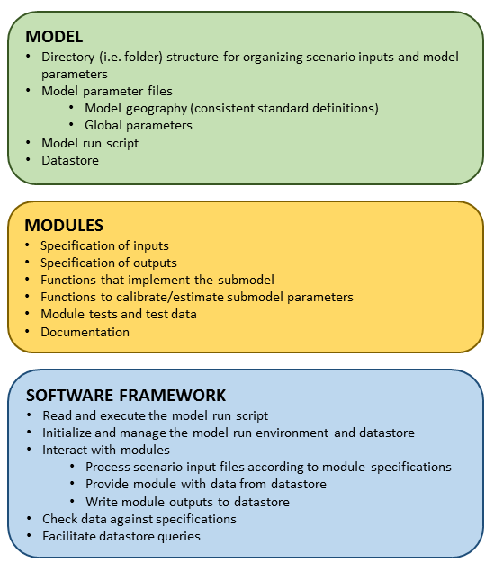
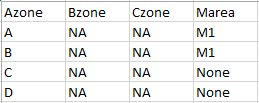
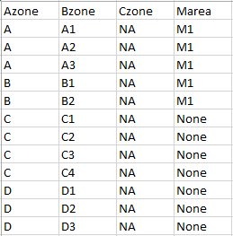

## VisionEval Model System Design and Users Guide
**Brian Gregor, Oregon Systems Analytics LLC**  
**August 16, 2017**  
**DRAFT**


### 1. Overview
The goal of this project is to define a model system and create a supporting software framework for developing and implementing models that support strategic planning for transportation, land use, and related topics. Strategic planning is a process that is used to determine a future direction and performance goals (in other words a vision) in recognition that conditions are likely to be different in the future than they are today, and that the nature, magnitudes, and effects of future changes are uncertain. Strategic planning is mostly concerned with setting performance goals for what is to be accomplished, rather than how it is to be accomplished. Strategic planning models are analytical tools that provide a computational representation of a social/economic/environmental system for which performance goals are to be developed. The system representation has to be broad enough to address interactions between factors related to the topic of interest. Strategic planning models are more oriented to representing the breadth of relationships between factors, rather than depth in representing those relationships. This enables potential strategies to be analyzed comprehensively and in consideration of future uncertainties.  

This project is the outgrowth of the development of the GreenSTEP model, a model developed to assist the Oregon Department of Transportation (ODOT) and its partners in analyzing alternate transportation and land use strategies for reducing greenhouse gas emissions from light-duty vehicles. ODOT made this model and all of the model estimation files available under an open source license. Subsequently several other modeling tools were built from the original GreenSTEP models and code, with various modifications to serve new purposes. These models include:  
1) [Regional Strategic Planning Model (RSPM)](https://www.oregon.gov/ODOT/TD/OSTI/Pages/scenario_planning.aspx#reg);  
2) [Energy and Emissions Reduction Policy Analysis Tool (EERPAT)](https://www.planning.dot.gov/fhwa_tool/); and,  
3) [Rapid Policy Analysis Tool (RPAT)](https://planningtools.transportation.org/10/travelworks.html).  
In addition, ODOT recognized that the GreenSTEP model platform could serve more general transportation-related strategic planning purposes because it was capable of analyzing and reporting on many types of transportation, land use, and household interactions. However, although ODOT and others found that the model could be modified and expanded to serve new purposes, the design and software implementation did not make it easy to do so. The goal of this project is to correct that limitation by creating a modeling system for building strategic planning models that are extensible and completely open.


### 2. Definitions  

Following are definitions of terms used in this document:  

- **Model System**  
A definition for a set of related models and a software framework for implementing that definition. Models built in the modeling system are related by the domains being modeled (e.g. travel, energy consumption, hydrology, etc.), the 'agents' being modeled (e.g. households, cities, watersheds, etc.), how physical space is represented (e.g. zones, grids, cubes, etc.), how time is represented (e.g. continuouse vs. discrete, independent vs. dependent on past states), and other modeling goals and tradeoffs (e.g. representational detail, degree of coupling, run times, etc.). The model system definition includes specifications for model modules that can be used in the model system, file structure specifications for organizing model parameters and input data necessary for running a model. The software framework for the model system is a library of code that manages the execution of model modules that are designed to work in the model system.  


- **Model**  
A model as used in this document refers to a model such as GreenSTEP that calculates a number of different attributes (e.g. household size, household income, number of autos owned, vehicle-miles traveled, etc.) that are composed of a number of components (submodels) that each calculate one or a few attributes.  


- **Submodel**  
A submodel is the component of a model that calculates one or a few closely related attributes.  


- **Module**  
A module, at its heart, is a collection of data and functions that meet the specifications described in this document and that implement a submodel. Modules also include documentation of the submodel. Modules as made available to users as R packages.


- **Software Framework**  
A software framework is a library of code containing functions that manage the execution of modules. These functions manage all interactions between modules, model system variables, and a datastore.  


- **Datastore**  
A datastore is a file or set of files for storing all of the inputs used by modules and outputs produced by modules.  


### 3. Model System Objectives
The GreenSTEP model and related models are disaggregate strategic planning models. They are disaggregate because, like many modern transportation models, they simulate behavior at the individual household level rather than at a more aggregate 'zonal' level. This enables the assessment of how prospective policies or other changes could have different impacts on different types of households (e.g. low income vs. high income). The models are strategic planning models because they are built to support long-range strategic planning decisions such as community visioning, policy development, and scenario planning. Strategic planning processes most often need to consider a number of possibilities about how the future may unfold and a range of potential actions that might be taken. As a consequence, models built to support strategic planning need to be responsive to a large number of variables and be capable of running quickly so that a large number of runs can be done to explore the decision space. The VisionEval model system supports the development of these types of models. The design objectives for this model system are:  


- **Modularity**  
The model system will allow new capabilities to be added in a plug-and-play fashion so models can be improved and extended and so improvements developed for one model can be easily shared with other models. Models are composed of modules that contain all of the data and functionality needed to calculate what they are intended to calculate.  


- **Loose Coupling**
This objective is closely related to the *modularity* objective. Loose coupling is necessary if modules are to be added to or removed from models in a plug-and-play fashion. Loose coupling means that the parameter estimation for a submodel is independent of the parameter estimation of any other submodel. It also means that there is no direct communication between modules. All communication between modules is carried out through the transfer of data that is mediated by the software framework.  


- **Openness**  
The VisionEval software framework and all modules developed to operate in the framework will be completely open. Being open means more than sharing ones work. It means completely revealing ones work so that others can assess how the module works. All module code, parameters, data, and specifications will be open to inspection and licensed using an open source license (e.g. Apache 2) that allows users to use, modify, and redistribute as they see fit. In addition, modules will provide access to data and code to estimate the model that the module implements. Finally, a module will contain complete documentation that users may use to document the model that the module is a part of.  


- **Geographic Scalability**  
The model system will enable models to be applied at a variety of geographic scales including metropolitan areas of various sizes, states of various sizes, and multi-state regions. Although models are applied at different scales, they share common geographic definitions to enable modules to be more readily shared between models built for the modeling system.  


- **Data Accessibility**  
Model results will be saved in a datastore that is easy to query. Results can be filtered, aggregated, and post-processed to produce desired performance measures.  


- **Regional Calibration Capability**  
Modules will have built in capbilities for estimating and calibrating submodel parameters from regional data when necessary.  


- **Speed and Simplicity**  
Since the intent of the model system is to support the development of strategic planning models, it is important that the models be able to address a large number factors and be able to model a large number of scenarios. For this to occur, the framework needs to run efficiently and modules need to be simple and need to run quickly.  


- **Operating System Independence**
The model system will run on any of the 3 major operating systems; Windows, Apple, or Linux. As is the case with GreenSTEP and related models, the VisionEval model system is written in the R programming language. Well-supported and easily installed R implementations exist for these operating systems. Modules will be distributed as standard R packages that can be compiled on all operating systems. Code that is written in another language may be included in a module package as long as it can be compiled in an R package that is usable on all 3 operating systems.  


- **Preemptive Error Checking**  
The model system will incorporate extensive data checking to identify errors in the model setup and inputs at the very beginning of the model run. Error messages will clearing identify the causes of the errors. The objective of early error checking is to avoid model runtime errors that waste model execution time and are difficult to debug.

### 4. Model System Software Design Approach
The VisionEval software framework uses many of the ideas from the functional programming paradigm to create a modeling system that is modular and robust. The framework is implemented in the R programming language which is largely a functional programming language having a well developed system for managing packages of modules. This section describes how the VisionEval model system incorporates functional programming design ideas and the reason for using the R programming language for implementing those ideas.

#### 4.1 Functional Programming Inspirations for System Design
There are a number of programming paradigms for organizing software and implementing modular system designs. The VisionEval system design is most inspired by the functional programming paradigm. This section describes key characteristics of the functional design paradigm that influence the VisionEval model system design to achieve the design objectives.  

The functional programming paradigm views computing as sequences of data transformations where a functions successively process a data stream with the outputs of one function becoming the inputs of the next. Functions are data processing machines with defined inputs and outputs. Given the same set of inputs, functions always produce the same set of outputs. Although functions have requirements for the data they process, they are not bound to the data in the same way as functions (methods) in the object-oriented programming paradigm. This characteristic of the functional paradigm fits well with the 'loose coupling' objective for the model system where model modules only interact with one another through the transfer of data mediated by the framework software. The design is for each module to act like a function with the framework software calling it, providing the data the module needs, and saving the data that the module produces.

Another key characteristic of the functional programming paradigm is that functions should have no side effects. A function should only change the state of variables within it's scope and should have no effects on the system outside of its scope. The only way that a function interacts with the rest of the program is by returning the result of its calculations to whatever function called it. Such functions are called pure functions. This characteristic makes software more testable, reliable, and maintainable. It is key aspect of the VisionEval model system design. The system is designed so that modules act like pure functions. The only thing that they do is return the results of their calculations to the software framework. They do not make any changes to program variables outside their scope and they do not read from or write to files. This approach makes the framework very robust and modular because code within a module can be changed without affecting any other module.

The framework software itself is also designed to minimize side effects in order to make it more robust and maintainable. Global state variables for a model run are kept to a minimum. Almost all model run state information is kept in the 'ModelState.Rda' file (Section 6.6). A common datastore holds all of the results of model computations. The only side effects in the framework code are reading model definition and input files, reading and writing to the common datastore, and writing to a log file.

A third key characteristic of some functional programming languages is the extensive use of data typing. While compiled languages in general use data typing to check the properness of functions and expressions when a program is compiled, some functional programming languages like Haskell and Elm make extensive use of defining and checking different data types for function inputs and outputs. They also include a type notation system for documenting functions. This makes it easier to check and understand the code. An analogous approach is used in the VisionEval system design. Each module includes specifications for all data that it consumes and all data that it produces. This enables the framework software to check that modules will work properly together and enables a model to be checked thoroughly before it is run so to eliminate run time errors. It also clearly documents to others what data the module uses and what it produces.

#### 4.2 Use of the R Software Environment to Implement the Model System
The VisionEval model system is built in the R programming language for statistical computing and graphics. R is an open-source variant of the S programming language developed at Bell Labs but is more functional in nature than S. Although R was primarily developed to be an interactive programming environment for data analysis, the language has a full set of features that enables it to be used for all steps in the modeling process from data preparation and cleaning through model implementation and output visualization. The language is augmented by thousands of packages supporting data analysis, programming, and visualization. The interactive nature of the language, range of capabilities, and large number of supporting packages enabled the the GreenSTEP model to be developed in an agile manner in a relatively short period of time. At the time, no other programming language had this range of capabilities and the large number of supporting packages. The VisionEval model system uses the R language for the following reasons:   
1) The existing code base for the GreenSTEP model and related models is written in R. Writing the VisionEval software framework in R enables this code base to be moved to the new framework with much less effort than would be required if it had to be rewritten in another programming language.  
2) R is open-source software that is available on all major operating systems so the model system will be operating system independent.
3) R has a very good and well tested package system for packaging modules that is well supported with documentation and build tools. The package system and development tools also include easy-to-use capabilities for documentation, including literate programming. This simplifies the development of the software framework and simplifies the process for module developers to produce complete and well documented modules.  
4) R has the most extensive set of statistical and other data analysis packages available. Because of this, almost any type of model can be estimated using R and therefore, modules can contain not only full documentation of model estimation, but also scripts that allow model estimation to be replicated and rerun using regional data.  
5) R is an interpreted language with capable (and free) integrated development environments. Because the state of objects can be easily queried, the process of building and testing models is simplified. This makes it easier for modelers who don't come from a computer science background to develop models to be deployed in the model system.  
6) Although as an interpreted language, R is slower than compiled languages, most of the core functions are "vectorized" functions that are written in C. This means that R programs can carry out many operations very quickly. In addition, it is relatively easy to call functions written in compiled languages such as C++, C, and Fortran to R so that if a pure R model is not fast enough, portions can be written as functions in a compiled language and linked to the R code.  
7) R has a large user base and so it is relatively easy for users to get answers to programming questions.  

### 5. Model System Layers
The VisionEval model system is composed of 3 layers:  
1) **Model**: The model layer defines the structure of the model and organizes all of the modules into a coherent model. The model layer includes a module run script, model definition files, model input files, and common datastore.   
2) **Modules**: The module layer is the core of a model. Modules contain all of the code and parameters to implement submodels which are the building blocks of models.  
3) **Software Framework**: The software framework layer provides the functionality for controlling a model run, running modules, and interacting with the common datastore.   
These layers are illustrated in Figure 1. Following sections describe the design and specifications for each layer.

**Figure 1. Overview of VisionEval Model System**  


A VisionEval model is built from a set of compatible modules, a set of specifications for the model and geography, a set of scenario input files, and a simple R script that initializes and runs the model. Following is a simple example of a model script:

```
#Initialize and check the model
initializeModel(
  ParamDir = "defs",
  RunParamFile = "run_parameters.json",
  GeoFile = "geo.csv",
  ModelParamFile = "model_parameters.json",
  LoadDatastore = FALSE,
  DatastoreName = NULL,
  SaveDatastore = TRUE
)

#Run modules for all forecast years
for(Year in getYears()) {
  runModule(
    ModuleName = "CreateHouseholds", 
    PackageName = "SimHouseholds",
    RunFor = "AllYears")
  runModule(
    ModuleName = "PredictWorkers",
    PackageName = "SimHouseholds",
    RunFor = "AllYears")
  runModule(
    ModuleName = "PredictLifeCycle",
    PackageName = "SimHouseholds",
    RunFor = "AllYears")
  runModule(
    ModuleName = "PredictIncome",
    PackageName = "SimHouseholds",
    RunFor = "AllYears")
  ...
}


```

A full model run script is shown in Appendix A.   

The script calls two functions that are defined by the software framework; *initializeModel* and *runModule*. The *initializeModel* function initializes the model environment and model datastore, checks that all necessary modules are installed, and checks whether all module data dependencies can be satisfied. The arguments of the *initializeModel* function identify where key model definition data are found. The *runModule* function, as the name suggests, runs a module. The arguments of the *runModule* function identify the name of the module to be run, the package the module is in, and whether the module should be run for all years, only the base year, or for all years except for the base year. This approach makes it easy for users to combine modules in a 'plug-and-play' fashion. One simply identifies the modules that will be run and the sequence that they will be run in. This is possible in large part for the following reasons:  
1) The modules are loosely coupled. Modules only communicate to one another by passing information to and from the datastore.  
2) The framework establishes standards for key shared aspects of modules including how data attributes are specified and how geography is represented.  
3) Every module includes detailed specifications for the data that are inputs to the module and for the data that are outputs from the module. These data specifications serve as contracts that the framework software enforces.  
  These features and how they are designed are described in detail in following sections.  

### 6. Model Layer Description
The model layer is composed of:  
- The directory (i.e. folder) and file structure for organizing scenario inputs and model parameters;  
- Model parameter files describing the model geography (consistent with standard definitions) and global parameters;  
- The model run script that lists the model execution steps; and,  
- The datastore which stores all of the data produced during the execution of the model.  
Each of these components is described in the following subsections.

#### 6.1. Model Directory Structure  
A model application has a very simple directory structure as shown in the following representation of a directory tree.

```
my_model
|   run_model.R  
|   <ModelState.Rda>  
|   <logXXXX.txt>  
|   <datastore.h5>  
|     
|  
|____defs
|    |   run_parameters.json
|    |   model_parameters.json
|    |   geography.csv  
|    |   units.csv  
|    |   deflators.csv  
|  
|  
|____inputs  
     |   filename.csv  
     |   filename.csv  
     |   ...  
         
```

The overall project directory, named *my_model* in this example, may have any name that is allowed by the operating system the model is being run on. One file is placed in this top level directory by the user, "run_model.R". Three additional files, denoted in the diagram by angled brackets, are created in the course of checking and running the model.

The "run_model.R" file, introduced in the previous section, initializes the model environment and datastore, checks that all necessary packages are installed, checks whether data dependencies can be satisfied, and then runs modules in a specified sequence. Data checks are performed before any modules are run to catch any errors. This saves time and the aggravation that occurs when a model run fails in midstream due to incorrect data inputs or other errors due to incorrect model setup. Data checking in advance is possible because every module includes detailed specifications for its input and output data. All scenario input files are checked against specifications to determine whether the required data exist and are correct. In addition, the state of the datastore is 'simulated' in the order that each module will be run to determine whether the data each module needs will be available in the datastore. After the model has been initialized and all all data checks are satisfactory, the modules are executed in the sequence prescribed in the script. 

The "ModelState.Rda" file is a R binary file that contains a list that holds key variables used in managing the model run. The file is created when the model run is initialized and is updated whenever the state of the datastore changes. Framework functions read this file when necessary to validate data and to determine that datastore read and write operations can be completed successfully. This file is described in more detail in section 6.6.

The "logXXXX.txt" file is a text file that is created when the model is initialized. This log file is used to record model run progress and any error or warning messages. The 'XXXX' part of the name is the date and time when the log file is created.

The "datastore.h5" file is an hdf5 formatted file that contains the central datastore for the model. Its structure is described in detail below. Users may use a different name for this file by specifying the name to be used in "parameters.json" file (see below). 

The "defs" directory contains all of the definition files needed to support the model run. Five files are required to be present in this directory: "run_parameters.json", "model_parameters.json", "geography.csv", "deflators.csv", and "units.csv".   

The "run_parameters.json" file contains parameters that define key attributes of the model run and relationships to other model runs. The file is a [JSON-formatted](http://www.json.org/) text file. The JSON format is used for several reasons. First, it provides much flexibility in how parameters may be structured. For example a parameter could be a single value or an array of values. Second, the JSON format is well documented and is very easy to learn how to use. It uses standard punctuation for formatting and, unlike XML, doesn't require learning a [markup language](https://en.wikipedia.org/wiki/Markup_language). Third, files are ordinary text files that can be easily read and edited by a number of different text editors available on all major operating systems. There are also a number of commercial and open source tools that simplify the process of editing and checking JSON-formatted files.  

The "run_parameters.json" file specifies the following parameters:  

- **Model** The name of the model. Example: "Oregon-GreenSTEP".  

- **Scenario** The name of the scenario. Example: "High-Gas-Price".  

- **Description** A short description of the scenario. Example: "Assume tripling of gas prices".   

- **Region** The name of the region being modeled. Example: "Oregon".  

- **BaseYear** The base year for the model. Example: "2015".  

- **Years** An array of all the 'forecast' years that the model will be run for. Example: ["2025", "2050"].  

- **DatastoreName** The name of the datastore. It is recommended that this be named "datastore.h5" for all model runs but it can be any name that is valid for the operating system.   

- **DatastoreReferences** This is a listing of other datastores that the framework should look for requested data in. This capability to reference other datastores enables users to split their model runs into stages to efficiently manage scenarios. For example, a user may wish to model how several transportation scenarios work with each of a few land use scenarios. To do this, the user could first set up and run the model for each of the land use scenarios. The user could then set up the transportation scenarios and make copies for each of the land use scenarios. Then the user would for each of the transportation scenarios reference the datastore of the land use scenario that it is associated with. The DatastoreReferences entry would look something like the following (the meaning of the entries is explained below):  
  "DatastoreReferences": {  
    "Global": "../BaseYear/datastore.h5",  
    "2010": "../BaseYear/datastore.h5"  
  }  
  
- **Seed** This is a number that modules use as a random seed to make model runs reproducible.  

The "model_parameters.json" can contain global parameters for a particular model configuration that may be used by multiple modules. For example, a model configuration to be a GreenSTEP model may require some parameters that are not required by a model configuration for an RSPM model. For example, the GreenSTEP model uses a parameter that is the total base year DVMT by light-duty vehicles to calibrate a factor used to compute commercial service vehicle travel. Parameters in this file should not include parameters that are specific to a module or data that would more properly be model inputs. While this file is available to establish global model parameters, it should be used sparingly in order enhance transferrability of modules between different models.

The "geography.csv" file describes all of the geographic relationships for the model and the names of geographic entities in a [CSV-formatted](https://en.wikipedia.org/wiki/Comma-separated_values) text file. The CSV format, like the JSON format is a plain text file. It is used rather than the JSON format because the geographic relationships are best described in table form and the CSV format is made for tabular data. In addition, a number of different open source and commercial spreadsheet and GIS programs can export tabular data in a CSV-formatted files. The structure of the model system geography is described in detail in Section 6.2 below.  

The "units.csv" file describes the default units to be used for storing complex data types in the model. The VisionEval model system keeps track of the types and units of measure of all data that is processed. The model system recognizes 4 primitive data types, a number of complex data types (e.g. currency, distance), and a compound data type. The primitive data types are data types recognized by the R language: 'double', 'integer', 'character', and 'logical'. The complex data types such as 'distance' and 'time' define types of data that have defined measurement units and factors for converting between units. The compound data type combines two or more complex data types whose units are defined in an expression (e.g. MI/HR). The *units.csv* describes the default units used to store complex data types in the datastore. The file structure and an example are described in more detail in Section 6.3 below.

The "deflators.csv" defines the annual deflator values, such as the consumer price index, that are used to convert currency values between different years for currency demonination. The file structure and an example are described in more detail in Section 6.4 below.

The "inputs" directory contains all of the input files for a scenario. All input files are CSV-formatted text files. Each module specifies what input files it needs and names and types of data to be included in the needed files. There are several requirements for the structure of input files. These requirements are described in section 6.5 below.

#### 6.2. Model Geography

The design of the model system includes the specification of a flexible standard for model geography in order to fulfill the objectives of *modularity* and *geographic scalability*. As a standard, it specifies levels of geographical units, their names, their relative sizes, and the hierarchical relationships between them. It is flexible in that it allows geographical boundaries to be determined by the user and it allows the units in some geographical levels to be simulated rather than being tied to actual physical locations. Allowing simulation of one or more geographic levels enables modules to be shared between models that operate at different scales. For example a statewide model and a metropolitan area model could use the same module for assigning households to land development types even though the statewide model lacks the fine scale of geography of the metropolitan model. 

Following is the definition of the geographic structure of the VisionEval model system:  

- **Region**  
The region is the entire model area. Large-scale characteristics that don't vary across the region are specified at the region level. Examples include fuel prices and the carbon intensities of fuels.  


- **Azones**  
Azones are large subdivisions of the region containing populations that are similar in size to those of counties or Census Public Use Microdata Areas (PUMA). The counties used in the GreenSTEP and EERPAT models and metropolitan divisions used in the RSPM are examples of Azones. Azones are used to represent population and economic characteristics that vary across the region such as demographic forecasts of persons by age group and average per capita income. Azones are the only level of geography that is required to represent actual geographic areas and may not be simulated.  


- **Bzones**  
Bzones are subdivisions of Azones that are similar in size to Census Block Groups. The districts used in RSPM models are examples of Bzones. Bzones are used to represent neighborhood characteristics and policies that may be applied differently by neighborhood, for example in the RSPM:  
  - District population density is a variable used in several submodels;  
  - An inventory of housing units by type by district is a land use input; and,  
  - Carsharing inputs are specified by district.  

  In rural areas, Bzones can be used to distinguish small cities from unincorporated areas. Bzones may correspond to actual geographic areas or may be simulated. For example, a submodel of the GreenSTEP model estimates the likely distribution of Census Tract densities for a metropolitan area given an overall population density for the metropolitan area. This submodel will be converted in the model system so that it creates a set of simulated Bzones having densities that represent the likely distribution of Census Tract densities.  


- **Czones**  
Czones are subdivisions of Bzones that describe more detailed land use characteristics such as whether an area is typified by residential development, commercial development, or mixed-use development. These characteristics may be described using a classification system such as the *development type* system, used by the GreenSTEP and RSPM models, or the *place type* system used by the RPAT model. A Czone may be any size, up to and including the Bzone that it is located within. As with Bzones, Czones may correspond to actual geographic areas such as the traffic analysis zones defined for an urban travel demand model. Perhaps more commonly, Czones will be synthesized based on scenario inputs and attributes of the Azones and Bzones they are situated within.  


- **Mareas**  
Mareas are associated with urbanized portions of metropolitan areas. Mareas are used to specify and model urbanized area transportation characteristics such as overall transportation supply (transit, highways) and congestion. A Marea does not exist in a strict hierarchical relationship with Azones and Bzones because the Marea boundary is likely to change over time as the urbanized area population grows. While a Marea will be associated with one or more Azones and Bzones, its boundary may be located inside or outside the boundaries of the Azones and Bzones it is associated with. Czones are used to represent the geographic extent of the Marea and land use characteristics of portions of it. Changes in the urbanized area boundary are modeled as changes in Czone designations.


Geographical relationships for a model are described in the "geography.csv" file contained in the "defs" directory. This file tabulates the names of each geographic unit (except for Region) and the relationships between them. Each row shows a unique relationship. Where a unit of geography is not explictly defined (i.e. it will be simulated), "NA" values are placed in the table. Appendix B shows examples of the "geography.csv" file where only Azones are specified and where Azones and Bzones are specified. It should be noted that there are no naming conventions for individual zones. The user is free to choose what conventions they will use.

#### 6.3. Data Types, Units, and Currency Deflators

A key feature of the VisionEval model system that enables modules to be bound together into models is a data specifications system. All datasets that a module requires as inputs and datasets that that a module produces must be specified according to requirements. Section 8 describes these specifications in more detail. This section provides an introduction to the TYPE and UNITS specification requirements to provide context for understanding the "units.csv" file in the "defs" directory.

The TYPE attribute for a dataset identifies the data type. The UNITS specification identifies the units of measure. The TYPE and UNITS specifications are related. The TYPE attribute affects the values that may be specified for UNITS attribute and how the framework processes the units values. The model system recognizes 3 categories of data types: 'primitive', 'complex', 'compound'. The 'primitive' category includes the 4 data types recognized by the R language: double, integer, character, and logical. A dataset that is specified as one of these types has no limitations on how the units of measure are specified. The 'complex' category currently includes 10 data types: currency, distance, area, mass, volume, time, people, vehicles, trips, and households. A dataset that is one of these types is limited to specified unit values. For example, the allowed units for the 'distance' type are MI, FT, KM, and M (for mile, foot, kilometer, and meter). The 'compound' category is composed of the compound data type. For compound data, units are represented as an expression involving the units of complex data types. For example, a dataset of vehicle speeds can be specified as having a TYPE that 'compound' and UNITS that are 'MI/HR'. The type is compound because it is made up of two complex types; distance and time. The units are an expression containing distance and time units and the '/' operator. The '*' (multiplication) operator may also be used in the units expression for a compound data type. Appendix C documents all the types and units in more detail. 

Although the complex and compound data types limit what values the units attributes may have, specifying these types enables the framework software to take care of unit conversions between modules and the datastore. For example, say that a model datastore contains a dataset for Bzone population density having units of persons per square mile. In this case the TYPE attribute for the data would be 'compound' and the UNITS would be 'PRSN/SQMI'. If a module which calculates household vehicle travel needs population density measured in persons per acre, the module would specify the UNITS as 'PRSN/ACRE' and the framework would take care of converting the density values from the units used in the datastore to the units requested by the module. This simplifies matters for module developers and reduces the likelihood of errors due to data conversions. 

Although the units specified by a module for a complex data type may be any of the recognized units (e.g. for distance - MI, FT, KM and M), this flexibility does not apply to the datastore. Complex data is stored in the datastore in predefined ways to limit potential confusion and simplify unit conversions. The default units file (units.csv) in the "defs" directory declares the default units to use for storing complex data types in the datastore. This file has two fields named 'Type' and 'Units'. A row is required for each complex data type recognized by the VisionEval system. The listing to date of complex types and the default units in the demonstration models are as follows:

|Type      |Units|
|----------|-----|
|currency  |USD  |
|distance  |MI   |
|area      |SQMI |
|mass      |LB   |
|volume    |GAL  |
|time      |DAY  |
|people    |PRSN |
|vehicles  |VEH  |
|trips     |TRIP |
|households|HH   |

For 'currency' data it's not sufficient to convert values to different units, it's also necessary to convert values between years since the value of money changes over time due to inflation. For example, if household income is a variable in a household travel model that was estimated using data from 2000, then when that model is applied to forecast travel in other years, the income data for the forecast years must be deflated to reflect the value in the model estimation year (2000). The software framework takes care of this process if a proper series of deflators are provided and if the units include the currency year (as described below). That information is used to convert currency to and from base year currency values (what is kept in the datastore).

The deflator series is defined for the model in the "deflators.csv" file in the "defs" directory. This file has 2 columns, 'Year' which contains an annual series of years, and 'Value' which contains corresponding deflator values (e.g. consumer price index). The earliest year in the deflator series must be sufficient to cover all of the years specified for modules which use currency data. The latest year must be sufficient to cover the base year and any later years that the model may be run for (excluding future forecast years of course). For example, the 'PredictIncome' module in the 'VESimHouseholds' package was estimated from 2000 Census PUMS data. Those data include household income for the previous year (1999). Therefore the "deflators.csv" file must include deflator values going back to 1999. If the base year for the model is 2010, the deflator series must go up to 2010; and if a later year such as 2015 is to be modeled, the deflator series must go up to that year.

Modules must include the currency year for datasets to be retrieved from the datastore and to be saved to the datastore. This is done by adding a period and 4-digit year to the UNITS attribute. For example, the UNITS specification for year 2000 dollars would be 'USD.2000'. Note, however, that this convention does not apply to specifications for currency data that is read in from input file. In those cases, the year is specified in the input file. This is explained in Section 6.4.

The UNITS value may also specify a multiplier option for complex and compound data types. This capability exists because modules may use data that is represented in thousands or millions when numbers are very large. For example total income and total VMT are often reported in this way. A multiplier option is added to a units name by adding a period and then the multiplier expressed in scientific notion where the leading digit must be a 1 (e.g. 1e3 for thousands). For currency units, the multiplier option must follow the year notation. For example, 2010 dollars expressed in millions would be expressed as 'USD.2010.1e6'. Miles traveled expressed in millions would be 'MI.1e6'.

#### 6.4. Model Inputs
The *inputs* directory contains all of the model inputs for a scenario. A model input file is a table that relates one or more input fields to geographic units and years. Because of the tabular nature of the data, all input files are CSV-formatted text files.  

At present, two types of input files are accommodated. These files differ with respect to whether the specified attribute values vary by 'forecast' year. For example, a file containing input assumptions about the cost of fuel, road use taxes, etc. would have values that vary  by 'forecast' year. In contrast, the files used to specify the characteristics of vehicles of different powertrain types have values that vary by vehicle model year, not 'forecast' year. The structure of these two types of input files, and how their values are organized in the datastore, differ.

All input files that have values which vary by 'forecast' year have at least three columns; two mandatory columns that specify geography ("Geo") and year ("Year"), and one or more data columns. Each row specifies a unique geographic unit and year combination. For example, if a model that has 10 Azones is being run for 2 'forecast' years, then an a table of inputs specified at the Azone level would contain 20 rows (in addition to the header row). The software framework checks these files to make sure that they contain values for all the required combinations of geography and year. 

By convention, input file names which include inputs that vary by level of geography, include the level of geography in the input file name. File names should be descriptive. Following are some examples:  
- azone_hh_pop_by_age.csv  
- azone_hhsize_targets.csv  
- bzone_dwelling_units.csv

Input files that do not vary by 'forecast' year do not have any required columns.

The name of an input file and the names of all the columns except for the "Geo" and "Year" columns are specified by the module that requires the input data. In addition to specifying the file and column names, the module specifies:  
- The level of geography the inputs are specified for (e.g. Azone, Bzone, Czone, Marea);  
- The data types in each column (e.g. integer, double, currency, compound);  
- The units of the data in each column (e.g. MI, USD); and,  
- Acceptable values for the data in each column.  

The module section describes these specifications in more detail below. Appendix D shows examples of the two types of input files.  

The field names of the input file (other than the "Geo" and "Year" fields) can encode year and unit multiplier information in addition to the name of the data item. This is done by breaking the name into elements with periods (.) separating the elements as follows:  

For 'currency' data type: **Name.Year.Multiplier**
For all other data types: **Name.Multiplier**

Where: 
**Name** is the dataset name. This must be the same as specified in the module that calls for the input data.  
**Year** is the four-digit representation of the year that the currency values are denominated for. For example if a currency dataset is in 2010 dollars, the Year value would be 2010'. The field name for a currency field must include a Year element.
**Multiplier** is an optional element which identifies the units multiplier. It must be expressed in scientific notation (e.g. 1e3) where the leading digit must be 1. This capability exists to make it easier for users to provide data inputs that may be more conviently represented with a smaller number of digits and an exponent. For example, annual VMT data for a metropolitan area or state is often represented in thousands or millions.

The the VisionEval framework uses the year and multiplier information to convert the data to be stored in the datastore. All currency values are stored in base year currency units and all values are stored without exponents.

#### 6.5. The Datastore
Currently GreenSTEP/RSPM and related models store data in R binary files (rda files). The largest of these files are the simulated household files which store all of the information for all simulated households in an Azone (e.g. counties in GreenSTEP). All the data for households in the Azone are stored in a data frame where each row corresponds to a record of an individual household and the columns are household attributes. Vehicle data for households are stored as lists in the data frame. This approach had some benefits:  
- Storage and retrieval are part of the R language: one line of code to store a data frame, and one line of code to retrieve;  
- It is easy to apply models to data frames; and  
- Vehicle data can be stored as lists within a household data frame, eliminating the need to join tables.  

The simplicity of this approach helped with getting GreenSTEP from a concept into an operational model quickly. However, several limitations have emerged as GreenSTEP and related models have been used in various applications including:  
- Large amounts of computer memory are required when modeling Azones that have large populations. This necessitates either expanding computer memory or limiting the size of Azones;  
- It is not easy to produce summary statistics from the simulated household files for a region; and  
- The number of non-household data files has proliferated in order to store various aggregations for use in the model and for later summarization.

The VisionEval model system uses the HDF5 file format for storing model data, rather than using R binary files. The HDF5 file format was developed by the National Center for Supercomputing Applications (NCSA) at the University of Illinois and other contributors to handle extremely large and complex data collections. For example, it is used to store data from particle simulations and climate models. It also is the basis for the new open matrix standard for transportation modeling, [OMX](https://github.com/osPlanning/omx).  

The HDF5 format was chosen over SQL databases because it reads and writes data faster than SQL alternatives that were tested. It also provides random data access in a way that is analogous to how data in R data structures can be indexed. Large complex data sets can be randomly accessed by organizing datasets in a hierarchy of groups and by accessing portions of datasets by using indexing. In addition, metadata can be stored as attributes of any data group or data item. Testing showed that the aggregate time for reading data from an HFD5 file, applying a model, and writing the result back to the HDF5 file was competitive with the aggregate time for doing these things using R binary files.

An HDF5 file is organized in groups and datasets. Groups provide the overall structure for organizing data, just as file system provides the structure for organizing files on a computer disk. A `/` indicates the root group. Subgroups are created with names. So for example, data for the year 2050 could be stored in a `/2050` group. Household data for the year 2050 is stored in a `/2050/Household` group. Some groups, like the *Household* group just mentioned, are used to store tabular data in the same way that the existing model stores tabular data in data frames. Just like a data frame, each component (dataset) can store a different type of data than other components, but all datasets must have the same length. The framework enforces the equal length requirement by storing a *LENGTH* attribute with the table group and using this attribute when initializing a new dataset to include in the table. The software framework stores information about the data type contained in a dataset as well as other key attributes that are identified in module specifications. Datasets in tables are accessed by supplying the name of the dataset and the full path name to the table where the dataset is stored (e.g. `/2050/Household/Income` for a household income dataset for the year 2050). Indexes may be used to read and write portions of a dataset. The software framework includes a function that calculates indexes for different geographical units.

The structure of the datastore to implement existing models (GreenSTEP, RSPM, EERPAT, RPAT) is shown in the following diagram which is organized like a directory tree. The first level of the tree denotes groups that are collections of tables. There are two types of groups at this level: the 'Global' group, and 'Year' groups (e.g. 2010, 2050). The 'Global' group is used to store data that is not organized by forecast year. The vehicle characteristics datasets used in the GreenSTEP, RSPM, and EERPAT models are examples. These data are organized by vehicle model year rather than forecast year. The 'Year' groups store datasets that are organized by forecast year. For example, regional cost inputs vary by forecast year. The second level of the tree denotes groups that represent data tables. These groups hold collections of datasets (vectors of data) that hold different types of data but all have the same lengths. Tables in the *Global* group are organized by 'topic' (e.g. HEV vehicle characteristics, EV vehicle characteristics). Tables in 'forecast year' groups include tables for each level of geography as well as 'Households' and 'Vehicles' tables which store attributes of the simulated households and the vehicles they own.

```    
|____Global
|    |____AutoLtTrkMpg
|    |        Year
|    |        Auto
|    |        LtTruck
|    :
|
|____2010  
|    |____Region
|    |        FuelCost
|    |        KwhCost
|    |        VmtTax
|    |        ...
|    |
|    |____Azone
|    |        ...
|    |
|    |____Bzone
|    |        ...
|    |
|    |____Czone
|    |        ...
|    |
|    |____Marea
|    |        ...
|    |
|    |____Households
|    |        ...
|    |
|    |____Vehicles
|    |        ...
|    :
|
|
|____2050  
|    |____ ...
|    |        ...
:    :

```

This structure is adequate to store all of the data that are used by the GreenSTEP/RSPM models and their offshoots. It can also be easily expanded to serve new modeling capabilites. For example if a module is added to model building stock, a 'Buildings' table could be added to each 'forecast year' group. In addition, since HDF5 files can store matrix data as well as vector data, if a future module makes use of a distance matrix, that matrix could be added to either the 'Global' group or the 'forecast years' groups.  

#### 6.6 The Model State File  
The model state file, "ModelState.Rda", maintains a record of all of the model run parameters and an inventory of the contents of the datastore. The software framework functions use this information to control the model run and to perform checks on module and data validity. The model state file contains a list which has the following components:  
- Model: The name of the model  
- Scenario: The name of the scenario  
- Description: A description of the scenario  
- Region: The name of the region being modeled  
- BaseYear: The model base year  
- Years: A list of years the model is being run for  
- DatastoreName: The file name for the datastore  
- Seed: The value to be used for the random seed  
- LastChanged: The date and time of the last change to the model state  
- Deflators: A data frame of deflator values by year  
- Units: A data frame of default units for complex data types  
- LogFile: The file name of the log file  
- Datastore: A data frame containing an inventory of the contents of the datastore  
- Geo_df: A data frame containing the geographic definitions for the model  
- BzoneSpecified: A logical value identifying whether Bzones are specified for the model  
- CzoneSpecified: A logical value identifying whether Czones are specified for the model  
- ModuleCalls_df: A data frame identifying the sequence of 'runModule' function calls and arguments  

The Datastore component is updated every time the data is written to the datastore. This enables framework functions to 'know' the contents of the datastore without having to access the datastore. The Datastore component keeps track of all groups and datasets in the datastore and their attributes such as the length of tables and the specifications of datasets.

### 7. Overview of Module and Software Framework Layer Interactions
Modules are the heart of the VisionEval model system. Modules contain all of the code and parameters to implement submodels that are the building blocks of models. Modules are distributed in standard R packages. A module contains the following components:  
- Data specifications for data that is to be loaded from input files, data that is to be loaded from the datastore, and data that is to be saved to the datastore;  
- Data for all parameters estimated/calibrated for use in the submodel;  
- One or more functions for implementing the submodel;  
- Functions for estimating/calibrating parameters using regional data supplied by the user (if necessary); and,  
- Documentation of the module and of submodel parameter estimation/calibration.  

The software framework provides all of the functionality for managing a model run. This includes: 
- Checking module specifications for consistency with standards;
- Checking input files for compliance with module specifications;
- Processing input files to load the input data into the datastore;
- Simulating the data transactions in a model run to check whether the datastore will contains the data each module needs when the module needs it;
- Loading module packages;  
- 'Running' modules in accordance with the 'run_model.R' script;  
- Fetching from the datastore, data that is required by a module;  
- Saving to the datastore, data that a module produces and specifies is to be saved; and,  
- Converting measurement units and currency years when necessary.

When the software framework "runs" a module it does several things. First, it reads the module data specifications and the main module function which performs the submodel calculations. Then it reads in all the datasets from the datastore that the module specifies. It also reads in the contents of the model state file. It puts these datasets into an input list and then it calls the main module function with this input list as the argument to the function call. This list, which by convention is called 'L', contains 4 components: Global, Year, BaseYear, and G. The Global, Year, and BaseYear components contain lists which are composed of table components which are in turn composed of dataset components. The Global component relates to the 'global' group in the datastore. The Year component relates to the the group in the datastore for the model run year. For example, if the model run year is 2040, the Year component will contain data that is read from the '2040' group in the datastore. The BaseYear component relates to the group in the datastore which represents the base year for the model. For example if the model base year is 2010, the BaseYear component will contain data that is read from the '2010' group in the datastore. The list contains a BaseYear component as well as a Year component because modules may need to compute changes in a dataset between the base year and the model run year. Each of these components will contain a component for each table in the the module requests data from. The table component is also a list which then contains components for all the requested datasets. For example, if a module needs the household income ('Income') and household size ('HhSize') datasets from the 'Household' table in the model run year (e.g. 2040), the Year component of 'L' will contain a 'Household' component which will contain an 'Income' component and a 'HhSize' component.

The 'G' component of 'L' contains the model state list which contains all the information described in Section 6.6.

When the module executes, it return a list containing all of the information that the module specifies is to be written to the datastore. By convention, this list is called 'R'. This list also has Global, Year, and BaseYear components which are structured in the same way that 'L' is structured. The table and dataset components of the list also include some attributes (metadata) which are described in Section 8.

### 8. Modules  
All modules are made available in the form of standard R packages that meet framework specifications. A package may contain more than one module. The package organization follows the standard organization of R packages. The structure is shown in the following diagram. The components are described below in the order that they are presented in the diagram. The file names are examples.

```
VESimHouseholds
|   DESCRIPTION
|   NAMESPACE
|   LICENSE
|     
|
|____R
|    |   CreateHouseholds.R  
|    |   PredictWorkers.R
|    |   CreateEstimationDatasets.R
|    |   ...
|
|
|____inst  
|    |    NOTICE
|    |____extdata  
|         |   pums_households.csv
|         |   pums_households.txt
|         |   pums_persons.csv
|         |   pums_persons.txt
|         |   ...
|         
|
|____tests
|    |____defs
|    |    |   run_parameters.json
|    |    |   model_parameters.json
|    |    |   geography.csv  
|    |    |   units.csv  
|    |    |   deflators.csv  
|    |
|    |____inputs
|    |    |   azone_hh_pop_by_age.csv
|    |    |   azone_gq_pop_by_age.csv
|    |    |   ...
|    |
|    |----scripts
|    |    |   test.R
|    |    |   ...
|
|
|____vignettes
|    |   VESimHouseholds.Rmd
|    |   CreateHouseholds.Rmd
|    |   PredictWorkers.Rmd
|    |   ...
|
|
|____data
|    |   Hh_df.rda
|    |   CreateHouseholdsSpecifications.rda
|    |   HtProb_HtAp.rda
|    |   PredictWorkersSpecifications.rda
|    |   PropHhWkr_HtAg.rda
|    |   ...
|
|
|____man
     |   CreateHouseholds.Rd
     |   PredictWorkers.Rd
     |   ...

```

The *DESCRIPTION* and *NAMESPACE* files are standard files required by the R package system. There are good sources available for describing the required contents of these files ([R Packages](http://r-pkgs.had.co.nz/)), so that will not be done here. Most of the entries in these files can be produced automatically from annotations in the R scripts that will be described next, using freely available tools such as [devtools](https://github.com/hadley/devtools) and [RStudio](https://www.rstudio.com/). The *LICENSE* file contains the text for the Apache 2 license which is the open source license that should be used for VisionEval packages.

#### 8.1. The R Directory
The *R* directory is where all the R scripts are placed which define the modules that are included in the package. Each module is defined by a single R script which has the name of the module (and the .R file extension). A module script does three things:  
1) It defines all of the parameters that are used by the submodel that the module implements. This can be done through simple declarations or through the application of more sophisticated statistical parameter estimation methods.  
2) It defines all the specifications for data that the module depends on.  
3) It defines all of the functions that implement the submodel.  
  Each of these actions is described below. An example of the CreateHouseholds module script from the VESimHouseholds package is included in Appendix E.  

The **parameter definition** section of the module script does several things. First, if any of the data to be used in parameter calculations is contained in files (placed in the 'inst/extdata' directory), the script describes specifications for the data to be read from those files. This is done to assure that the parameters are calculated from correct data. All parameter estimation data input files are CSV-formatted text files located in the "inst/extdata" directory. The data specifications for each file are organized in a list. A separate specification list is provided for each file that is to be read in. The specifications for a file identify the require data columns and the required attributes of those data. Following is an example:

```
PumsHhInp_ls <- items(
  item(
    NAME =
      items("SERIALNO",
            "PUMA5",
            "HWEIGHT",
            "UNITTYPE",
            "PERSONS"),
    TYPE = "integer",
    PROHIBIT = c("NA", "<= 0"),
    ISELEMENTOF = "",
    UNLIKELY = "",
    TOTAL = ""
  ),
  item(
    NAME = "BLDGSZ",
    TYPE = "integer",
    PROHIBIT = c("< 0"),
    ISELEMENTOF = "",
    UNLIKELY = "",
    TOTAL = ""
  ),
  item(
    NAME = "HINC",
    TYPE = "double",
    PROHIBIT = c("NA"),
    ISELEMENTOF = "",
    UNLIKELY = "",
    TOTAL = ""
  )
)
```
The meanings of these specifications are as follows:  
- **NAME** This is the name(s) of the data column in the file. The name must be a character string (i.e. surrounded by quotation marks). If multiple columns of the file have the same specifications except for their names, they can listed as in the first item in the example. This method avoids a lot of redundant data entry. Note that the order of specifications does not need to be the same as the order of the columns in the file. Also note that it is OK if the file contains columns that are not specified, as long as it contains all of the columns that are specified. Columns that are not listed are ignored.  
- **TYPE** This the data type of the data contained in the column. Allowable types are the 4 primitive types recognized by the R language (integer, double, character, and logical), the complex types listed in section 6.4, or 'compound'. The type must be a character string.  
- **PROHIBIT** This is a character vector which identifies all prohibited data conditions. For example, the specification for the "PERSONS" data column in the example above is c("NA", "< 0"). This means that there cannot be any values that are undefined (NA) or less than or equal to 0. The symbols that may be used in a PROHIBIT specification are: NA, ==, !=, <, <=, >, >= (i.e. undefined, equal to, not equal to, less than, less than or equal to, greater than, greater than or equal to). Note that prohibited conditions must be represented as character strings. If there is more than one prohibited condition, as in the example, the conditions must be entered as an R vector using the 'c()' function, as shown in the example. The absence of prohibited conditions is represented by an empty character string (i.e. "").  
- **ISELEMENTOF** This is a vector which specifies the set of allowed values. It is used when the input values must be elements of a set of discrete values. The vector describing the set must be of the same type as is specified for the input data. Vectors of elements are entered using the 'c()' function. The absence of a specification for this is represented by an empty character string.  
- **UNLIKELY** This is a vector of conditions that while not prohibited, are not likely to occur. While conditions identified in the PROHIBIT and ISELEMENTOF specifications will produce an error if they are not met (thereby stopping the calculation of parameters), the conditions identified in the UNLIKELY specification will only produce a warning message. Vectors of conditions are entered using the 'c()' function. 
- **TOTAL** This specifies a required total value for the column of data. This is useful if the data represents proportions or percentages and must add up to 1 or 100. The absence of a specification for this is represented by an empty character string.

Note that if more than one module uses the same dataset(s) for parameter estimation, it may be convenient for all data preparation to be carried out by one script which produces one or more R data frames which are saved to the data directory and loaded as needed by module scripts. That is what is done in the VESimHouseholds package. The CreateEstimationDatasets.R script creates and saves the Hh_df dataset which is used in estimating all the models in the package.

The second thing the parameters section of the module script does is define any functions that may be needed to calculate submodel parameters. These functions can be as complex as required to carry out the calculations, but they must be well documented. Function documentation is done using [Roxygen syntax](http://r-pkgs.had.co.nz/man.html).

The third thing the parameters section does is assign the parameters to objects that have the names that will be referenced by the module function or functions which implement the submodel. The value of a parameter object can be produced by a simple assignment (e.g. AveHhSize <- 2.5), by loading a parameter input file, or by calling a function that has been defined to calculate it.

The last thing the parameters section does is save the parameters. The example script in Appendix E shows how this is done. The scripts also show the required form of documentation of the saved parameters. Although the parameters may be saved as data that is internal to the package (usable by package functions but not viewable from the outside), it is recommended that they be 'exported' to make it easier for users to check the values of the parameters if they need to do so. The examples are set up to export the parameters.

The **data specifications** section of the module script provides specifications for the data that is to be read or saved and how it is to be indexed. These specifications are declared in a list that has the following 6 main components:  
- **RunBy** specifies of the level of geography that the model is to be run at. For example, the congestion submodel in the GreenSTEP and RSPM models runs at the Marea level. This specification is used by the software framework to determine how to index data that is read from the datastore and data that is written to the datastore. Acceptable values are "Region", "Azone", "Bzone", "Czone", and "Marea". 
- **NewInpTable** specifies any new tables that need to be created in the datastore to accommodate input data. The following specifications are required for each new input table that is to be created:  
  - TABLE: the name of the table that is to be created; and,
  - GROUP: the type of group the table is to be put into. There are 3 group types: Global, BaseYear, and Year. If 'Global', the table is created in the global group of the datastore. If 'BaseYear' the table is created in the year group for the base year and only in that year group. For example, if the model base year is 2010, the table will be created in the '2010' group. If 'Year', the table will be created in the group for every model run year. For example, if the run years are 2010 and 2040, the table will be created in both the '2010' group and the '2040' group.  
- **NewSetTable** specifies any new tables that need to be created in the datastore to accommodate outputs from the module identified in the 'Set' specifications (see below). The specifications for new 'Set' tables take the same form as the specifications for new input tables. The 'CreateHouseholds' module example in Appendix E includes specifications for creating a new 'Household' table in the datastore.
- **Inp** specifies the scenario input files that need to be read, the data fields that need to be read from the input files, and the attributes of the data fields. The *Inp* component is a list where each component of that list describes a data field. The following specifications are required for each data field:  
  -  NAME: the name of a data item in the input table;  
  -  FILE: the name of the file that contains the table;  
  -  TABLE: the name of the datastore table the item is to be put into;  
  -  GROUP: the type of group where the table is located in the datastore (i.e. Global, Year, BaseYear);
  -  TYPE: the data type (e.g. double, distance, compound);  
  -  UNITS: the measurement units for the data;  
  -  NAVALUE: the value used to represent NA in the datastore;  
  -  SIZE: the maximum number of characters for strings (or 0 for numeric data);  
  -  PROHIBIT: data conditions that are prohibited or "" if not applicable;  
  -  ISELEMENTOF: allowed categorical data values or "" if not applicable;  
  -  UNLIKELY: data conditions that are unlikely or "" if not applicable; and,  
  -  TOTAL: the total for all values (e.g. 1) or "" if not applicable.
  
  The values that may be entered for the TYPE and UNITS attributes are described in Section 6.3. It should be noted that the UNITS attribute must not include 'year' (for 'currency' type) or 'multiplier' information. That information is part of the input file field names instead (where relevant). This is explained in more detail in Section 6.4.  
- **Get** specifies what data items that need to be retrieved from the datastore and what characteristics those data need to have. The *Get* component is a list where each component of that list describes data that is to be retrieved from the datastore. The following specifications are required for each dataset:  
  -  NAME: the name of the dataset to be loaded;  
  -  TABLE: the name of the table that the dataset is a part of;  
  -  GROUP: the type of group where the table is located in the datastore (i.e. Global, Year, BaseYear);  
  -  TYPE: the data type (i.e. double, integer, character, logical);  
  -  UNITS: the measurement units for the data;  
  -  PROHIBIT: data conditions that are prohibited or "" if not applicable;  
  -  ISELEMENTOF: allowed categorical data values or "" if not applicable.  
  
  These elements have the same meanings as described above. Unlike the 'Inp' specifications, the 'Get' specifications for UNITS must include 'year' information for 'currency' types. This is necessary in order for the framework to convert the currency data being requested from the datastore to the year denomination that the module needs. The UNITS attribute may also include a multiplier specification if the module needs the values to be modified in that way. For example, if the module needs VMT in thousands of miles, the UNITS specification would be 'MI.1e3'. Section 6.3 provides more information on how 'year' and 'multiplier' options are added to a UNITS specification.  
- **Set** specifies the attributes of data that is to be saved in the datastore. The following need to be specified for every dataset that is to be saved in the datastore:  
  -  NAME: the name of the data item that is to be saved;  
  -  TABLE: the name of the table that the dataset is a part of;  
  -  GROUP: the type of group where the table is located in the datastore (i.e. Global, Year, BaseYear);  
  -  TYPE: the data type (i.e. double, integer, character, logical);  
  -  UNITS: the measurement units for the data;  
  -  NAVALUE: the value used to represent NA in the datastore;  
  -  PROHIBIT: data conditions that are prohibited or "" if not applicable;  
  -  ISELEMENTOF: allowed categorical data values or "" if not applicable;  
  -  SIZE: the maximum number of characters (or 0 for numeric data).  

  These elements have the same meanings as described above. As with the 'Get' specifications for UNITS, 'year' information must be included for 'currency' types. This is necessary in order for the framework to convert the currency data being produced by the module to the base year denomination that the datastore will contain. The UNITS attribute must also include a multiplier specification if the module outputs are multiplied values such as thousands or millions. For example, if the module produces VMT in thousands of miles, the UNITS specification must be 'MI.1e3'. Section 6.3 provides more information on how 'year' and 'multiplier' options are added to a UNITS specification.
  
  It should be noted that it may not be possible to prespecify the SIZE attribute for a dataset. For example, if a unique household ID is assigned, the SIZE attribute will depend on the number of households and so must be calculated when the module is run. In such a circumstance, the SIZE attribute is omitted and the module function must calculate it and include the calculated value as an attribute of the output dataset. This is shown in the example in Appendix E and is explained below.

The name of the data specifications list must be the concatenation of the name of the module and "Specifications". For example, if the module name is *CreateHouseholds*, then the data specifications list must be named *CreateHouseholdsSpecifications*. This naming convention is very important because it is what the software framework uses to extract the specifications from the package that the module is in.

The **function definitions** section of the module script is used to define all functions that will be used to implement the submodel. One of these functions is the main function that is called by the software framework to run the module. This function must have the same name as the module name. For example, the main function of the 'CreateHouseholds' module is named 'CreateHouseholds' as well. This function must be written to accept one argument, a list, which by convention is named L. This list contains all of the datasets identified in the 'Get' component of the module data specifications. The structure of this list is described in Section 7. The main function returns a list which contains all of the datasets identified in the 'Set' component of the module data specifications and structured as described in Section 7. The software framework function includes a function, 'initDataList', to initialize an outputs list having the proper structure with 'Global', 'Year', and 'BaseYear' components. It is up to the developer to The example 'CreateHouseholds.R' script (Appendix E) shows how the module outputs list is populated with 'table' components and 'dataset' components within 'table' components. For example the following code creates a list component to store datasets that will be put into the 'Household' table (for each model run year group), and then assigns the 'HhId' (household ID) dataset to that list. 

```
Out_ls$Year$Household <- list()
Out_ls$Year$Household$HhId <- paste("HH", 1:NumHh, sep = "-")
#NumHh is the number of households
```

In this example, the SIZE attribute of the 'HhId' dataset will not have been specified in the module 'Set' specifications for the dataset because the maximum number of characters depends on the number of households ('NumHh' in the example). Because the SIZE attribute was not prespecified, it must be specified in the module code. Following is an example of how this is done:

```
attributes(Out_ls$Year$Household$HhId)$SIZE <- max(nchar(Out_ls$Year$Household$HhId))
```

If a new table is being created by a module, as in the case of the example in Appendix E it is required that the module code assign a length attribute to the output list component for the table that is being created. Following is an example:

```
attributes(Out_ls$Year$Household)$LENGTH <- NumHh
#NumHh is the number of households
```

The main function may call other functions as necessary to carry out computations. The main function is responsible for passing to those functions all data they need as inputs. The main function is also responsible for passing any datasets specified in the 'Set' specifications back to the software framework which only recognizes the main function.

All functions must be properly documented using Roxygen syntax.

The last portion of the module script is optional. This part of the script is there to help module developers during module development. All portions of the example script are commented out. This is necessary when the package is built because it will cause errors during package building. More on support for module testing is 
#### 8.2. The inst/extdata Directory
By convention, the 'inst/extdata' directory is the standard place to put external (raw) data files as opposed to R datasets which are placed in the 'data' directory. All the files that are used to calculate model parameters are placed in this directory. Parameter data files must be CSV-formatted text files where the first line of the file is a header of column names. The data included in each parameter file must be consistent with the data specifications described in the R script for the module that uses those data. Each parameter data file should be accompanied by a text file which documents the data contained in the file. This text file should have the same name as the parameter data file but the file extension should be ".txt". The text file should include notes on the file structure, document data sources, and provide any other notes on the data that are important for users to know. 

#### 8.3. The tests Directory
The 'tests' directory contains an R script to run and data to be used to test all the modules in a package. The software framework includes a 'testModule' function that module developers can use to assist module development and testing. The testing script is named 'test.R'. Appendix F includes an example of a test script. Test data mirrors the setup for running a model. A 'defs' directory includes all the files described in Section 6.1. An 'inputs' directory includes all the input files specified by the modules. A datastore file, 'datastore.h5', must be present which contains all the data items identified in the module 'Get' specifications that will not be provided by the input files. The 'VERSPM' directory in the VisionEval GitHub repository includes a test datastore for the Rogue Valley MPO (RVMPO) test area.  

#### 8.4. The vignettes Directory  
Whereas package help files provide basic documentation of package functions and datasets, vignettes provide a vehicle for longer-form documentation of packages and the modules included in packages. Vignettes enable literate programming, where R code is embedded within  a vignette source file and evaluated when that document is compiled into it's final form. R code embedded in a vignette source file can be used to produce tables and graphs that are embedded in the document. This makes vignettes very useful for documenting how submodels are designed and how their parameters are estimated. 

Source files for producing vignettes are composed in R Markdown format text files (Rmd extension). When the package is built, the source files are evaluated and final versions are produced in HTML or PDF formats. The process for preparing vignettes in packages is [well documented.](http://r-pkgs.had.co.nz/vignettes.html)

There is no limit to the number of vignettes that are included in a package, and module developers are encouraged include vignettes that throughly document the submodels that the package implements, but some standard vignettes are required to be included in a package. One vignette is must be included which describes the package as a whole. This vignette identifies the modules included in the package, provides a brief description of each module, any provides any other information about the package and what is included in it. A vignette must be included to document each module contained in the package as well. Appendix F shows an example of a source file for a package vignette and Appendix G shows an example source file for a module vignette.

#### 8.5. The data and man Directories
The 'data' and 'man' directories and the files within them are created automatically when a package is built (i.e. when the sources are compiled into a version that can be used by the R language environment). The 'data' directory contains R binary files for all of the module parameters and specifications. These are created by the save commands in the module scripts. The 'man' directory contains the documentation files for the functions and data that are defined by the module scripts. These documentation files are created from the documentation annotations (in Roxygen format) included in the module scripts.

### 9. Software Framework 
The software framework for the VisionEval model system is implemented by a set of functions contained in the **visioneval** package. The package contains contains standard documentation for all of the functions. Additional documentation which shows the calling relationships between functions is available in a [interactive visualization](https://gregorbj.github.io/VisionEval/website/visioneval_functions.html) in the project repository. This visualization shows the names of the functions as nodes in a network graph with arrows connecting the nodes showing the functions that are called by each function (arrows point from the calling function to the called function). The nodes are colored to show different types of functionality. Functions that are used to create models from modules are colored blue. There are three such functions. Functions that are used in the creation of modules are colored green. There are a dozen of these functions. There are several dozen functions which manage various aspects of the software frame and interactions with the datastore. The latter functions are colored red and the rest are colored yellow. These functions are not intended to be used by module developers or model users. Clicking on a function in the visualization highlights the function and all the arrows connected to it. It also provides summary information about the function including a description of what it does, descriptions of all the function arguments, and a description of the function's return value. Sections 9.1 and 9.2 describe the functions that are the applications programming interfaces (API) for model users and module developers respectively. Readers should refer to the visualization and documentation in the visioneval package if the desire to learn more about functions that are not part of the API.

#### 9.1. API for Model Users  
Three functions are part of the API for model users: 'initializeModel', 'runModule', and 'getYears'. These are explained below in turn.

The 'initializeModel' function prepares the model for running modules. This includes:  
1) Creating the "ModelState.Rda" file that contains global parameters for the model run and variables used to keep track of the state of the datastore and other aspects of the model run (Section 6.6);  
2) Creating a log file that is used to record model status messages such as warning and error messages;  
3) Creating and initializing the model datastore;  
4) Processing the model geography definition file and setting up the appropriate geographic tables in the datastore;  
5) Checking whether all the specified module packages are installed and that all module specifications are correct;  
6) Parsing the "run_model.R" script and simulating the model run to confirm that the datastore will contain the data that each module needs when it is called and that the data specifications are consistent with the module 'Get' specifications;  
7) Checking whether all the scenario input files identified by the specified modules are present, and that the data are consistent with specifications; and,  
8) Loading all the data in the input files into the datastore.

If any errors are found during the model initialization process, an error message will be displayed in the console and the initialization process will terminate. Detailed error messages in the log will identify the specific causes of errors. If the initialization proceeds without errors, the user can be assured that the model will run without errors. Following is a typical 'initializeModel' function call in a model run script.  

```  
initializeModel(
  ParamDir = "defs",
  RunParamFile = "run_parameters.json",
  GeoFile = "geo.csv",
  ModelParamFile = "model_parameters.json",
  LoadDatastore = FALSE,
  DatastoreName = NULL,
  SaveDatastore = TRUE
  )
```    

The function arguments and their meanings are as follows:  
- **ParamDir** A string identifying the relative or absolute path to the directory where the parameter and geography definition files are located. The default value is "defs".  
- **RunParamFile** A string identifying the name of a JSON-formatted text file that contains parameters needed to identify and manage the model run. The default value is "run_parameters.json".  
- **GeoFile** A string identifying the name of a text file in comma-separated values format that contains the geographic specifications for the model. The default value is "geo.csv".  
- **ModelParamFile** A string identifying the name of a JSON-formatted text file that contains global model parameters that are important to a model and may be shared by several modules.  
- **LoadDatastore** A logical identifying whether an existing datastore should be loaded.  
- **DatastoreName** A string identifying the full path name of a datastore to load or NULL if an existing datastore in the working directory is to be loaded.  
- **SaveDatastore** A string identifying whether if an existing datastore in the working directory should be saved rather than removed.  

As the name suggests, the 'runModule' function runs a module. Following is an example of how it is invoked:  
```
runModule(ModuleName = "CreateHouseholds", 
          PackageName = "VESimHouseholds",
          RunFor = "AllYears",
          RunYear = Year)
```  

The function arguments and their meanings are as follows:  
- **ModuleName** A string identifying the name of a module object.  
- **PackageName** A string identifying the name of the package the module is a part of.  
- **RunFor** A string identifying whether to run the module for all years (AllYears), only the base year (BaseYear), or for all years except the base year (NotBaseYear).
- **RunYear** A string identifying the run year.

The *runModule* function runs the named module within the *runModule* function environment. This is a significant improvement over how functions that implement the submodels in the current GreenSTEP (RSPM, EERPAT, RPAT) are run. In these models, functions are run in the the global environment. As a consequence, the global environment collects objects that increase the potential for name conflicts if care is not taken to keep it clean. By running modules within the *runModule* function environment, no changes are made to the global environment and all objects that are created in the process vanish when the *runModule* function completes the work of running the module.   

Modules can be run for multiple years by running them in a loop which iterates through all of the years identified in the 
'Years' parameter specified in the "run_parameters.json" file (Section 6.1). Section 5 shows an example of using such a loop. Rather than hard code the model run years in the loop, the user can use the 'getYears' function to query and return the vector of years.

#### 9.2. API for Module Developers
The VisionEval API for module developers currently includes 10 functions. These are presented below in 3 groups:  
- Key module script functions;  
- Functions to help developers write specifications that are consistent with other modules; and,  
- Functions that developers may use to simplify model implementation.  

##### 9.2.1. Key Module Script Functions  
Four functions are almost always used in module scripts.

Module specifications are written as nested R lists that are structured in a particular way (Section 8). Rather than use the 'list' function to define the list structure, two alias functions - 'item' and 'items' - are used to define the structure. An example of how these functions are used is shown in Appendix E. Although modules will run if the 'list' function is used instead, it is highly recommended that 'item' and 'items' be used to maintain a consistent style for all modules.

The 'processEstimationInputs' function must be used if a module includes procedures for estimating model parameter(s) from regional data (Section 8). This function is used to check that the data supplied to calculate the regional parameter(s) are consistent with specifications. The function arguments are as follows:  
- **Inp_ls** A list that describes the specifications for the estimation file. This list must meet the framework standards for specification description.  
- **FileName** A string identifying the file name. This is the file name without any path information. The file must located in the "inst/extdata" directory of the package.  
- **ModuleName** A string identifying the name of the module the estimation data is being used in.

The function returns a data frame containing the estimation inputs if all the supplied specifications are met. If any of the specifications are not met, an error is thrown and details regarding the specification error(s) are written to the console.

The 'testModule' function is an essential tool for testing that the module will work correctly in the VisionEval model system. The test module function tests a module with a test setup that mimics a model run. A test datastore needs to be present unless no data from other modules is needed (i.e. all data used by the module is supplied by input data). All inputs required by the module must be present, and all the standard model definitions files included in the "defs" directory (Section 6.1) must be present as well. When this function is invoked, the following tests are done on a module:  
- Checks whether module specifications are proper;  
- Checks whether test module inputs are consistent with the module 'Inp' specifications and that they can be loaded into a test datastore;  
- Checks whether the test datastore with the loaded inputs contains all the data needed for the module to run;
- Checks whether the module will run without error; and,  
- Checks whether the outputs of the module are consistent with the module 'Set' specifications.

The function arguments are as follows:
- **ModuleName** A string identifying the module name.  
- **ParamDir** A string identifying the location of the directory where the run parameters, model parameters, and geography definition files are located. The default value is defs. This directory should be located in the tests directory.
- **RunParamFile** A string identifying the name of the run parameters file. The default value is run_parameters.json.
- **GeoFile** A string identifying the name of the file which contains geography definitions.
- **ModelParamFile** A string identifying the name of the file which contains model parameters. The default value is model_parameters.json.
- **LoadDatastore** A logical value identifying whether to load an existing datastore. If TRUE, it loads the datastore whose name is identified in the run_parameters.json file. If FALSE it initializes a new datastore.
- **SaveDatastore** A logical value identifying whether the module outputs will be written to the datastore. If TRUE the module outputs are written to the datastore. If FALSE the outputs are not written to the datastore.
- **DoRun** A logical value identifying whether the module should be run. If FALSE, the function will initialize a datastore, check specifications, and load inputs but will not run the module. If TRUE, the module will be run and results will be checked for consistency with the module's 'Set' specifications.

but will return the list of module specifications. That setting is useful for module development in order to create the all the data needed to assist with module programming. It is used in conjunction with the getFromDatastore function to create the dataset that will be provided by the framework. The default value for this parameter is TRUE. In that case, the module will be run and the results will checked for consistency with the Set specifications.

If the DoRun argument is TRUE, the module will be run and there will be no return value. If that argument is FALSE, the return value of the function is a list containing the module specifications. That setting is useful for module development in order to create the all the data needed to assist with module programming. It is used in conjunction with the 'getFromDatastore' function to create the dataset that will be provided by the framework. The example module script in Appendix E shows how this aspect of the 'testModule' function can be used by module developers to make the development of their code easier. The function also writes out messages to the console and to the log as the testing proceeds. These messages include the time when each test starts and when it ends. When a key test fails, requiring a fix before other tests can be run, execution stops and an error message is written to the console. Detailed error messages are also written to the log.

##### 9.2.2. Functions to Assist Specification Writing
As was explained above in Sections 4.1 and 8.1, the VisionEval model system uses data specifications to help assure that modules can work properly with one another. The data specifications are saved as attributes for each dataset that are saved to the datastore by a module. The specifications are checked for consistency for each dataset a module requests to be retrieved from the datastore. A couple of functions assist a module developer with identifying datasets that registered modules produce and for retrieving 'Get' specifications for the datasets the developer's module will use.

The 'item' and 'items' functions are used to organize specifications in the module script. They are aliases of the R language 'list' function.  

The 'readVENameRegistry' function returns a list containing the specifications for all datasets that registered modules save to the datastore. This list contains two components. The components are data frames containing the specifications for all datasets identified in the 'Inp' and 'Set' of registered modules. Each data frame row lists the specifications for a dataset as well as the module which produces the dataset and the package the module is in. This function is useful to developers for:  
- Avoiding dataset naming conflicts with other modules; and,  
- Identifying datasets produced by other modules that can be used in module calculations.  

At the present time, the 'readVENameRegistry' function has fairly rudimentary functionality. The only argument, 'NameRegistryDir', allows the user to specify the local directory where the name registry is located. In the future, the function will read the registry from the remote repository where VisionEval modules are stored. Also, the function will also be modified to enable the module developer to search for datasets based on keywords, module names, package names, and keywords.

The 'getRegisteredGetSpecs' function helps the module developer to write 'Get' specifications that are consistent with the specifications of registered datasets. This function returns a data frame containing the 'Get' specifications for specified datasets. The function arguments are as follows:  
- **Names_** A character vector of the dataset names to get specifications for.  
- **Tables_** A character vector of the tables that the datasets are a part of.  
- **Groups_** A character vector of the groups that the tables are a part of.  
- **NameRegistryDir** A string identifying the path to the directory where the name registry file is located.  

At the present time, the function returns a data frame which contains the 'Get' specifications for each requested dataset. It is up to the module developer to put the information into the proper form in the module script. In the future, the function will be modified to return the 'Get' specifications in list form that may be copied into a module script.  

##### 9.2.3. Utility Functions for Implementing Modules  
Many submodels of the GreenSTEP and RSPM models are linear or binomial logit models. Several of the binary logit model implementations adjust the constant to match specified input proportions. For example, the light truck model enables model users to specify a future light truck proportion and the model will adjust the constant to match that proportion. Likewise, several linear models adjust a dispersion parameter to match a specified population mean. This is done for example in the household income model to match future per capita income projections. The adjustments are made with the use of a binary search algorithm. The following three functions simplify the implementation of those models in the VisionEval model system.  

The 'applyLinearModel' function applies a linear model and optionally adjusts the model to match a target mean value. It has the following arguments:  
- **Model_ls** A list which contains the following components: 1) Type - which has a value of 'linear'; 2) Formula - a string representation of the model equation; 3) PrepFun - a function which prepares the input data frame for the model application. If no preparation, this element of the list should not be present or should be set equal to NULL; 4) SearchRange - a two-element numeric vector which specifies the acceptable search range to use when determining the dispersion factor. 5) OutFun a function that is applied to transform the results of applying the linear model. For example to untransform a power-transformed variable. If no transformation is necessary, this element of the list should not be present or should be set equal to NULL.  
- **Data_df** A data frame containing the data required for applying the model.  
- **TargetMean** A number identifying a target mean value to be achieved or NULL if there is no target.  
- **CheckTargetSearchRange** A logical identifying whether the function is to only check whether the specified 'SearchRange' for the model will produce acceptable values (i.e. no NA or NaN values). If FALSE (the default), the function will run the model and will not check the target search range.   

It is important to note that the 'Model_ls' argument is a list that must contain the components listed above. Also, the 'CheckTargetSearchRange' argument must NOT be set equal TRUE in the call in the module function. Setting it equal to TRUE is only useful during model estimation to help set the target search range values.  

The function returns a  vector of numeric values for each record of the input data frame if the model is being run, or if the function is run to only check the target search range, a summary of predicted values when the model is run with dispersion set at the high value of the search range.

The 'applyBinomialModel' function applies a binomial model and optionally adjusts the model to match a target proportion. It has the following arguments which are similar to those of the 'applyLinearModel' function:  
- **Model_ls** A list which contains the following components: 1) Type - which has a value of 'binomial'; 2) Formula - a string representation of the model equation; 3) Choices - a two-element vector listing the choice set. The first element is the choice that the binary logit model equation predicts the odds of; 4) PrepFun - a function which prepares the input data frame for the model application. If no preparation, this element of the list should not be present or should be set equal to NULL; 5) SearchRange - a two-element numeric vector which specifies the acceptable search range to use when determining the factor for adjusting the model constant.  
- **Data_df** A data frame containing the data required for applying the model.  
- **TargetProp** A number identifying a target proportion for the default choice to be achieved for the input data or NULL if there is no target proportion to be achieved.  
- **CheckTargetSearchRange** A logical identifying whether the function is to only check whether the specified 'SearchRange' for the model will produce acceptable values (i.e. no NA or NaN values). If FALSE (the default), the function will run the model and will not check the target search range.  

The function returns a vector of choice values for each record of the input data frame if the model is being run, or if the function is run to only check the target search range, a two-element vector identifying if the search range produces NA or NaN values.  

The third function, 'binarySearch', is called by the 'applyLinearModel' function if the value of the 'TargetMean' argument is not NULL, and called by the 'applyBinomialModel' function if the value of the 'TargetProp' argument is not NULL. Module developers may find this function to be useful in their own module implementation code. The arguments of the function are:  
- **Function** A function which returns a value which is compared to the Target argument. The function must take as its first argument a value which from the SearchRange_. It must return a value that may be compared to the Target value.  
- **SearchRange_** A two element numeric vector which has the lowest and highest values of the parameter range within which the search will be carried out.
- **...** One or more optional arguments for the Function.  
- **Target** A numeric value that is compared with the return value of the 'Function'.  
- **MaxIter** An integer specifying the maximum number of iterations for the search to attempt in order to match the 'Target' within the specified 'Tolerance'.  
- **Tolerance** A numeric value specifying the proportional difference between the 'Target' and the return value of the Function to determine when the search is complete.  

The function returns a value within the 'SearchRange_' for the function parameter which matches the target value.

Developers can refer to the source code for the 'applyLinearModel' and 'applyBinomialModel' functions to help understand how to use this function.

### Appendix A: Example Model Run Script  
```
#===========
#run_model.R
#===========

#This script demonstrates the VisionEval framework for the RSPM model.

#Load libraries
#--------------
library(visioneval)

#Initialize model
#----------------
initializeModel(
  ParamDir = "defs",
  RunParamFile = "run_parameters.json",
  GeoFile = "geo.csv",
  ModelParamFile = "model_parameters.json",
  LoadDatastore = FALSE,
  DatastoreName = NULL,
  SaveDatastore = TRUE
  )  

#Run all demo module for all years
#---------------------------------
for(Year in getYears()) {
  runModule(ModuleName = "CreateHouseholds", 
            PackageName = "VESimHouseholds",
            RunFor = "AllYears",
            RunYear = Year)
  runModule(ModuleName = "PredictWorkers", 
            PackageName = "VESimHouseholds",
            RunFor = "AllYears",
            RunYear = Year)
  runModule(ModuleName = "AssignLifeCycle", 
            PackageName = "VESimHouseholds",
            RunFor = "AllYears",
            RunYear = Year)
  runModule(ModuleName = "PredictIncome", 
            PackageName = "VESimHouseholds",
            RunFor = "AllYears",
            RunYear = Year)
  runModule(ModuleName = "PredictHousing", 
            PackageName = "VESimHouseholds",
            RunFor = "AllYears",
            RunYear = Year)
  runModule(ModuleName = "LocateHouseholds",
            PackageName = "VELandUse",
            RunFor = "AllYears",
            RunYear = Year)
  runModule(ModuleName = "LocateEmployment",
            PackageName = "VELandUse",
            RunFor = "AllYears",
            RunYear = Year)
  runModule(ModuleName = "AssignDevTypes",
            PackageName = "VELandUse",
            RunFor = "AllYears",
            RunYear = Year)
  runModule(ModuleName = "Calculate4DMeasures",
            PackageName = "VELandUse",
            RunFor = "AllYears",
            RunYear = Year)
  runModule(ModuleName = "CalculateUrbanMixMeasure",
            PackageName = "VELandUse",
            RunFor = "AllYears",
            RunYear = Year)
  runModule(ModuleName = "AssignTransitService",
            PackageName = "VETransportSupply",
            RunFor = "AllYears",
            RunYear = Year)
  runModule(ModuleName = "AssignRoadMiles",
            PackageName = "VETransportSupply",
            RunFor = "AllYears",
            RunYear = Year)
  runModule(ModuleName = "AssignVehicleOwnership",
            PackageName = "VEVehicleOwnership",
            RunFor = "AllYears",
            RunYear = Year)
  runModule(ModuleName = "CalculateHouseholdDVMT",
            PackageName = "VETravelDemand",
            RunFor = "AllYears",
            RunYear = Year)
  runModule(ModuleName = "CalculateAltModeTrips",
            PackageName = "VETravelDemand",
            RunFor = "AllYears",
            RunYear = Year)
}
```  

### Appendix B: Geography Specification File (geography.csv) Examples  
**Figure A1. Example of a geography.csv file that only specifies Azones**  
  

**Figure A2. Example of geography.csv file that specifies Azones and Bzones**   
  

### Appendix C: Recognized Data Types and Units  
Recognized Data Types and Units are defined in the 'Types' function. The definition also includes the factors for converting between units. This function definition is listed below:

```
function(){
  list(
    double = list(units = NA, mode = "double"),
    integer = list(units = NA, mode = "integer"),
    character = list(units = NA, mode = "character"),
    logical = list(units = NA, mode = "logical"),
    compound = list(units = NA, mode = "double"),
    currency = list(
      units = list(
        USD = c(USD = 1)
        ),
      mode = "double"),
    distance = list(
      units = list(
        MI = c(MI = 1, FT = 5280, KM = 1.60934, M = 1609.34),
        FT = c(MI = 0.000189394, FT = 1, KM = 0.0003048, M = 0.3048),
        KM = c(MI = 0.621371, FT = 3280.84, KM = 1, M = 1000),
        M = c(MI = 0.000621371, FT = 3.28084, KM = 0.001, M = 1)),
      mode = "double"),
    area = list(
      units = list(
        SQMI = c(SQMI = 1, ACRE = 640, SQFT = 2.788e+7, SQM = 2.59e+6, HA = 258.999, SQKM = 2.58999 ),
        ACRE = c(SQMI = 0.0015625, ACRE = 1, SQFT = 43560, SQM = 4046.86, HA = 0.404686, SQKM = 0.00404686),
        SQFT = c(SQMI = 3.587e-8, ACRE = 2.2957e-5, SQFT = 1, SQM = 0.092903, HA = 9.2903e-6, SQKM = 9.2903e-8),
        SQM = c(SQMI = 3.861e-7, ACRE = 0.000247105, SQFT = 10.7639, SQM = 1, HA = 1e-4, SQKM = 1e-6),
        HA = c(SQMI = 0.00386102, ACRE = 2.47105, SQFT = 107639, SQM = 0.00386102, HA = 1, SQKM = 0.01),
        SQKM = c(SQMI = 0.386102, ACRE = 247.105, SQFT = 1.076e+7, SQM = 1e+6, HA = 100, SQKM = 1)),
      mode = "double"
    ),
    mass = list(
      units = list(
        LB = c(LB = 1, TON = 0.0005, MT = 0.000453592, KG = 0.453592, GM = 453.592),
        TON = c(LB = 2000, TON = 1, MT = 0.907185, KG = 907.185, GM = 907185),
        MT = c(LB = 2204.62, TON = 1.10231, MT = 1, KG = 1000, M = 1e+6),
        KG = c(LB = 2.20462, TON = 0.00110231, MT = 0.001, KG = 1, GM = 1000),
        GM = c(LB = 0.00220462, TON = 1.1023e-6, MT = 1e-6, KG = 0.001, GM = 1)),
      mode = "double"
    ),
    volume = list(
      units = list(
        GAL = c(GAL = 1, L = 3.78541),
        L = c(GAL = 0.264172, L = 1)),
      mode = "double"
    ),
    time = list(
      units = list(
        YR = c(YR = 1, DAY = 365, HR = 8760, MIN = 525600, SEC = 3.154e+7),
        DAY = c(YR = 0.00273973, DAY = 1, HR = 24, MIN = 1440, SEC = 86400),
        HR = c(YR = 0.000114155, DAY = 0.0416667, HR = 1, MIN = 60, SEC = 3600),
        MIN = c(YR = 1.9026e-6, DAY = 0.000694444, HR = 0.0166667, MIN = 1, SEC = 60),
        SEC = c(YR = 3.171e-8, DAY = 1.1574e-5, HR = 0.000277778, MIN = 0.0166667, SEC = 1)),
      mode = "double"
    ),
    people = list(
      units = list(
        PRSN = c(PRSN = 1)
      ),
      mode = "integer"
    ),
    vehicles = list(
      units = list(
        VEH = c(VEH = 1)
      ),
      mode = "integer"
    ),
    trips = list(
      units = list(
        TRIP = c(TRIP = 1)
      ),
      mode = "integer"
    ),
    households = list(
      units = list(
        HH = c(HH = 1)
      ),
      mode = "integer"
    ),
    employment = list(
      units = list(
        JOB = c(JOB = 1)
      ),
      mode = "integer"
    ),
    activity = list(
      units = list(
        HHJOB = c(HHJOB = 1)
      )
    )
  )
```  

### Appendix D: Scenario Input File Examples  
**Figure B1. Example of input file to be loaded into 'Global' group**  
*NOTE: Heavy lines denote rows that are hidden to shorten the display*  
  

**Figure B2. Example of input file to be loaded into 'forecast year' group**  
  

### Appendix E: Example Module Script from the VESimHouseholds Package
```
#==================
#CreateHouseholds.R
#==================
#This module creates simulated households for a model using inputs of population
#by age group for each Azone and year.

# Copyright [2017] [AASHTO]
# Based in part on works previously copyrighted by the Oregon Department of
# Transportation and made available under the Apache License, Version 2.0 and
# compatible open-source licenses.

# Licensed under the Apache License, Version 2.0 (the "License");
# you may not use this file except in compliance with the License.
# You may obtain a copy of the License at
#
# http://www.apache.org/licenses/LICENSE-2.0
#
# Unless required by applicable law or agreed to in writing, software
# distributed under the License is distributed on an "AS IS" BASIS,
# WITHOUT WARRANTIES OR CONDITIONS OF ANY KIND, either express or implied.
# See the License for the specific language governing permissions and
# limitations under the License.

library(visioneval)

#=============================================
#SECTION 1: ESTIMATE AND SAVE MODEL PARAMETERS
#=============================================
#This model has just one parameter object, a matrix of the probability that a
#person in each age group is in one of several hundred household types.
#Each household type is denoted by the number of persons in each age group in
#the household. The rows of the matrix correspond to the household types.
#The columns of the matrix correspond to the 6 age groups. Each column of the
#matrix sums to 1. The process selects the most frequently observed households.
#The default is to select the most frequent households which account for 99% of
#all households.

#Define a function to estimate household size proportion parameters
#------------------------------------------------------------------
#' Calculate proportions of households by household size
#'
#' \code{calcHhAgeTypes} creates a matrix of household types and age
#' probabilities.
#'
#' This function produces a matrix of probabilities that a person in one of six
#' age groups is in one of many household types where each household type is
#' determined by the number of persons in each age category.
#'
#' @param Threshold A number between 0 and 1 identifying the percentile
#' cutoff for determining the most prevalent households.
#' @return A matrix where the rows are the household types and the columns are
#' the age categories and the values are the number of persons.
#' @export
calcHhAgeTypes <- function(Threshold = 0.99) {
  load("data/Hh_df.rda")
  Hh_df <- Hh_df[Hh_df$HhType == "Reg",]
  Ag <-
    c("Age0to14",
      "Age15to19",
      "Age20to29",
      "Age30to54",
      "Age55to64",
      "Age65Plus")
  #Create vector of household type names
  HhType_ <-
    apply(Hh_df[, Ag], 1, function(x)
      paste(x, collapse = "-"))
  #Expand the HH types using HH weights and select most prevalent households
  ExpHhType_ <- rep(HhType_, Hh_df$HhWeight)
  #Define function to identify most prevalent households
  idMostPrevalent <- function(Types_, Cutoff) {
    TypeTab_ <- rev(sort(tapply(Types_, Types_, length)))
    TypeProp_ <- cumsum(TypeTab_ / sum(TypeTab_))
    names(TypeProp_[TypeProp_ <= Cutoff])
  }
  #Select most prevalent households
  SelHhTypes_ <- idMostPrevalent(ExpHhType_, Threshold)
  SelHh_df <- Hh_df[HhType_ %in% SelHhTypes_, ]
  SelHhType_ <-
    apply(SelHh_df[, Ag], 1, function(x)
      paste(x, collapse = "-"))
  #Apply household weights to persons by age
  WtHhPop_df <- sweep(SelHh_df[, Ag], 1, SelHh_df$HhWeight, "*")
  #Tabulate persons by age group by household type
  AgeTab_ls <- lapply(WtHhPop_df, function(x) {
    tapply(x, SelHhType_, function(x)
      sum(as.numeric(x)))
  })
  AgeTab_HtAp <- do.call(cbind, AgeTab_ls)
  #Calculate and return matrix of probabilities
  sweep(AgeTab_HtAp, 2, colSums(AgeTab_HtAp), "/")
}

#Create and save household size proportions parameters
#-----------------------------------------------------
HtProb_HtAp <- calcHhAgeTypes()
#' Household size proportions
#'
#' A dataset containing the proportions of households by household size.
#'
#' @format A matrix having 950 rows (for Oregon data) and 6 colums:
#' @source CreateHouseholds.R script.
"HtProb_HtAp"
devtools::use_data(HtProb_HtAp, overwrite = TRUE)
rm(calcHhAgeTypes)


#================================================
#SECTION 2: DEFINE THE MODULE DATA SPECIFICATIONS
#================================================

#Define the data specifications
#------------------------------
CreateHouseholdsSpecifications <- list(
  #Level of geography module is applied at
  RunBy = "Region",
  #Specify new tables to be created by Inp if any
  #Specify new tables to be created by Set if any
  NewSetTable = items(
    item(
      TABLE = "Household",
      GROUP = "Year"
    )
  ),
  #Specify input data
  Inp = items(
    item(
      NAME =
        items("Age0to14",
              "Age15to19",
              "Age20to29",
              "Age30to54",
              "Age55to64",
              "Age65Plus"),
      FILE = "azone_hh_pop_by_age.csv",
      TABLE = "Azone",
      GROUP = "Year",
      TYPE = "people",
      UNITS = "PRSN",
      NAVALUE = -1,
      SIZE = 0,
      PROHIBIT = c("NA", "< 0"),
      ISELEMENTOF = "",
      UNLIKELY = "",
      TOTAL = ""
    ),
    item(
      NAME = "AveHhSize",
      FILE = "azone_hhsize_targets.csv",
      TABLE = "Azone",
      GROUP = "Year",
      TYPE = "compound",
      UNITS = "PRSN/HH",
      NAVALUE = -1,
      SIZE = 0,
      PROHIBIT = c("< 0"),
      ISELEMENTOF = "",
      UNLIKELY = "",
      TOTAL = ""
    ),
    item(
      NAME = "Prop1PerHh",
      FILE = "azone_hhsize_targets.csv",
      TABLE = "Azone",
      GROUP = "Year",
      TYPE = "double",
      UNITS = "proportion of households",
      NAVALUE = -1,
      SIZE = 0,
      PROHIBIT = c("< 0"),
      ISELEMENTOF = "",
      UNLIKELY = "",
      TOTAL = ""
    ),
    item(
      NAME =
        items("GrpAge0to14",
              "GrpAge15to19",
              "GrpAge20to29",
              "GrpAge30to54",
              "GrpAge55to64",
              "GrpAge65Plus"),
      FILE = "azone_gq_pop_by_age.csv",
      TABLE = "Azone",
      GROUP = "Year",
      TYPE = "people",
      UNITS = "PRSN",
      NAVALUE = -1,
      SIZE = 0,
      PROHIBIT = c("NA", "< 0"),
      ISELEMENTOF = "",
      UNLIKELY = "",
      TOTAL = ""
    )
  ),
  #Specify data to be loaded from data store
  Get = items(
    item(
      NAME = "Azone",
      TABLE = "Azone",
      GROUP = "Year",
      TYPE = "character",
      UNITS = "ID",
      PROHIBIT = "",
      ISELEMENTOF = ""
    ),
    item(
      NAME =
        items("Age0to14",
              "Age15to19",
              "Age20to29",
              "Age30to54",
              "Age55to64",
              "Age65Plus"),
      TABLE = "Azone",
      GROUP = "Year",
      TYPE = "people",
      UNITS = "PRSN",
      PROHIBIT = c("NA", "< 0"),
      ISELEMENTOF = ""
    ),
    item(
      NAME = "AveHhSize",
      TABLE = "Azone",
      GROUP = "Year",
      TYPE = "compound",
      UNITS = "PRSN/HH",
      PROHIBIT = c("NA", "< 0"),
      ISELEMENTOF = ""
    ),
    item(
      NAME = "Prop1PerHh",
      TABLE = "Azone",
      GROUP = "Year",
      TYPE = "double",
      UNITS = "proportion of households",
      PROHIBIT = c("NA", "< 0"),
      ISELEMENTOF = ""
    ),
    item(
      NAME =
        items("GrpAge0to14",
              "GrpAge15to19",
              "GrpAge20to29",
              "GrpAge30to54",
              "GrpAge55to64",
              "GrpAge65Plus"),
      TABLE = "Azone",
      GROUP = "Year",
      TYPE = "people",
      UNITS = "PRSN",
      PROHIBIT = c("NA", "< 0"),
      ISELEMENTOF = ""
    )
  ),
  #Specify data to saved in the data store
  Set = items(
    item(
      NAME = "NumHh",
      TABLE = "Azone",
      GROUP = "Year",
      TYPE = "households",
      UNITS = "HH",
      NAVALUE = -1,
      PROHIBIT = c("NA", "< 0"),
      ISELEMENTOF = "",
      SIZE = 0
    ),
    item(
      NAME =
        items("HhId",
              "Azone"),
      TABLE = "Household",
      GROUP = "Year",
      TYPE = "character",
      UNITS = "ID",
      NAVALUE = "NA",
      PROHIBIT = "",
      ISELEMENTOF = ""
    ),
    item(
      NAME = "HhSize",
      TABLE = "Household",
      GROUP = "Year",
      TYPE = "people",
      UNITS = "PRSN",
      NAVALUE = -1,
      PROHIBIT = c("NA", "<= 0"),
      ISELEMENTOF = "",
      SIZE = 0
    ),
    item(
      NAME =
        items("Age0to14",
              "Age15to19",
              "Age20to29",
              "Age30to54",
              "Age55to64",
              "Age65Plus"),
      TABLE = "Household",
      GROUP = "Year",
      TYPE = "people",
      UNITS = "PRSN",
      NAVALUE = -1,
      PROHIBIT = c("NA", "< 0"),
      ISELEMENTOF = "",
      SIZE = 0
    ),
    item(
      NAME = "HhType",
      TABLE = "Household",
      GROUP = "Year",
      TYPE = "character",
      UNITS = "ID",
      NAVALUE = "NA",
      PROHIBIT = "",
      ISELEMENTOF = ""
    )
  )
)

#Save the data specifications list
#---------------------------------
#' Specifications list for CreateHouseholds module
#'
#' A list containing specifications for the CreateHouseholds module.
#'
#' @format A list containing 5 components:
#' \describe{
#'  \item{RunBy}{the level of geography that the module is run at}
#'  \item{NewSetTable}{new table to be created for datasets specified in the
#'  'Set' specifications}
#'  \item{Inp}{scenario input data to be loaded into the datastore for this
#'  module}
#'  \item{Get}{module inputs to be read from the datastore}
#'  \item{Set}{module outputs to be written to the datastore}
#' }
#' @source CreateHouseholds.R script.
"CreateHouseholdsSpecifications"
devtools::use_data(CreateHouseholdsSpecifications, overwrite = TRUE)
rm(CreateHouseholdsSpecifications)


#=======================================================
#SECTION 3: DEFINE FUNCTIONS THAT IMPLEMENT THE SUBMODEL
#=======================================================
#This function creates households for the entire model region. A household table
#is created and this is populated with the household size and persons by age
#characteristics of all the households.

#Function that creates set of households for an Azone
#----------------------------------------------------
#' Create simulated households for an Azone
#'
#' \code{createHhByAge} creates a set of simulated households for an Azone that
#' reasonably represents a population census or forecast of persons in each of 6
#' age categories.
#'
#' This function creates a set of simulated households for an Azone that
#' reasonably represents the population census or forecast of persons in each of
#' 6 age categories: 0 to 14, 15 to 19, 20 to 29, 30 to 54, 55 to 64, and 65
#' plus. The function uses a matrix of probabilities that a person in each age
#' group might be present in each of 524 household types. This matrix
#' (HtProb_HtAp) is estimated by the calcHhAgeTypes function which is described
#' above. Household types are distinguished by the number of persons in each age
#' category in the household. The function fits the distribution of households
#' by type by iteratively applying the probability matrix to the population,
#' reconciling households allocated by type based on the population assigned,
#' recomputing the assigned population, calculating the difference between the
#' assigned population by age and the input population by age, recalculating the
#' probabilities, and assigning the population difference. This process
#' continues until the difference between the assigned population and the input
#' population by age group is less than 0.1%. After the households are
#' synthesized, the size of each household is calculated.
#'
#' @param Prsn_Ap A named vector containing the number of persons in each age
#'   category.
#' @param MaxIter An integer specifying the maximum number of iterations the
#' algorithm should use to balance and reconcile the population allocation to
#' household types.
#' @param TargetHhSize A double specifying a household size target value or NA
#' if there is no target.
#' @param TargetProp1PerHh A double specifying a target for the proportion of
#' households that are one-person households or NA if there is no target.
#' @return A list containing 7 components. Each component is a vector where each
#'   element of a vector corresponds to a simulated household. The components
#'   are as follows:
#' Age0to14 - number of persons age 0 to 14 in the household
#' Age15to19 - number of persons age 15 to 19 in the household
#' Age20to29 - number of persons age 20 to 29 in the household
#' Age30to54 - number of persons age 30 to 54 in the household
#' Age 55to64 - number of persons age 55 to 64 in the household
#' Age65Plus - number of persons 65 or older in the household
#' HhSize - total number of persons in the household
#' @export
createHhByAge <-
  function(Prsn_Ap,
           MaxIter = 100,
           TargetHhSize = NA,
           TargetProp1PerHh = NA) {
    #Dimension names
    Ap <- colnames(HtProb_HtAp)
    Ht <- rownames(HtProb_HtAp)
    #Place persons by age into household types by multiplying person vector
    #by probabilities
    Prsn_HtAp <- sweep(HtProb_HtAp, 2, Prsn_Ap, "*")
    #Make table of factors to convert persons into households and vice verse
    PrsnFactors_Ht_Ap <-
      lapply(strsplit(Ht, "-"), function(x)
        as.numeric(x))
    PrsnFactors_HtAp <- do.call(rbind, PrsnFactors_Ht_Ap)
    dimnames(PrsnFactors_HtAp) <- dimnames(Prsn_HtAp)
    rm(PrsnFactors_Ht_Ap)
    # Calculate household size for each household type
    HsldSize_Ht <- rowSums( PrsnFactors_HtAp )
    #Initial calculation of persons by age for each housing type
    #-----------------------------------------------------------
    #Convert population into households. Each row of Hsld_HtAp contains an
    #estimate of the number of household of the type given the number of persons
    #assigned to the household type
    Hsld_HtAp <- Prsn_HtAp / PrsnFactors_HtAp
    Hsld_HtAp[is.na(Hsld_HtAp)] <- 0
    MaxHh_Ht <- apply(Hsld_HtAp, 1, max)
    #Iterate until "balanced" set of households is created
    #-----------------------------------------------------
    MaxDiff_ <- numeric(MaxIter)
    HsldSize_ <- numeric(MaxIter)
    for (i in 1:MaxIter) {
      #Resolve differences in household type estimates. For each household type
      #if there is more than one estimate of the number of households, take the
      #mean value of the estimates that are non-zero to determine the number of
      #households of the type.
      ResolveHh_HtAp <- t(apply(Hsld_HtAp, 1, function(x) {
        if (sum(x > 0) > 1) {
          x[x > 0] <- mean(x[x > 0])
        }
        x
      }))
      # Exit if the difference between the maximum estimate for each
      # household type is not too different than the resolved estimate
      # for each household type
      ResolveHh_Ht <- apply(ResolveHh_HtAp, 1, max)
      Diff_Ht <- abs(MaxHh_Ht - ResolveHh_Ht)
      PropDiff_Ht <- Diff_Ht / ResolveHh_Ht
      if (all(PropDiff_Ht < 0.001)) break
      MaxDiff_[i] <- max(PropDiff_Ht)
      # Adjust household proportions to match household size target if exists
      if (!is.na(TargetHhSize)) {
        # Calculate average household size and ratio with target household size
        AveHsldSize <-
          sum(ResolveHh_Ht * HsldSize_Ht) / sum(ResolveHh_Ht)
        HsldSize_[i] <- AveHsldSize
        HsldSizeAdj <- TargetHhSize / AveHsldSize
        # Calculate household adjustment factors and adjust households
        HsldAdjFactor_Ht <-
          HsldSize_Ht * 0 + 1 # Start with a vector of ones
        HsldAdjFactor_Ht[HsldSize_Ht > TargetHhSize] <- HsldSizeAdj
        ResolveHh_HtAp <-
          sweep(ResolveHh_HtAp, 1, HsldAdjFactor_Ht, "*")
      }
      # Adjust proportion of 1-person households to match target if there is one
      if (!is.na(TargetProp1PerHh)) {
        Hsld_Ht <- round(apply(ResolveHh_HtAp, 1, max))
        NumHh_Sz <- tapply(Hsld_Ht, HsldSize_Ht, sum)
        NumHh <- sum(NumHh_Sz)
        Add1PerHh <- (TargetProp1PerHh * NumHh) - NumHh_Sz[1]
        Is1PerHh_Ht <- HsldSize_Ht == 1
        Add1PerHh_Ht <-
          Add1PerHh * Hsld_Ht[Is1PerHh_Ht] / sum(Hsld_Ht[Is1PerHh_Ht])
        RmOthHh_Ht <-
          -Add1PerHh * Hsld_Ht[!Is1PerHh_Ht] / sum(Hsld_Ht[!Is1PerHh_Ht])
        ResolveHh_HtAp[Is1PerHh_Ht] <-
          ResolveHh_HtAp[Is1PerHh_Ht] + Add1PerHh_Ht
        ResolveHh_HtAp[!Is1PerHh_Ht] <-
          ResolveHh_HtAp[!Is1PerHh_Ht] + RmOthHh_Ht
      }
      #Calculate the number of persons by age group consistent with the resolved
      #numbers of households of each household type
      ResolvePrsn_HtAp <- ResolveHh_HtAp * PrsnFactors_HtAp
      #Convert the resolved persons tabulation into probabilities
      PrsnProb_HtAp <-
        sweep(ResolvePrsn_HtAp, 2, colSums(ResolvePrsn_HtAp), "/")
      #Calculate the difference in the number of persons by age category
      PrsnDiff_Ap <- Prsn_Ap - colSums(ResolvePrsn_HtAp)
      #Allocate extra persons to households based on probabilities
      AddPrsn_HtAp <- sweep(PrsnProb_HtAp, 2, PrsnDiff_Ap, "*")
      #Add the reallocated persons to the resolved persons matrix
      Prsn_HtAp <- ResolvePrsn_HtAp + AddPrsn_HtAp
      # Recalculate number of households by type
      Hsld_HtAp <- Prsn_HtAp/PrsnFactors_HtAp
      Hsld_HtAp[is.na(Hsld_HtAp)] <- 0
      # Calculate the maximum households by each type for convergence check
      MaxHh_Ht <- apply(ResolveHh_HtAp, 1, max)
    }
    #Calculate number of households by household type
    Hsld_Ht <- round(apply(ResolveHh_HtAp, 1, max))
    #Calculate persons by age group and household type
    Prsn_HtAp <- sweep(PrsnFactors_HtAp, 1, Hsld_Ht, "*")
    #Convert into a matrix of households
    Hsld_Hh <- rep(names(Hsld_Ht), Hsld_Ht)
    Hsld_Hh_Ap <- strsplit(Hsld_Hh, "-")
    Hsld_Hh_Ap <- lapply(Hsld_Hh_Ap, function(x) as.numeric(x))
    Hsld_df <- data.frame(do.call(rbind, Hsld_Hh_Ap))
    names(Hsld_df) <- Ap
    Hsld_df$HhSize <- rowSums(Hsld_df)
    Hsld_df$HhType <-
      apply(Hsld_df[, Ap], 1, function(x) paste(x, collapse = "-"))
    #Randomly order the rows of the matrix and convert into a list of
    #corresponding vectors by age group
    RandomSort <-
      sample(1:nrow(Hsld_df), nrow(Hsld_df), replace = FALSE)
    Hsld_ls <- as.list(Hsld_df[RandomSort, ])
    # Return a list of corresponding age group vectors
    Hsld_ls
  }

#Function that creates group quarters population for an Azone
#------------------------------------------------------------
#' Create group quarters population for an Azone
#'
#' \code{createGroupQtrHhByAge} creates the quarters 'households' for an Azone
#' where each 'household' is a single person in group quarters.
#'
#' This function creates a set of simulated 'households' living in group
#' quaters in an Azone. Each group quarters 'household' is a single person in
#' each of 6 age categories: 0 to 14, 15 to 19, 20 to 29, 30 to 54, 55 to 64,
#' and 65 plus.
#'
#' @param GrpPrsn_Ag A named vector containing the number of persons in each age
#'   category.
#' @return A list containing 7 components. Each component is a vector where each
#'   element of a vector corresponds to a simulated household. The components
#'   are as follows:
#' Age0to14 - number of persons age 0 to 14 in the household
#' Age15to19 - number of persons age 15 to 19 in the household
#' Age20to29 - number of persons age 20 to 29 in the household
#' Age30to54 - number of persons age 30 to 54 in the household
#' Age 55to64 - number of persons age 55 to 64 in the household
#' Age65Plus - number of persons 65 or older in the household
#' HhSize - total number of persons in the household
#' @export
createGrpHhByAge <-
  function(GrpPrsn_Ag) {
    if (sum(GrpPrsn_Ag > 0)) {
      GrpHh_df <-
        data.frame(
          Age0to14 = as.integer(rep(c(1,0,0,0,0,0), GrpPrsn_Ag)),
          Age15to19 = as.integer(rep(c(0,1,0,0,0,0), GrpPrsn_Ag)),
          Age20to29 = as.integer(rep(c(0,0,1,0,0,0), GrpPrsn_Ag)),
          Age30to54 = as.integer(rep(c(0,0,0,1,0,0), GrpPrsn_Ag)),
          Age55to64 = as.integer(rep(c(0,0,0,0,1,0), GrpPrsn_Ag)),
          Age65Plus = as.integer(rep(c(0,0,0,0,0,1), GrpPrsn_Ag)),
          HhSize = as.integer(rep(c(1,1,1,1,1,1), GrpPrsn_Ag)),
          HhType = rep("Grp", sum(GrpPrsn_Ag)),
          stringsAsFactors = FALSE)
      RandomSort <-
        sample(1:nrow(GrpHh_df), nrow(GrpHh_df), replace = FALSE)
      GrpHh_ls <- as.list(GrpHh_df[RandomSort, ])
    } else {
      GrpHh_ls <-
        list(
          Age0to14 = integer(0),
          Age15to19 = integer(0),
          Age20to29 = integer(0),
          Age30to54 = integer(0),
          Age55to64 = integer(0),
          Age65Plus = integer(0),
          HhSize = integer(0),
          HhType = character(0))
    }
    GrpHh_ls
  }

#Main module function that creates simulated households
#------------------------------------------------------
#' Main module function to create simulated households
#'
#' \code{CreateHouseholds} creates a set of simulated households that each have
#' a unique household ID, an Azone to which it is assigned, household
#' size (number of people in the household), and numbers of persons in each of
#' 6 age categories.
#'
#' This function creates a set of simulated households for the model region
#' where each household is assigned a household size, an Azone, a unique ID, and
#' numbers of persons in each of 6 age categories. The function calls the
#' createHhByAge and createGrpHhByAge functions for each Azone to create
#' simulated households containing persons by age category from a vector of
#' persons by age category for the Azone. The list of vectors produced by the
#' Create Households function are to be stored in the "Household" table. Since
#' this table does not exist, the function calculates a LENGTH value for the
#' table and returns that as well. The framework uses this information to
#' initialize the Households table. The function also computes the maximum
#' numbers of characters in the HhId and Azone datasets and assigns these to a
#' SIZE vector. This is necessary so that the framework can initialize these
#' datasets in the datastore. All the results are returned in a list.
#'
#' @param L A list containing the components listed in the Get specifications
#' for the module.
#' @return A list containing the components specified in the Set
#' specifications for the module along with:
#' LENGTH: A named integer vector having a single named element, "Household",
#' which identifies the length (number of rows) of the Household table to be
#' created in the datastore.
#' SIZE: A named integer vector having two elements. The first element, "Azone",
#' identifies the size of the longest Azone name. The second element, "HhId",
#' identifies the size of the longest HhId.
#' @import visioneval
#' @export
CreateHouseholds <- function(L) {
  #Define dimension name vectors
  Ap <-
    c("Age0to14", "Age15to19", "Age20to29", "Age30to54", "Age55to64", "Age65Plus")
  Ag <- paste0("Grp", Ap)
  Az <- L$Year$Azone$Azone
  #fix seed as synthesis involves sampling
  set.seed(L$G$Seed)
  #Initialize output list
  Out_ls <- initDataList()
  Out_ls$Year$Azone$NumHh <- numeric(0)
  Out_ls$Year$Household <-
    list(
      Azone = character(0),
      HhId = character(0),
      HhSize = integer(0),
      HhType = character(0),
      Age0to14 = integer(0),
      Age15to19 = integer(0),
      Age20to29 = integer(0),
      Age30to54 = integer(0),
      Age55to64 = integer(0),
      Age65Plus = integer(0)
    )
  #Make matrix of regular household persons by Azone and age group
  Prsn_AzAp <-
    as.matrix(data.frame(L$Year$Azone, stringsAsFactors = FALSE)[,Ap])
  rownames(Prsn_AzAp) <- Az
  #Make vector of average household size target by Azone
  TargetHhSize_Az <- L$Year$Azone$AveHhSize
  names(TargetHhSize_Az) <- Az
  #Make vector of target proportion of 1-person households
  TargetProp1PerHh_Az <- L$Year$Azone$Prop1PerHh
  names(TargetProp1PerHh_Az) <- Az
  #Make matrix of group population households by Azone and age group
  Prsn_AzAg <-
    as.matrix(data.frame(L$Year$Azone, stringsAsFactors = FALSE)[,Ag])
  rownames(Prsn_AzAg) <- Az
  #Simulate households for each Azone and add to output list
  for (az in Az) {
    RegHh_ls <-
      createHhByAge(Prsn_AzAp[az,],
                    MaxIter=100,
                    TargetHhSize = TargetHhSize_Az[az],
                    TargetProp1PerHh = TargetProp1PerHh_Az[az])
    GrpHh_ls <-
      createGrpHhByAge(Prsn_AzAg[az,])
    NumHh <-
      length(RegHh_ls[[1]]) + length(GrpHh_ls[[1]])
    Out_ls$Year$Household$Azone <-
      c(Out_ls$Year$Household$Azone, rep(az, NumHh))
    Out_ls$Year$Household$HhId <-
      c(Out_ls$Year$Household$HhId, paste(rep(az, NumHh), 1:NumHh, sep = "-"))
    Out_ls$Year$Household$HhSize <-
      c(Out_ls$Year$Household$HhSize, RegHh_ls$HhSize, GrpHh_ls$HhSize)
    Out_ls$Year$Household$HhType <-
      c(Out_ls$Year$Household$HhType, RegHh_ls$HhType, GrpHh_ls$HhType)
    Out_ls$Year$Household$Age0to14 <-
      c(Out_ls$Year$Household$Age0to14, RegHh_ls$Age0to14, GrpHh_ls$Age0to14)
    Out_ls$Year$Household$Age15to19 <-
      c(Out_ls$Year$Household$Age15to19, RegHh_ls$Age15to19, GrpHh_ls$Age15to19)
    Out_ls$Year$Household$Age20to29 <-
      c(Out_ls$Year$Household$Age20to29, RegHh_ls$Age20to29, GrpHh_ls$Age20to29)
    Out_ls$Year$Household$Age30to54 <-
      c(Out_ls$Year$Household$Age30to54, RegHh_ls$Age30to54, GrpHh_ls$Age30to54)
    Out_ls$Year$Household$Age55to64 <-
      c(Out_ls$Year$Household$Age55to64, RegHh_ls$Age55to64, GrpHh_ls$Age55to64)
    Out_ls$Year$Household$Age65Plus <-
      c(Out_ls$Year$Household$Age65Plus, RegHh_ls$Age65Plus, GrpHh_ls$Age65Plus)
    Out_ls$Year$Azone$NumHh <-
      c(Out_ls$Year$Azone$NumHh, NumHh)
  }
  Out_ls$Year$Household$HhSize <- as.integer(Out_ls$Year$Household$HhSize)
  Out_ls$Year$Household$Age0to14 <- as.integer(Out_ls$Year$Household$Age0to14)
  Out_ls$Year$Household$Age15to19 <- as.integer(Out_ls$Year$Household$Age15to19)
  Out_ls$Year$Household$Age20to29 <- as.integer(Out_ls$Year$Household$Age20to29)
  Out_ls$Year$Household$Age30to54 <- as.integer(Out_ls$Year$Household$Age30to54)
  Out_ls$Year$Household$Age55to64 <- as.integer(Out_ls$Year$Household$Age55to64)
  Out_ls$Year$Household$Age65Plus <- as.integer(Out_ls$Year$Household$Age65Plus)
  Out_ls$Year$Azone$NumHh <- as.integer(Out_ls$Year$Azone$NumHh)
  #Calculate LENGTH attribute for Household table
  attributes(Out_ls$Year$Household)$LENGTH <-
    length(Out_ls$Year$Household$HhId)
  #Calculate SIZE attributes for 'Household$Azone' and 'Household$HhId'
  attributes(Out_ls$Year$Household$Azone)$SIZE <-
    max(nchar(Out_ls$Year$Household$Azone))
  attributes(Out_ls$Year$Household$HhId)$SIZE <-
    max(nchar(Out_ls$Year$Household$HhId))
  attributes(Out_ls$Year$Household$HhType)$SIZE <-
    max(nchar(Out_ls$Year$Household$HhType))
  #Return the list
  Out_ls
}


#====================
#SECTION 4: TEST CODE
#====================
#The following code is useful for testing and module function development. The
#first part initializes a datastore, loads inputs, and checks that the datastore
#contains the data needed to run the module. The second part produces a list of
#the data the module function will be provided by the framework when it is run.
#This is useful to have when developing the module function. The third part
#runs the whole module to check that everything runs correctly and that the
#module outputs are consistent with specifications. Note that if a module
#requires data produced by another module, the test code for the other module
#must be run first so that the datastore contains the requisite data. Also note
#that it is important that all of the test code is commented out when the
#the package is built.

#1) Test code to set up datastore and return module specifications
#-----------------------------------------------------------------
#The following commented-out code can be run to initialize a datastore, load
#inputs, and check that the datastore contains the data needed to run the
#module. It return the processed module specifications which can be used in
#conjunction with the getFromDatastore function to fetch the list of data needed
#by the module. Note that the following code assumes that all the data required
#to set up a datastore are in the defs and inputs directories in the tests
#directory. All files in the defs directory must have the default names.
#
# Specs_ls <- testModule(
#   ModuleName = "CreateHouseholds",
#   LoadDatastore = FALSE,
#   SaveDatastore = TRUE,
#   DoRun = FALSE
# )
#
#2) Test code to create a list of module inputs to use in module function
#------------------------------------------------------------------------
#The following commented-out code can be run to create a list of module inputs
#that may be used in the development of module functions. Note that the data
#will be returned for the first year in the run years specified in the
#run_parameters.json file. Also note that if the RunBy specification is not
#Region, the code will by default return the data for the first geographic area
#in the datastore.
#
# setwd("tests")
# Year <- getYears()[1]
# if (Specs_ls$RunBy == "Region") {
#   L <- getFromDatastore(Specs_ls, RunYear = Year, Geo = NULL)
# } else {
#   GeoCategory <- Specs_ls$RunBy
#   Geo_ <- readFromTable(GeoCategory, GeoCategory, Year)
#   L <- getFromDatastore(Specs_ls, RunYear = Year, Geo = Geo_[1])
#   rm(GeoCategory, Geo_)
# }
# rm(Year)
# setwd("..")
#
#3) Test code to run full module tests
#-------------------------------------
#Run the following commented-out code after the module functions have been
#written to test all aspects of the module including whether the module can be
#run and whether the module will produce results that are consistent with the
#module's Set specifications. It is also important to run this code if one or
#more other modules in the package need the dataset(s) produced by this module.
#
# testModule(
#   ModuleName = "CreateHouseholds",
#   LoadDatastore = FALSE,
#   SaveDatastore = TRUE,
#   DoRun = TRUE
# )
```  

### Appendix F: Example Test Script from the VESimHouseholds Package  
```
#Test CreateHouseholds module
source("R/CreateHouseholds.R")
testModule(
  ModuleName = "CreateHouseholds",
  LoadDatastore = FALSE,
  SaveDatastore = TRUE,
  DoRun = TRUE
)

#Test PredictWorkers module
source("R/PredictWorkers.R")
testModule(
  ModuleName = "PredictWorkers",
  LoadDatastore = TRUE,
  SaveDatastore = TRUE,
  DoRun = TRUE
)

#Test AssignLifeCycle module
source("R/AssignLifeCycle.R")
testModule(
  ModuleName = "AssignLifeCycle",
  LoadDatastore = TRUE,
  SaveDatastore = TRUE,
  DoRun = TRUE
)

#Test PredictIncome module
source("R/PredictIncome.R")
testModule(
  ModuleName = "PredictIncome",
  LoadDatastore = TRUE,
  SaveDatastore = TRUE,
  DoRun = TRUE
)

#Test PredictHousing module
source("R/PredictHousing.R")
testModule(
  ModuleName = "PredictHousing",
  LoadDatastore = TRUE,
  SaveDatastore = TRUE,
  DoRun = TRUE
)
```  

### Appendix G: Example Vignette Source File 

TO BE DONE