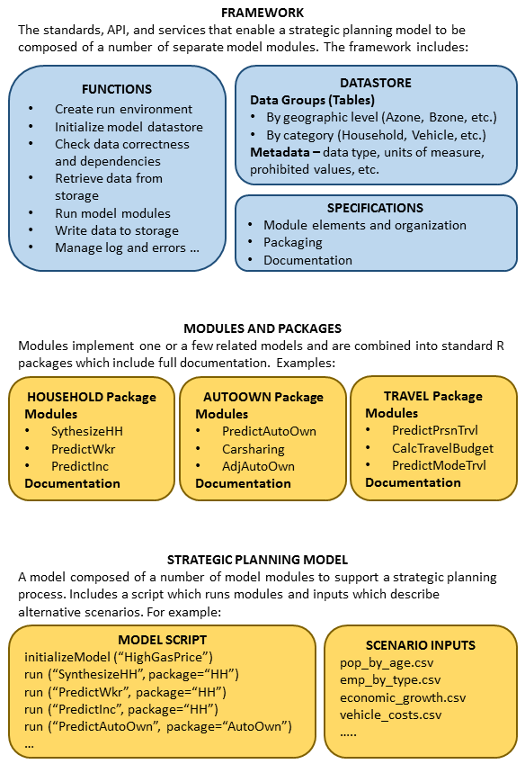
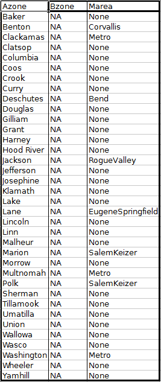

## VisionEval Model System and Framework Design  
**Brian Gregor, Oregon Systems Analytics LLC**  
**October 28, 2015**  
**DRAFT**


###Overview
The goal of this project is to define a model system and create a supporting software framework for developing and implementing strategic planning models that are completely open and extensible. This project is the outgrowth of the development of the GreenSTEP model, a model developed to assist the Oregon Department of Transportation (ODOT) and its partners in analyzing alternate transportation and land use strategies for reducing emissions from light-duty vehicles to meet statutory goals. ODOT made this model and all of the model estimation files to be open source code and subsequently several other modeling tools were built off of the original with various alterations to serve new purposes. In addition, ODOT recognized that the model could serve more general transportation-related strategic planning purposes because it was capable of analyzing and reporting on many types of transportation, land use, and household interactions. However, although ODOT and others found that the model could be modified and expanded to serve new purposes, the current design does not make it easy to do so. This project will define a model system and create a software framework for implementing strategic planning models as a set of loosely coupled modules which interact through a common datastore.

Following are definitions of some of the terms used in the preceding paragraph and in the sections that follow:  
- **Strategic planning** is the process for determining an organization's future direction and performance goals (i.e. vision). An important aspect of strategic planning is the recognition that the external conditions affecting the organization are likely to be different in the future than they are today, and that the nature, magnitudes, and effects of the changes are uncertain. Strategic planning is mostly concerned with what is to be accomplished, rather than how it is to be accomplished.  
- **Strategic planning models** are analytical tools which provide a computational representation of a social/economic/environmental system for which performance goals are to be developed. The system representation has to be broad enough to address interactions between factors related to the interests of the organization and other factors significantly related to the factors of interest. Strategic planning models are more oriented to representing the breadth of relationships between factors, rather than depth in representing those relationships. This enables potential strategies to be analyzed comprehensively and in consideration of uncertainties. In order for a strategic planning model to be able to analyze a variety of factors and their interactions, it is composed of a number of model components. These components are organized into modules.  
- A **modeling system** is a definition for a set of related models and a software framework for implementing that definition. Models built in the modeling system are related by the domains being modeled (e.g. travel, energy consumption, hydrology, etc.), the 'agents' being modeled (e.g. households, cities, watersheds, etc.), how physical space is represented (e.g. zones, grids, cubes, etc.), how time is represented (e.g. continuouse vs. discrete, independent vs. dependent on past states), and other modeling goals and tradeoffs (e.g. representational detail, degree of coupling, run times, etc.).  
- A **software framework** in the context of this project includes specifications and an application programming interface (API) for model modules, an environment and functions that coordinate the execution of modules, functions that manage the interaction between modules and input and output data storage, and a file structure for organizing model information.  
- A **module** in the context of this project is the combination of functionality, model parameters, and input and output specifications for a model or a small set of related models. (For example, a module might predict if a household owns a motor vehicle and, if so, how many they own.) A module resides in an *R* package which also contains full documentation of the module.  
- **Datastore** means a file or set of files for storing all of the inputs used by modules and outputs produced by modules.  
- **Loose coupling** means that there are limited dependencies between modules so that the internal operations of one module are unaffected by those of another module. This loose coupling applies both to model parameters and implementation code. Coupling is limited to the data items that modules consume and produce and the meanings of those data.  
- **Completely open** means that in addition to code, parameters and specifications being open to inspection, the scripts and data used for model estimation are open as well. All are documented so that reviewers can understand how a model was built and how it runs. Reviewers can also run model scripts to determine whether the reported results can be replicated. In addition, completely open means that the module is licensed with an open-source license that allows others to modify the module and redistribute the modified module (with attribution of course). Being open means more than sharing ones work. It means completely revealing ones work so that others can assess whether a model is working properly.  
- **Extensible** means that new model modules which follow the API can be used in a model in a 'plug-and-play' fashion as long as the inputs they need are present. It also means that models can be extended beyond the original purpose of modeling transportation energy consumption and emissions. For example, modules could be added which model building energy consumption, household earthquake preparedness, etc.  

###Definition of the VisionEval Model System
The GreenSTEP model, Regional Strategic Planning Model (RSPM), Energy and Emissions Reduction Policy Analysis Tool (EERPAT), and Regional Policy Analysis Tool (RPAT) comprise a modeling system for modeling strategic planning issues related to transportation and land use. These models are part of a modeling system in the most part because they share roots in the GreenSTEP model. No formal definition of the modeling system they comprise has been developed. Such a definition is necessary if we are to achieve the goal of interchangeability of components of models in the model system. That is the purpose of this section.

####General Qualities
All of these models belong to a class called disaggregate strategic planning models. They are disaggregate because, like many modern transportation models, they simulate behavior at the individual household level rather than at a more aggregate 'zonal' level. This enables the assessment of how prospective policies or other changes could have different impacts on different types of households (e.g. low income vs. high income). The models are strategic planning models because they are built to support long-range strategic planning decisions such as community visioning, policy development, and scenario planning. Strategic planning processes most often need to consider a number of possibilities about how the future may unfold and a range of potential actions that might be taken. As a consequence, models built to support strategic planning need to be responsive to a large number of variables and be capable of running quickly so that a large number of runs can be done to explore the decision space. 

The VisionEval system will have the following characteristics to provide strategic planning support:  
- **Simplicity and Policy Focused**: Models will only be as complex as needed to address policy questions and contingencies of interest to planners and decision-makers. Breadth of coverage is more important than depth of coverage.      
- **Short Run Time**: Model modules will run quickly to enable a large number of factors and a large number of scenarios to be modeled in a reasonable amount of time.  
- **Modular and Extensible**: A structure that allows new capabilities to be added in a plug-and-play fashion responding to new conditions and uncertainties (e.g., as more or different understanding develops about travel behavior with emerging modes such as electric bikes, or high travel prices). Modules are loosely coupled and completely open so that developers can easily extend the capabilities models and incorporate the work of other developers.  
- **Scalable and Accessible**: The structure of data storage and retrieval will support use in regions of varying population sizes, from small town to large metropolitan area or state, with large numbers of household attributes. Performance measures will be easily calculable from stored model outputs.
- **Completely Open**: Clear standards and guidelines will enable developers anywhere to create modules and/or combine modules into new or improved models. Openness will facilitate the development of a broad community of developers and users.  

####Model Domain
The modeling domain for VisionEval models is transportation and the relationship of transportation to land use, the environment (e.g. air quality), the economy (e.g. transportation costs), and social conditions (e.g. public health). VisionEval models take a comprehensive approach to transportation, addressing a broad range of transportation factors including, but not limited to:  
- Transportation Infrastructure and Services such as roadways of different functional classes and public transportation services;  
- Transportation costs such as gas taxes, mileage fees, parking charges, and congestion charges;  
- Demographic characteristics such as the geographic and age distributions of the population;  
- Economic characteristics such as the economic growth of the region and the distribution of household incomes;  
- Land use characteristics such as the distributions of people and jobs, the distribution and mix of developments of different types, the intensity (density) of development, the mix of housing types, and design characteristics of places;  
- Transportation system management such as deployment of management of traffic controls and the nature and deployment of transportation demand management programs;  
- Vehicle characteristics such as size, powertrain (e.g. ICE, HEV, PHEV, EV), age, and fuel economy;  
- Vehicle ownership and use; and,  
- Vehicle fuel characteristics such as type and carbon intensity.

Because transportation relates to many aspects of society, the economy, and the environment, the potential exists for the domain of VisionEval models to be expanded to include addition matters. For example, the housing type model in the RSPM could be complemented by a housing energy consumption model. Moreover planners and researchers in non-transportation fields may find that components in the VisionEval system may be useful in developing models of interest to them. For example, model components for household age structure, income, and housing type might be useful to the development of a water consumption model. Although the primary domain of the VisionEval model system is transportation and the system is being designed to satisfy that domain, the system is being built so as not to preclude modeling other domains.

####Model Agents
The primary agents being modeled in the VisionEval system are individual households. All of the existing models in the system model the characteristics of households, the vehicles they own, and their travel. Households are created by the models based on existing or forecasted demographic characteristics of the region. Most of the existing model modules are applied at the household level.

Household level modeling is an essential feature of the VisionEval model system. Modules developed to work with households need to have the same convention for what a household is. Household in the VisionEval system is defined as related and/or unrelated persons who share space in a dwelling unit or an individual living in group quarters. 

Although households are the primary model agent, the VisionEval system can model other agents are wellThe system is not limited to modeling household agents. For example, the Regional Policy Analysis Tool (RPAT) models firms - their sizes and types - and this capability is likely to be added to other , are modeled by RPAT. Commercial service vehicles and heavy trucks are modeled in the aggregate.

####Model Geographic Structure  
One of the objectives of the RSPM framework is to make the statewide and metropolitan models more consistent with how they treat geographic units. The statewide model divides space into counties (or similar divisions such as PUMAs) and metropolitan areas. The metropolitan model divides space into metropolitan divisions and the divisions into districts (which now roughly correspond to census tracts, but could in the future correspond to block groups). In the RSPM framework there would be "Azones" and "Bzones" for both the statewide and metropolitan implementations. Azones are the larger geographical units corresponding to counties, PUMAs or similarly sized areas. Bzones are smaller geographical units corresponding to areas such as census tracts or census block groups. (The framework might also be extended to include smaller Czones if this would be useful.) However, while Azones would be explicit geographic units with definite boundaries in all implementations, Bzones could be either explicit or implicit geographic units. Bzones are likely to be explict geographic units in metropolitan models and implicit in statewide models. Implicit Bzones are synthesized so that their characteristics represent a likely distribution of characteristics given the characteristics of the metropolitan area in which they are situated. This approach would be a variation of current approach of modeling the density and mixed use characteristics of neighborhoods that households reside in implicitly. Synthesizing Bzones and modeling them implicitly in statewide models will enable all the models to use the same functions for associating households with land use characteristics such as density, place type and building type.  

The following geographic organization is proposed:  
- **Region**: The region is the entire model area. Large-scale characteristics that don't vary across the region are specified at the region level. Examples include fuel prices and model-year vehicle characteristics.  
- **Azone**: Azones are large subdivisions of the region. These are counties in the Oregon GreenSTEP model. They are cities for the RSPM model for the Central Lane MPO. They could also be PUMAs. Azones are used to represent population and economic characteristics that vary across the region such as demographic forecasts of persons by age group and average per capita income.  
- **Bzone**: Bzones are subdivisions of divisions. Given that the GreenSTEP travel model has been estimated to use census tract-level population density, Bzones have been defined to be approximately the size of census tracts. However, with model reestimation, the size of Bzones could be reduced to be more comparable to census block groups. Bzones are used to represent neighborhood characteristics such as population density and mixed land use. In rural counties (i.e. counties that don't have an urbanized area), Bzones can be used to distinguish small cities from the more rural (sparsely developed) portions of the county.  
- **Mareas**: Mareas are census urbanized areas. The boundaries of Mareas may coincide, but don't have to coincide, with Azones or Bzones. The main reason for this is that an urbanized area boundary is likely to change over time as the population of the area grows. When Bzones are explicitly modeled, changes in an urbanized area over time are modeled by specifying changes in the portions of the Bzone land area and households that are assigned to metropolitan vs. non-metropolitan development. When Bzones are implicitly modeled, they are assigned as metropolitan or non-metropolitan based on portions of the Azone land area and households assigned to metropolitan vs. non-metropolitan development. Mareas are used to specify and analyze urbanized area transportation characteristics such as overall transportation supply (transit, highways) and congestion.  

###Design of the VisionEval Software Framework

The strategic planning model system that the framework is designed to support is composed of three components:  
1. The framework including functionality it provides, a datastore of module inputs and outputs, and specifications for modules and other parts of the system;  
2. Model modules which are packaged as standard R packages; and  
3. Strategic planning models that are created with simple scripts which call a number of different modules, and scenario input files which specify conditions and policies that describe a scenario.  
Figure 1 illustrates these components:  


**Figure 1. Overview of RSPM Framework**  



Although some people are likely to be involved in all three components of the system, it is expected that the framework will enable a more natural division of responsibilities that encourage collaboration and sharing. The framework component is currently and will probably continue to be the responsibility of a fairly small technical team who understand both the overall system and implementation details. This core team will need to remain fairly small because it is the responsibility of the team to maintain standards and code to assure interoperability of modules. The module component is likely to begin as the responsibility of a small number of people who are familiar with the framework and existing models which make up GreenSTEP and related models. However, the number of people who build modules and packages will grow over time as people develop ideas for improving existing modules and developing new modules to support new and improved strategic planning applications. The number of people who can develop modules will only be limited by their abilities to design and estimate models that meet framework specifications. Finally the strategic planning model component is likely to be carried out by organizations such as ODOT and the FHWA who develop model templates for others to use, and other organizations or individuals who either use an existing template or who develop their own model scripts to meet their strategic planning needs.


###File Structure for a Strategic Planning Model
A strategic planning model application will have a very simple file structure as follows. Directories are denoted by a trailing forward slash. Optional files are denoted by angle brackets.  

    run_model.r
    datastore.h5  
    defs/  
        geography.csv  
        parameters.json  
    inputs/  
        <age_adj.csv>  
        <auto_lighttruck_fuel.csv>  
        <auto_lighttruck_mpg.csv>  
        <...>  
    scripts/  
        <tabulate_outputs.r>
        <...>

The *run_model.r* file (or whatever else it might be called) is the model application R script which starts the model and calls modules. 

The *datastore.h5* file is the central datastore. In the present implementation of the framework it is an HDF5 format file. The structure of the file is described below.

The *defs* directory contains all of the definition files needed to support the model run. Currently, only two files have been defined. The *geography.csv* file describes all of the geographic relationships for the model in a csv formatted text file. Figure 2 shows an example of a geography definition file that would be used for a statewide model where Bzones are left unspecified and *pseudo-Bzones* would be created by a model module. In the case of a metropolitan model with specified Bzones, the Bzone column would be filled in with the unique set of Bzone names and the Azone columns would have duplicated values as appropriate for the model. 

**Figure 2. Example of geography.csv File**  


The *parameters.json* file describes all other model parameters in a json formatted text file. The demo version contains the following parameters: Scenario, Description, BaseYear, Years. This file will also include other global parameters needed to support a model run.


###Modules and Framework Responsibilities 
Modules and the framework have distinct responsibilities. Modules encapulate all of the functionality, parameters and specifications for models. A model describes what is to be accomplished (e.g. predicting auto ownership) and how it is to be accomplished, but it doesn't do anything by itself. The framework takes care of managing the application of modules. It sets up the persistent datastore and keeps track of its state, checks that the resources a module needs will be available when it needs them, loads resources, runs the module, and saves the module results. The following list describes module and framework design principles in more detail:
1. Modules only interact with one another through data which resides in the datastore. Each module specifies what data it needs and what data it produces.  
2. The framework is responsible for all interactions with the datastore. It determines from the module specification what data the module needs and it reads the data from the datastore and supplies it to the environment in which the module runs. It also writes to the datastore data that the module specifies is to be written. Modules do not interact with the datastore directly.  
3. The framework establishes the general structure of the datastore, but modules are free to add tables to the datastore. The framework provides higher level functionality to enable a new table to be established which includes fields to enable the data in one table to be linked to data in other tables.
4. Each module is responsible for completely specifying what data it needs from the datastore. This includes the name of the data (e.g. Hhsize), the table where it is stored (e.g. Household), and the key characteristics of that data (e.g. type = integer). The framework checks that the data is present and has the correct characteristics before it attempts to read the data from the datastore. Likewise the module is responsible for completely specifying what outputs are to be stored and the key characteristics to be stored with the data.  
5. Every module is responsible for completely specifying any scenario inputs it needs including the name of the file, the level of geography of the inputs, the data fields that the file must have, and characteristics of the data (data type, measurement units, prohibited values, unlikely values).
6. Each module is responsible for determining how to link input data coming from different tables.  
7. The framework handles reading in scenario inputs, checking the inputs for compliance with specifications, writing the inputs to the datastore, and writing related metadata to the datastore (e.g. type, units, prohibited values).  
8. The framework checks all scenario inputs, processes those inputs, and checks all datastore dependencies for all modules prior to running any modules. This will minimize runtime errors due to missing or improper inputs.  
9. The framework provides a log for keeping track of model progress through messages written to the log. The framework will write messages to the log to record errors and warnings that it discovers and to record key actions when running modules. This logging is also available for modules to record messages to the log.  
10. A module operates within an environment and all module functions get and assign data from that environment. All passing of data is through explicit assignment to the environment. Once a module has completed being run, nothing from its execution is left in memory.  
11. The framework keeps track of the state of a model run such as an inventory of the state of the datastore which is updated whenever any change has been made.  
12. If needed, a module will include a function or functions that will estimate regionalized parameters when the module is built from source files.  


####Modules  
All modules are made available in the form of R packages that meet framework specifications. A package may contain more than one module. The source form of a module is an R script included in the R directory of the source package. The binary form of the module, created when the binary package is built, is an R environment. The characteristics of the source R script and the binary environment are described below.  

The source script must define all of the key functions utilized by the module. There are 3 types of functions: 1) optional functions that suit the needs of the model developer, 2) mandatory functions if one or more model parameters need to be estimated using regional data, 3) required functions.  

The optional functions are whatever the module developer determines are necessary to implement the model. These functions can be organized and written in whatever way the developer determines is best, with the following restrictions:  
- Function documentation must be complete and must use Roxygen syntax;  
- Objects created by functions which are to be used as inputs to other functions must be assigned to the module environment (i.e. by using the assign function with `envir = Module`); and  
- All coding needs to follow the coding guidelines so that the functions can be more easily understood by others.  

If the model requires that one or more parameters be estimated using regional data, then the source script must include one or more functions which will read in user-supplied regional data and compute the required parameter(s). These parameters are assigned to the module. With these models, as opposed to models requiring no estimation of regionalized parameters, the model users download the source package, rather than the built binary package. They then prepare their regional data according to instructions included with the package and save it in the `inst/extdata` directory in the package. When they build the binary package, for example by using functionality in RStudio, the model estimation functions are invoked and the necessary regional model parameters are computed. This customized binary package is then used in the model implementation.

One of the required functions is the `main` function. This is the function that is invoked by the framework to run the model. The `main` function orchestrates all of the model procedures, calling other model functions as necessary.

The other required function is the `buildModel` function. This function establishes an R environment and populates it with all of the information needed to run the model. An R environment is used as a container for the model information for several reasons. First, like a list, it can store many types of information, including functions, and the framework can copy information to it and retrieve information from it. Keeping all of the model information in one object simplifies memory management. Once the model has finished executing and all of the results have been retrieved, the environment can be removed from memory. Second, unlike a list, an environment provides a namespace for functions that are assigned to it. This is very useful because if all the function inputs are in the environment, the function will be able to access those inputs by their names. The environment acts as a useful container for the exchange of information between functions that are part of the module as well as data from the data store. This is why all model functions are required to pass data that is to be used again (either temporarily by other functions or permanently in the data store) by assigning it to the enclosing environment. Following is an annotated example of a `buildModel` function:

    buildModule <- function() {
      #1. Create an environment to hold the module components
      Module <- new.env()
      #2. Add functions and assign their environments to be 'Module'
      Module$idEcoWorkers <- idEcoWorkers
      environment(Module$idEcoWorkers) <- Module
      Module$idImpHouseholds <- idImpHouseholds
      environment(Module$idImpHouseholds) <- Module
      #3. Define a main function which calls the other functions
      Module$main <- function() {
        Module$idEcoWorkers()
        Module$idImpHouseholds()
      }
      #4. Define model parameters
      Module$LabForcePartRate <- 0.65
      Module$DenThrshold <- 4000
      Module$MixRequired <- TRUE
      #5. Identify the level of geography that is iterated over when running the module
      Module$RunBy <- "Marea"
      #6. Identify scenario input files and characteristics
      Module$Inp <- list()
      Module$Inp$TDM <- list()
      Module$Inp$TDM$File <- "tdm.csv"
      Module$Inp$TDM$GeoLvl <- "Marea"
      Module$Inp$TDM$Fields <- list()
      Module$Inp$TDM$Fields$PropWrkEco <-
        list(
          TYPE = "double",
          UNITS = "None",
          NAVALUE = -9999,
          PROHIBIT = c("NA", "< 0", "> 1"),
          UNLIKELY = NULL
        )
      Module$Inp$TDM$Fields$ImpPropGoal <-
        list(
          TYPE = "double",
          UNITS = "None",
          NAVALUE = -9999,
          PROHIBIT = c("NA", "< 0", "> 1"),
          UNLIKELY = NULL
        )
      #7. Identify data to be loaded from data store
      Module$Get <- list()
      Module$Get$Marea <- list()
      Module$Get$Marea$PropWrkEco <-
        list(
          TYPE = "double",
          UNITS = "None",
          PROHIBIT = c("NA", "< 0", "> 1")
        )
      Module$Get$Marea$ImpPropGoal <-
        list(
          TYPE = "double",
          UNITS = "None",
          PROHIBIT = c("NA", "< 0", "> 1")
        )
      Module$Get$Household <- list()
      Module$Get$Household$Houseid <-
        list(TYPE = "character",
             UNITS = "None",
             PROHIBIT = "NA")
      Module$Get$Household$DrvAgePop <-
        list(TYPE = "integer",
             UNITS = "Persons",
             PROHIBIT = c("NA", "< 0"))
      Module$Get$Household$Htppopdn <-
        list(TYPE = "double",
             UNITS = "Persons Per Square Mile",
             PROHIBIT = c("NA", "< 0"))
      Module$Get$Household$Urban <-
        list(
          TYPE = "integer",
          UNITS = "None",
          PROHIBIT = c("NA", "< 0", "> 1")
        )
      #8. Identify data to store
      Module$Set <- list()
      Module$Set$Household$NumEco <-
        list(
          TYPE = "integer",
          UNITS = "Persons",
          NAVALUE = -9999,
          PROHIBIT = c("NA", "< 0"),
          SIZE = 0
        )
      Module$Set$Household$ImpHh <-
        list(
          TYPE = "integer",
          UNITS = "None",
          NAVALUE = -9999,
          PROHIBIT = c("NA", "< 0", "> 1"),
          SIZE = 0
        )
      #9. Return the Module object
      Module
    }

As can be seen, the `buildModel` function creates an environment that will hold all of the model components and assigns all model functions and parameters to that environment. It also defines a `main` function which calls all the other functions. Model parameters can be assigned as static values, as in this example, or may be assigned by calling a function which calculates regionalized values. The `buildModel` function establishes what unit of geography is to be iterated over when applying the model. In this case the model will be applied by Marea (metropolitan area). The `Inp` component of the environment identifies the scenario input file(s) to be loaded, the level of geography that the file represents, the names of the data fields in the file, and the attributes of data in those fields. (Note that in addition to the named fields, all scenario input files have a field named *Geo* which specifies the geography of each entry, and a field names *Year* which specifies the year of each entry.) The framework uses the specified data attributes to check the correctness of the inputs and to attribute the data that is written to the datastore. The `Get` component of the environment identifies the data to be drawn from the datastore including the table and dataset the data is to be drawn from and the key characteristics of the data (data type, measurement units, and prohibited values). The framework checks the values of these attributes with the values stored with the requested data (type and prohibited values differences are errors, unit differences create warning). The `Set` component of the environment describes the results to be saved to the datastore including the table to save it in, the name of the dataset, and key attributes to be saved with the data. The `NAVALUE` attribute specified in this and other components of the environment identify the value that is used to denote NA in the dataset in the datastore.  


####Framework  
In addition to establishing standards for modules, the framework contains the mechanisms for running models. These include a run environment which stores in memory key information about the state of a model run, and a datastore which stores all data generated by a model run, and a set of functions that manage the execution of a model run. This section describes how the framework manages namespaces and the role of the run environment. Following sections describe the datastore and the framework functions. 

One of the design goals of the framework is to minimize the use of the global environment namespace. The current GreenSTEP and derivative models use the global environment extensively and that practice increases the difficulty of maintaining and extending the models. The framework minimizes the use of the global namespace by:  
1. Keeping key information about the state of the run and the datastore in an environment named `E`. This is referred to as the run environment. All run state values are stored in this environment. For example, an inventory of the datastore contents is stored in `E$Datastore`.  
2. Framework functions are stored in the framework package whose namespace is attached when the framework package is loaded.
3. Module functions and data are stored in the packages where they reside. These packages are attached as they are needed.
4. A module is executed within the context of the framework function (`runModel`) which loads the module environment, interacts with that environment, and cleans up afterwards.

The run environment (`E`) keeps track of all information regarding the state of the model run. In the current iteration it contains the following components. Some of these components may not be in the final framework and other components may be added. Components in the run environment might be used to coordinate with graphical user interfaces. Some of the data in these components may also be moved to the datastore from where they would be made available to modules. More design work needs to be done in this area.
- BaseYear: A string identifying the base year for the model (e.g. "2005");  
- BzoneSpecified: A logical identifying whether Bzones have been specified;  
- Datastore: A data frame containing the current inventory of the datastore (identifying, tables, datasets, and dataset attributes);  
- Description: A string containing a description of the scenario;  
- Geo_df: A data frame containing the contents of the "geography.csv" file;  
- LogFile: A string containing the name of the log file for the model run;       
- Scenario: A string identifying the name of the scenario; and
- Years: A string vector identifying the model run years.


A model that is run in the framework will be a straight-forward R script. A model run is started by calling an `initModel` function. This is then followed by sequential calls to run model modules. More complicated execution sequences can also be established by using loops and conditional evaluation. Modules are called by the framework `runModel` function which takes as arguments the name of the module, the name of the package where the module is located, and the model run year. A model script might look something like the following:  
```  
initModel(Name = "High Gas Price")
for (yr in Years) {
    runModel("SynthesizeHh", Package = "HH", Year = yr)  
    runModel("PredictWkr", Package = "HH", Year = yr)  
    runModel("PredictInc", Package = "HH", Year = yr)  
    runModel("PredictAuto", Package = "Auto", Year = yr)  
    runModel("PredictDvmt", Package = "Travel", Year = yr)
}
```  


###Data Store Description
####Overview of the Problem to be Solved  
Currently GreenSTEP/RSPM and related models store data in R binary files (RData files). The largest of these files are the synthetic household files which store all of the information for all synthetic households in an Azone (e.g. counties in GreenSTEP). All the data for households in the Azone are stored in a data frame where each row corresponds to a record of an individual household and the columns are household attributes. Vehicle data for households are stored as lists in the data frame. This approach has had some advantages:  
- Storage and retrieval are part of the language: one line of code to store a data frame, and one line of code to retrieve;  
- It is easy to apply models to data frames; and  
- Vehicle data can be stored as lists within a household data frame, eliminating the need to join tables.  

The simplicity of this approach helped with getting GreenSTEP from a concept into an operational model quickly. However, several limitations have emerged as GreenSTEP and related models have been used in various applications including:  
- Requiring large amounts of computer memory when modeling divisions having large populations (e.g. King County Washington). This necessitates either expanding computer memory or limiting the size of divisions;  
- The system time to add an attribute increases as the number of attibutes increase;  
- It is not easy to produce summary statistics from the synthetic household files; and  
- The number of non-household data files has proliferated in order to store various aggregations for use in the model and for later summarization.

These limitations are a consequence of using data frames and storing them as binary objects. One consequence of using R binary objects is that the whole object needs to be loaded into memory, even though in most cases only a portion of the data are needed for a calculation. The memory footprint increases as the number of household attributes increases. Moreover, calculations can end up increasing the memory requirements as multiple copies are made. The impact of this was reduced in later versions of GreenSTEP by sending only the needed data frame components to model functions. Other improvements might be made by using newer packages like dplyr and data.table.  

The use of data frames also introduces time penalties. As more attributes are added to a data frame and its size grows, the amount of time necessary to save and retrieve the data frame from disk increases. In addition, the amount of time required to add attributes to the data frame in memory increases.  

The memory problem has been overcome to some extent by storing the household data for Azones (counties) in separate data frames. This, along with limiting the data sent to model functions enabled Oregon GreenSTEP model to be run out to the year 2050 on a computer with a modest amount of memory (4 GB). However, the splitting of household data among a number of data files greatly complicates the process of producting summary statistics from the outputs. This makes it necessary to load multiple files sequentially to extract the desired information and accumulate in an intermediate data structure before you can compute the desired statistic. Because this is a cumbersome process, an outputs script has been developed for GreenSTEP which produces a number of output arrays which then can be used to calculate a variety of statistics. While this has been a workable solution, it has required a significant amount of maintenance when the model changes and/or users request other statistics.  

Finally, as the model has been developed and revised, a number of data sets have been created and are saved to disk either for later use in model calculations or to produce performance measures. This has been done on an ad hoc basis and without overall organizing principles.  

####Datastore Design  
The proposed solution is to use the HDF5 file format for storing model data. This file format was developed by the National Center for Supercomputing Applications (NCSA) at the University of Illinois and other contributors to handle extremely large and complex data collections. For example, it is used to store data from particle simulations and climate models. It also is the basis for the new open matrix standard for transportation modeling, [OMX](https://github.com/osPlanning/omx).  

Prior to pursuing the HDF5 approach, several attempts were made to use SQL databases as a substitute for R binary files. In all cases, SQL approaches were found to take considerably more time than the current approach. Moreover, SQL databases are much more complex than is needed to serve as a data store for the RSPM framework. The RSPM does not need to query data based on multiple attributes, it only needs to extract conforming vectors of selected attributes which are then very efficiently processed by R language functions. 

The HDF5 format and tools provide random data access in a way that is better scaled to the needs of the RSPM framework. Large complex data sets can be randomly accessed by organizing datasets in a heirarchy of groups and by accessing portions of datasets by using indexing. In addition, metadata can be stored as attributes of any data group or data item. Preliminary tests indicate that the aggregate time for reading data from an HFD5 file, applying a model, and writing the result back to the HDF5 file is competitive with the aggregate time for doing these things using R binary files. 

An HDF5 file is composed of groups and datasets. Groups provide the overall structure for organizing data, just a file system provides the structure for organizing files on a computer disk. A `/` indicates the root group. Subgroups are created with names. So for example, data for the year 2050 could be stored in a `/2050` group. Household data for the year 2050 could be stored in a `/2050/Household` group. Some groups, like the *Household* group just mentioned, are used to store tabular data in the same way that the existing model stores tabular data in data frames. Just like a data frame, each component (dataset) can store a different type of data, but all datasets must have the same length. The framework enforces the equal length requirement by storing a length attribute with the table and then using the length attribute when initializing a new dataset to include in the table. The framework stores information about the data type contained in a dataset as well as other key attributes (identified in the *Modules* section) as attributes of the dataset. Datasets in tables are accessed by supplying the name of the dataset and the full path name to the table where the dataset is stored (e.g. `/2050/Household/Income` for a household income dataset). Indexed reading and writing to the dataset is possible and the framework includes functionality to simplify indexing.

The structure of the datastore to date is as follows. Names in angle brackets are examples of tables that could be added to the datastore in the future. The example below shows what a datastore would look like for a model that is run for two years (2010 and 2050). The `Global` group is used to store global parameters (constants) related to the model run such as the factor to convert daily vehicle miles traveled to annual vehicle miles traveled.
```    
  \Global  
  \2010  
      \Region  
      \Azone  
      \Bzone  
      \Marea  
      \Households  
      \Vehicles  
      \<Persons>  
      \<Buildings>  
      \<Employers>  
  \2050  
      \Region  
      \Azone  
      \Bzone  
      \Marea  
      \Households  
      \Vehicles  
      \<Persons>  
      \<Buildings>  
      \<Employers>  
```            
This structure should be adequate to store all of the information which are used by the GreenSTEP/RSPM models and their offshoots. This structure can easily be expanded to serve new modeling capabilites. For example if a module is added to model building stock, a 'Buildings' group could be added. In addition, if a future module makes use of a matrix such as a travel time matrix, a group could be added to store the matrix.  


###Framework Functions
A number of framework functions have been written. Following is a listing with brief descriptions. This is by no means complete or final.  
- **initEnv** creates an environment 'E' which is used to keep track of key information which is used to manage a model run. It is initialized with values stored in the 'defs/parameters.json' file. At this time the parameters include the scenario name ('Scenario' parameter), scenario description ('Description' parameter), base year ('BaseYear' parameter), and model run years ('Years' parameter). Additional parameters may be added in the future.  
- **initLog** creates a log file that is a text file which stores messages generated during a model run. The name of the log is 'Log <date> <time>' where '<date>' is the initialization date and '<time>' is the initialization time. The log is initialized with the scenario name, scenario description and the date and time of initialization.  
- **writeLog** writes a message in the form of a string to the run log. Itlogs the time as well as the message to the run log.  
- **initDatastore** creates the datastore file for the model run with the initial structure. The file is created in the working directory and is named 'datastore.h5'. If this file already exists it is deleted and a new initialized file is created. Groups are created in the file; one for each model run year and one named 'Global' for storing global values.  
- **loadDatastore** copies a saved datastore as 'datastore.h5' in the working directory and attributes the run environment with related geographic information. This function will most often be used during module development to start off with a datastore which contains the data needed to run a module. It may also be used to run scenario variants off of a constant set of starting conditions.  
- **readGeography** reads the file containing geographic specifications for the model and checks the file entries to determine whether they are internally consistent.  
- **listDatastore** lists the contents of a datastore including identifying all groups, tables, and datasets. It also lists the attributes associated with each table and dataset. The listing is stored in the run environment as 'E$Datastore'. This function is run whenever the structure or contents of the datastore is changed to always keep the listing in E$Datastore current.  
- **initDatastoreTable** initializes a table in the datastore. A table in the datastore is a group which contains equal length vectors of data that may have different types. Thus is is much like an R data frame which is a list containing equal length vectors that may have different types. A table is initialized in the datastore by initializing a group whose name is the table name and assigning a 'LENGTH' attribute which specifies the length that all data vectors in the table must have.  
- **initDataset** initializes a dataset which must be done before data can be stored. Initialization establishes a name for the dataset and key attributes associated with the data.  
- **writeToTable** writes data to a dataset in a table. It initializes the dataset if the dataset does not exist. Enables data to be written to specific location indexes in the dataset. The function makes several checks prior to attempting to write to the datastore including: the desired table exists in the datastore, the input data is a vector, the data and index conform to each other and to the table length, the type, size, and units of the data match the datastore specifications. On successful completion, the function calls 'listDatastore' to update the datastore listing in the run environment.  
- **readFromTable** reads datasets from a table. Indexed reads are permitted. The function checks whether the table and dataset exist and whether all specified indices are within the length of the table. The function converts any values equal to the NAVALUE attribute to NA.
- **initDatastoreGeography** writes tables to the datastore for each of the geographic levels. These tables are then used during a model run to store values that are either specified in scenario inputs or that are calculated during a model run. The function populates the tables with cross-references between geographic levels. The function reads the model geography from the run environment 'E$Geo_df'. Upon successful completion, the function calls 'listDatastore' to update the datastore listing in the run environment.  
- **checkModuleInputs** manages the checking of scenario inputs required by a module. Modules specify what inputs they need; the file names, the geographic level of the data, the data fields, and the attributes of the data stored in the data fields. A module may specify more than one scenario input file. This function manages the checking of inputs of all these files and collates all of the errors and warnings that are found with the inputs. It writes all of the errors and warnings to the log.  
- **checkInputFile** checks whether the specified scenario input file exists and whether all of the values meet specifications including: whether values exist for all years and for all geographic entities for the specified level of geography, whether all specified data fields are in the file, whether the data types are consistent with specifications, whether any prohibited data values are present in the data, and whether any unlikely values are present in the data. The function calls two other functions to carry out the checking of data types ('compareDatatypeToSpec') and prohibited and unlikely values ('checkValues').  
- **checkValues** checks whether any of the values in a data vector match one or more conditions. The conditions are specified in a character vector where each element is either "NA" (to match for the existence of NA values) or a character representation of a valid R comparison expression for comparing each element with a specified value (e.g. "< 0", "> 1", "!= 10").  
- **compareDatatypeToSpec checks whether the data type of a data vector is inconsistent with a specified data type. An error message is generated if data can't be coerced into the specified data type without the possibility of error or loss of information (e.g. if a double is coerced to an integer). A warning message is generated if the specified type is 'character' but the input data type is 'integer', 'double' or 'logical' since these can be coerced correctly, but that may not be what is intended (e.g. zone names may be input as numbers).  
- **loadInputFile** loads the data contained in an input file into the datastore. The function calls the 'checkInputFile' function to check for any errors and if not then copies the data into the datastore. It calls the 'readFromTable' function to create an index to match the data in the file with the geographic ordering in the relevant datastore table. It calls the 'writeToTable' function to initialize the dataset with the specified attributes and to write the data to the table using the index to put it in the correct positions.
- **checkModuleDependencies** checks whether the datastore contains the data needed for a module to run. The module specifications identify all of the datasets required to run a module including the dataset name, the name of the table where the dataset is located, and the data attributes that affect whether the module is likely to run correctly (i.e. TYPE, PROHIBIT), and the attribute which determines whether the measurement units are consistent (UNITS).  
- **createIndex** creates an indexing function that returns an index to positions in datasets which correspond to positions in an index field of a table. For example if the index field is 'Azone' in the 'Household' table, this function will return a function that when provided the name of a particular Azone, will return the positions corresponding to that Azone.  
- **runModule** runs a model module for a specified year.

Several functions are yet to be written. One of the functions will parse the model run script and read in all of the module specifications. It will then check all of the input files for correctness, and load them if they are all correct. Otherwise it will throw an error. This function will also check all of the data dependencies for the modules to assure that the data that every module needs will be available when it needs it and will have the correct characteristics. If not, an error will be thrown. This way all data errors can be checked and eliminated so that they down show up during a model run. This function and other initialization functions will be called by a function to start the model run.

