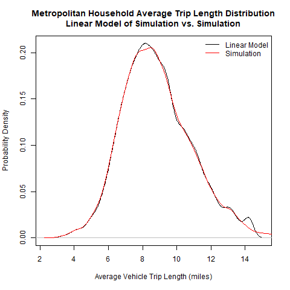
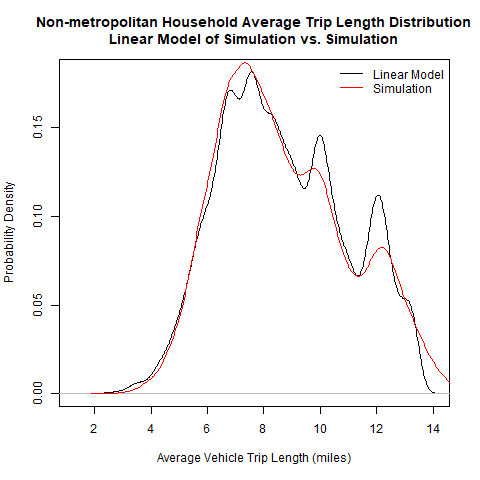

# CalculateVehicleTrips Module
### November 23, 2018

This module calculates average daily vehicle trips for households consistent with the household DVMT. An average trip length model is applied to estimate average length of household trips reflecting the characteristics of the household and the place where they live. The average trip length is divided into the average household DVMT to get an estimate of average number of daily vehicle trips.

## Model Parameter Estimation

Metropolitan and non-metropolitan household trip length models are estimated from the Hh_df dataset in the VE2001NHTS package. Separate metropolitan and non-metropolitan models are estimated because the metropolitan model is sensitive to added variables that are not present for non-metropolitan household data. The models are estimated using the records of households that had some light-duty vehicle travel on the survey day.

The models are estimated in 2 steps. In the first step, a linear model is estimated to predict the survey day average trip length. This model is applied stochastically over 1000 days to calculate the average trip length. In the second step, a linear model of the averages is estimated. These steps are described in more detail below.

In the first step, linear models of survey day average vehicle trip length are estimated for metropolitan and non-metropolitan households. Since the distribution of vehicle trip length is highly skewed with a long right-hand tail, the model is estimated for predicting power-transformed values. The power is estimated to minimize the skewness of the distribution. Following is a summary of the estimation statistics for non-metropolitan households:

```

Call:
lm(formula = ModelFormula, data = Data_df)

Residuals:
     Min       1Q   Median       3Q      Max 
-0.43677 -0.06198 -0.00375  0.05986  0.43820 

Coefficients:
                       Estimate Std. Error t value Pr(>|t|)    
(Intercept)           0.9966442  0.0197085  50.569  < 2e-16 ***
Drivers               0.0823890  0.0103433   7.965 1.70e-15 ***
NonDrivers            0.0305891  0.0075363   4.059 4.94e-05 ***
LogIncome             0.0254076  0.0018770  13.536  < 2e-16 ***
LogDensity           -0.0146889  0.0003151 -46.623  < 2e-16 ***
VehLtDvr             -0.0146301  0.0020280  -7.214 5.56e-13 ***
Drivers:LogIncome    -0.0066623  0.0009650  -6.904 5.16e-12 ***
NonDrivers:LogIncome -0.0028721  0.0007053  -4.072 4.67e-05 ***
---
Signif. codes:  0 ‘***’ 0.001 ‘**’ 0.01 ‘*’ 0.05 ‘.’ 0.1 ‘ ’ 1

Residual standard error: 0.1 on 31205 degrees of freedom
Multiple R-squared:  0.0934,	Adjusted R-squared:  0.0932 
F-statistic: 459.3 on 7 and 31205 DF,  p-value: < 2.2e-16

```

All variables are highly significant and the coefficients have expected signs. Trip lengths increase with the numbers of drivers and non-drivers in the household and the income of the household. The number of drivers in the household has a stronger effect than the number of non-drivers. Trip lengths decrease at higher population densities and if households have fewer vehicles than drivers. The negative coefficients for the interaction of income with drivers and non-drivers indicates that the rate of increase in trip length diminishes as income and the numbers of drivers and non-drivers increase.

The metropolitan model has the same independent variables as the non-metropolitan model and also includes freeway lane-miles per capita and urban mixed-use neighborhood variables. Following is a summary of the estimation statistics for this model:

```

Call:
lm(formula = ModelFormula, data = Data_df)

Residuals:
     Min       1Q   Median       3Q      Max 
-0.69842 -0.10741 -0.00495  0.10100  0.72511 

Coefficients:
                            Estimate Std. Error t value Pr(>|t|)    
(Intercept)                 0.901819   0.044739  20.157  < 2e-16 ***
Drivers                     0.140673   0.023458   5.997 2.05e-09 ***
NonDrivers                  0.059420   0.016324   3.640 0.000273 ***
LogIncome                   0.051143   0.004077  12.544  < 2e-16 ***
LogDensity                 -0.022121   0.001060 -20.873  < 2e-16 ***
IsUrbanMixNbrhd            -0.261479   0.034807  -7.512 6.11e-14 ***
FwyLaneMiPC                19.946129   7.085153   2.815 0.004881 ** 
VehLtDvr                   -0.027993   0.004361  -6.419 1.41e-10 ***
Drivers:LogIncome          -0.011388   0.002129  -5.349 8.96e-08 ***
NonDrivers:LogIncome       -0.005853   0.001498  -3.907 9.36e-05 ***
LogDensity:IsUrbanMixNbrhd  0.027941   0.003759   7.434 1.11e-13 ***
---
Signif. codes:  0 ‘***’ 0.001 ‘**’ 0.01 ‘*’ 0.05 ‘.’ 0.1 ‘ ’ 1

Residual standard error: 0.1646 on 16299 degrees of freedom
Multiple R-squared:  0.0805,	Adjusted R-squared:  0.07993 
F-statistic: 142.7 on 10 and 16299 DF,  p-value: < 2.2e-16

```

The coefficients for the variables shared with the non-metropolitan model have the same signs. The added freeway lane-mile and urban mixed-use neighborhood variables are also highly significant and have expected signs. The average vehicle trip length increases with greater freeway lane-miles and decreases in urban mixed-use neighborhoods. The added interaction between density and urban mixed-use has a positive sign which indicates that the rate of decrease in trip length diminishes as density increases.

As can be seen from the statistics, the models predict a small portion of the observed variation in vehicle trip lengths. Because of this and because the model is a model of power-transformed trip length (where trip length has a long right-hand tail), the mean of the modeled values is substantially less than the observed mean. To address this, the modeled predictions are treated as the mean values of distributions for which a standard deviation is calculated that results in a distribution of predicted values that has the same variance as the observed distribution. The model is run 1000 times for each survey household where each time a value is chosen at random from a normal distribution having the modeled mean and the estimated standard deviation. The household average is computed from the results.

In the second step, linear models to predict the simulated averages for metropolitan and non-metropolitan households are estimated. The independent variables in these models are the same as in the survey day models. Following is are the estimation statistics for the metropolitan household model.

```

Call:
lm(formula = makeFormula(EndTerms_), data = EstData_df)

Residuals:
       Min         1Q     Median         3Q        Max 
-0.0112023 -0.0020296  0.0000068  0.0020352  0.0113354 

Coefficients:
                             Estimate Std. Error t value Pr(>|t|)    
(Intercept)                 9.944e-01  8.100e-04 1227.70   <2e-16 ***
Drivers                     7.373e-02  4.246e-04  173.62   <2e-16 ***
NonDrivers                  2.998e-02  2.955e-04  101.44   <2e-16 ***
LogIncome                   2.650e-02  7.381e-05  359.03   <2e-16 ***
LogDensity                 -1.127e-02  1.922e-05 -586.32   <2e-16 ***
IsUrbanMixNbrhd            -1.346e-01  6.304e-04 -213.56   <2e-16 ***
FwyLaneMiPC                 1.048e+01  1.283e-01   81.69   <2e-16 ***
VehLtDvr                   -1.454e-02  7.895e-05 -184.15   <2e-16 ***
Drivers:LogIncome          -5.983e-03  3.854e-05 -155.26   <2e-16 ***
NonDrivers:LogIncome       -2.956e-03  2.712e-05 -109.02   <2e-16 ***
LogDensity:IsUrbanMixNbrhd  1.438e-02  6.807e-05  211.25   <2e-16 ***
---
Signif. codes:  0 ‘***’ 0.001 ‘**’ 0.01 ‘*’ 0.05 ‘.’ 0.1 ‘ ’ 1

Residual standard error: 0.00298 on 16299 degrees of freedom
Multiple R-squared:  0.9859,	Adjusted R-squared:  0.9859 
F-statistic: 1.143e+05 on 10 and 16299 DF,  p-value: < 2.2e-16

```

The high R-squared value indicates that the linear model can be substituted for the synthesis method for predicting the average trip length for households. The following figure illustrates this by comparing the distributions of the values produced by the linear model and the simulated averages.



Following are the estimation statistics for the non-metropolitan household model.

```

Call:
lm(formula = makeFormula(EndTerms_), data = EstData_df)

Residuals:
      Min        1Q    Median        3Q       Max 
-0.206203 -0.034100 -0.001406  0.032511  0.260520 

Coefficients:
                       Estimate Std. Error  t value Pr(>|t|)    
(Intercept)           0.9245207  0.0099569    92.85   <2e-16 ***
Drivers               0.8732096  0.0052252   167.12   <2e-16 ***
NonDrivers            0.3698883  0.0038072    97.16   <2e-16 ***
LogIncome             0.2790979  0.0009482   294.33   <2e-16 ***
LogDensity           -0.1795171  0.0001597 -1123.75   <2e-16 ***
VehLtDvr             -0.1722608  0.0010245  -168.15   <2e-16 ***
Drivers:LogIncome    -0.0690655  0.0004875  -141.67   <2e-16 ***
NonDrivers:LogIncome -0.0347670  0.0003563   -97.57   <2e-16 ***
---
Signif. codes:  0 ‘***’ 0.001 ‘**’ 0.01 ‘*’ 0.05 ‘.’ 0.1 ‘ ’ 1

Residual standard error: 0.05052 on 31205 degrees of freedom
Multiple R-squared:  0.9832,	Adjusted R-squared:  0.9832 
F-statistic: 2.606e+05 on 7 and 31205 DF,  p-value: < 2.2e-16

```

The high r-squared value indicates that this model is also a suitable substitute for the simulation of average trip length. The following figure shows that the fit of the non-metropolitan model is not as good as the fit of the metropolitan model.



The following table compares the mean modeled values for average DVMT, average trip length, and average daily vehicle trips with average survey values for DVMT, trip length, and vehicle trips. The survey values are capped at the 99th percentile value as are the modeled values. The mean number of trips for the modeled and survey values is calculated by dividing the mean DVMT by the mean trip length. As can be seen, the modeled mean trip length is close to the survey mean. However, since the mean of the modeled average household DVMT is less than the survey day mean DVMT, the modeled average number of vehicle trips is less than the survey mean.


|             | DVMT (miles)| Trip Length (miles)| Trips|
|:------------|------------:|-------------------:|-----:|
|Model Means  |         58.7|                 8.8|   6.7|
|Survey Means |         62.6|                 8.7|   7.2|

## How the Module Works

The module applies the estimated metropolitan and non-metropolitan average vehicle trip length models to calculate the average vehicle trip length for each household. The metropolitan model is applied to all household located in the urbanized area. The non-metropolitan model is applied to other households. The average number of vehicle trips is calculated for each household by dividing the household DVMT by the average trip length.


## User Inputs
This module has no user input requirements.

## Datasets Used by the Module
The following table documents each dataset that is retrieved from the datastore and used by the module. Each row in the table describes a dataset. All the datasets must be present in the datastore. One or more of these datasets may be entered into the datastore from the user input files. The table names and their meanings are as follows:

NAME - The dataset name.

TABLE - The table in the datastore that the data is retrieved from.

GROUP - The group in the datastore where the table is located. Note that the datastore has a group named 'Global' and groups for every model run year. For example, if the model run years are 2010 and 2050, then the datastore will have a group named '2010' and a group named '2050'. If the value for 'GROUP' is 'Year', then the dataset will exist in each model run year group. If the value for 'GROUP' is 'BaseYear' then the dataset will only exist in the base year group (e.g. '2010'). If the value for 'GROUP' is 'Global' then the dataset will only exist in the 'Global' group.

TYPE - The data type. The framework uses the type to check units and inputs. Refer to the model system design and users guide for information on allowed types.

UNITS - The units that input values need to represent. Some data types have defined units that are represented as abbreviations or combinations of abbreviations. For example 'MI/HR' means miles per hour. Many of these abbreviations are self evident, but the VisionEval model system design and users guide should be consulted.

PROHIBIT - Values that are prohibited. Values in the datastore do not meet any of the listed conditions.

ISELEMENTOF - Categorical values that are permitted. Values in the datastore are one or more of the listed values.

|NAME            |TABLE     |GROUP |TYPE      |UNITS     |PROHIBIT |ISELEMENTOF        |
|:---------------|:---------|:-----|:---------|:---------|:--------|:------------------|
|Marea           |Marea     |Year  |character |ID        |         |                   |
|FwyLaneMiPC     |Marea     |Year  |compound  |MI/PRSN   |NA, < 0  |                   |
|Marea           |Bzone     |Year  |character |ID        |         |                   |
|Bzone           |Bzone     |Year  |character |ID        |         |                   |
|D1B             |Bzone     |Year  |compound  |PRSN/SQMI |NA, < 0  |                   |
|Marea           |Household |Year  |character |ID        |         |                   |
|Bzone           |Household |Year  |character |ID        |         |                   |
|LocType         |Household |Year  |character |category  |NA       |Urban, Town, Rural |
|Income          |Household |Year  |currency  |USD.2001  |NA, < 0  |                   |
|Drivers         |Household |Year  |people    |PRSN      |NA, < 0  |                   |
|Vehicles        |Household |Year  |vehicles  |VEH       |NA, < 0  |                   |
|HhSize          |Household |Year  |people    |PRSN      |NA, < 0  |                   |
|IsUrbanMixNbrhd |Household |Year  |integer   |binary    |NA       |0, 1               |
|Dvmt            |Household |Year  |compound  |MI/DAY    |NA, < 0  |                   |

## Datasets Produced by the Module
The following table documents each dataset that is retrieved from the datastore and used by the module. Each row in the table describes a dataset. All the datasets must be present in the datastore. One or more of these datasets may be entered into the datastore from the user input files. The table names and their meanings are as follows:

NAME - The dataset name.

TABLE - The table in the datastore that the data is retrieved from.

GROUP - The group in the datastore where the table is located. Note that the datastore has a group named 'Global' and groups for every model run year. For example, if the model run years are 2010 and 2050, then the datastore will have a group named '2010' and a group named '2050'. If the value for 'GROUP' is 'Year', then the dataset will exist in each model run year. If the value for 'GROUP' is 'BaseYear' then the dataset will only exist in the base year group (e.g. '2010'). If the value for 'GROUP' is 'Global' then the dataset will only exist in the 'Global' group.

TYPE - The data type. The framework uses the type to check units and inputs. Refer to the model system design and users guide for information on allowed types.

UNITS - The units that input values need to represent. Some data types have defined units that are represented as abbreviations or combinations of abbreviations. For example 'MI/HR' means miles per hour. Many of these abbreviations are self evident, but the VisionEval model system design and users guide should be consulted.

PROHIBIT - Values that are prohibited. Values in the datastore do not meet any of the listed conditions.

ISELEMENTOF - Categorical values that are permitted. Values in the datastore are one or more of the listed values.

DESCRIPTION - A description of the data.

|NAME          |TABLE     |GROUP |TYPE     |UNITS    |PROHIBIT |ISELEMENTOF |DESCRIPTION                                                  |
|:-------------|:---------|:-----|:--------|:--------|:--------|:-----------|:------------------------------------------------------------|
|VehicleTrips  |Household |Year  |compound |TRIP/DAY |NA, < 0  |            |Average number of vehicle trips per day by household members |
|AveVehTripLen |Household |Year  |distance |MI       |NA, < 0  |            |Average household vehicle trip length in miles               |
