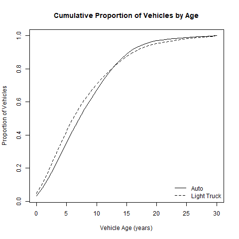
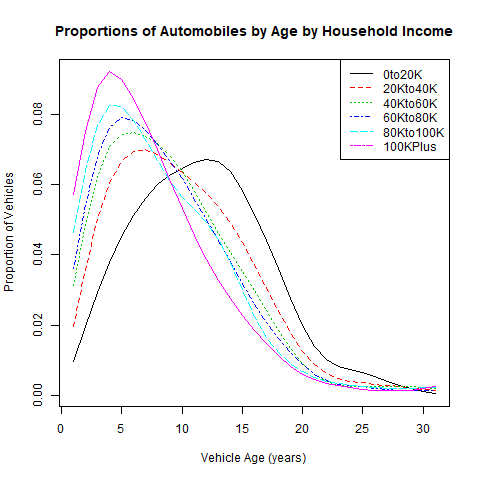
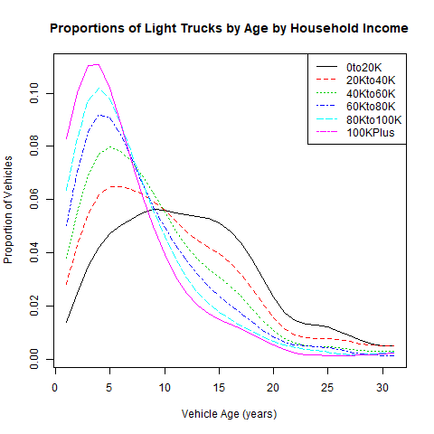

# AssignVehicleAge Module
### September 7, 2018

This module assigns vehicle ages to each household vehicle. Vehicle age is assigned as a function of the vehicle type (auto or light truck), household income, and assumed mean vehicle age by vehicle type and Azone. Car service vehicles are assigned an age based on input assumptions with no distinction between vehicle type.

## Model Parameter Estimation

The models are estimated using the *Hh_df* (household) and *Veh_df* (vehicle) datasets in the VE2001NHTS package. Information about these datasets and how they were developed from the 2001 National Household Travel Survey public use dataset is included in that package. For each vehicle type (auto, light truck), tabulations are made of cumulative proportions of vehicles by age (i.e. proportion of vehicles less than or equal to the age) and the joint proportion of vehicles by age and income group. For these tabulations, the maximum vehicle age was set at 30 years. This ignores about 1.5% of the vehicle records.

The following figure shows the cumulative proportions of vehicles by vehicle age.

The following figure compares the age proportions of automobiles by income group. It can be seen that as income decreases, the age distribution shifts towards older vehicles. The 6 income groups are $0 to $20,000, $20,000 to $40,000, $40,000 to $60,000, $60,000 to $80,000, $80,000 to $100,000, $100,000 plus.

The following figure compares the age proportions of light trucks by income group. As with automobiles, as increases, the age distributions shifts to older vehicles.

## How the Module Works

The module auto and light truck vehicle age distributions which match user inputs for mean auto age and mean light truck age. The module adjusts the cumulative age distribution to match a target mean age. This is done by either expanding the age interval (i.e. a year is 10% longer) if the mean age increases, or compressing the age interval if the mean age decreases. A binary search function is used to determine the amount of expansion or compression of the estimated age distribution is necessary in order to match the input mean age. The age distribution for the vehicles is derived from the adjusted cumulative age distribution.

Once the age distribution for a vehicle type has been determined, the module calculates vehicle age distributions by household income group. It takes marginal distributions of vehicles by age and vehicles by household income group along with a seed matrix of the joint probability distribution of vehicles by age and income group, and then uses iterative proportional fitting to adjust the joint probabilities to match the margins. The age probability by income group is calculated from the joint probability matrix. These probabilities are then used as sampling distributions to determine the age of each household vehicle as a function of the vehicle type and the household income.

## User Inputs
The following table(s) document each input file that must be provided in order for the module to run correctly. User input files are comma-separated valued (csv) formatted text files. Each row in the table(s) describes a field (column) in the input file. The table names and their meanings are as follows:

NAME - The field (column) name in the input file. Note that if the 'TYPE' is 'currency' the field name must be followed by a period and the year that the currency is denominated in. For example if the NAME is 'HHIncomePC' (household per capita income) and the input values are in 2010 dollars, the field name in the file must be 'HHIncomePC.2010'. The framework uses the embedded date information to convert the currency into base year currency amounts. The user may also embed a magnitude indicator if inputs are in thousand, millions, etc. The VisionEval model system design and users guide should be consulted on how to do that.

TYPE - The data type. The framework uses the type to check units and inputs. The user can generally ignore this, but it is important to know whether the 'TYPE' is 'currency'

UNITS - The units that input values need to represent. Some data types have defined units that are represented as abbreviations or combinations of abbreviations. For example 'MI/HR' means miles per hour. Many of these abbreviations are self evident, but the VisionEval model system design and users guide should be consulted.

PROHIBIT - Values that are prohibited. Values may not meet any of the listed conditions.

ISELEMENTOF - Categorical values that are permitted. Value must be one of the listed values.

UNLIKELY - Values that are unlikely. Values that meet any of the listed conditions are permitted but a warning message will be given when the input data are processed.

DESCRIPTION - A description of the data.

### azone_hh_veh_mean_age.csv
|NAME         |TYPE |UNITS |PROHIBIT       |ISELEMENTOF |UNLIKELY |DESCRIPTION                                              |
|:------------|:----|:-----|:--------------|:-----------|:--------|:--------------------------------------------------------|
|Geo          |     |      |               |Azones      |         |Must contain a record for each Azone and model run year. |
|Year         |     |      |               |            |         |Must contain a record for each Azone and model run year. |
|AutoMeanAge  |time |YR    |NA, < 5, >= 14 |            |         |Mean age of automobiles owned or leased by households.   |
|LtTrkMeanAge |time |YR    |NA, < 5, >= 14 |            |         |Mean age of light trucks owned or leased by households.  |

## Datasets Used by the Module
The following table documents each dataset that is retrieved from the datastore and used by the module. Each row in the table describes a dataset. All the datasets must be present in the datastore. One or more of these datasets may be entered into the datastore from the user input files. The table names and their meanings are as follows:

NAME - The dataset name.

TABLE - The table in the datastore that the data is retrieved from.

GROUP - The group in the datastore where the table is located. Note that the datastore has a group named 'Global' and groups for every model run year. For example, if the model run years are 2010 and 2050, then the datastore will have a group named '2010' and a group named '2050'. If the value for 'GROUP' is 'Year', then the dataset will exist in each model run year group. If the value for 'GROUP' is 'BaseYear' then the dataset will only exist in the base year group (e.g. '2010'). If the value for 'GROUP' is 'Global' then the dataset will only exist in the 'Global' group.

TYPE - The data type. The framework uses the type to check units and inputs. Refer to the model system design and users guide for information on allowed types.

UNITS - The units that input values need to represent. Some data types have defined units that are represented as abbreviations or combinations of abbreviations. For example 'MI/HR' means miles per hour. Many of these abbreviations are self evident, but the VisionEval model system design and users guide should be consulted.

PROHIBIT - Values that are prohibited. Values in the datastore do not meet any of the listed conditions.

ISELEMENTOF - Categorical values that are permitted. Values in the datastore are one or more of the listed values.

|NAME                |TABLE     |GROUP |TYPE      |UNITS    |PROHIBIT |ISELEMENTOF                |
|:-------------------|:---------|:-----|:---------|:--------|:--------|:--------------------------|
|Azone               |Azone     |Year  |character |ID       |         |                           |
|AutoMeanAge         |Azone     |Year  |time      |YR       |NA, <= 0 |                           |
|LtTrkMeanAge        |Azone     |Year  |time      |YR       |NA, <= 0 |                           |
|Azone               |Household |Year  |character |ID       |         |                           |
|HhId                |Household |Year  |character |ID       |         |                           |
|Income              |Household |Year  |currency  |USD.2001 |NA, < 0  |                           |
|Azone               |Vehicle   |Year  |character |ID       |         |                           |
|HhId                |Vehicle   |Year  |character |ID       |NA       |                           |
|VehId               |Vehicle   |Year  |character |ID       |NA       |                           |
|VehicleAccess       |Vehicle   |Year  |character |category |         |Own, LowCarSvc, HighCarSvc |
|Type                |Vehicle   |Year  |character |category |NA       |Auto, LtTrk                |
|AveCarSvcVehicleAge |Azone     |Year  |time      |YR       |NA, < 0  |                           |

## Datasets Produced by the Module
The following table documents each dataset that is retrieved from the datastore and used by the module. Each row in the table describes a dataset. All the datasets must be present in the datastore. One or more of these datasets may be entered into the datastore from the user input files. The table names and their meanings are as follows:

NAME - The dataset name.

TABLE - The table in the datastore that the data is retrieved from.

GROUP - The group in the datastore where the table is located. Note that the datastore has a group named 'Global' and groups for every model run year. For example, if the model run years are 2010 and 2050, then the datastore will have a group named '2010' and a group named '2050'. If the value for 'GROUP' is 'Year', then the dataset will exist in each model run year. If the value for 'GROUP' is 'BaseYear' then the dataset will only exist in the base year group (e.g. '2010'). If the value for 'GROUP' is 'Global' then the dataset will only exist in the 'Global' group.

TYPE - The data type. The framework uses the type to check units and inputs. Refer to the model system design and users guide for information on allowed types.

UNITS - The units that input values need to represent. Some data types have defined units that are represented as abbreviations or combinations of abbreviations. For example 'MI/HR' means miles per hour. Many of these abbreviations are self evident, but the VisionEval model system design and users guide should be consulted.

PROHIBIT - Values that are prohibited. Values in the datastore do not meet any of the listed conditions.

ISELEMENTOF - Categorical values that are permitted. Values in the datastore are one or more of the listed values.

DESCRIPTION - A description of the data.

|NAME |TABLE   |GROUP |TYPE |UNITS |PROHIBIT |ISELEMENTOF |DESCRIPTION          |
|:----|:-------|:-----|:----|:-----|:--------|:-----------|:--------------------|
|Age  |Vehicle |Year  |time |YR    |NA, < 0  |            |Vehicle age in years |
