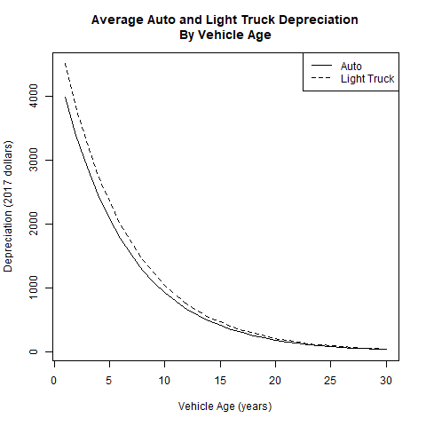
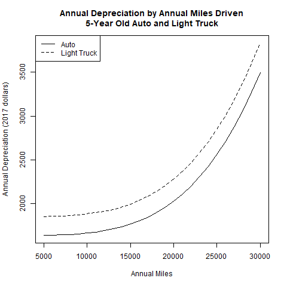

# CalculateVehicleOwnCost Module
### November 23, 2018

This module calculates average vehicle ownership cost for each vehicle based on the vehicle type and age using data from the American Automobile Association (AAA). To this are added the cost of parking at the vehicle residence if free parking is not available for all household vehicles. The ownership cost is converted into an average ownership cost per mile by predicting the household DVMT given the number of owned vehicles and splitting the miles equally among the vehicles. Vehicle ownership costs are used by the AdjustVehicleOwnership module to determine whether it would be more cost-effective for a household to substitute the use of car services for one or more of vehicles that they otherwise would own.

The module also assigns pay-as-you-drive (PAYD) insurance to households based on household characteristics and input assumption about the proportion of households who have PAYD insurance. PAYD insurance does not affect the cost of vehicle ownership when determining whether a household will substitute car services for one or more of their vehicles. It does affect the operating cost of the vehicle and determination of whether the amount of vehicle travel fits within the household's vehicle operations budget.

## Model Parameter Estimation

Vehicle ownership cost data from the American Automobile Association (AAA) are used along with information on vehicle depreciation rates to develop a model of vehicle ownership cost as a function of vehicle type, vehicle age, and miles driven.

The AAA cost data is described in the *aaa_vehicle_ownership_costs.txt* file in the *inst/extdata* directory of this package. Data are included on insurance, license/registration/taxes, finance, and depreciation (at 3 annual mileage rates) for 7 light duty body types (small sedan, medium sedan, large sedan, small SUV, medium SUV, minivan, and pickup). Data are also included for hybrids and electric vehicles but these are not used in the model because these vehicle types are relatively new (especially electric vehicles) and are not split out by body type. The following table show these data which are for the year [2017](http://exchange.aaa.com/wp-content/uploads/2017/08/17-0013_Your-Driving-Costs-Brochure-2017-FNL-CX-1.pdf).

|                           | SmallSedan| MediumSedan| LargeSedan| SmallSUV| MediumSUV| Minivan| Pickup|
|:--------------------------|----------:|-----------:|----------:|--------:|---------:|-------:|------:|
|Insurance                  |       1288|        1202|       1200|     1076|      1089|    1075|   1229|
|License/Registration/Taxes |        454|         639|        757|      607|       831|     726|    984|
|Finance                    |        396|         597|        706|      567|       806|     692|    922|
|Depreciation10KPerYear     |       1969|        3028|       3601|     2646|      3479|    3654|   3308|
|Depreciation15KPerYear     |       2114|        3187|       3799|     2840|      3720|    3839|   3587|
|Depreciation20KPerYear     |       2489|        3592|       4300|     3319|      4309|    4298|   4258|

The AAA data body type values are aggregated into vehicle type (auto, light truck) values by taking the midpoint of the range of values for the body types corresponding to each vehicle type. The values for the 3 sedan body types are aggregated to calculate the auto type value. Likewise, the values for the 4 other body types are aggregated to calculate the light truck type value.

Building an ownership cost model requires additional information because the AAA data only address cost during the first 5 years of a vehicle's life and only 3 levels for annual miles driven whereas the cost model needs to address vehicles up to 30 years old and a continuous range of annual vehicle miles driven. The model is created by combining the AAA data with average vehicle depreciation rate data from the [National Automobile Dealers Association *Used Vehicle Price Report: Age-level Analysis and Forecast, Q3 2013*](https://www.nada.com/b2b/Portals/0/assets/pdf/Q3%20Whitepaper%20Age-level%20Analysis%20and%20Forecast.pdf). This report estimates that light-duty vehicles depreciate at an average rate of 15% per year.

The first step in building a model is to calculate the average vehicle value by year and body type for vehicles having a midrange value for annual mileage (15,000). This starts with calculating the new car value for each of the body types. To do this, the total depreciation for the first five years is calculated by multiplying the reported annual depreciation values by 5 since the AAA data represent annual costs over the first 5 years of the vehicle life. From that, the corresponding new vehicle value is calculated using the assumed annual depreciation rate of 15%. The new vehicle values by vehicle type (auto, light truck) are computed by taking the midpoint of the ranges of the the corresponding body types. The following table shows the estimated 2017 new car prices by body type and vehicle type.

|Body        |Price   |
|:-----------|:-------|
|SmallSedan  |$19,001 |
|MediumSedan |$28,645 |
|LargeSedan  |$34,146 |
|SmallSUV    |$25,526 |
|MediumSUV   |$33,436 |
|Minivan     |$34,505 |
|Pickup      |$32,240 |
|Auto        |$26,573 |
|LtTrk       |$30,016 |

Once the new car value by vehicle type has been calculated, the values by vehicle age are computed by applying the annual depreciation rate. Then the annual depreciation values are computed as the differences in annual vehicle values. The following figure illustrates the annual depreciation for auto and light truck that are driven 15,000 miles per year.

The depreciation models adjusts depreciation to account for the effect of miles driven. As can be seen from the examination of the AAA data, depreciation increases at an increasing rate as annual mileage increases. To account for the effect of miles driven on depreciation, a linear model is estimated to predict the ratio of depreciation at the annual mileage driven to depreciation at 15,000 miles driven. This model is used to adjust the depreciation schedule shown in the figure above. The steps in creating this depreciation adjustment model are as follows:

* The AAA data on depreciation by body type and mileage is aggregated to the vehicle types (auto, light truck) by taking the midpoint of the range of values for the corresponding body types.

* The ratios of annual depreciation to depreciation at 15,000 miles are calculated.

* The relationship between mileage and depreciation ratio is linearized by power-transforming the mileage. Mileage is divided by 1000 to reduce the size of the power-transformed result. The linearizing power transform is estimated using binary search to find the value at which the slopes are equal.

* A linear regression model is estimated to find the slope and intercept of the line describing the relationship between mileage and relative depreciation.

The following figure illustrates the resulting estimated relationship between depreciation and miles driven for 5-year old autos and light trucks.

A finance cost model calculates finance cost as a function of the vehicle age. To estimate this model, first the AAA values for finance cost by body type are aggregated to vehicle types. This is done by taking the midpoint values of the body types that correspond to each vehicle type. Since the AAA data represent the first 5 years of a vehicle's life and since auto loans typically have a duration of 5 years, it is assumed that the AAA data represent the average finance cost for a new vehicle. Therefore the annual finance cost for different vehicle can be calculated by multiplying the new car finance cost by the estimated proportion of new car value for the vehicle age. It is important to note that finance cost is the cost of financing the vehicle loan, not the cost of purchasing the car. Depreciation accounts for purchase cost and residual value.

To calculate the cost of insurance, the AAA values for insurance cost by body type are aggregated to vehicle types in the manner described above. Since insurance cost is largely a function of driver characteristics (e.g. age) and weakly related to vehicle value, no adjustments are made to the AAA values as a function of vehicle value.

The module also identifies which households are assigned to pay-as-you-drive (PAYD) insurance to satisfy user input on the proportion of households having that type of insurance. PAYD insurance is limited to 1996 or later model years because it requires OBD-II ports that were made mandatory on all vehicles in that year. This model has no estimated parameters, rather it weights various household characteristics based on judgements regarding the relative value of PAYD insurance to different users based on reviewing the literature. Undoubtedly there are correlations between the factors and therefore potential for double-counting, but substantially more data and study is required to sort out the effects. The characteristics and relative weights are as follows:

* Teen Drivers (2 points) - households with one or more teenage drivers are benefitted by the monitoring and feedback provided by the technology;

* Lower Mileage (3 points) - PAYD insurance is relatively more economical for households that have relatively low annual mileage (less than 15,000 miles per vehicle);

* Older Adult Drivers (2 points) - Households with older adult drivers (30 or older) are more likely to use than households with younger adult drivers;

* Lower Income (2 points) - Lower income households are more likely to use because of the lower costs and ability to moderate behavior to save additional money. Low income threshold is an annual household income of $45,000 in 2005 dollars.

* Auto Proportion (2 points) - Households owning automobiles are more likely to use than households owning light trucks; and,

* In Metropolitan Area (3 points) - Households in metropolitan areas are more likely to use.

## How the Module Works

The module loads data on the type and age of each vehicle. It calls the CalculateHouseholdVmt module to calculate average daily vehicle miles traveled for each household. This is converted to annual miles and split equally among household vehicles. The depreciation model is applied to calculate vehicle depreciation cost as a function of the vehicle type, the vehicle age, and annual miles driven. The finance cost model is applied to calculate the finance cost as a function of the vehicle type and age. The insurance cost is calculated as a function of the vehicle type. Vehicle licensing/registration/tax costs are not calculated from the AAA values because these values can vary substantially by state and because they may changed to implement policy objectives. The user provides inputs for flat fees/taxes (i.e. annual cost per vehicle) and ad valorem taxes (i.e. percentage of vehicle value paid in taxes). The flat fees/taxes are applied to each vehicle. The ad valorem taxes are calculated by multiplying the vehicle value, which varies by type and age, by the tax rate. The module also loads household residential parking cost data calculated by the AssignParkingRestrictions module. The household parking costs are split equally among vehicles. Total ownership cost for each vehicle is then calculated by summing the depreciation, finance, insurance, fees/taxes, and parking costs. Total ownership cost is divided by vehicle miles to calculate the cost of ownership per mile of travel.

The module also identifies which households will be assigned PAYD insurance given user inputs on the proportion of households having PAYD insurance. The module identifies which households qualify for PAYD insurance based on whether any of their vehicles are 1996 model year vehicles or later. The vehicle and household characteristics (identified above) are evaluated and points assigned. The total points are calculated for each households. Random sampling is used to choose a number of households to equal the input proportion where the probability that each household is chosen is a function of the ratio of the household weight to the maximum household weight.

## User Inputs
The following table(s) document each input file that must be provided in order for the module to run correctly. User input files are comma-separated valued (csv) formatted text files. Each row in the table(s) describes a field (column) in the input file. The table names and their meanings are as follows:

NAME - The field (column) name in the input file. Note that if the 'TYPE' is 'currency' the field name must be followed by a period and the year that the currency is denominated in. For example if the NAME is 'HHIncomePC' (household per capita income) and the input values are in 2010 dollars, the field name in the file must be 'HHIncomePC.2010'. The framework uses the embedded date information to convert the currency into base year currency amounts. The user may also embed a magnitude indicator if inputs are in thousand, millions, etc. The VisionEval model system design and users guide should be consulted on how to do that.

TYPE - The data type. The framework uses the type to check units and inputs. The user can generally ignore this, but it is important to know whether the 'TYPE' is 'currency'

UNITS - The units that input values need to represent. Some data types have defined units that are represented as abbreviations or combinations of abbreviations. For example 'MI/HR' means miles per hour. Many of these abbreviations are self evident, but the VisionEval model system design and users guide should be consulted.

PROHIBIT - Values that are prohibited. Values may not meet any of the listed conditions.

ISELEMENTOF - Categorical values that are permitted. Value must be one of the listed values.

UNLIKELY - Values that are unlikely. Values that meet any of the listed conditions are permitted but a warning message will be given when the input data are processed.

DESCRIPTION - A description of the data.

### azone_hh_veh_own_taxes.csv
|NAME               |TYPE     |UNITS      |PROHIBIT     |ISELEMENTOF |UNLIKELY |DESCRIPTION                                              |
|:------------------|:--------|:----------|:------------|:-----------|:--------|:--------------------------------------------------------|
|Geo                |         |           |             |Azones      |         |Must contain a record for each Azone and model run year. |
|Year               |         |           |             |            |         |Must contain a record for each Azone and model run year. |
|VehOwnFlatRateFee  |currency |USD        |NA, < 0      |            |         |Annual flat rate tax per vehicle in dollars              |
|VehOwnAdValoremTax |double   |proportion |NA, < 0, > 1 |            |         |Annual proportion of vehicle value paid in taxes         |
### azone_payd_insurance_prop.csv
|   |NAME       |TYPE   |UNITS      |PROHIBIT     |ISELEMENTOF |UNLIKELY |DESCRIPTION                                                                                  |
|:--|:----------|:------|:----------|:------------|:-----------|:--------|:--------------------------------------------------------------------------------------------|
|1  |Geo        |       |           |             |Azones      |         |Must contain a record for each Azone and model run year.                                     |
|11 |Year       |       |           |             |            |         |Must contain a record for each Azone and model run year.                                     |
|3  |PaydHhProp |double |proportion |NA, < 0, > 1 |            |         |Proportion of households in the Azone who have pay-as-you-drive insurance for their vehicles |

## Datasets Used by the Module
The following table documents each dataset that is retrieved from the datastore and used by the module. Each row in the table describes a dataset. All the datasets must be present in the datastore. One or more of these datasets may be entered into the datastore from the user input files. The table names and their meanings are as follows:

NAME - The dataset name.

TABLE - The table in the datastore that the data is retrieved from.

GROUP - The group in the datastore where the table is located. Note that the datastore has a group named 'Global' and groups for every model run year. For example, if the model run years are 2010 and 2050, then the datastore will have a group named '2010' and a group named '2050'. If the value for 'GROUP' is 'Year', then the dataset will exist in each model run year group. If the value for 'GROUP' is 'BaseYear' then the dataset will only exist in the base year group (e.g. '2010'). If the value for 'GROUP' is 'Global' then the dataset will only exist in the 'Global' group.

TYPE - The data type. The framework uses the type to check units and inputs. Refer to the model system design and users guide for information on allowed types.

UNITS - The units that input values need to represent. Some data types have defined units that are represented as abbreviations or combinations of abbreviations. For example 'MI/HR' means miles per hour. Many of these abbreviations are self evident, but the VisionEval model system design and users guide should be consulted.

PROHIBIT - Values that are prohibited. Values in the datastore do not meet any of the listed conditions.

ISELEMENTOF - Categorical values that are permitted. Values in the datastore are one or more of the listed values.

|NAME               |TABLE     |GROUP |TYPE      |UNITS          |PROHIBIT     |ISELEMENTOF                |
|:------------------|:---------|:-----|:---------|:--------------|:------------|:--------------------------|
|Azone              |Azone     |Year  |character |ID             |             |                           |
|VehOwnFlatRateFee  |Azone     |Year  |currency  |USD.2017       |NA, < 0      |                           |
|VehOwnAdValoremTax |Azone     |Year  |double    |proportion     |NA, < 0, > 1 |                           |
|PaydHhProp         |Azone     |Year  |double    |proportion     |NA, < 0, > 1 |                           |
|Azone              |Household |Year  |character |ID             |             |                           |
|HhId               |Household |Year  |character |ID             |             |                           |
|Vehicles           |Household |Year  |vehicles  |VEH            |NA, < 0      |                           |
|HhId               |Vehicle   |Year  |character |ID             |NA           |                           |
|Azone              |Vehicle   |Year  |character |ID             |             |                           |
|VehId              |Vehicle   |Year  |character |ID             |NA           |                           |
|VehicleAccess      |Vehicle   |Year  |character |category       |             |Own, LowCarSvc, HighCarSvc |
|Type               |Vehicle   |Year  |character |category       |NA           |Auto, LtTrk                |
|Age                |Vehicle   |Year  |time      |YR             |NA, < 0      |                           |
|FreeParkingSpaces  |Household |Year  |integer   |parking spaces |NA, < 0      |                           |
|ParkingUnitCost    |Household |Year  |currency  |USD.2017       |NA, < 0      |                           |
|Drivers            |Household |Year  |people    |PRSN           |NA, < 0      |                           |
|Drv15to19          |Household |Year  |people    |PRSN           |NA, < 0      |                           |
|Drv20to29          |Household |Year  |people    |PRSN           |NA, < 0      |                           |
|Drv30to54          |Household |Year  |people    |PRSN           |NA, < 0      |                           |
|Drv55to64          |Household |Year  |people    |PRSN           |NA, < 0      |                           |
|Drv65Plus          |Household |Year  |people    |PRSN           |NA, < 0      |                           |
|Income             |Household |Year  |currency  |USD.2005       |NA, < 0      |                           |
|LocType            |Household |Year  |character |category       |NA           |Urban, Town, Rural         |
|NumLtTrk           |Household |Year  |vehicles  |VEH            |NA, < 0      |                           |
|NumAuto            |Household |Year  |vehicles  |VEH            |NA, < 0      |                           |

## Datasets Produced by the Module
The following table documents each dataset that is retrieved from the datastore and used by the module. Each row in the table describes a dataset. All the datasets must be present in the datastore. One or more of these datasets may be entered into the datastore from the user input files. The table names and their meanings are as follows:

NAME - The dataset name.

TABLE - The table in the datastore that the data is retrieved from.

GROUP - The group in the datastore where the table is located. Note that the datastore has a group named 'Global' and groups for every model run year. For example, if the model run years are 2010 and 2050, then the datastore will have a group named '2010' and a group named '2050'. If the value for 'GROUP' is 'Year', then the dataset will exist in each model run year. If the value for 'GROUP' is 'BaseYear' then the dataset will only exist in the base year group (e.g. '2010'). If the value for 'GROUP' is 'Global' then the dataset will only exist in the 'Global' group.

TYPE - The data type. The framework uses the type to check units and inputs. Refer to the model system design and users guide for information on allowed types.

UNITS - The units that input values need to represent. Some data types have defined units that are represented as abbreviations or combinations of abbreviations. For example 'MI/HR' means miles per hour. Many of these abbreviations are self evident, but the VisionEval model system design and users guide should be consulted.

PROHIBIT - Values that are prohibited. Values in the datastore do not meet any of the listed conditions.

ISELEMENTOF - Categorical values that are permitted. Values in the datastore are one or more of the listed values.

DESCRIPTION - A description of the data.

|NAME           |TABLE     |GROUP |TYPE     |UNITS    |PROHIBIT |ISELEMENTOF |DESCRIPTION                                                                                                              |
|:--------------|:---------|:-----|:--------|:--------|:--------|:-----------|:------------------------------------------------------------------------------------------------------------------------|
|OwnCost        |Vehicle   |Year  |currency |USD.2017 |NA, < 0  |            |Annual cost of vehicle ownership including depreciation, financing, insurance, taxes, and residential parking in dollars |
|OwnCostPerMile |Vehicle   |Year  |currency |USD.2017 |NA, < 0  |            |Annual cost of vehicle ownership per mile of vehicle travel (dollars per mile)                                           |
|InsCost        |Vehicle   |Year  |currency |USD.2017 |NA, < 0  |            |Annual vehicle insurance cost in dollars                                                                                 |
|HasPaydIns     |Household |Year  |integer  |binary   |         |0, 1        |Identifies whether household has pay-as-you-drive insurance for vehicles: 1 = Yes, 0 = no                                |
