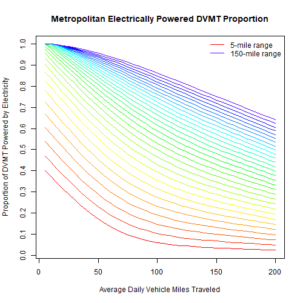
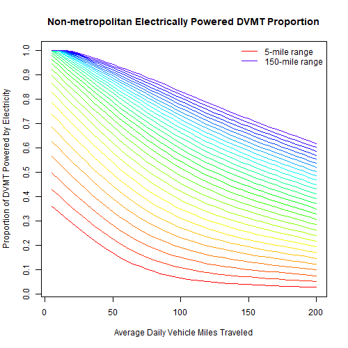

# AssignHhVehiclePowertrain Module
### November 24, 2018

This module assigns a powertrain type to each household vehicle. The powertrain types are internal combustion engine vehicle (ICEV), hybrid electric vehicle (HEV), plug-in hybrid electric vehicle (PHEV), and battery electric vehicles (BEV). The module also assigns related characteristics to household vehicles including:

* Battery range (for PHEV and BEV)

* Miles per gallon (MPG) and gallons per mile (GPM)

* Miles per kilowatt-hour (MPKWH) and kilowatt-hours per mile (KWHPM)

* Miles per gasoline gallon equivalent (MPGe)

* The proportion of DVMT powered by electricity

* Carbon dioxide equivalent emissions per mile powered by hydrocarbon fuel

* Carbon dioxide equivalent emissions per mile powered by electricity

## Model Parameter Estimation

Most of the module calculations require no estimated models. The procedures for these calculations are described in the next section. However, models are estimated to calculate the proportions of PHEV vehicle travel powered by electricity vs. fuel. Those proportions will vary depending on the day-to-day travel patterns of households. A household which travels short distances on most days may power most of their travel by their battery which is charged up overnight.

The model to calculate the proportion of PHEV travel powered by electricity assumes that a PHEV will be fully charged once per day and that the vehicle will be powered by electricity up to the specified battery range. Travel exceeding the battery range will be powered by fuel. It is also assumed that travel will vary from day to day so that the proportion of travel powered by electricity will not be the ratio of the battery range and average daily vehicle miles of travel (DVMT). For example, if a household has a PHEV whose battery range is greater than the average DVMT for the vehicle, not all of the vehicle travel will be powered by electricity because there will be some days when the vehicle is driven beyond the vehicle's battery range.

To estimate the proportion of a PHEV travel powered by electricity, it is assumed that the variation in the vehicle's DVMT is the same as the variation in household DVMT as simulated by the CalculateHouseholdDvmt module in the VEHouseholdTravel package. That module includes polynomial regression models for calculating DVMT percentiles (from 5% to 95% at 5% intervals) as a function of the average household DVMT. There are separate models for metropolitan and non-metropolitan households.

The estimated models take the form of lookup tables which calculate the proportion of travel powered by electricity for combinations of average DVMT and battery range. The average DVMT values range from 5 to 200 miles in 5 mile increments. The battery range values range from 5 to 150 miles in 5 mile increments. Two such lookup tables are created, one for metropolitan households (those residing in an urbanized area) and non-metropolitan households (those residing outside of an urbanized area). For each location type (metropolitan vs. non-metropolitan) and each combination of DVMT and battery range, the DVMT percentile models for the location type are run. These are the percentile models estimated and included in the CalculateHouseholdDvmt module. Running the DVMT percentile models produces the DVMT at different percentiles from the 5th percentile to the 95th percentile in 5% increments and the 99th percentile. A smooth spline curve is fitted to these values to cover all percentiles from 0 to 100. The percentile corresponding to the battery range is predicted using the smooth spline curve relationship. Then the DVMT traveled below the battery range and DVMT traveled above the battery range is calculated from integrating the smooth spline curve using the battery range percentile threshold. The DVMT powered by electricity is then calculated as follows:

  ElecDvmt = DvmtBelow + Range * (100 - RangePctl)

  Where:

  * ElecDvmt is the DVMT powered by electricity

  * DvmtBelow is the sum of DVMT below the range percentile described above

  * Range is the battery range

  * RangePctl is the battery range percentile described above

Once the DVMT powered by electricity is calculated, the proportion of DVMT powered by electricity is calculated as follows:

  ElecProp = ElecDvmt / (DvmtBelow + DvmtAbove)

  Where:

  * ElecDvmt is as described above

  * DvmtBelow + DvmtAbove is the sum of all DVMT below and above the battery range percentile

These calculations are done for every combination of DVMT and battery range for metropolitan and non-metropolitan households to produce a metropolitan lookup table and a non-metropolitan lookup table. The values in the tables are smoothed using smooth splines; first by smoothing the values in the columns (battery range) and then smoothing the values in rows (average DVMT). The following figures illustrate the relationships of electrically-powered DVMT, average DVMT, and battery range for metropolitan and non-metropolitan household vehicles.

## How the Module Works

Assignment of powertrains is done by vehicle type (Auto, LtTrk) and model year. For each type and model year, vehicles of that type and model year are assigned powertrains in the order of BEV, PHEV, HEV, and ICEV.

The assignment of BEVs is conditional on the whether the 95th percentile DVMT for the vehicle is within the battery range of the vehicle and whether charging the vehicle is possible at the residence. The battery range of the vehicle is determined by the age and type of vehicle. Battery range is a BEV powertrain characteristic as described in the documentation for `PowertrainFuelDefaults_ls`. Charging possibilities are determined by household based on the housing type and charging availability by housing type by azone in the `azone_charging_availability.csv` input file. Charging availability is specified as a proportion of housing units that have chargers or could have chargers installed. Households are randomly selected based on the input proportions. It is assumed that if charging is available for a household, then all vehicles in the household have charging available. If there are not enough qualifying vehicles to match the charging and battery range assumptions, then the number of BEVs that can't be assigned are designated as PHEVs. The range criterion is not used in assigning PHEVs, but the charging criterion is. The PHEV designation is only assigned to vehicles where residential charging is available. If there are not enough qualifying vehicles, then the number of PHEVs that can't be assigned to a vehicle are designated as HEVs. There are no qualifications for HEVs and ICEVs and their numbers are assigned randomly to vehicles that have no assignment.

The vehicle MPG (GPM) and MPKWH (KWHPM) characteristics are determined by the vehicle powertrain, vehicle age, and vehicle type by looking up the corresponding values in the household powertrain table.

The proportion of DVMT powered by electricity is either 1 for BEVs or 0 for ICEVs and HEVs. To calculate the proportion for PHEVs, it is assumed that household DVMT is split equally among household vehicles. Then the proportion is determined from the estimated lookup table using the vehicle DVMT and battery range.

Carbon dioxide equivalent emissions per mile from fuel are calculated by converting the gallons per mile (GPM) which are in gasoline gallon equivalents to megajoules per mile and multiplying by the average carbon intensity for the vehicle type. Carbon dioxide equivalent emissions per mile from electricity are calculated similarly by converting kilowatts to megajoules.

## User Inputs
The following table(s) document each input file that must be provided in order for the module to run correctly. User input files are comma-separated valued (csv) formatted text files. Each row in the table(s) describes a field (column) in the input file. The table names and their meanings are as follows:

NAME - The field (column) name in the input file. Note that if the 'TYPE' is 'currency' the field name must be followed by a period and the year that the currency is denominated in. For example if the NAME is 'HHIncomePC' (household per capita income) and the input values are in 2010 dollars, the field name in the file must be 'HHIncomePC.2010'. The framework uses the embedded date information to convert the currency into base year currency amounts. The user may also embed a magnitude indicator if inputs are in thousand, millions, etc. The VisionEval model system design and users guide should be consulted on how to do that.

TYPE - The data type. The framework uses the type to check units and inputs. The user can generally ignore this, but it is important to know whether the 'TYPE' is 'currency'

UNITS - The units that input values need to represent. Some data types have defined units that are represented as abbreviations or combinations of abbreviations. For example 'MI/HR' means miles per hour. Many of these abbreviations are self evident, but the VisionEval model system design and users guide should be consulted.

PROHIBIT - Values that are prohibited. Values may not meet any of the listed conditions.

ISELEMENTOF - Categorical values that are permitted. Value must be one of the listed values.

UNLIKELY - Values that are unlikely. Values that meet any of the listed conditions are permitted but a warning message will be given when the input data are processed.

DESCRIPTION - A description of the data.

### azone_charging_availability.csv
|NAME                |TYPE   |UNITS      |PROHIBIT     |ISELEMENTOF |UNLIKELY |DESCRIPTION                                                                                                       |
|:-------------------|:------|:----------|:------------|:-----------|:--------|:-----------------------------------------------------------------------------------------------------------------|
|Geo                 |       |           |             |Azones      |         |Must contain a record for each Azone and model run year.                                                          |
|Year                |       |           |             |            |         |Must contain a record for each Azone and model run year.                                                          |
|PropSFChargingAvail |double |proportion |NA, < 0, > 1 |            |         |Proportion of single-family dwellings in Azone that have PEV charging facilties installed or able to be installed |
|PropMFChargingAvail |double |proportion |NA, < 0, > 1 |            |         |Proportion of multi-family dwelling units in Azone that have PEV charging facilities available                    |
|PropGQChargingAvail |double |proportion |NA, < 0, > 1 |            |         |Proportion of group quarters dwelling units in Azone that have PEV charging facilities available                  |

## Datasets Used by the Module
The following table documents each dataset that is retrieved from the datastore and used by the module. Each row in the table describes a dataset. All the datasets must be present in the datastore. One or more of these datasets may be entered into the datastore from the user input files. The table names and their meanings are as follows:

NAME - The dataset name.

TABLE - The table in the datastore that the data is retrieved from.

GROUP - The group in the datastore where the table is located. Note that the datastore has a group named 'Global' and groups for every model run year. For example, if the model run years are 2010 and 2050, then the datastore will have a group named '2010' and a group named '2050'. If the value for 'GROUP' is 'Year', then the dataset will exist in each model run year group. If the value for 'GROUP' is 'BaseYear' then the dataset will only exist in the base year group (e.g. '2010'). If the value for 'GROUP' is 'Global' then the dataset will only exist in the 'Global' group.

TYPE - The data type. The framework uses the type to check units and inputs. Refer to the model system design and users guide for information on allowed types.

UNITS - The units that input values need to represent. Some data types have defined units that are represented as abbreviations or combinations of abbreviations. For example 'MI/HR' means miles per hour. Many of these abbreviations are self evident, but the VisionEval model system design and users guide should be consulted.

PROHIBIT - Values that are prohibited. Values in the datastore do not meet any of the listed conditions.

ISELEMENTOF - Categorical values that are permitted. Values in the datastore are one or more of the listed values.

|NAME                |TABLE     |GROUP |TYPE      |UNITS      |PROHIBIT     |ISELEMENTOF                |
|:-------------------|:---------|:-----|:---------|:----------|:------------|:--------------------------|
|HhAutoFuelCI        |Region    |Year  |compound  |GM/MJ      |< 0          |                           |
|HhLtTrkFuelCI       |Region    |Year  |compound  |GM/MJ      |< 0          |                           |
|CarSvcAutoFuelCI    |Region    |Year  |compound  |GM/MJ      |< 0          |                           |
|CarSvcLtTrkFuelCI   |Region    |Year  |compound  |GM/MJ      |< 0          |                           |
|CarSvcAutoPropIcev  |Region    |Year  |double    |proportion |NA, < 0, > 1 |                           |
|CarSvcAutoPropHev   |Region    |Year  |double    |proportion |NA, < 0, > 1 |                           |
|CarSvcAutoPropBev   |Region    |Year  |double    |proportion |NA, < 0, > 1 |                           |
|CarSvcLtTrkPropIcev |Region    |Year  |double    |proportion |NA, < 0, > 1 |                           |
|CarSvcLtTrkPropHev  |Region    |Year  |double    |proportion |NA, < 0, > 1 |                           |
|CarSvcLtTrkPropBev  |Region    |Year  |double    |proportion |NA, < 0, > 1 |                           |
|Marea               |Marea     |Year  |character |ID         |             |                           |
|Marea               |Azone     |Year  |character |ID         |             |                           |
|Azone               |Azone     |Year  |character |ID         |             |                           |
|PropSFChargingAvail |Azone     |Year  |double    |proportion |NA, < 0, > 1 |                           |
|PropMFChargingAvail |Azone     |Year  |double    |proportion |NA, < 0, > 1 |                           |
|PropGQChargingAvail |Azone     |Year  |double    |proportion |NA, < 0, > 1 |                           |
|ElectricityCI       |Azone     |Year  |compound  |GM/MJ      |< 0          |                           |
|HhId                |Household |Year  |character |ID         |NA           |                           |
|LocType             |Household |Year  |character |category   |NA           |Urban, Town, Rural         |
|Vehicles            |Household |Year  |vehicles  |VEH        |NA, < 0      |                           |
|NumAuto             |Household |Year  |vehicles  |VEH        |NA, < 0      |                           |
|NumLtTrk            |Household |Year  |vehicles  |VEH        |NA, < 0      |                           |
|HouseType           |Household |Year  |character |category   |             |SF, MF, GQ                 |
|Dvmt                |Household |Year  |compound  |MI/DAY     |NA, < 0      |                           |
|Marea               |Vehicle   |Year  |character |ID         |             |                           |
|Azone               |Vehicle   |Year  |character |ID         |             |                           |
|HhId                |Vehicle   |Year  |character |ID         |NA           |                           |
|VehId               |Vehicle   |Year  |character |ID         |NA           |                           |
|Type                |Vehicle   |Year  |character |category   |NA           |Auto, LtTrk                |
|Age                 |Vehicle   |Year  |time      |YR         |NA, < 0      |                           |
|VehicleAccess       |Vehicle   |Year  |character |category   |             |Own, LowCarSvc, HighCarSvc |

## Datasets Produced by the Module
The following table documents each dataset that is retrieved from the datastore and used by the module. Each row in the table describes a dataset. All the datasets must be present in the datastore. One or more of these datasets may be entered into the datastore from the user input files. The table names and their meanings are as follows:

NAME - The dataset name.

TABLE - The table in the datastore that the data is retrieved from.

GROUP - The group in the datastore where the table is located. Note that the datastore has a group named 'Global' and groups for every model run year. For example, if the model run years are 2010 and 2050, then the datastore will have a group named '2010' and a group named '2050'. If the value for 'GROUP' is 'Year', then the dataset will exist in each model run year. If the value for 'GROUP' is 'BaseYear' then the dataset will only exist in the base year group (e.g. '2010'). If the value for 'GROUP' is 'Global' then the dataset will only exist in the 'Global' group.

TYPE - The data type. The framework uses the type to check units and inputs. Refer to the model system design and users guide for information on allowed types.

UNITS - The units that input values need to represent. Some data types have defined units that are represented as abbreviations or combinations of abbreviations. For example 'MI/HR' means miles per hour. Many of these abbreviations are self evident, but the VisionEval model system design and users guide should be consulted.

PROHIBIT - Values that are prohibited. Values in the datastore do not meet any of the listed conditions.

ISELEMENTOF - Categorical values that are permitted. Values in the datastore are one or more of the listed values.

DESCRIPTION - A description of the data.

|NAME         |TABLE   |GROUP |TYPE      |UNITS      |PROHIBIT     |ISELEMENTOF              |DESCRIPTION                                                                                                                                                                                                                     |
|:------------|:-------|:-----|:---------|:----------|:------------|:------------------------|:-------------------------------------------------------------------------------------------------------------------------------------------------------------------------------------------------------------------------------|
|Powertrain   |Vehicle |Year  |character |category   |             |ICEV, HEV, PHEV, BEV, NA |Vehicle powertrain type: ICEV = internal combustion engine vehicle, HEV = hybrid electric vehicle, PHEV = plug-in hybrid electric vehicle, BEV = battery electric vehicle, NA = not applicable because is a car service vehicle |
|BatRng       |Vehicle |Year  |distance  |MI         |NA, < 0      |                         |Miles of travel possible on fully charged battery                                                                                                                                                                               |
|MPG          |Vehicle |Year  |compound  |MI/GGE     |NA, < 0      |                         |Average miles of vehicle travel powered by fuel per gasoline equivalent gallon                                                                                                                                                  |
|GPM          |Vehicle |Year  |compound  |GGE/MI     |NA, < 0      |                         |Average gasoline equivalent gallons per mile of vehicle travel powered by fuel                                                                                                                                                  |
|MPKWH        |Vehicle |Year  |compound  |MI/KWH     |NA, < 0      |                         |Average miles of vehicle travel powered by electricity per kilowatt-hour                                                                                                                                                        |
|KWHPM        |Vehicle |Year  |compound  |KWH/MI     |NA, < 0      |                         |Average kilowatt-hours per mile of vehicle travel powered by electricity                                                                                                                                                        |
|MPGe         |Vehicle |Year  |compound  |MI/GGE     |NA, < 0      |                         |Average miles of vehicle travel per gasoline equivalent gallon (fuel and electric powered)                                                                                                                                      |
|ElecDvmtProp |Vehicle |Year  |double    |proportion |NA, < 0, > 1 |                         |Average miles of vehicle travel per gasoline equivalent gallon (fuel and electric powered)                                                                                                                                      |
|FuelCO2ePM   |Vehicle |Year  |compound  |GM/MI      |NA, < 0      |                         |Average grams of carbon-dioxide equivalents produced per mile of travel powered by fuel                                                                                                                                         |
|ElecCO2ePM   |Vehicle |Year  |compound  |GM/MI      |NA, < 0      |                         |Average grams of carbon-dioxide equivalents produced per mile of travel powered by electricity                                                                                                                                  |
