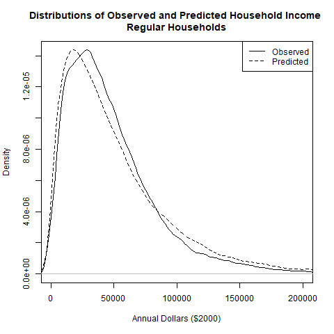
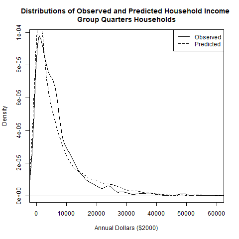

# PredictIncome Module
### September 6, 2018

This module predicts the income for each simulated household given the number of workers in each age group and the average per capita income for the Azone where the household resides.

## Model Parameter Estimation
Household income models are estimated for *regular* households and for *group quarters* households.

The household income models are estimated using Census public use microsample (PUMS) data that are compiled into a R dataset (HhData_df) by the 'CreateEstimationDatasets.R' script when the VESimHouseholds package is built. The data that are supplied with the VESimHouseholds package downloaded from the VisionEval repository may be used, but it is preferrable to use data for the region being modeled. How this is done is explained in the documentation for the *CreateEstimationDatasets.R* script.

The household income models are linear regression models in which the dependent variable is a power transformation of income. Power transformation is needed in order to normalize the income data distribution which has a long right-hand tail. The power transform is found which minimizes the skewness of the income distribution. The power transform for *regular* households is:

```
0.299
```

The power transform for *group quarters* households is:

```
0.311
```

The independent variables for the linear models are power transformed per capita income for the area, the number of workers in each of 4 worker age groups (15-19, 20-29, 30-54, 55-64), and the number of persons in the 65+ age group. In addition, power-transformed per capita income is interacted with each of the 4 worker groups and 65+ age group variable. The summary statistics for the *regular* household model are as follows:

```

Call:
lm(formula = makeFormula(EndTerms_), data = EstData_df)

Residuals:
     Min       1Q   Median       3Q      Max 
-29.9236  -3.0678  -0.1775   2.7363  31.2154 

Coefficients:
                       Estimate Std. Error t value Pr(>|t|)    
(Intercept)             5.47698    0.67302   8.138 4.09e-16 ***
PowPerCapInc            0.58388    0.03320  17.589  < 2e-16 ***
Wkr20to29               4.38321    0.66480   6.593 4.33e-11 ***
Wkr30to54              -3.46547    0.50990  -6.796 1.08e-11 ***
Wkr55to64              -2.90758    0.94398  -3.080  0.00207 ** 
PowPerCapInc:Wkr20to29 -0.09440    0.03259  -2.896  0.00378 ** 
PowPerCapInc:Wkr30to54  0.41380    0.02512  16.475  < 2e-16 ***
PowPerCapInc:Wkr55to64  0.41132    0.04653   8.840  < 2e-16 ***
PowPerCapInc:Age65Plus  0.13778    0.00200  68.893  < 2e-16 ***
---
Signif. codes:  0 ‘***’ 0.001 ‘**’ 0.01 ‘*’ 0.05 ‘.’ 0.1 ‘ ’ 1

Residual standard error: 5.41 on 66677 degrees of freedom
Multiple R-squared:  0.3133,	Adjusted R-squared:  0.3132 
F-statistic:  3802 on 8 and 66677 DF,  p-value: < 2.2e-16

```

The summary statistics for the *group quarters* household model are as follows:

```

Call:
lm(formula = makeFormula(EndTerms_), data = EstData_df)

Residuals:
    Min      1Q  Median      3Q     Max 
-16.482  -3.698  -0.213   3.003  32.278 

Coefficients:
                       Estimate Std. Error t value Pr(>|t|)    
(Intercept)              5.3567     2.5176   2.128 0.033483 *  
PowPerCapInc             0.0743     0.1081   0.688 0.491782    
Wkr15to19                5.2459     0.3550  14.779  < 2e-16 ***
Wkr20to29                6.9401     0.3669  18.916  < 2e-16 ***
Wkr30to54               20.0759     5.3274   3.768 0.000169 ***
Wkr55to64               12.1407     1.0000  12.140  < 2e-16 ***
Age65Plus               20.7776     6.4541   3.219 0.001305 ** 
PowPerCapInc:Wkr30to54  -0.3980     0.2266  -1.756 0.079172 .  
PowPerCapInc:Age65Plus  -0.4800     0.2817  -1.704 0.088525 .  
---
Signif. codes:  0 ‘***’ 0.001 ‘**’ 0.01 ‘*’ 0.05 ‘.’ 0.1 ‘ ’ 1

Residual standard error: 5.541 on 2055 degrees of freedom
Multiple R-squared:  0.312,	Adjusted R-squared:  0.3094 
F-statistic: 116.5 on 8 and 2055 DF,  p-value: < 2.2e-16

```

An additional step must be carried out in order to predict household income. Because the linear model does not account for all of the observed variance, and because income is power distribution, the average of the predicted per capita income is less than the average per capita income of the population. To compensate, random variation needs to be added to each household prediction of power-transformed income by randomly selecting from a normal distribution that is centered on the value predicted by the linear model and has a standard deviation that is calculated so as the resulting average per capita income of households match the input value. A binary search process is used to find the suitable standard deviation. Following is the comparison of mean values for the observed *regular* household income for the estimation dataset and the corresponding predicted values for the estimation dataset.


|          | Dollars|
|:---------|-------:|
|Observed  |   51924|
|Estimated |   51771|

The following figure compares the distributions of the observed and predicted incomes of *regular* households.



Following is the comparison of mean values for the observed *group quarters* household income for the estimation dataset and the corresponding predicted values for the estimation dataset.


|          | Dollars|
|:---------|-------:|
|Observed  |    7504|
|Estimated |    7291|

The following figure compares the distributions of the observed and predicted incomes of *groups quarters* households.



## How the Module Works
This module runs at the Azone level. Azone household average per capita income and group quarters average per capita income are user inputs to the model. The other model inputs are in the datastore, having been created by the CreateHouseholds and PredictWorkers modules. Household income is predicted separately for *regular* and *group quarters* households. Per capita income is transformed using the estimated power transform, the model dependent variables are calculated, and the linear model is applied. Random variation is applied so that the per capita mean income for the predicted household income matches the input value.


## User Inputs
The following table(s) document each input file that must be provided in order for the module to run correctly. User input files are comma-separated valued (csv) formatted text files. Each row in the table(s) describes a field (column) in the input file. The table names and their meanings are as follows:

NAME - The field (column) name in the input file. Note that if the 'TYPE' is 'currency' the field name must be followed by a period and the year that the currency is denominated in. For example if the NAME is 'HHIncomePC' (household per capita income) and the input values are in 2010 dollars, the field name in the file must be 'HHIncomePC.2010'. The framework uses the embedded date information to convert the currency into base year currency amounts. The user may also embed a magnitude indicator if inputs are in thousand, millions, etc. The VisionEval model system design and users guide should be consulted on how to do that.

TYPE - The data type. The framework uses the type to check units and inputs. The user can generally ignore this, but it is important to know whether the 'TYPE' is 'currency'

UNITS - The units that input values need to represent. Some data types have defined units that are represented as abbreviations or combinations of abbreviations. For example 'MI/HR' means miles per hour. Many of these abbreviations are self evident, but the VisionEval model system design and users guide should be consulted.

PROHIBIT - Values that are prohibited. Values may not meet any of the listed conditions.

ISELEMENTOF - Categorical values that are permitted. Value must be one of the listed values.

UNLIKELY - Values that are unlikely. Values that meet any of the listed conditions are permitted but a warning message will be given when the input data are processed.

DESCRIPTION - A description of the data.

### azone_per_cap_inc.csv
|NAME       |TYPE     |UNITS |PROHIBIT |ISELEMENTOF |UNLIKELY |DESCRIPTION                                                         |
|:----------|:--------|:-----|:--------|:-----------|:--------|:-------------------------------------------------------------------|
|Geo        |         |      |         |Azones      |         |Must contain a record for each Azone and model run year.            |
|Year       |         |      |         |            |         |Must contain a record for each Azone and model run year.            |
|HHIncomePC |currency |USD   |NA, < 0  |            |         |Average annual per capita income of households (non-group quarters) |
|GQIncomePC |currency |USD   |NA, < 0  |            |         |Average annual per capita income of group quarters population       |

## Datasets Used by the Module
The following table documents each dataset that is retrieved from the datastore and used by the module. Each row in the table describes a dataset. All the datasets must be present in the datastore. One or more of these datasets may be entered into the datastore from the user input files. The table names and their meanings are as follows:

NAME - The dataset name.

TABLE - The table in the datastore that the data is retrieved from.

GROUP - The group in the datastore where the table is located. Note that the datastore has a group named 'Global' and groups for every model run year. For example, if the model run years are 2010 and 2050, then the datastore will have a group named '2010' and a group named '2050'. If the value for 'GROUP' is 'Year', then the dataset will exist in each model run year group. If the value for 'GROUP' is 'BaseYear' then the dataset will only exist in the base year group (e.g. '2010'). If the value for 'GROUP' is 'Global' then the dataset will only exist in the 'Global' group.

TYPE - The data type. The framework uses the type to check units and inputs. Refer to the model system design and users guide for information on allowed types.

UNITS - The units that input values need to represent. Some data types have defined units that are represented as abbreviations or combinations of abbreviations. For example 'MI/HR' means miles per hour. Many of these abbreviations are self evident, but the VisionEval model system design and users guide should be consulted.

PROHIBIT - Values that are prohibited. Values in the datastore do not meet any of the listed conditions.

ISELEMENTOF - Categorical values that are permitted. Values in the datastore are one or more of the listed values.

|NAME       |TABLE     |GROUP |TYPE      |UNITS    |PROHIBIT |ISELEMENTOF |
|:----------|:---------|:-----|:---------|:--------|:--------|:-----------|
|Azone      |Azone     |Year  |character |ID       |         |            |
|HHIncomePC |Azone     |Year  |currency  |USD.1999 |NA, < 0  |            |
|GQIncomePC |Azone     |Year  |currency  |USD.1999 |NA, < 0  |            |
|Azone      |Household |Year  |character |ID       |         |            |
|HhSize     |Household |Year  |people    |PRSN     |NA, <= 0 |            |
|HhType     |Household |Year  |character |category |         |            |
|Wkr15to19  |Household |Year  |people    |PRSN     |NA, < 0  |            |
|Wkr20to29  |Household |Year  |people    |PRSN     |NA, < 0  |            |
|Wkr30to54  |Household |Year  |people    |PRSN     |NA, < 0  |            |
|Wkr55to64  |Household |Year  |people    |PRSN     |NA, < 0  |            |
|Age65Plus  |Household |Year  |people    |PRSN     |NA, < 0  |            |

## Datasets Produced by the Module
The following table documents each dataset that is retrieved from the datastore and used by the module. Each row in the table describes a dataset. All the datasets must be present in the datastore. One or more of these datasets may be entered into the datastore from the user input files. The table names and their meanings are as follows:

NAME - The dataset name.

TABLE - The table in the datastore that the data is retrieved from.

GROUP - The group in the datastore where the table is located. Note that the datastore has a group named 'Global' and groups for every model run year. For example, if the model run years are 2010 and 2050, then the datastore will have a group named '2010' and a group named '2050'. If the value for 'GROUP' is 'Year', then the dataset will exist in each model run year. If the value for 'GROUP' is 'BaseYear' then the dataset will only exist in the base year group (e.g. '2010'). If the value for 'GROUP' is 'Global' then the dataset will only exist in the 'Global' group.

TYPE - The data type. The framework uses the type to check units and inputs. Refer to the model system design and users guide for information on allowed types.

UNITS - The units that input values need to represent. Some data types have defined units that are represented as abbreviations or combinations of abbreviations. For example 'MI/HR' means miles per hour. Many of these abbreviations are self evident, but the VisionEval model system design and users guide should be consulted.

PROHIBIT - Values that are prohibited. Values in the datastore do not meet any of the listed conditions.

ISELEMENTOF - Categorical values that are permitted. Values in the datastore are one or more of the listed values.

DESCRIPTION - A description of the data.

|NAME   |TABLE     |GROUP |TYPE     |UNITS    |PROHIBIT |ISELEMENTOF |DESCRIPTION                                                |
|:------|:---------|:-----|:--------|:--------|:--------|:-----------|:----------------------------------------------------------|
|Income |Household |Year  |currency |USD.1999 |NA, < 0  |            |Total annual household (non-qroup & group quarters) income |
