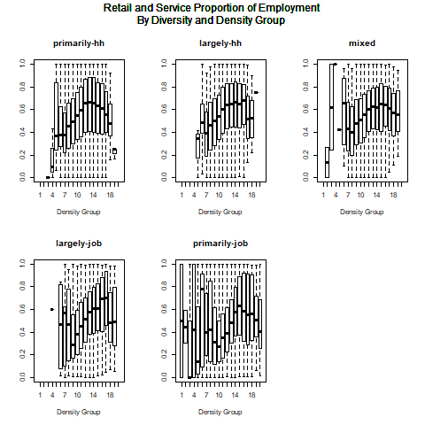
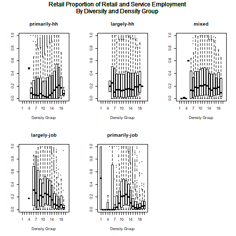
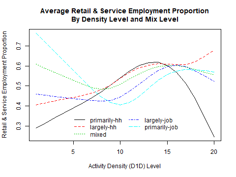
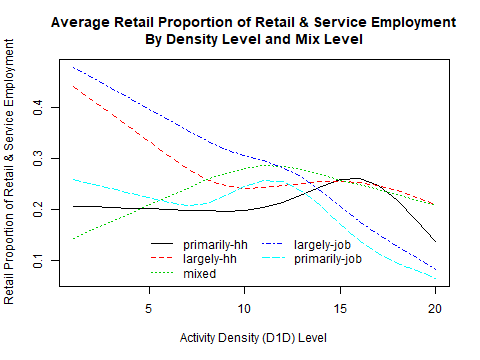
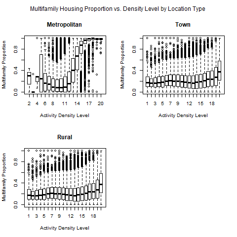
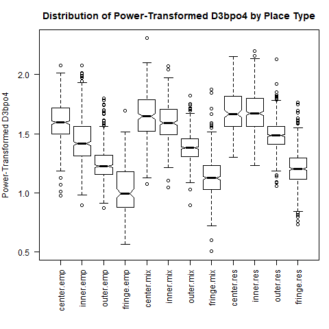
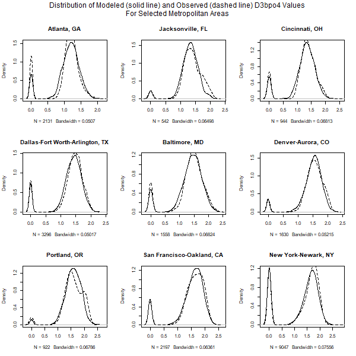
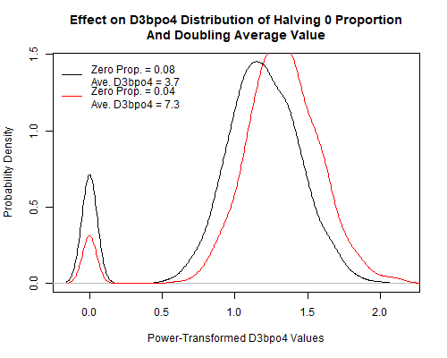

# CreateSimBzoneModels Module
### December 1, 2018

This module estimates all the models for synthesizing Bzones and their land use attributes as a function of Azone characteristics as well as data derived from the US Environmental Protection Agency's Smart Location Database (SLD) augmented with US Census housing and household income data, and data from the National Transit Database. Details on these data are included in the VESimLandUseData package. The combined dataset contains a number of land use attributes at the US Census block group level. The goal of Bzone synthesis to generate a set of SimBzones in each Azone that reasonably represent block group land use characteristics given the characteristics of the Azone, the Marea that the Azone is a part of, and scenario inputs provided by the user.

Many of the models and procedures used in Bzone synthesis pivot from profiles developed from these data sources for specific urbanized areas, as well as more general profiles for different urbanized area population size categories, towns, and rural areas. Using these specific and general profiles enables the simulated Bzones (SimBzones) to better represent the areas being modeled and the variety of conditions found in different states. The documentation for the `Initialize` module has a listing of urbanized area profile names.

The models estimated by this module support the synthesis of SimBzones within each Azone that simulate the land use characteristics of neighborhoods likely to be found in the Azone. The SimBzones are assigned quantities of households and jobs and are attributed with several land use measures in the process. The characteristics are:

* **Location Type**: Identification of whether the SimBzone is located in an urbanized area, a town (i.e. an urban-type area that is not large enough to be urbanized), rural (i.e. dispersed low-density development)

* **Households**: Number of households in each SimBzone

* **Employment**: Number of jobs in each SimBzone

* **Activity Density**: Number of households and jobs per acre

* **Land Use Diversity**: Measures of the degree of mixing of households and jobs

* **Destination Accessibility**: Measures of proximity to households and jobs

* **Area Type**: Category identifying relative activity density and destination accessibility

* **Development Type**: Category identifying whether development is characterized residential, employment, or mixed

* **Housing Units**: Numbers of single-family dwellings and multifamily dwellings in each SimBzone

* **Network Design**: Design of the transportation network to support non-motorized travel

## Model Parameter Estimation

The process of developing SimBzones proceed in a series of steps. Model parameters are developed for each step. In a number of cases the parameters take the form of specific urbanized area or more general profiles.

### Calculate the Number of Households by Azone and Location Type

This procedure is driven by user inputs and does not have any model parameters. The user specifies the proportions of households by location type (urban, town, rural) for each Azone. These proportions are used to calculate the number of households in the Azone that are assigned to each location type.

### Calculate the Number of Jobs by Azone and Location Type

This procedure is driven by user inputs and does not have any model parameters. The user specifies where workers residing in the Azone work in terms of the proportional distribution of location types. Furthermore, the user specifies the proportion of urbanized area jobs in the Marea that the Azone is associated with that are in the Azone.

### Create SimBzones by Azone and Location Type

SimBzones are created to have roughly equal activity totals (households and jobs). The total activity in each Azone and location type is divided by median value calculated for block groups of that location type from the SLD data. The following table shows the median values by location type:

|Location Type | Median Activity Amount|
|:-------------|----------------------:|
|Urban         |                    748|
|Town          |                    801|
|Rural         |                    688|

The total amount of activity in each location type of the Azone is divided by the corresponding numbers in the table to arrive at the number of SimBzones by location type. Fractional remainders are allocated randomly among the SimBzones in each location type to get whole number amounts.

### Assign an Activity Density to Each SimBzone

Activity density (households and jobs per acre) is the key characteristic which drives the synthesis of all SimBzone characteristics. This measure is referred to as D1D in the SLD. The overall activity density of each location type in each Azone is determined by the allocations of households and jobs described above and user inputs on the areal extents of development. The activity density of SimBzones is determined by the overall density and by density distribution characteristics reflective of the area. Density distribution profiles developed for areas as noted above are used in the process.

The distribution of activity density by block group is approximately lognormally distributed. This distribution is related to the overall density of the area. As the overall density increases, the density distribution shifts to the right. This is illustrated in the following figure which shows distributions for 9 urbanized areas having a range of overall densities from the least dense (Atlanta, GA) to the most dense (New York, NY). In each panel of the figure, the probability density of the activity density distribution of block groups in the urbanized area are shown by the solid line. The distribution for all urbanized areas is shown by the dashed line. As can be seen, as the overall density of the urbanized area increases the density distribution shifts to the right.

The characterization of activity density distributions is simplified by discretizing activity density values. The profile for each area is a combination of the proportion of activity at each level and the average density at each level. Levels for urbanized areas are created by dividing the lognormal distribution of activity density for all urbanized areas in the SLD into 20 equal intervals. Activity density levels for town and for rural areas are established in the same way. The following figure shows the distribution of urbanized area activity by activity density level and the average activity density at each level.

Profiles like those show in the figure are developed for each of the urbanized areas listed above, for each urbanized area size category, for towns (as a whole), and for rural areas (as a whole).

The model adjusts the profile for an area as a function of the overall activity density of the area. This is a 2-step mechanistic process. In the first step, the proportions of activity in each level are adjusted until the overall density for the area calculated from the proportion of activity in each level and the average density of each level is within 1% of the target density. The proportion of activity at each level is adjusted in a series of increments by calculating a weighted average of the proportion at each level and the proportion at each level to the right or left. In each increment, 99% of the level value is added to 1% of the adjacent level value and then the results are divided by the sum of all level values so that the proportions for all levels sum to 1. When the overall density is within 10% of the target density, the weights are changed to 99.9% and 0.1%. In this way, the distribution of activity by density level is smoothly shifted to the right or left. In the second step, the average density of all levels is adjusted so that the target density is matched exactly.

Activity density profiles are developed from the SLD for each of the urbanized areas documented in the **Initialize** module, as well as each urbanized area size category, for towns (as a whole), and rural areas (as a whole).

### Assign a Jobs and Housing Mix Level to Each SimBzone

The ratio of jobs to housing (D2A_JPHH in the SLD) at the block group level, like the distribution of activity density, is approximately lognormally distributed. However, unlike the activity density distribution, the distribution of the jobs to housing ratio has no apparent relationship with the overall activity density of the area. Is can be seen in the following figure which compares distributions for 9 urbanized areas.

As can be seen from the figure, the distributions for all of the areas are very similar to the distribution for all urbanized areas. There are, however, some differences that need to be accounted for. For example, the distribution of for the Portland (Oregon) urbanized area is more compressed with a much higher peak at the center of the distribution. This indicates that the jobs to housing ratio is closer to 1 for a much larger portion of block groups in that urbanized area than in other urbanized areas. The distribution for the San Francisco - Oakland urbanized area is similar. On the other hand, the distribution for the Dallas - Fort Worth - Arlington urbanized area is more spread out, indicating more segregation of jobs and households at the block group level.

Differences among urbanized areas are accounted for by developing individual area profiles. As with activity density, these profiles are simplified by discretizing the D2A_JPHH variable into the following 5 activity mix levels:

* **primarily-hh**: from 0 to 4 households per job

* **largely-hh**: less than 4 households to 2 households per job

* **mixed**: less than 2 households per job to 2 jobs per household

* **largely-job**: greater than 2 jobs per household to 4 jobs per household

* **primarily-job**: greater than 4 jobs per household

Areas are profiled according to the distribution of activity among activity mix levels at each activity density level. In this way, the SimBzones created for an area can reasonably reflect observed conditions, and when a scenario having a different overall density is modeled, the joint distribution of activity density and mix will be a sensible result. The following figure illustrates the activity mix distributions by activity density level for urbanized areas as a whole. This figure is a visual representation of a matrix where the rows correspond to activity mix levels and the columns correspond to activity density levels. The values in each cell of the matrix are the proportion of activity at the activity density level that is in the activity mix level (values in each column sum to 1). The value of each cell is represented by the color where yellow represents the highest proportion and black the lowest.

Several patterns in the relationship between activity density and mixing. Ignoring for now the lowest activity density levels, the jobs proportion of activity increases as activity density increases. Jobs dominate at the highest activity densities. This is consistent with the bid rent theory of spatial location. Businesses value higher density (more central) locations more highly than households and so outbid households for those locations. The greatest degree of activity mixing occurs in the 3rd quarter of the density range. There is no clear pattern at the lowest density levels which are represented by a very small number of block groups.

the relationship between activity density and activity mix varies by metropolitan area as illustrated in the following figure which compares values for the 9 example urbanized areas. For example, it can be seen that jobs and housing are much more segregated in the Atlanta area than in the San Francisco-Oakland area.

Profiles illustrated in the preceding figures are developed for each of the urbanized areas listed in the **Initialize** module documentation, for each urbanized area size category, and for towns (as a whole), and rural areas (as a whole). These are used by the **CreateSimBzones** module to assign a activity mix level to each SimBzone based on the activity density of the SimBzone.

### Split SimBzone Activity Between Jobs and Households

The process of splitting the activity of each SimBzone between jobs and households is done in 2 steps. In the first step an initial value for the jobs proportion of activity is selected by sampling from distributions associated with each activity mix level. In the second step, a balancing process is use to so that the distribution of jobs and households among SimBzones in an area is consistent with the control totals of jobs and households by Azone and location type.

The 1st step uses tabulations from the SLD of the numbers of block groups by employment proportion for each activity mix level. Those tabulations are converted into proportions of block groups that are then used as sampling distributions from which to choose an initial employment proportion based on the activity mix level of the SimBzone. The following figure shows the probability distributions of jobs proportions by activity mix levels. These are the sample distributions used to determine the initial jobs proportion for SimBzones located in urbanized areas. Similar sampling distributions are tabulated from the SLD for town locations and for rural locations.

In the second step, jobs and household numbers by SimBzone are adjusted to be consistent with control totals by Azone and location type and activity totals by SimBzone.

### Assign Destination Accessibility Measure Values to SimBzones

Destination accessibility is a measure of the amount of activity present in the vicinity of each SimBzone. The measure used is the harmonic mean of the population within 5 miles and employment within 2 miles of the SimBzone. This measure was computed for each block group in the SLD using straight line distances between block group centroids. This measure is used instead of destination accessibility measures in the SLD which are auto oriented (for example, jobs within 45 minute travel time) and not very useful for measuring destination accessibility within smaller urbanized areas. The harmonic mean of population and employment was found to be useful for distinguishing *area types*, one of the dimensions in the *place type* system that will be implemented in the Bzone synthesis process.

Destination accessibility at the block group level, like the distribution of activity density, is approximately lognormally distributed. However, unlike the activity density distribution, the distribution of the jobs to housing ratio has no apparent relationship with the overall activity density of the area. Is can be seen in the following figure which compares distributions for 9 urbanized areas. As with activity density, the distribution of destination accessibility is related to overall urbanized area density; shifting to the right as overall density increases.

The characterization of destination accessibility distributions is simplified by discretizing destination accessibility values. The profile for each area is a combination of the proportion of activity at each level and the average destination accessibility at each level. Levels for urbanized areas are created by dividing the lognormal distribution of destination accessibility for all urbanized areas in the SLD into 20 equal intervals. Destination accessibility levels for town and for rural areas are established in the same way. The following figure shows the distribution of urbanized area activity by destination accessibility level and the average destination accessibility at each level.

Areas are profiled according to the distribution of activity among destination accessibility levels at each activity density level. In this way, the SimBzones created for an area can reasonably reflect observed conditions, and when a scenario having a different overall density is modeled, the joint distribution of activity density and destination accessibility will be a sensible result. The following figure illustrates the destination accessibility distributions by activity density level for 9 example metropolitan areas. It can be seen that except for low activity density levels (for which there are few census block groups) there is a relatively strong relationship between destination accessibility and activity density.

Profiles illustrated in the preceding figures are developed for each of the urbanized areas listed in the **Initialize** module documentation, for each urbanized area size category, and for towns (as a whole), and rural areas (as a whole). These are used by the **CreateSimBzone** module to assign a destination accessibility level to each SimBzone based on the activity density of the SimBzone.

### Split SimBzone Employment Into Sectors

SimBzone employment is split into 3 sectors (retail, service, other) to enable the calculation of an entropy measure of land use mixing that is used in the forthcoming multimodal household travel for VisionEval. A model is developed to carry out the splits for each SimBzone as a function of the activity density and mixing levels assigned to the SimBzone. This model is carried out in two steps. In the first step, the combined proportion of retail and service employment is determined. In the second step, the retail proportion of retail and service employment is determined. It is clear from graphing the relationship of retail and service proportions with density and mix, that while there are some trends, there is a very large amount of variability. The following figure shows the distribution of the combined retail and service proportion at different density and mixing levels.

The relationship is even less clear for the retail proportion of retail and service employment as shown in the following figure.

Because of the high degree of variability and limited number of predictive variables that may be employed, a very simple model structure is used. The mean values by density are calculated for each mix level and smoothed using splines with 4 degrees of freedom. In addition, the standard deviation of values at each mix level is computed. This is done for both model steps. In each step, the model randomly selects a proportion from a normal distribution described by the mean and standard deviation. The following figure shows the mean values for the retail and service proportion of employment by density and mix level.

The following figure shows the mean values for the retail proportion of retail and service employment by density and mix level.

### Model Housing Types

The housing types (single family, multifamily) occupied by households in each SimBzone are modeled and used in combination with a housing choice model to assign housing types to households, and to assign households to SimBzones. This is done for several reasons. First, dwelling type has a significant relationship to several important household transportation characteristics such as auto ownership. Second, modeling housing type provides a mechanism for assigning households to SimBzones (neighborhoods) having characteristics where they're more likely to live. For example, a large higher income household is more likely to live in a single-family dwelling and thus are more likely to live in a lower density neighborhood where single-family dwellings predominate.

The proportion of housing units in multifamily dwellings is modeled as a function of SimBzone activity density. The following set of boxplots show the distributions of the multifamily dwelling proportions by activity density level for metropolitan, town, and rural areas. In general, the multifamily dwelling unit proportion increases with increased density. This is particularly evident for metropolitan areas where the multifamily proportion increases greatly at activity density levels beyond the midrange.

The boxplots also show that the distribution of values (extent and skewness) varies by activity density. Given the complexity of the distributions and information limitations of the Bzone synthesis process, the multifamily proportions model has a simple design to capture central tendencies and variance patterns. The design is similar to the boxplot representation. Multifamily dwellings at each activity density level and for each location type are split into 8 quantiles. Each quantile has an associated range of multifamily proportions. The model selects a multifamily proportion for a SimBzone by selecting the corresponding set of quantiles corresponding to the location type and activity density level of the SimBzone. Then a quantile is randomly selected and a multifamily proportion is randomly selected within the range of the chosen quantile.

### Designate Place Types

Place types simplify the characterization of land use patterns. They are used in the VESimLandUse package modules to simplify the management of inputs for land use related policies. There are three dimensions to the place type system. Location type identifies whether the SimBzone is located in an urbanized area (Metropolitan), a smaller urban-type area (Town), or a non-urban area (Rural). Area types identify the relative urban nature of the SimBzone: center, inner, outer, fringe. Development types identify the character of development in the SimBzone: residential, employment, mix.

Area types are designated based on a combination of activity density and destination accessibility levels. Each is split into 4 levels. Area type is determined by 16 combinations of those levels. Following are the activity density level definitions:

* Very Low (VL): 0 to 0.5 households and jobs per acre

* Low (L): Greater than 0.5 to 5 households and jobs per acre

* Moderate (M): Greater than 5 to 10 households and jobs per acrea

* High (H): Greater than 10 households and jobs per acre

Following are the destination accessiblity level definitions:

c(0, 2e3, 1e4, 5e4, max(Values_Bz))

* Very Low (VL): 0 to 2,000 units

* Low (L): Greater than 2,000 units to 10,000 units

* Moderate (M): Greater than 10,000 units to 50,000 units

* High (H): Greater than 50,000 units

The following table classifies area types by activity density levels and destination accessibility levels. Rows in the table represent activity density levels and columns represent destination accessibility levels.

 |          | Very Low | Low    | Moderate | High   |
 |----------|----------|--------|----------|--------|
 | Very Low | fringe   | fringe | outer    | outer  |
 | Low      | fringe   | outer  | outer    | inner  |
 | Moderate | outer    | outer  | inner    | inner  |
 | High     | outer    | inner  | center   | center |

Development type is determined by collapsing the mix levels from 5 to 3 as follow:

 | Development Type | Mix Levels                  |
 |------------------|-----------------------------|
 | mix              | mixed                       |
 | res              | primarily-hh & largely-hh   |
 | emp              | primarily-job & largely-job |

 The following maps show how the area type and development type categories apply to the Atlanta and Portland urbanized areas based on block group data in the SLD.

### Model Pedestrian-Oriented Network Design (D3bpo4)

Pedestrian-oriented network design can significantly affect the amount of walking and other non-auto oriented trip making. Having a suitable measure can be an important indicator. It can also be used as a predictor variable of non-auto mode travel as it is in the forthcoming multimodal travel model. The D3bpo4 measure of pedestrian-oriented network design measure in the SLD is used for this purpose and the **CreateSimBzones** module needs to include a process for assigning reasonable values of this measure to SimBzones.

D3bpo4 is a measure of intersection density in terms of pedestrian-oriented intersections having four or more legs per square mile. The SLD users guide defines pedestrian-oriented facilities as follows:

* Any arterial or local street having a speed category of 6 (between 21 and 30 mph) where car travel is permitted in both directions.

* Any arterial or local street having a speed category of 7 or lower (less than 21 mph).

* Any local street having a speed category of 6 (between 21 and 30 mph).

* Any pathway or trail on which automobile travel is not permitted (speed category 8).

* For all of the above, pedestrians must be permitted on the link.

* For all of the above, controlled access highways, tollways, highway ramps, ferries, parking lot roads, tunnels, and facilities having four or more lanes of travel in a single direction (implied eight lanes bi-directional) are excluded.

This model is implemented using several datasets for each urbanized area in the database (see **Initialize** model documentation for details), for urbanized area size categories, and for towns in aggregate, and and rural areas in aggregate. The model has two steps. The first step is used to determine whether a SimBzone will have a D3bpo4 value of zero. The second step is used to determine what the D3bpo4 value is if it is not zero. This 2-step approach is used because a significant proportion (~ 10%) of block groups in the SLD have a zero value and because the distribution of values is highly skewed so transformation is required in order to develop normal sampling distributions.

The parameters for the first model step (to determine if D3bpo4 is 0) are tables of the zero proportions for named urbanized areas, urbanized area size category, towns (as a whole), and rural areas (as a whole) tabulated from the SLD. Two tabulations are done. One of these is a tabulation for the location as a whole (e.g. the proportion of block groups in Seattle having a 0 value). The other is a tabulation for the location by place type where place types are combinations of area types and development types (12 in total). For many of the urbanized areas, there are missing values for one or more place types. Values are imputed for these by taking a weighted average of the values for all other urbanized areas where the weights measure how close the overall value of each urbanized area is to the overall value of the urbanized area for with a missing place value is calculated. From these tabulations, the ratio of the zero proportion by place type for each location to the zero proportion for the location is calculated. Calculation of this ratio enables the model to respond to user inputs for performance goals. For example, the user may specify a scenario where the proportion of neighborhoods having no pedestrian-oriented intersections cut in half. The model will use this input and the relative 0 ratios that have been calculated for the location to calculate what the 0 proportions would be by place type (assuming that the same proportional changes are made across the board by place type).

The parameters for the second model step (to determine D3bpo4 if it is not 0) are tables of average D3pbo4 values for the same locations as above. Overall averages by location and averages by location and place type are calculated. Averages are weighted by block group activity. Because the distribution of D3bpo4 values is highly skewed, with a long right-hand tail, the averages are calculated for power-transformed values. Transformation powers are calculated for each location type (urban, town, rural). Missing values in the place type by location table are imputed using the method described above. The following figure compares the distributions of power-transformed averages by place type for urbanized areas as a whole. As can be seen from the figure, as expected, values drop as one moves from urban centers to fringe areas. The decline is greater for employment development types than for residential. For the residential areas, the D3bpo4 values for inner neighborhoods are as high as for center neighborhoods.

From these tabulations, the ratio of the power-transformed average density by place type for each location to the power-transformed average density for the location is calculated. Calculation of this ratio enables the model to respond to user inputs for performance goals. For example, the user may specify a scenario where the average D3bpo4 value is doubled. The model will use this input, power transform it and calculate the power-transfomed values by place type.

In addition to computing the power-transformed average values by location and place type, the standard deviation of the power-transformed D3bpo4 values is computed by location type (urban, town, rural) and place type. The power-transformed average for the location and place type along with the standard deviation by location type and place type parameterize a normal sampling distribution for a location and place type from which a sample is drawn to be the selected power-transformed D3bpo4 value that is applied if the value is not 0.

The following figure compares the results of modeling the D3bpo4 values using the estimated parameters with values from the SLD for 9 metropolitan areas. The power-transformed D3bpo4 values are shown. The simplified model process does a reasonable job of replicating observed values.

The following shows the results of testing the model using Atlanta urbanized area data with reducing the 0 proportion in half and doubling the average D3bpo4 value for the urbanized area. Power-transformed D3bpo4 distributions are shown.

## User Inputs
This module has no user input requirements.

## Datasets Used by the Module
This module uses no datasets that are in the datastore.

## Datasets Produced by the Module
This module produces no datasets to store in the datastore.
