# CreateSimBzoneModels Module
### February 3, 2018

This module estimates all the models for synthesizing Bzones and their land use attributes as a function of Azone characteristics as well as data derived from the US Environmental Protection Agency's Smart Location Database (SLD) augmented with US Census housing and household income data, and data from the National Transit Database. Details on these data are included in the VESimLandUseData package. The combined dataset contains a number of land use attributes at the US Census block group level. The goal of Bzone synthesis to generate a set of SimBzones in each Azone that reasonably represent block group land use characteristics given the characteristics of the Azone, the Marea that the Azone is a part of, and scenario inputs provided by the user.

Many of the models and procedures used in Bzone synthesis pivot from profiles developed from these data sources for specific urbanized areas, as well as more general profiles for different urbanized area population size categories, towns, and rural areas. Using these specific and general profiles enables the simulated Bzones (SimBzones) to better represent the areas being modeled and the variety of conditions found in different states. The documentation for the `Initialize` module has a listing of urbanized area profile names.

The models estimated by this module support the synthesis of SimBzones within each Azone that simulate the land use characteristics of neighborhoods likely to be found in the Azone. The SimBzones are assigned quantities of households and jobs and are attributed with several land use measures in the process. The characteristics are:

* **Location Type**: Identification of whether the SimBzone is located in an urbanized area, a town (i.e. an urban-type area that is not large enough to be urbanized), rural (i.e. dispersed low-density development)

* **Households**: Number of households in each SimBzone

* **Employment**: Number of jobs in each SimBzone

* **Activity Density**: Number of households and jobs per acre

* **Land Use Diversity**: Measures of the degree of mixing of households and jobs

* **Destination Accessibility**: Measures of proximity to households and jobs

* **Area Type**: Category identifying urban nature of the area (center, inner, outer, fringe)

* **Development Type**: Category identifying whether development is characterized by predominantly residential, or employment, or is mixed

* **Housing Units**: Numbers of single-family dwellings and multifamily dwellings in each SimBzone

* **Employment by Sector**: Numbers of retail, service, and other jobs in the SimBzone

* **Pedestrian Network Design**: Design of the transportation network to support non-motorized travel

* **Transit Accessibility**: Level of peak period transit service near the SimBzone

## Model Parameter Estimation

The process of developing SimBzones proceeds in a series of steps. Model parameters are developed for each step. In a number of cases the parameters take the form of specific urbanized area or more general profiles.

### Calculate the Number of Households by Azone and Location Type

This procedure is driven by user inputs and does not have any model parameters. The user specifies the proportions of households by location type (urban, town, rural) for each Azone. These proportions are used to calculate the number of households in the Azone that are assigned to each location type.

### Calculate the Number of Jobs by Azone and Location Type

This procedure is driven by user inputs and does not have any model parameters. The user specifies where workers residing in the Azone work in terms of the proportional distribution of location types. Furthermore, the user specifies the proportion of urbanized area jobs in the Marea that the Azone is associated with that are in the Azone.

### Create SimBzones by Azone and Location Type

SimBzones are created to have roughly equal activity totals (households and jobs). The total activity in each Azone and location type is divided by median value calculated for block groups of that location type from the SLD data. The following table shows the median values by location type:


|Location Type | Median Activity Amount|
|:-------------|----------------------:|
|Urban         |                    748|
|Town          |                    801|
|Rural         |                    688|

**Table 1. Median Number of Households and Jobs in a Census Block Group by Location Type**

The total amount of activity in each location type of the Azone is divided by the corresponding numbers in the table to arrive at the number of SimBzones by location type. Fractional remainders are allocated randomly among the SimBzones in each location type to get whole number amounts.

### Assign an Activity Density to Each SimBzone

Activity density (households and jobs per acre) is the key characteristic which drives the synthesis of all SimBzone characteristics. This measure is referred to as D1D in the SLD. The overall activity density of each location type in each Azone is determined by the allocations of households and jobs described above and user inputs on the areal extents of development. The activity density of SimBzones is determined by the overall density and by density distribution characteristics reflective of the area. Density distribution profiles developed for areas as noted above are used in the process.

The distribution of activity density by block group is approximately lognormally distributed. This distribution is related to the overall density of the area. As the overall density increases, the density distribution shifts to the right. This is illustrated in the following figure which shows distributions for 9 urbanized areas having a range of overall densities from the least dense (Atlanta, GA) to the most dense (New York, NY). In each panel of the figure, the probability density of the activity density distribution of block groups in the urbanized area are shown by the solid line. The distribution for all urbanized areas is shown by the dashed line. As can be seen, as the overall density of the urbanized area increases, the density distribution shifts to the right.


**Figure 1. Distributions of Block Group Activity Density for Selected Urbanized Areas**

The characterization of activity density distributions is simplified by discretizing activity density values. The profile for each area is a combination of the proportion of activity at each level and the average density at each level. Levels for urbanized areas are created by dividing the lognormal distribution of activity density for all urbanized areas in the SLD into 20 equal intervals. Activity density levels for town and for rural areas are established in the same way. The following figure shows the distribution of urbanized area activity by activity density level and the average activity density at each level.


**Figure 2. Proportions of Urbanized Area Activity and Average Density by Density Level**

Profiles like those show in the figure are developed for each of the urbanized areas listed above, for each urbanized area size category, for towns (as a whole), and for rural areas (as a whole).

The model adjusts the profile for an area as a function of the overall activity density of the area. This is a 2-step mechanistic process. In the first step, the proportions of activity in each level are adjusted until the overall density for the area calculated from the proportion of activity in each level and the average density of each level is within 1% of the target density. The proportion of activity at each level is adjusted in a series of increments by calculating a weighted average of the proportion at each level and the proportion at each level to the right or left. In each increment, 99% of the level value is added to 1% of the adjacent level value and then the results are divided by the sum of all level values so that the proportions for all levels sum to 1. When the overall density is within 10% of the target density, the weights are changed to 99.9% and 0.1%. In this way, the distribution of activity by density level is smoothly shifted to the right or left. In the second step, the average density of all levels is adjusted so that the target density is matched exactly.

Activity density profiles are developed from the SLD for each of the urbanized areas documented in the **Initialize** module, as well as each urbanized area size category, for towns (as a whole), and rural areas (as a whole).

### Assign a Jobs and Housing Mix Level to Each SimBzone

The ratio of jobs to housing (D2A_JPHH in the SLD) at the block group level, like the distribution of activity density, is approximately lognormally distributed. However, unlike the activity density distribution, the distribution of the jobs to housing ratio has no apparent relationship with the overall activity density of the area. Is can be seen in the following figure which compares distributions for 9 urbanized areas.

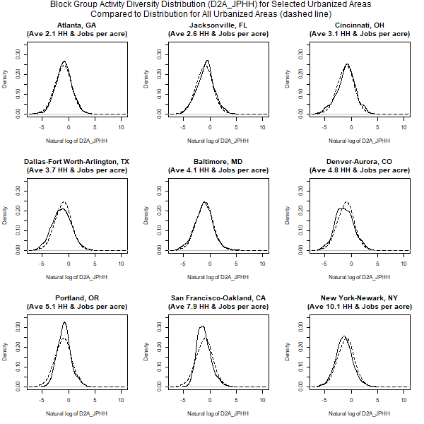

**Figure 3. Distribution of Block Group Jobs to Housing Ratio for Selected Urbanized Areas**

As can be seen from the figure, the distributions for all of the areas are very similar to the distribution for all urbanized areas. There are, however, some differences that need to be accounted for. For example, the distribution of for the Portland (Oregon) urbanized area is more compressed with a much higher peak at the center of the distribution. This indicates that the jobs to housing ratio is closer to 1 for a much larger portion of block groups in that urbanized area than in other urbanized areas. The distribution for the San Francisco - Oakland urbanized area is similar. On the other hand, the distribution for the Dallas - Fort Worth - Arlington urbanized area is more spread out, indicating more segregation of jobs and households at the block group level.

Differences among urbanized areas are accounted for by developing individual area profiles. As with activity density, these profiles are simplified by discretizing the D2A_JPHH variable into the following 5 activity mix levels:

* **primarily-hh**: greater than 4 households per job

* **largely-hh**: less than 4 households to 2 households per job

* **mixed**: less than 2 households per job to 2 jobs per household

* **largely-job**: greater than 2 jobs per household to 4 jobs per household

* **primarily-job**: greater than 4 jobs per household

Areas are profiled according to the distribution of activity among activity mix levels at each activity density level. In this way, the SimBzones created for an area can reasonably reflect observed conditions, and when a scenario having a different overall density is modeled, the joint distribution of activity density and mix will be a sensible result. The following figure illustrates the activity mix distributions by activity density level for urbanized areas as a whole. This figure is a visual representation of a matrix where the rows correspond to activity mix levels and the columns correspond to activity density levels. The values in each cell of the matrix are the proportion of activity at the activity density level that is in the activity mix level (values in each column sum to 1). The value of each cell is represented by the color where yellow represents the highest proportion and black the lowest.

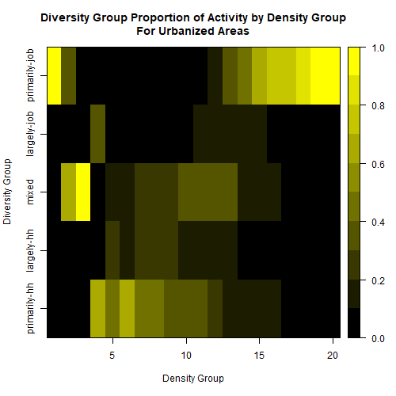

**Figure 4. Diversity Group Proportion of Activity by Density Group, All Urbanized Areas**

Several patterns can be seen in the relationship between activity density and mixing. Ignoring for now the lowest activity density levels, the jobs proportion of activity increases as activity density increases. Jobs dominate at the highest activity densities. This is consistent with the bid rent theory of spatial location. Businesses value higher density (more central) locations more highly than households and so outbid households for those locations. The greatest degree of activity mixing occurs in the 3rd quarter of the density range. There is no clear pattern at the lowest density levels which are represented by a very small number of block groups.

The relationship between activity density and activity mix varies by metropolitan area as illustrated in the following figure which compares values for the 9 example urbanized areas. For example, it can be seen that jobs and housing are much more segregated in the Atlanta area than in the San Francisco-Oakland area.


**Figure 5. Comparison of Distribution of Activity by Diversity and Density for Selected Urbanized Areas**

Profiles illustrated in the preceding figures are developed for each of the urbanized areas listed in the **Initialize** module documentation, for each urbanized area size category, and for towns (as a whole), and rural areas (as a whole). These are used by the **CreateSimBzones** module to assign a activity mix level to each SimBzone based on the activity density of the SimBzone.

### Split SimBzone Activity Between Jobs and Households

The process of splitting the activity of each SimBzone between jobs and households is done in 2 steps. In the first step an initial value for the jobs proportion of activity is selected by sampling from distributions associated with each activity mix level. In the second step, a balancing process is used so that the distribution of jobs and households among SimBzones is consistent with the control totals of jobs and households by Azone and location type.

The 1st step uses tabulations from the SLD of the numbers of block groups by employment proportion for each activity mix level. Those tabulations are converted into proportions of block groups that are then used as sampling distributions from which to choose an initial employment proportion based on the activity mix level of the SimBzone. The following figure shows the probability distributions of jobs proportions by activity mix levels. These are the sample distributions used to determine the initial jobs proportion for SimBzones located in urbanized areas. Similar sampling distributions are tabulated from the SLD for town locations and for rural locations.

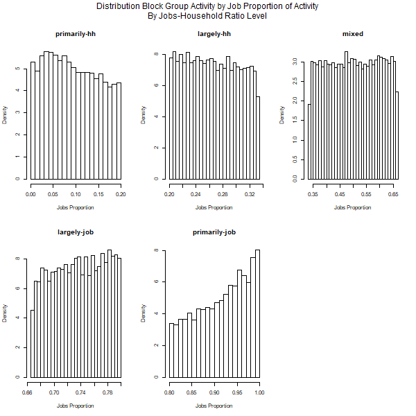

**Figure 6. Distributions of Jobs Proportions of Total Activity by Activity Mix Level**

In the second step, jobs and household numbers by SimBzone are adjusted to be consistent with control totals by Azone and location type and activity totals by SimBzone. The difference between the control total of jobs and the allocated jobs is allocated as a function of the initial jobs allocations among zones and the respective capacities to accommodate more (or fewer) jobs.

### Assign Destination Accessibility Measure Values to SimBzones

Destination accessibility is a measure of the amount of activity present in the vicinity of each SimBzone. The measure used is the harmonic mean of the population within 5 miles and employment within 2 miles of the SimBzone. This measure was computed for each block group in the SLD using straight line distances between block group centroids. This measure is used instead of destination accessibility measures in the SLD which are auto oriented (for example, jobs within 45 minute travel time) and not very useful for measuring destination accessibility within smaller urbanized areas. The harmonic mean of population and employment was found to be useful for distinguishing *area types*, one of the dimensions in the *place type* system that is implemented in the Bzone synthesis process.

Destination accessibility at the block group level, like the distribution of activity density, is approximately lognormally distributed. As with activity density, the distribution of destination accessibility is related to overall urbanized area density; shifting to the right as overall density increases.

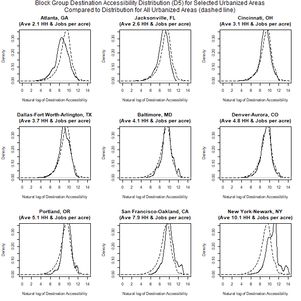

**Figure 7. Distributions of Destination Accessibility for Selected Urbanized Areas**

The characterization of destination accessibility distributions is simplified by discretizing destination accessibility values. The profile for each area is a combination of the proportion of activity at each level and the average destination accessibility at each level. Levels for urbanized areas are created by dividing the lognormal distribution of destination accessibility for all urbanized areas in the SLD into 20 equal intervals. Destination accessibility levels for town and for rural areas are established in the same way. The following figure shows the distribution of urbanized area activity by destination accessibility level and the average destination accessibility at each level.

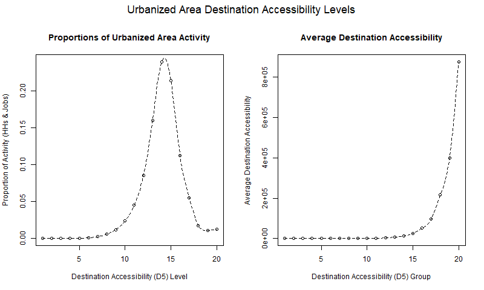

**Figure 8. Proportions of Urbanized Area Activity and Average Destination Accessibility by Destination Accessibility Level**

Areas are profiled according to the distribution of activity among destination accessibility levels at each activity density level. In this way, the SimBzones created for an area can reasonably reflect observed conditions, and when a scenario having a different overall density is modeled, the joint distribution of activity density and destination accessibility will be a sensible result. The following figure illustrates the destination accessibility distributions by activity density level for 9 example metropolitan areas. It can be seen that except for low activity density levels (for which there are few census block groups) there is a relatively strong relationship between destination accessibility and activity density.

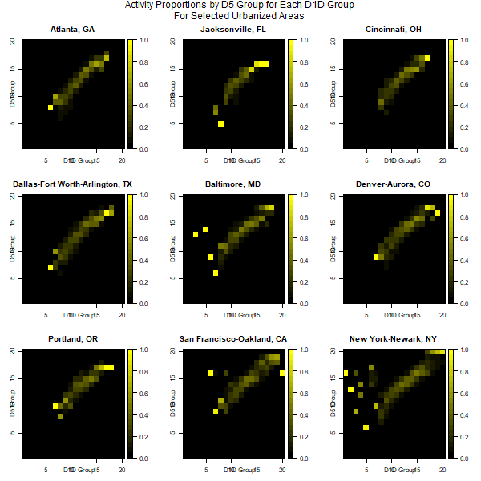

**Figure 9. Activity Proportions by Destination Accessibility Level for Each Density Level for Selected Urbanized Areas**

Profiles illustrated in the preceding figures are developed for each of the urbanized areas listed in the **Initialize** module documentation, for each urbanized area size category, and for towns (as a whole), and rural areas (as a whole). These are used by the **CreateSimBzone** module to assign a destination accessibility level to each SimBzone based on the activity density of the SimBzone.

### Designate Place Types

Place types are a land use classification system which simplifies the characterization of land use patterns. They are used in the estimation of the housing type, employment sector, pedestrian network, and transit access models.  They are used to simplify the management of inputs for land use related policies. There are three dimensions to the place type system. Location type identifies whether the SimBzone is located in an urbanized area (Urban), a smaller urban-type area (Town), or a non-urban area (Rural). Area types identify the relative urban nature of the SimBzone: center, inner, outer, fringe. Development types identify the character of development in the SimBzone: residential (res), employment (emp), mix.

Area types are designated based on a combination of activity density and destination accessibility levels. Each is split into 4 levels. Area type is determined by 16 combinations of those levels. Following are the activity density level definitions:

* Very Low (VL): 0 to 0.5 households and jobs per acre

* Low (L): Greater than 0.5 to 5 households and jobs per acre

* Moderate (M): Greater than 5 to 10 households and jobs per acrea

* High (H): Greater than 10 households and jobs per acre

Following are the destination accessiblity level definitions:

* Very Low (VL): 0 to 2,000 units

* Low (L): Greater than 2,000 units to 10,000 units

* Moderate (M): Greater than 10,000 units to 50,000 units

* High (H): Greater than 50,000 units

The following table classifies area types by activity density levels and destination accessibility levels. Rows in the table represent activity density levels and columns represent destination accessibility levels.

 |          | Very Low | Low    | Moderate | High   |
 |----------|----------|--------|----------|--------|
 | Very Low | fringe   | fringe | outer    | outer  |
 | Low      | fringe   | outer  | outer    | inner  |
 | Moderate | outer    | outer  | inner    | inner  |
 | High     | outer    | inner  | center   | center |

Development type is determined by collapsing the mix levels from 5 to 3 as follow:

 | Development Type | Mix Levels                  |
 |------------------|-----------------------------|
 | mix              | mixed                       |
 | res              | primarily-hh & largely-hh   |
 | emp              | primarily-job & largely-job |

 The following maps show how the area type and development type categories apply to the Atlanta and Portland urbanized areas based on block group data in the SLD.

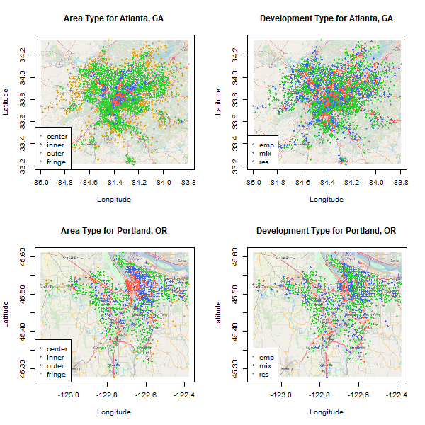

**Figure 10. Area Type and Development Type Designations for Atlanta and Portland Urbanized Areas**

### Model Housing Types

The housing types (single family, multifamily) occupied by households in each SimBzone are modeled and used in combination with a housing choice model to assign housing types to households, and to assign households to SimBzones. This is done for several reasons. First, dwelling type has a significant relationship to several important household transportation characteristics such as auto ownership. Second, modeling housing type provides a mechanism for assigning households to SimBzones (neighborhoods) having characteristics where they're more likely to live. For example, a large higher income household is more likely to live in a single-family dwelling and thus are more likely to live in a lower density neighborhood where single-family dwellings predominate.

The proportion of housing units in multifamily dwellings is modeled as a function of area type and development type which are combined as place types (e.g. center-emp, center-mix, center-res). The model is simply a table of block group percentiles (2% intervals) of the multifamily housing unit proportion by place type. This table is prepared using the area type and development type designations applied to SLD block groups using the area and development type models, and the multifamily housing unit proportion attached to the SLD (see documentation for the VESimLandUseData package). The model uses all the SLD records instead of segmented by urbanized area or location type.

The model is applied to assign multifamily and single family dwelling unit numbers in a SimBzone as follows:

1) Choose the multifamily percentile distribution corresponding to the place type of the SimBzone;

2) Randomly select a percentile from the distribution and return the corresponding multifamily housing unit proportion;

2) Multiply the household total for the SimBzone by the selected proportion and round the result to calculate the number of households in multifamily housing units;

4) Subtract the multifamily housing units from the household total to calculate the number of households in single family dwelling units.

Despite the simplicity of the model, it does a reasonable job of simulating the distributions of multifamily housing unit proportions. This can be seen in the following figure which compares the distributions of observed and simulated multifamily housing proportions in several urbanized areas.

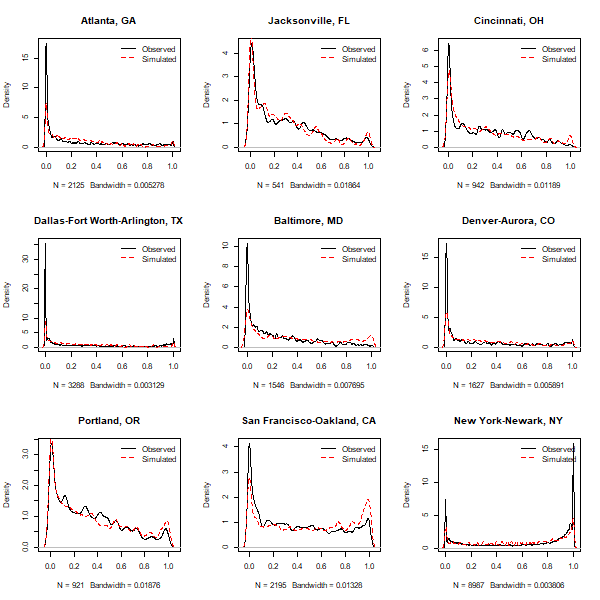

**Figure 10. Comparison of Observed and Simulated Distributions of Multifamily Housing Proportions for Selected Urbanized Areas**

### Split SimBzone Employment Into Sectors

SimBzone employment is split into 3 sectors (retail, service, other) to enable the calculation of an entropy measure of land use mixing that is used in the forthcoming multimodal household travel module for VisionEval. The model for doing this is similar to the housing split model except that two percentile tables are made; one which tablulates the combined retail and service employment proportion of total employment in the block group, and another which tabulated the retail employment proportion of combined retail and service employment.

As with the housing split model, all of the records in the SLD are used to estimate the model rather than segmenting the model by urbanized area or location type. The SLD 'E5_Ret10' and 'E5_Svc10' variables are used to indentify the numbers of retail and service jobs respectively in each block group, and the 'TotEmp' variable to identify the total number of jobs. The required proportions are calculated from these values. The block group area types and development types are the values calculated using the area and development type models.

The model is applied to calculate the amounts of retail, service, and other jobs in each SimBzone as follows:

1) Choose a percentile distribution of the retail-service proportion of total employment corresponding to the place type of the SimBzone.

2) Randomly select a percentile from the distribution and return the corresponding retail-service job proportion;

3) Multiply the selected proportion by the total employment and round the result to calculate the combined retail and service employment. Subtract from the total to calculate the number of other jobs.

4) Choose a percentile distribution of the retail proportion of retail-service employment corresponding to the place type of the SimBzone.

5) Randomly select a percentile from the distribution and return the corresponding retail job proportion;

6) Multiply the selected proportion by the retail-service employment and round the result to calculate the retail employment and subtract from the retail-service employment to calculate the number of service jobs.

Despite its simplicity, the model produces employment splits which enable entropy measures calculated using them to reasonably represent entropy measures calculated from observed employment. This can be seen in the following figure which compares observed and simulated entropy distributions for 9 example urbanized areas.


**Figure 11. Comparison of Observed and Simulated Distributions of Entropy Measures of Land Use Mixing for Selected Urbanized Areas**

### Model Pedestrian-Oriented Network Design (D3bpo4)

Pedestrian-oriented network design can significantly affect the amount of walking and other non-auto oriented trip making. Having a suitable measure can be an important indicator. It can also be used as a predictor variable of non-auto mode travel as it is in the forthcoming multimodal travel model. The D3bpo4 measure of pedestrian-oriented network design measure in the SLD is used for this purpose and the **CreateSimBzones** module needs to include a process for assigning reasonable values of this measure to SimBzones.

D3bpo4 is a measure of intersection density in terms of pedestrian-oriented intersections having four or more legs per square mile. The SLD users guide defines pedestrian-oriented facilities as follows:

* Any arterial or local street having a speed category of 6 (between 21 and 30 mph) where car travel is permitted in both directions.

* Any arterial or local street having a speed category of 7 or lower (less than 21 mph).

* Any local street having a speed category of 6 (between 21 and 30 mph).

* Any pathway or trail on which automobile travel is not permitted (speed category 8).

* For all of the above, pedestrians must be permitted on the link.

* For all of the above, controlled access highways, tollways, highway ramps, ferries, parking lot roads, tunnels, and facilities having four or more lanes of travel in a single direction (implied eight lanes bi-directional) are excluded.

The modeling approach for simulating the D3bpo4 measure is a variant of the approach used in the housing and employment split models. However, instead of modeling proportions using tables of percentiles by place type, normalized D3bpo4 values are modeled using these tables. The normalized D3bpo4 value for a zone (block group or SimBzone) is calculated by dividing the zonal value by the average of all zones in the urbanized area the zone is located in. Normalizing values helps to account for differences between urbanized areas and enables the data to be pooled to create a table of values by percentile and place type. For town locations and for rural locations the normalized values are calculated using the town and rural averages respectively.

Tables of normalized D3bpo4 values by percentile and place type are calculated for urban, town, and rural locations. These are used in the same way as the housing and employment split tables are used. The location type of the SimBzone determines which table is used and the place type determines which set of percentiles are used. A percentile value is then selected as random from the selected set. If the SimBzone is located in an urbanized area, the selected normalized value is multiplied by the average for the urbanized area to compute the D3bpo4 value for the SimBzone. If the SimBzone is located in a town location or a rural location the selected value is multiplied by the town or rural average. The following figure compares the results of simulating D3bpo4 values using this approach with values from the SLD for 9 metropolitan areas. The log-transformed D3bpo4 values are shown to aid the comparison. The simplified model process does a reasonable job of reflecting observed values.

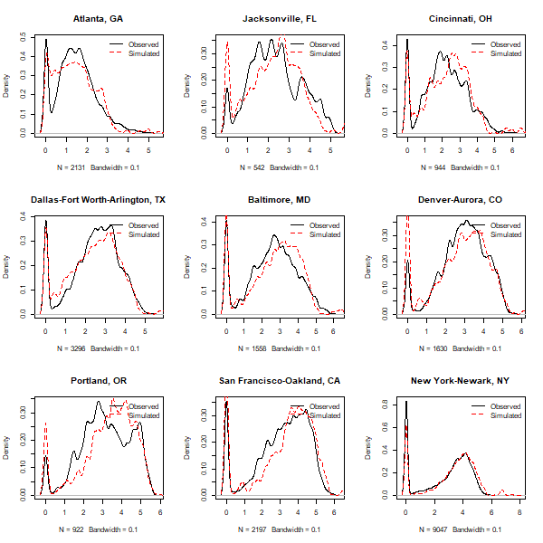

**Figure 12. Comparison of Observed and Simulated Distributions of D3bpo4 Values for Selected Urbanized Areas**

### Model Transit Accessibility (D4c)

Transit accessibility measures how easily transit service may be accessed from each zone. The SLD includes several transit accessibility measures. The D4c measure is the one used in the forthcoming multimodal household travel module. D4c is a measure of the aggregate frequency of transit service within 0.25 miles of the block group boundary per hour during evening peak period (4:00 PM to 7:00 PM). The measure was calculated by the EPA using Google GTFS data.

The model to simulate D4c is only applied to urban locations. VisionEval does not model transit service and its effects in town or rural locations. The model has two parts. The first part is like the D3bpo4 model in that it uses a table of normalized D4c values by place type and percentile to select a normalized D4c value for a SimBzone which is multiplied by the average D4c value for the urbanized area the SimBzone is located in to calculate the D4c value for the SimBzone. The second model computes the average D4c value for an urbanized area as a function of the overall transit supply for the urbanized area (transit revenue miles) and urbanized area density. Because of limited availability of GTFS data at the time the SLD was being developed, D4c data are only present for about 30% of the urbanized areas included in the SLD. However since the urbanized areas for which data are missing are smaller urbanized areas, data are provided for over 70% of the block groups in the SLD. This provides plenty of datapoints for tabulating normalized values by percentile and place type, but is means that average D4c values are not available for the large majority of urbanized areas.

Simulating D4c values as a function of place type using a table of normalized D4c values by percentile and place type does a reasonably good job of producing a sensible distribution of D4c values for urbanized areas. This can be seen in the following figure which compares log-transformed distributions for observed and simulated values for 8 urbanized areas. It should be noted that data for Jacksonville Florida are not shown, unlike figures presented above. This is because D4c data are missing for Jacksonville.

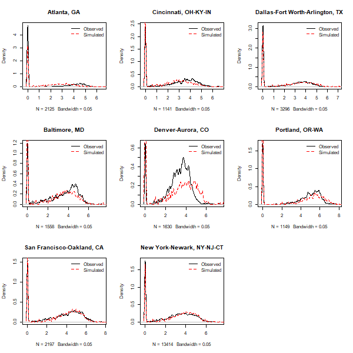

**Figure 13. Comparison of Observed and Simulated Distributions of D4c Values for Selected Urbanized Areas**

An important goal of this model is to be sensitive to public transit service level (i.e. transit revenue miles). If the amount of transit service in an urbanized area changes, the average D4c value for the urbanized area should change as well. One would expect there to be a general relationship between the density of transit service (e.g. revenue miles per acre) and the average D4c value. This relationship can be calculated directly from the augmented SLD database (which contains transit revenue miles) for the urbanized areas for which D4c values are provided (~ 30% of the urbanized areas). For these urbanized areas, the ratio of average D4c and transit revenue mile density is calculated. This ratio is used in model applications to calculate the average D4c value for an urbanized area from the transit revenue miles and geographic area of the urbanized area. The following figure shows the distribution of values for these urbanized areas.

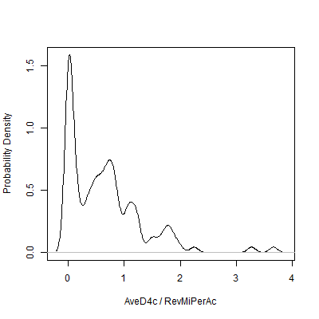

**Figure 14: Distribution of Urbanized Area Ratios of Average D4c to Transit Service Density**

For other urbanized areas a model of the relationship needs to be employed. This is developed from the data for the urbanized area that have recorded D4c values. The following chart plots the values of the log of average D4c against the log of transit revenue miles per acre for these urbanized areas. Plot symbols identify clusters that area described below. It can be seen that while the overall distribution shows no clear relationship, the data appear to be in several clusters and that the data points clustered near the top have an upward-trending relationship. Kmeans cluster analysis was used to split the data into two clusters based on the axis measures. These are shown in the figure by the different plotting symbols.


**Figure 15: Urbanized Area Average D4c vs. Transit Service Density**

A linear model is estimated to fit the data shown in the upper cluster. A summary of the model statistics follows.

```

Call:
lm(formula = LogAveD4c ~ LogTranRevMiPerAc * LogAveD1D, data = LmDat_df)

Residuals:
     Min       1Q   Median       3Q      Max 
-2.73087 -0.28697  0.05069  0.43815  1.80975 

Coefficients:
                            Estimate Std. Error t value Pr(>|t|)    
(Intercept)                  -1.3398     0.7418  -1.806  0.07440 .  
LogTranRevMiPerAc             1.2519     0.2556   4.898  4.5e-06 ***
LogAveD1D                     2.4247     0.7267   3.337  0.00125 ** 
LogTranRevMiPerAc:LogAveD1D  -0.6370     0.1881  -3.386  0.00107 ** 
---
Signif. codes:  0 '***' 0.001 '**' 0.01 '*' 0.05 '.' 0.1 ' ' 1

Residual standard error: 0.84 on 86 degrees of freedom
Multiple R-squared:  0.3827,	Adjusted R-squared:  0.3611 
F-statistic: 17.77 on 3 and 86 DF,  p-value: 4.616e-09

```

This model is used to predict the urbanized area average D4c value if the ratio of average D4c and transit revenue mile density is not available. The following figure compares the simulated D4c distributions for the sample urbanized areas using the modeled average D4c values vs. the values calculated from the SLD. As can be seen, the model-bases values are close the calculated values for some of the areas but depart substantially for a couple.

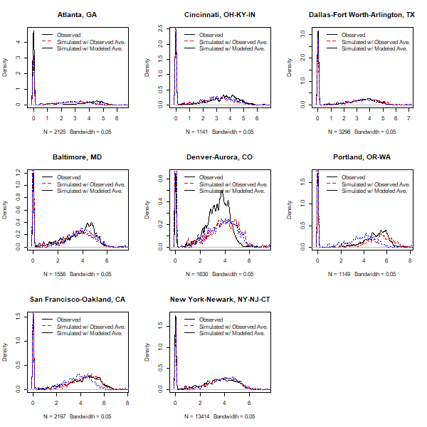

**Figure 16. Comparison of Simulated Distributions of D4c Values Using Modeled Values of Average D4c for Selected Urbanized Areas**


## User Inputs
This module has no user input requirements.

## Datasets Used by the Module
This module uses no datasets that are in the datastore.

## Datasets Produced by the Module
This module produces no datasets to store in the datastore.
