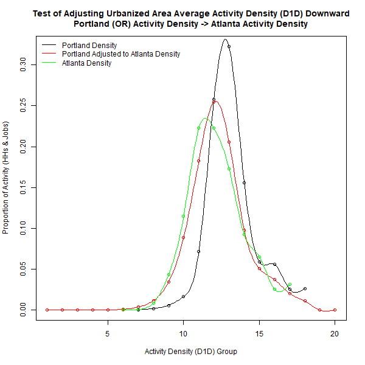
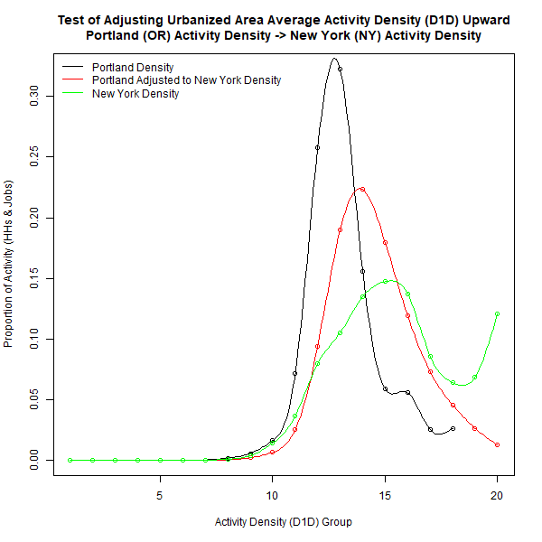

# CreateSimBzones Module
### November 25, 2018

This module synthesizes Bzones and their land use attributes as a function of Azone characteristics as well as data derived from the US Environmental Protection Agency's Smart Location Database (SLD) augmented with US Census housing and household income data, and data from the National Transit Database. Details on these data are included in the VESimLandUseData package. The combined dataset contains a number of land use attributes at the US Census block group level. The goal of Bzone synthesis to generate a set of SimBzones in each Azone that reasonably represent block group land use characteristics given the characteristics of the Azone, the Marea that the Azone is a part of, and scenario inputs provided by the user.

Many of the models and procedures used in Bzone synthesis pivot from profiles developed from these data sources for specific urbanized areas, as well as more general profiles for different urbanized area population size categories, towns, and rural areas. Using these specific and general profiles enables the simulated Bzones (SimBzones) to better represent the areas being modeled and the variety of conditions found in different states. The documentation for the `Initialize` module has a listing of urbanized area profile names.

The models and procedures in this module create SimBzones within each Azone that simulate the land use characteristics of neighborhoods likely to be found in the Azone. The SimBzones are assigned quantities of households and jobs and are attributed with several land use measures in the process. The characteristics are:

* **Location Type**: Identification of whether the SimBzone is located in an urbanized area, a town (i.e. an urban-type area that is not large enough to be urbanized), rural (i.e. dispersed low-density development)

* **Households**: Number of households in each SimBzone

* **Employment**: Number of jobs in each SimBzone

* **Activity Density**: Number of households and jobs per acre

* **Land Use Diversity**: Measures of the degree of mixing of households and jobs

* **Destination Accessibility**: Measures of proximity to households and jobs

## Model Parameter Estimation

The process of developing SimBzones proceed in a series of steps. Model parameters are developed for each step. In a number of cases the parameters take the form of specific urbanized area or more general profiles.

### Calculate the Number of Households by Azone and Location Type

This procedure is driven by user inputs and does not have any model parameters. The user specifies the proportions of households by location type (urban, town, rural) for each Azone. These proportions are used to calculate the number of households in the Azone that are assigned to each location type.

### Calculate the Number of Jobs by Azone and Location Type

This procedure is driven by user inputs and does not have any model parameters. The user specifies where workers residing in the Azone work in terms of the proportional distribution of location types. Furthermore, the user specifies the proportion of urbanized area jobs in the Marea that the Azone is associated with that are in the Azone.

### Create SimBzones by Azone and Location Type

SimBzones are created to have roughly equal activity totals (households and jobs). The total activity in each Azone and location type is divided by median value calculated for block groups of that location type from the SLD data. The following table shows the median values by location type:

|Location Type | Median Activity Amount|
|:-------------|----------------------:|
|Urban         |                    747|
|Town          |                    802|
|Rural         |                    688|

The total amount of activity in each location type of the Azone is divided by the corresponding numbers in the table to arrive at the number of SimBzones by location type. Fractional remainders are allocated randomly among the SimBzones in each location type to get whole number amounts.

### Assign an Activity Density to Each SimBzone

Activity density (households and jobs per acre) is the key characteristic which drives the synthesis of all SimBzone characteristics. This measure is referred to as D1D in the SLD. The overall activity density of each location type in each Azone is determined by the allocations of households and jobs described above and user inputs on the areal extents of development. The activity density of SimBzones is determined by the overall density and by density distribution characteristics reflective of the area. Density distribution profiles developed for areas as noted above are used in the process.

The distribution of activity density by block group is approximately lognormally distributed. This distribution is related to the overall density of the area. As the overall density increases, the density distribution shifts to the right. This is illustrated in the following figure which shows distributions for 9 urbanized areas having a range of overall densities from the least dense (Atlanta, GA) to the most dense (New York, NY). In each panel of the figure, the probability density of the activity density distribution of block groups in the urbanized area are shown by the solid line. The distribution for all urbanized areas is shown by the dashed line. As can be seen, as the overall density of the urbanized area increases the density distribution shifts to the right.

The characterization of activity density distributions is simplified by discretizing activity density values. The profile for each area is a combination of the proportion of activity at each level and the average density at each level. Levels for urbanized areas are created by dividing the lognormal distribution of activity density for all urbanized areas in the SLD into 20 equal intervals. Activity density levels for town and for rural areas are established in the same way. The following figure shows the distribution of urbanized area activity by activity density level and the average activity density at each level.

Profiles like those show in the figure are developed for each of the urbanized areas listed above, for each urbanized area size category, for towns (as a whole), and for rural areas (as a whole).

The model adjusts the profile for an area as a function of the overall activity density of the area. This is a 2-step mechanistic process. In the first step, the proportions of activity in each level are adjusted until the overall density for the area calculated from the proportion of activity in each level and the average density of each level is within 1% of the target density. The proportion of activity at each level is adjusted in a series of increments by calculating a weighted average of the proportion at each level and the proportion at each level to the right or left. In each increment, 99% of the level value is added to 1% of the adjacent level value and then the results are divided by the sum of all level values so that the proportions for all levels sum to 1. When the overall density is within 10% of the target density, the weights are changed to 99.9% and 0.1%. In this way, the distribution of activity by density level is smoothly shifted to the right or left. In the second step, the average density of all levels is adjusted so that the target density is matched exactly. The following two figures illustrate the results of this process for adjusting activity distributions using hypothetical scenarios where the overall density of the Portland (Oregon) urbanized area decreases to be the same as Atlanta and where the overall density of Portland increases to be the same as New York.

Activity density profiles are developed from the SLD for each of the urbanized areas listed above, as well as each urbanized area size category, for towns (as a whole), and rural areas (as a whole).

### Assign a Jobs and Housing Mix Level to Each SimBzone

The ratio of jobs to housing (D2A_JPHH in the SLD) at the block group level, like the distribution of activity density, is approximately lognormally distributed. However, unlike the activity density distribution, the distribution of the jobs to housing ratio has no apparent relationship with the overall activity density of the area. Is can be seen in the following figure which compares distributions for 9 urbanized areas.

As can be seen from the figure, the distributions for all of the areas are very similar to the distribution for all urbanized areas. There are, however, some differences that need to be accounted for. For example, the distribution of for the Portland (Oregon) urbanized area is more compressed with a much higher peak at the center of the distribution. This indicates that the jobs to housing ratio is closer to 1 for a much larger portion of block groups in that urbanized area than in other urbanized areas. The distribution for the San Francisco - Oakland urbanized area is similar. On the other hand, the distribution for the Dallas - Fort Worth - Arlington urbanized area is more spread out, indicating more segregation of jobs and households at the block group level.

Differences among urbanized areas are accounted for by developing individual area profiles. As with activity density, these profiles are simplified by discretizing the D2A_JPHH variable into the following 5 activity mix levels:

* **primarily-hh**: from 0 to 4 households per job

* **largely-hh**: less than 4 households to 2 households per job

* **mixed**: less than 2 households per job to 2 jobs per household

* **largely-job**: greater than 2 jobs per household to 4 jobs per household

* **primarily-job**: greater than 4 jobs per household

Areas are profiled according to the distribution of activity among activity mix levels at each activity density level. In this way, the SimBzones created for an area can reasonably reflect observed conditions, and when a scenario having a different overall density is modeled, the joint distribution of activity density and mix will be a sensible result. The following figure illustrates the activity mix distributions by activity density level for urbanized areas as a whole. This figure is a visual representation of a matrix where the rows correspond to activity mix levels and the columns correspond to activity density levels. The values in each cell of the matrix are the proportion of activity at the activity density level that is in the activity mix level (values in each column sum to 1). The value of each cell is represented by the color where yellow represents the highest proportion and black the lowest.

Several patterns in the relationship between activity density and mixing. Ignoring for now the lowest activity density levels, the jobs proportion of activity increases as activity density increases. Jobs dominate at the highest activity densities. This is consistent with the bid rent theory of spatial location. Businesses value higher density (more central) locations more highly than households and so outbid households for those locations. The greatest degree of activity mixing occurs in the 3rd quarter of the density range. There is no clear pattern at the lowest density levels which are represented by a very small number of block groups.

the relationship between activity density and activity mix varies by metropolitan area as illustrated in the following figure which compares values for the 9 example urbanized areas. For example, it can be seen that jobs and housing are much more segregated in the Atlanta area than in the San Francisco-Oakland area.

Profiles illustrated in the preceding figures are developed for each of the urbanized areas listed above, for each urbanized area size category, and for towns (as a whole), and rural areas (as a whole). These are used by the module to assign a activity mix level to each SimBzone based on the activity density of the SimBzone.

### Split SimBzone Activity Between Jobs and Households

The process of splitting the activity of each SimBzone between jobs and households is done in 2 steps. In the first step an initial value for the jobs proportion of activity is selected by sampling from distributions associated with each activity mix level. In the second step, a balancing process is use to so that the distribution of jobs and households among SimBzones in an area is consistent with the control totals of jobs and households by Azone and location type.

The 1st step uses tabulations from the SLD of the numbers of block groups by employment proportion for each activity mix level. Those tabulations are converted into proportions of block groups that are then used as sampling distributions from which to choose an initial employment proportion based on the activity mix level of the SimBzone. The following figure shows the probability distributions of jobs proportions by activity mix levels. These are the sample distributions used to determine the initial jobs proportion for SimBzones located in urbanized areas. Similar sampling distributions are tabulated from the SLD for town locations and for rural locations.

## How the Module Works

## User Inputs
This module has no user input requirements.

## Datasets Used by the Module
This module uses no datasets that are in the datastore.

## Datasets Produced by the Module
This module produces no datasets to store in the datastore.
