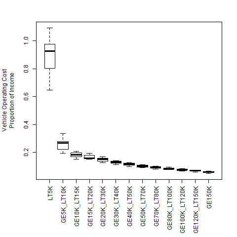
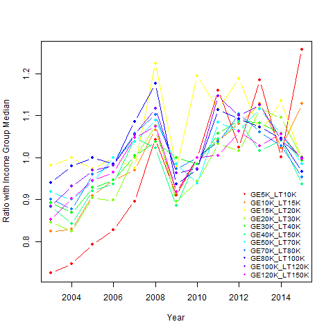
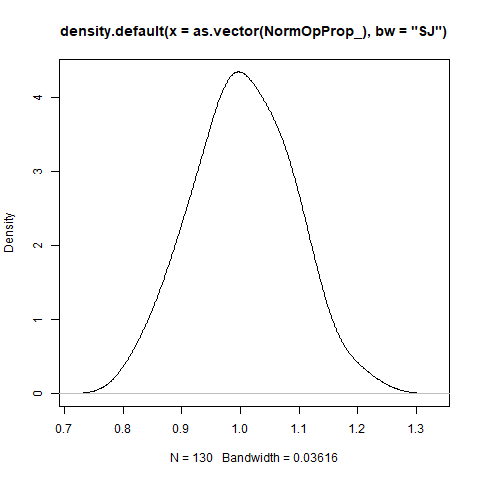
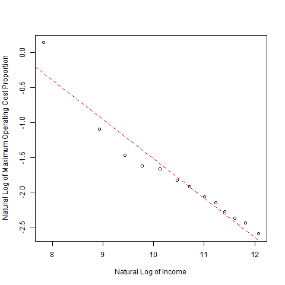
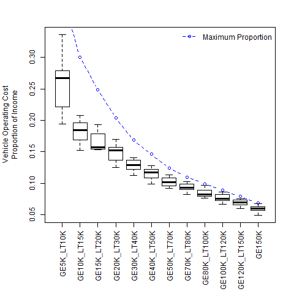

# BudgetHouseholdDvmt Module
### January 23, 2019

This module adjusts average household DVMT to keep the quantity within the limit of the household vehicle operating cost budget. A linear regression model is applied to calculate the maximum proportion of income that the household is willing to pay for vehicle operations. This proportion is multiplied by household income (with adjustments explained below) to calculate the maximum amount the household is willing to spend. This is compared to the vehicle operating cost calculated for the household. If the household vehicle operating cost is greater than the maximum amount the household is willing to pay, the household DVMT is reduced to fit within the budget.

## Model Parameter Estimation

This section describes the estimation of a model to calculate the maximum proportion of household income a household is willing to pay to operate vehicles used by the household. The model is estimated from aggregate data on consumer expenditures published by the U.S. Bureau of Labor Statistics (BLS) collected in the (Consumer Expenditure Survey). The CES data used to estimate the model are included in the 'ces_vehicle_op-cost.csv' file. Documentation of that file is included in the 'ces_vehicle_op-cost.txt' file. The 'ces.R' R script file contains the code used to download the raw CES dataset from the BLS website and process it to produce the dataset in the 'ces_vehicle_op-cost.csv' file.

The CES data document average household expenditures by expenditure category and demographic category. Transportation expenditure categories are:

* New car and truck purchases
* Used car and truck purchases
* Other vehicle purchases
* Gasoline, other fuels, and motor oil
* Vehicle finance charges
* Maintenance and repairs
* Vehicle insurance
* Vehicle rental, leases, licenses, and other charges
* Public and other transportation

Expenditures in the 'gasoline, other fuels, and motor oils', 'matenance and repairs', and 'vehicle rental, leases, licenses, and other charges' categories are used to represent the vehicle operating cost budget. Following are description of costs in these categories:

1. Gasoline and motor oil includes gasoline, diesel fuel, and motor oil.

2. Maintenance and repairs includes tires, batteries, tubes, lubrication, filters, coolant, additives, brake and transmission fluids, oil change, brake work including adjustment, front-end alignment, wheel balancing, steering repair, shock absorber replacement, clutch and transmission repair, electrical system repair, exhaust system repair, body work and painting, motor repair, repair to cooling system, drive train repair, drive shaft and rear-end repair, tire repair, audio equipment, other maintenance and services, and auto repair policies.

3. Vehicle rental, leases, licenses, and other charges includes leased and rented cars, trucks, motorcycles, and aircraft; inspection fees; State and local registration; driver's license fees; parking fees; towing charges; tolls; and automobile service clubs.

Annual average expenditures (in nominal dollars) are tabulated by demographic category. Household income categories were used for estimating the budget model. Table 1 shows the income categories, abbreviations used for them, and midpoint values used in model estimation.

| Abbreviation | Annual Before Tax Income | Midpoint Value |
|---|---|---|
| LT5K | Less than $5,000 | $2,499.50 |
| GE5K_LT10K | $5,000 - $9,999 | $7,499.50 |
| GE10K_LT15K | $10,000 - $14,999 | $12,499.50 |
| GE15K_LT20K | $15,000 - $19,999 | $17,499.50 |
| GE20K_LT30K | $20,000 - $29,999 | $24,999.50 |
| GE30K_LT40K | $30,000 - $39,999 | $34,999.50 |
| GE40K_LT50K | $40,000 - $49,999 | $44,999.50 |
| GE50K_LT70K | $50,000 - $69,999 | $59,999.50 |
| GE70K_LT80K | $70,000 - $79,999 | $74,999.50 |
| GE80K_LT100K | $80,000 - $99,999 | $89,999.50 |
| GE100K_LT120K | $100,000 - $119,999 | $109,999.50 |
| GE120K_LT150K | $120,000 - $149,999 | $134,999.50 |
| GE150K | $150,000 or more | $174,999.50 |

**Table 1. CES Income Categories and Abbreviations and Midpoint Values Used in Analysis**

CES data for the years from 2003 to 2015 are used in model estimation. 2003 is the first year that the BLS included income subcategories for incomes greater than $70,000. 2015 was the last year for which data were complete when the data were accessed.
The ratios of average operating cost to average income are calculated by dividing the average operating cost by the income midpoint value for each income group. Since both operating cost and income are in nominal dollars, the result is the proportion of income spent on vehicle operating cost by income group and year. Figure 1 shows the distribution of values by income group over the period from 2003 to 2015.



**Figure 1. Proportion of Household Income Spent on Vehicle Operating Cost by Income Group for the Years 2003 - 2015**

The values for the lowest income group look unreasonably high and are dropped from further use in developing the model. The values for the highest income group are also dropped because the actual median income for the group is unknown.

The operating cost proportions are normalized by the median proportion for each income group to enable the data to be pooled to compute the budget limit. Figure 2 shows the normalized values by income group over the period. It can be seen that the normalized values for all but the GE5K_LT10K income group follow the same trajectories and have similar values distributions. These are used to develop the model.



**Figure 2. Normalized Operating Cost Proportion Trends by Income Group**

The distribution of the pooled normalized operating cost data are shown in Figure 3. The distribution is calculated using the R 'density' kernal density estimation function assuming a gaussian probability density function and a bandwidth which implements the methods of Sheather & Jones (1991). The maximum normalized operating cost ratio is calculated as the value that is 3 standard deviations above the mean. The maximum operating cost ratio for each income group is then calculated by multiplying the median operating cost ratio by this maximum normalized ratio.



**Figure 3. Probability Distribution of Pooled Normalized Operating Cost Ratios**

A log-log linear model is estimated to predict the maximum operating cost ratio as a function of household income. Table 2 shows the model summary statistics. Figure 4 compares the model with the calculated maximum operating cost ratios.

```

Call:
lm(formula = LogMaxProp ~ LogInc)

Residuals:
     Min       1Q   Median       3Q      Max 
-0.26743 -0.07002  0.02148  0.05914  0.44263 

Coefficients:
            Estimate Std. Error t value Pr(>|t|)    
(Intercept)  4.09804    0.46071   8.895 2.35e-06 ***
LogInc      -0.56182    0.04363 -12.876 5.62e-08 ***
---
Signif. codes:  0 '***' 0.001 '**' 0.01 '*' 0.05 '.' 0.1 ' ' 1

Residual standard error: 0.1878 on 11 degrees of freedom
Multiple R-squared:  0.9378,	Adjusted R-squared:  0.9321 
F-statistic: 165.8 on 1 and 11 DF,  p-value: 5.621e-08

```

**Table 2. Summary Statistics for Log-Log Model of Maximum Operating Cost Ratio**



**Figure 4. Comparison of Log-Log Model of Maximum Operating Cost Ratio**

Finally, Figure 5 compares the predicted maximum operating cost ratio for each income group (excluding the lowest income group) with the distributions of operating cost ratios for the period from 2003 to 2015 for each income group.



**Figure 5. Comparison of Maximum Operating Cost Ratio by Income with Observed Operating Cost Ratios**

## How the Module Works

The module calculates the household operating cost budget and adjusts household travel to fit within the budget in the following steps:

* The model for calculating the maximum proportion of household income to be spent on vehicle operating cost is applied.

* Household income adjustments are made for the purpose of calculating the maximum operating cost as follows:

  * For workers in a parking cash-out program, their annual work parking costs (calculated by the 'AssignParkingRestrictions' module) are added to household income.

  * For households assigned to pay-as-you-drive insurance, their annual vehicle insurance cost (calculated by the 'CalculateVehicleOwnCost' module) are added to household income.

  * For households that substitute car service vehicle(s) for owned vehicle(s), the annual ownership cost savings (calculated by the 'AdjustVehicleOwnership' module) are added to household income.

* The adjusted household income is multiplied by the maximum operating cost proportion to calculate the household operating cost budget.

* The CalculateHouseholdDvmt module is run to calculate household DVMT.

* The modeled DVMT is compared to the maximum DVMT that the household would travel given the calculated operating cost budget and the average operating cost per vehicle mile calculated by the 'CalculateVehicleOperatingCost' module. If the modeled DVMT is greater than the DVMT that could be traveled within the household budget, the DVMT which fits the budget is substituted for the modeled DVMT. The ApplyDvmtReductions models are run to adjust household DVMT to account for travel demand management programs and user assumptions regarding diversion of single-occupant vehicle travel to bicycles, electric bicycles, scooters, etc.

* The 'CalculateVehicleTrips' and 'CalculateAltModeTrips' modules are run to calculate the number of household vehicle trips and alternative mode trips (walk, bike, transit) to be consistent with the adjusted DVMT.


## User Inputs
This module has no user input requirements.

## Datasets Used by the Module
The following table documents each dataset that is retrieved from the datastore and used by the module. Each row in the table describes a dataset. All the datasets must be present in the datastore. One or more of these datasets may be entered into the datastore from the user input files. The table names and their meanings are as follows:

NAME - The dataset name.

TABLE - The table in the datastore that the data is retrieved from.

GROUP - The group in the datastore where the table is located. Note that the datastore has a group named 'Global' and groups for every model run year. For example, if the model run years are 2010 and 2050, then the datastore will have a group named '2010' and a group named '2050'. If the value for 'GROUP' is 'Year', then the dataset will exist in each model run year group. If the value for 'GROUP' is 'BaseYear' then the dataset will only exist in the base year group (e.g. '2010'). If the value for 'GROUP' is 'Global' then the dataset will only exist in the 'Global' group.

TYPE - The data type. The framework uses the type to check units and inputs. Refer to the model system design and users guide for information on allowed types.

UNITS - The units that input values need to represent. Some data types have defined units that are represented as abbreviations or combinations of abbreviations. For example 'MI/HR' means miles per hour. Many of these abbreviations are self evident, but the VisionEval model system design and users guide should be consulted.

PROHIBIT - Values that are prohibited. Values in the datastore do not meet any of the listed conditions.

ISELEMENTOF - Categorical values that are permitted. Values in the datastore are one or more of the listed values.

|NAME           |TABLE     |GROUP |TYPE      |UNITS    |PROHIBIT |ISELEMENTOF        |
|:--------------|:---------|:-----|:---------|:--------|:--------|:------------------|
|HhId           |Household |Year  |character |ID       |NA       |                   |
|HhSize         |Household |Year  |people    |PRSN     |NA, <= 0 |                   |
|Income         |Household |Year  |currency  |USD.2001 |NA, < 0  |                   |
|LocType        |Household |Year  |character |category |NA       |Urban, Town, Rural |
|AveVehCostPM   |Household |Year  |currency  |USD.2001 |NA, < 0  |                   |
|OwnCostSavings |Household |Year  |currency  |USD.2001 |NA, < 0  |                   |
|HasPaydIns     |Household |Year  |integer   |binary   |         |0, 1               |
|AveGPM         |Household |Year  |compound  |GGE/MI   |NA, < 0  |                   |
|AveKWHPM       |Household |Year  |compound  |KWH/MI   |NA, < 0  |                   |
|AveCO2ePM      |Household |Year  |compound  |GM/MI    |NA, < 0  |                   |
|HhId           |Worker    |Year  |character |ID       |NA       |                   |
|IsCashOut      |Worker    |Year  |integer   |binary   |         |0, 1               |
|ParkingCost    |Worker    |Year  |currency  |USD.2001 |NA, < 0  |                   |
|PaysForParking |Worker    |Year  |integer   |binary   |         |0, 1               |
|HhId           |Vehicle   |Year  |character |ID       |NA       |                   |
|InsCost        |Vehicle   |Year  |currency  |USD.2001 |NA, < 0  |                   |

## Datasets Produced by the Module
The following table documents each dataset that is retrieved from the datastore and used by the module. Each row in the table describes a dataset. All the datasets must be present in the datastore. One or more of these datasets may be entered into the datastore from the user input files. The table names and their meanings are as follows:

NAME - The dataset name.

TABLE - The table in the datastore that the data is retrieved from.

GROUP - The group in the datastore where the table is located. Note that the datastore has a group named 'Global' and groups for every model run year. For example, if the model run years are 2010 and 2050, then the datastore will have a group named '2010' and a group named '2050'. If the value for 'GROUP' is 'Year', then the dataset will exist in each model run year. If the value for 'GROUP' is 'BaseYear' then the dataset will only exist in the base year group (e.g. '2010'). If the value for 'GROUP' is 'Global' then the dataset will only exist in the 'Global' group.

TYPE - The data type. The framework uses the type to check units and inputs. Refer to the model system design and users guide for information on allowed types.

UNITS - The units that input values need to represent. Some data types have defined units that are represented as abbreviations or combinations of abbreviations. For example 'MI/HR' means miles per hour. Many of these abbreviations are self evident, but the VisionEval model system design and users guide should be consulted.

PROHIBIT - Values that are prohibited. Values in the datastore do not meet any of the listed conditions.

ISELEMENTOF - Categorical values that are permitted. Values in the datastore are one or more of the listed values.

DESCRIPTION - A description of the data.

|NAME         |TABLE     |GROUP |TYPE     |UNITS    |PROHIBIT |ISELEMENTOF |DESCRIPTION                                                                                                          |
|:------------|:---------|:-----|:--------|:--------|:--------|:-----------|:--------------------------------------------------------------------------------------------------------------------|
|Dvmt         |Household |Year  |compound |MI/DAY   |NA, < 0  |            |Average daily vehicle miles traveled by the household in autos or light trucks                                       |
|UrbanHhDvmt  |Marea     |Year  |compound |MI/DAY   |NA, < 0  |            |Average daily vehicle miles traveled in autos or light trucks by households residing in urban locations of the Marea |
|RuralHhDvmt  |Marea     |Year  |compound |MI/DAY   |NA, < 0  |            |Average daily vehicle miles traveled in autos or light trucks by households residing in rural locations of the Marea |
|TownHhDvmt   |Marea     |Year  |compound |MI/DAY   |NA, < 0  |            |Average daily vehicle miles traveled in autos or light trucks by households residing in town locations of the Marea  |
|DailyGGE     |Household |Year  |compound |GGE/DAY  |NA, < 0  |            |Gasoline equivalent gallons consumed per day by household vehicle travel                                             |
|DailyKWH     |Household |Year  |compound |KWH/DAY  |NA, < 0  |            |Kilowatt-hours consumed per day by household vehicle travel                                                          |
|DailyCO2e    |Household |Year  |compound |GM/DAY   |NA, < 0  |            |Grams of carbon-dioxide equivalents produced per day by household vehicle travel                                     |
|WalkTrips    |Household |Year  |compound |TRIP/YR  |NA, < 0  |            |Average number of walk trips per year by household members                                                           |
|BikeTrips    |Household |Year  |compound |TRIP/YR  |NA, < 0  |            |Average number of bicycle trips per year by household members                                                        |
|TransitTrips |Household |Year  |compound |TRIP/YR  |NA, < 0  |            |Average number of public transit trips per year by household members                                                 |
|VehicleTrips |Household |Year  |compound |TRIP/DAY |NA, < 0  |            |Average number of vehicle trips per day by household members                                                         |
