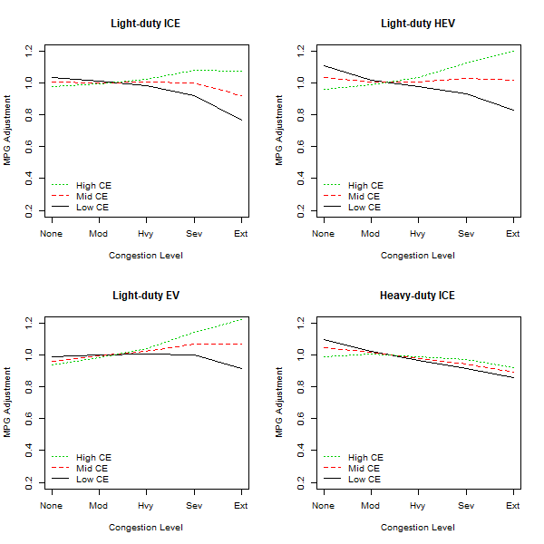
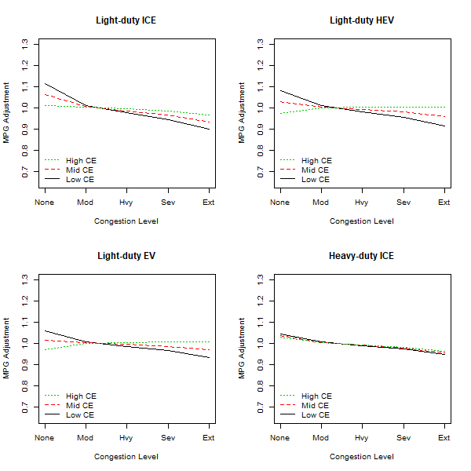
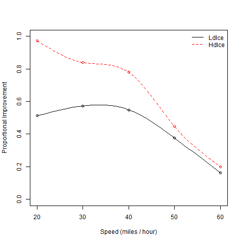

# CalculateMpgMpkwhAdjustments Module
### January 23, 2019

This module calculates adjustments to fuel economy and electric energy efficiency (for plug-in vehicles) resulting from traffic congestion, speed smoothing (i.e. active traffic management which reduces speed variation), and eco-driving. Eco-driving is the practice of driving in ways that increase fuel economy and reduce carbon emissions.

## Model Parameter Estimation

This module calculates adjustments to the average fuel economy of internal combustion engine vehicles and the average electric energy efficiency of plug in vehicles. Adjustments are made in response to congestion, speed smoothing, and eco-driving.

#### Model of the Effects of Speed on Fuel Economy

Congestion adjustments use a fuel-speed curve methodology that is based on research by Alex Bigazzi and Kelly Clifton documented in "Refining GreenSTEP: Impacts of Vehicle Technologies and ITS/Operational Improvements on Travel Speed and Fuel Consumption Curves Final Report on Task 1: Advanced Vehicle Fuel-Speed Curves", November 2011. (A copy of this report is included in the inst/extdata/sources directory of this package.) Among other things, this research developed a set of models which calculate adjustments to the average fuel economy of vehicles as a function of the vehicle type (light-duty, heavy-duty), the vehicle powertrain (ICE, HEV, EV), and the road type (freeway, arterial). These models are applied to the results of urban congestion analysis by the CalculateRoadPerformance module (DVMT by road type and congestion level, average speed by road type and congestion level) to calculate proportional adjustments to vehicle fuel economy (or energy efficiency for electric vehicles) that reflect the effects of congestion on different vehicle types and powertrains. Following is a brief summary of the methodology detailed in the report. Note that when the term 'fuel economy' is used in the context of electric vehicles, it means the energy efficiency of the electric vehicle (i.e. miles per kilowatt-hour).

The US Environmental Protection Agency's (EPA) PERE model is used to model the fuel economy and energy efficiency relationships with travel speed for the vehicle types listed above. The PERE model was developed by the EPA to fill in gaps in fuel consumption rate data for advanced technology vehicles that are not addressed by EPA's MOVES model and to help project future emissions. The PERE model takes as inputs driving cycle data (i.e. second-by-second speed and time data reflecting a realistic driving pattern) and general vehicle characteristics and calculates the power requirements of the vehicle over the drive cycle. Power requirements are measured in terms of vehicle-specific power (VSP) which is the power required to move the vehicle divided by the mass of the vehicle. The second-by-second results are aggregated into VSP bins. The PERE model then calculates the energy consumption by VSP based on the powertrain type and the characteristics of the powertrain (e.g. engine displacement). The average fuel economy for the drive cycle is calculated from the energy consumption by VSP bin and the amount of drive time by VSP bin.

145 vehicle configurations for the following 5 vehicle and powertrain types are modeled using the PERE model:

* Light-duty internal combustion engine vehicle (LdIce)

* Light-duty hybrid electric vehicle (LdHev)

* Light-duty electric vehicle (LdEv)

* Light-duty fuel cell vehicle (LdFcv)

* Heavy-duty internal combustion engine vehicle (HdIce)

Note that the fuel cell vehicle type is not currently included in the VisionEval model. Also note that plug-in hybrid electric (PHEV) vehicles are not analyzed. These are treated in VisionEval model as combination HEV and EV vehicles and they have both an MPG rating (similar to HEV) and an MPKWH rating (similar to EV). The HEV and EV adjustment factors are applied to the respective components.

The PERE model is used to model the fuel economy of each of the vehicle configurations using several drive cycles including a number of drive cycles that are incorporated in the MOVES model, EPA test drive cycles used to calculate average fuel economy, and a drive cycle using data collected on 59 probe vehicle runs on a Portland (OR) area freeway. Since each of the drive cycles is associated with an overall average trip speed, the relationship between between average trip speed (rather than instantaneous speed) and fuel consumption by vehicle type and facility type (freeway, arterial) can be determined. This relationship is commonly referred to as a fuel-speed curve (FSC) and is modeled as an exponentiated 4th order polynomial relationship with speed. An iteratively reweighted least squares (IWLS) method was used to fit the model coefficients.

Since VisionEval includes average fuel economy estimates by vehicle type and model year, the FSCs must be transformed to represent the relationship between speed and fuel economy relative to average fuel economy. This is done using reference average speeds corresponding to the EPA test cycles used to estimate average fuel economy. The reference speed of the Highway Fuel Economy Test or HFET (48.2 MPH) is used to normalize freeway FSCs. This corresponds to a speed associated with moderate to heavy freeway congestion (Table 1 of CalculateRoadPerformance module documentation). Normalization is carried out by dividing the exponentiated polynomial expression for the FSC by the value of that expression at the reference speed. A modified method is used to normalize the arterial FSC because the EPA city fuel economy test cycle includes driving on lower speed minor roads as well as arterials so the reference speed is too low to reflect average arterial driving conditions. Instead a reference arterial speed was selected to reflect the same level of arterial congestion as the freeway reference speed (moderate to heavy), 24.4 MPH.

The normalized FSCs are summarized for each of the 5 vehicle types and roadway types by identifying from the sample set of vehicles of the type the vehicles that perform best and worst in congestion on the roadway type. Relative congestion performance is calculated as the percentage difference in fuel economy in congested conditions vs. uncongested conditions. The fuel-speed response is selected within the range by specifying a relative congestion efficiency in the range of 0 to 1 where a value of 0 selects the worst congestion response curve and a value of 1 selects the best congestion response curve. For values in between 0 and 1, the reponse is calculated by linearly interpolating between the worst and best response curves.

Figure 1 illustrates the the effect of congestion on the relative fuel economy of different vehicle types traveling on freeways. Each chart shows the fuel economy response at the lowest congestion efficiency, the highest congestion efficiency, and mid-level congestion efficiency. The curves were generated by applying the speeds from the first column of Table 1 of the CalculateRoadPerformance module documentation. It can be seen from all the LDV plots that there is a considerable amount of variation in congestion response at higher levels of congestion. Looking at the middle congestion efficiency plots it can be seen that relative fuel economy for light-duty ICE vehicles changes little with congestion except at high levels where it declines. The relative fuel economy of light-duty HEVs changes very little across the range of congestion levels. For light-duty EVs, relative fuel economy increases with congstion. Finally, for heavy-duty ICE vehicles, relative fuel economy decreases at a fairly constant rate as congestion increases.

**Figure 1. Fuel Economy Relative to Average by Congestion Level and Vehicle Type on Freeways**

Figure 2 illustrates the the effect of congestion on the relative fuel economy of different vehicle types traveling on arterials. As can be seen, there is a greater response to congestion on arterials than freeways. That is because arterial speeds are slower than freeway speeds and fuel economy declines at an increasing rate as speed decreases. The relative fuel economy of the midpoint congestion efficiency vehicle declines for all vehicle types but the amount of decline is greater for vehicles with ICE powertrains than HEVs and EVs.

**Figure 2. Fuel Economy Relative to Average by Congestion Level and Vehicle Type on Arterials**

### Speed Smoothing and Eco-driving Model

Speed smoothing through active traffic management and eco-driving practices reduce fuel consumption by reducing acceleration and deceleration losses. The method for calculating the effects is based on research by Bigazzi and Clifton documented in "Refining GreenSTEP: Impacts of Vehicle Technologies and ITS/Operational Improvements on Travel Speed and Fuel Consumption Curves Final Report on Task 2: Incorporation of Operations and ITS Improvements", November 2011." (A copy of this report is included in the inst/extdata/sources directory of this package.) Following is a brief summary of the methodology.

The speed smoothing and eco-driving adjustments to fuel economy only address the effects of reducing speed variation (i.e. reducing acceleration and deceleration events). The methodology does not account for other improvements to fuel economy that eco-driving practices can make such as proper tire inflation, regular maintenance, and reducing the vehicle payload. Moreover, speed smoothing and eco-driving adjustments are only made to vehicles having internal combustion engine powertrains because they are much more affected by acceleration and deceleration losses that HEVs and EVs which use more efficient electric motors to accelerate and which recover energy when decelerating with regenerative braking.

Theoretical maximum improvements in fuel economy with speed-smoothing and eco-driving were calculated by modeling fuel consumption at constant speeds using the PERE model and comparing the results with the drive-cycle results. Table 1 shows the the resulting theoretical maximum improvements in fuel economy by speed for light-duty and heavy-duty ICE vehicles. It can be seen that the lower the speed, the greater the potential for improving fuel economy with speed smoothing.

| Speed|     LdIce|     HdIce|
|-----:|---------:|---------:|
|    20| 0.5118479| 0.9730198|
|    30| 0.5733484| 0.8401800|
|    40| 0.5490454| 0.7795904|
|    50| 0.3762066| 0.4492664|
|    60| 0.1632502| 0.1996938|

**Table 1. Maximum theoretical proportional improvement in fuel economy from speed smoothing by speed**

The fuel economy improvements that are achieveable in practice are substantially less than these maximums. The authors, based on review of the literature, conclude that it is reasonable to expect that speed smoothing through traffic management could achieve 50% of the benefits in Table 1, and that eco-driving could achieve 33% of the benefits on freeways and 21% of the benefits on arterials.

Spline curves are fit to the values in Table 1. These smooth splines are used by the module to estimate the maximum theoretical proportional improvement in fuel economy for any speed. Figure 1 shows the Table 1 values and fitted smooth splines.

**Figure 2. Maximum theoretical proportional improvement in fuel economy from speed smoothing by speed**

## How the Module Works

### Calculating the effects of modeled speeds on fuel economy
The module calculates fuel economy adjustments to fuel economy to reflect the effects of modeled travel speeds resulting from congestion. The calculations use marea urban road congestion calculation results from the CalculateRoadPerformance module including DVMT by vehicle type and road class, DVMT by road type and congestion level, and average speed by road type and congestion level. From these data and the congestion model described above, the module computes the proportional adjustments to average MPG and MPKWH by marea and vehicle and powertrain type. The vehicle and powertrain types are the ones identified in the CalculateRoadPerformance module documentation (LdIce, LdHev, LdEv, LdFcv, HdIce). It should be noted that the LdFcv (light-duty fuel cell vehicle) is not a current powertrain option in VisionEval. The steps in the calculation are as follows:

* An array of the modeled average speeds by congestion level for each marea and road class (freeway, arterial, other) is tabulated from the inputs. Since the CalculateRoadPerformance module does not calculate performance of 'other' roads, it is assumed that the speed is constant over all congestion levels (OthSpd in Marea table set by the CalculateRoadPerformance module).

* An array of the proportions of DVMT by congestion level for each marea and road class (freeway, arterial, other) is tabulated from the inputs. Since the CalculateRoadPerformance module does not calculate performance of 'other' roads, it is assumed that DVMT is split uniformly over all congestion levels.

* A list of DVMT proportions by marea and road class by vehicle type (Ldv, HvyTrk, Bus) is tabulated from the inputs.

* For each marea, the average fuel economy adjustment by vehicle powertrain type (LdIce, LdHev, LdEv, HdIce) is calculated as follows:

  * A matrix of fuel economy (FE) adjustments by congestion level and road class is calculated for the marea and powertrain type. For each road class, the relative FSC model coefficients are selected for the vehicle powertrain type and road class. The reference speed for the road class is selected as well. For the 'other' road class, the arterial coefficients are used and the reference speed is the constant speed established for other roads. The relative FSC model is applied to the average speeds by congestion for the road class in the marea to calculate fuel economy (FE) adjustments by congestion level. The result of applying the model to all road classes is a matrix of FE adjustments by congestion level and road class.

 * A corresponding matrix of the proportions of DVMT of the corresponding vehicle type (e.g. LdIce = LDV) by congestion level and road class are calculated from the values of DVMT by road class for the vehicle type and the proportions of DVMT by congestion level for each road class.

 * The values in the FE adjustment matrix are multiplied by the corresponding values in the DVMT proportions matrix and the results are summed to calculate an average FE adjustment for the vehicle powertrain type in the marea. This average value is used to adjust fuel economy on urban roadways in the marea.

 * In addition, an average FE adjustment value for travel at the 'None' congestion level is calculated from the FE adjustments by road class for the 'None' level and the proportions of DVMT for the vehicle type by road class. This average value is used to adjust fuel economy on non-urban roadways in the marea.

 * The FE adjustments are outputs to be saved to the datastore for use in the AdjustHhVehicleMpgMpkwh module, CalculateComEnergyAndEmissions module, and CalculatePtranEnergyAndEmissions module.

### Calculating the effects of speed smoothing and eco-driving

The module calculates average proportional improvement in fuel economy (FE) due to active traffic management on urban area freeways and arterials by marea and vehicle type (light-duty, heavy truck, bus). The calculations are sensitive to user inputs on the relative deployment of active traffic management on freeways and arterials by marea ('marea_speed_smooth_ecodrive.csv' file). The potentials for active traffic management on non-urban roads and on roads other than freeways and arterials are not evaluated. The module also calculates the average FE improvement for eco-drivers by marea and vehicle type. The potential benefit for eco-driving on urban area roads is calculated from the modeled speeds and DVMT split by congestion level and road class. The potential on non-urban roads is calculate from the speed data for uncongested roadways. It should also be noted that the the FE benefits only apply to internal combustion engine (ICE) vehicles. Following is a summary of the methodology:

* The calculations use the arrays of speeds and DVMT proportions by marea, congestion level, and road class, and the list of DVMT proportions by marea, road class, and vehicle type described in the previous section.

* The maximum theoretical benefits of speed smoothing and eco-driving for each vehicle type by marea, congestion level, and road class is calculated by applying the smooth-spline models described above to the speed data by marea, congestion level, and road class. For light-duty vehicles, the LdIce model is applied. For heavy trucks and buses, the HdIce model is applied. It is assumed that no-benefits accrue to roads other than freeways and arterials.

* The average fuel economy (FE) benefit of speed smoothing by marea and vehicle type is calculated as follows:

  * The maximum achieveable FE benefits are calculated by multiplying the maximum theoretical benefits by 0.5 (see model estimation section above).

  * The expected FE benefits are calculated by multiplying the maximum achieveable FE benefits for freeways and arterials by the respective user inputs for proportional deployment of speed smoothing on freeways and arterials by marea.

  * The average FE benefits by marea and vehicle type are calculated as a DVMT weighted average of the FE benefits by congestion level and road class for the marea and vehicle type.

* The average FE benefit of eco-driving is calculated for each marea and vehicle type as follows:

  * The achieveable FE benefits for eco-drivers is calculated by multiplying the maximum theoretical benefits for freeways and arterials by 0.33 and 0.21 respectively (see model estimation section).

  * The average achieveable FE benefits for eco-driving on urban roads by marea and vehicle type are calculated as a DVMT weighted average of the FE benefits by congestion level and road class for the marea and vehicle type. The average achieveable FE benefits for eco-driving on non-urban roads is calculated from the FE benefits on uncongested roads by road class and the DVMT by road class.

## User Inputs
The following table(s) document each input file that must be provided in order for the module to run correctly. User input files are comma-separated valued (csv) formatted text files. Each row in the table(s) describes a field (column) in the input file. The table names and their meanings are as follows:

NAME - The field (column) name in the input file. Note that if the 'TYPE' is 'currency' the field name must be followed by a period and the year that the currency is denominated in. For example if the NAME is 'HHIncomePC' (household per capita income) and the input values are in 2010 dollars, the field name in the file must be 'HHIncomePC.2010'. The framework uses the embedded date information to convert the currency into base year currency amounts. The user may also embed a magnitude indicator if inputs are in thousand, millions, etc. The VisionEval model system design and users guide should be consulted on how to do that.

TYPE - The data type. The framework uses the type to check units and inputs. The user can generally ignore this, but it is important to know whether the 'TYPE' is 'currency'

UNITS - The units that input values need to represent. Some data types have defined units that are represented as abbreviations or combinations of abbreviations. For example 'MI/HR' means miles per hour. Many of these abbreviations are self evident, but the VisionEval model system design and users guide should be consulted.

PROHIBIT - Values that are prohibited. Values may not meet any of the listed conditions.

ISELEMENTOF - Categorical values that are permitted. Value must be one of the listed values.

UNLIKELY - Values that are unlikely. Values that meet any of the listed conditions are permitted but a warning message will be given when the input data are processed.

DESCRIPTION - A description of the data.

### marea_speed_smooth_ecodrive.csv
|NAME           |TYPE   |UNITS      |PROHIBIT     |ISELEMENTOF |UNLIKELY |DESCRIPTION                                                                                                                                 |
|:--------------|:------|:----------|:------------|:-----------|:--------|:-------------------------------------------------------------------------------------------------------------------------------------------|
|Geo            |       |           |             |Mareas      |         |Must contain a record for each Marea and model run year.                                                                                    |
|Year           |       |           |             |            |         |Must contain a record for each Marea and model run year.                                                                                    |
|FwySmooth      |double |proportion |NA, < 0, > 1 |            |         |Fractional deployment of speed smoothing traffic management on freeways, where 0 is no deployment and 1 is the full potential fuel savings  |
|ArtSmooth      |double |proportion |NA, < 0, > 1 |            |         |Fractional deployment of speed smoothing traffic management on arterials, where 0 is no deployment and 1 is the full potential fuel savings |
|LdvEcoDrive    |double |proportion |NA, < 0, > 1 |            |         |Eco-driving penetration for light-duty vehicles; the fraction of vehicles from 0 to 1                                                       |
|HvyTrkEcoDrive |double |proportion |NA, < 0, > 1 |            |         |Eco-driving penetration for heavy-duty vehicles; the fraction of vehicles from 0 to 1                                                       |

## Datasets Used by the Module
The following table documents each dataset that is retrieved from the datastore and used by the module. Each row in the table describes a dataset. All the datasets must be present in the datastore. One or more of these datasets may be entered into the datastore from the user input files. The table names and their meanings are as follows:

NAME - The dataset name.

TABLE - The table in the datastore that the data is retrieved from.

GROUP - The group in the datastore where the table is located. Note that the datastore has a group named 'Global' and groups for every model run year. For example, if the model run years are 2010 and 2050, then the datastore will have a group named '2010' and a group named '2050'. If the value for 'GROUP' is 'Year', then the dataset will exist in each model run year group. If the value for 'GROUP' is 'BaseYear' then the dataset will only exist in the base year group (e.g. '2010'). If the value for 'GROUP' is 'Global' then the dataset will only exist in the 'Global' group.

TYPE - The data type. The framework uses the type to check units and inputs. Refer to the model system design and users guide for information on allowed types.

UNITS - The units that input values need to represent. Some data types have defined units that are represented as abbreviations or combinations of abbreviations. For example 'MI/HR' means miles per hour. Many of these abbreviations are self evident, but the VisionEval model system design and users guide should be consulted.

PROHIBIT - Values that are prohibited. Values in the datastore do not meet any of the listed conditions.

ISELEMENTOF - Categorical values that are permitted. Values in the datastore are one or more of the listed values.

|NAME                |TABLE |GROUP |TYPE      |UNITS      |PROHIBIT     |ISELEMENTOF |
|:-------------------|:-----|:-----|:---------|:----------|:------------|:-----------|
|Marea               |Marea |Year  |character |ID         |             |            |
|FwySmooth           |Marea |Year  |double    |proportion |NA, < 0, > 1 |            |
|ArtSmooth           |Marea |Year  |double    |proportion |NA, < 0, > 1 |            |
|LdvFwyDvmt          |Marea |Year  |compound  |MI/DAY     |NA, < 0      |            |
|LdvArtDvmt          |Marea |Year  |compound  |MI/DAY     |NA, < 0      |            |
|LdvOthDvmt          |Marea |Year  |compound  |MI/DAY     |NA, < 0      |            |
|HvyTrkFwyDvmt       |Marea |Year  |compound  |MI/DAY     |NA, < 0      |            |
|HvyTrkArtDvmt       |Marea |Year  |compound  |MI/DAY     |NA, < 0      |            |
|HvyTrkOthDvmt       |Marea |Year  |compound  |MI/DAY     |NA, < 0      |            |
|BusFwyDvmt          |Marea |Year  |compound  |MI/DAY     |NA, < 0      |            |
|BusArtDvmt          |Marea |Year  |compound  |MI/DAY     |NA, < 0      |            |
|BusOthDvmt          |Marea |Year  |compound  |MI/DAY     |NA, < 0      |            |
|FwyNoneCongSpeed    |Marea |Year  |compound  |MI/HR      |< 0          |            |
|FwyModCongSpeed     |Marea |Year  |compound  |MI/HR      |< 0          |            |
|FwyHvyCongSpeed     |Marea |Year  |compound  |MI/HR      |< 0          |            |
|FwySevCongSpeed     |Marea |Year  |compound  |MI/HR      |< 0          |            |
|FwyExtCongSpeed     |Marea |Year  |compound  |MI/HR      |< 0          |            |
|ArtNoneCongSpeed    |Marea |Year  |compound  |MI/HR      |< 0          |            |
|ArtModCongSpeed     |Marea |Year  |compound  |MI/HR      |< 0          |            |
|ArtHvyCongSpeed     |Marea |Year  |compound  |MI/HR      |< 0          |            |
|ArtSevCongSpeed     |Marea |Year  |compound  |MI/HR      |< 0          |            |
|ArtExtCongSpeed     |Marea |Year  |compound  |MI/HR      |< 0          |            |
|OthSpd              |Marea |Year  |compound  |MI/HR      |< 0          |            |
|FwyDvmtPropNoneCong |Marea |Year  |double    |proportion |< 0, > 1     |            |
|FwyDvmtPropModCong  |Marea |Year  |double    |proportion |< 0, > 1     |            |
|FwyDvmtPropHvyCong  |Marea |Year  |double    |proportion |< 0, > 1     |            |
|FwyDvmtPropSevCong  |Marea |Year  |double    |proportion |< 0, > 1     |            |
|FwyDvmtPropExtCong  |Marea |Year  |double    |proportion |< 0, > 1     |            |
|ArtDvmtPropNoneCong |Marea |Year  |double    |proportion |< 0, > 1     |            |
|ArtDvmtPropModCong  |Marea |Year  |double    |proportion |< 0, > 1     |            |
|ArtDvmtPropHvyCong  |Marea |Year  |double    |proportion |< 0, > 1     |            |
|ArtDvmtPropSevCong  |Marea |Year  |double    |proportion |< 0, > 1     |            |
|ArtDvmtPropExtCong  |Marea |Year  |double    |proportion |< 0, > 1     |            |

## Datasets Produced by the Module
The following table documents each dataset that is retrieved from the datastore and used by the module. Each row in the table describes a dataset. All the datasets must be present in the datastore. One or more of these datasets may be entered into the datastore from the user input files. The table names and their meanings are as follows:

NAME - The dataset name.

TABLE - The table in the datastore that the data is retrieved from.

GROUP - The group in the datastore where the table is located. Note that the datastore has a group named 'Global' and groups for every model run year. For example, if the model run years are 2010 and 2050, then the datastore will have a group named '2010' and a group named '2050'. If the value for 'GROUP' is 'Year', then the dataset will exist in each model run year. If the value for 'GROUP' is 'BaseYear' then the dataset will only exist in the base year group (e.g. '2010'). If the value for 'GROUP' is 'Global' then the dataset will only exist in the 'Global' group.

TYPE - The data type. The framework uses the type to check units and inputs. Refer to the model system design and users guide for information on allowed types.

UNITS - The units that input values need to represent. Some data types have defined units that are represented as abbreviations or combinations of abbreviations. For example 'MI/HR' means miles per hour. Many of these abbreviations are self evident, but the VisionEval model system design and users guide should be consulted.

PROHIBIT - Values that are prohibited. Values in the datastore do not meet any of the listed conditions.

ISELEMENTOF - Categorical values that are permitted. Values in the datastore are one or more of the listed values.

DESCRIPTION - A description of the data.

|NAME                  |TABLE  |GROUP |TYPE   |UNITS      |PROHIBIT |ISELEMENTOF |DESCRIPTION                                                                                                                      |
|:---------------------|:------|:-----|:------|:----------|:--------|:-----------|:--------------------------------------------------------------------------------------------------------------------------------|
|LdvSpdSmoothFactor    |Marea  |Year  |double |proportion |<= 0     |            |Proportional adjustment of light-duty internal combustion engine (ICE) vehicle MPG due to speed smoothing                        |
|HvyTrkSpdSmoothFactor |Marea  |Year  |double |proportion |<= 0     |            |Proportional adjustment of heavy truck internal combustion engine (ICE) vehicle MPG due to speed smoothing                       |
|BusSpdSmoothFactor    |Marea  |Year  |double |proportion |<= 0     |            |Proportional adjustment of bus internal combustion engine (ICE) vehicle MPG due to speed smoothing                               |
|LdvEcoDriveFactor     |Marea  |Year  |double |proportion |<= 0     |            |Proportional adjustment of light-duty internal combustion engine (ICE) vehicle MPG due to eco-driving                            |
|HvyTrkEcoDriveFactor  |Marea  |Year  |double |proportion |<= 0     |            |Proportional adjustment of heavy truck internal combustion engine (ICE) vehicle MPG due to eco-driving                           |
|BusEcoDriveFactor     |Marea  |Year  |double |proportion |<= 0     |            |Proportional adjustment of bus internal combustion engine (ICE) vehicle MPG due to eco-driving                                   |
|LdIceFactor           |Marea  |Year  |double |proportion |<= 0     |            |Proportional adjustment of light-duty internal combustion engine (ICE) vehicle MPG due to congestion                             |
|LdHevFactor           |Marea  |Year  |double |proportion |<= 0     |            |Proportional adjustment of light-duty hybrid-electric vehicle (HEV) MPG due to congestion                                        |
|LdEvFactor            |Marea  |Year  |double |proportion |<= 0     |            |Proportional adjustment of light-duty battery electric vehicle (EV) MPkWh due to congestion                                      |
|LdFcvFactor           |Marea  |Year  |double |proportion |<= 0     |            |Proportional adjustment of light-duty fuel cell vehicle (FCV) MPkWh due to congestion                                            |
|HdIceFactor           |Marea  |Year  |double |proportion |<= 0     |            |Proportional adjustment of heavy-duty internal combustion engine (ICE) vehicle MPG due to congestion                             |
|LdvEcoDriveFactor     |Region |Year  |double |proportion |<= 0     |            |Proportional adjustment of light-duty internal combustion engine (ICE) vehicle MPG due to eco-driving in uncongested conditions  |
|HvyTrkEcoDriveFactor  |Region |Year  |double |proportion |<= 0     |            |Proportional adjustment of heavy truck internal combustion engine (ICE) vehicle MPG due to eco-driving in uncongested conditions |
|BusEcoDriveFactor     |Region |Year  |double |proportion |<= 0     |            |Proportional adjustment of bus internal combustion engine (ICE) vehicle MPG due to eco-driving in uncongested conditions         |
|LdIceFactor           |Region |Year  |double |proportion |<= 0     |            |Proportional adjustment of light-duty internal combustion engine (ICE) vehicle MPG in uncongested conditions                     |
|LdHevFactor           |Region |Year  |double |proportion |<= 0     |            |Proportional adjustment of light-duty hybrid-electric vehicle (HEV) MPG in uncongested conditions                                |
|LdEvFactor            |Region |Year  |double |proportion |<= 0     |            |Proportional adjustment of light-duty battery electric vehicle (EV) MPkWh in uncongested conditions                              |
|LdFcvFactor           |Region |Year  |double |proportion |<= 0     |            |Proportional adjustment of light-duty fuel cell vehicle (FCV) MPkWh in uncongested conditions                                    |
|HdIceFactor           |Region |Year  |double |proportion |<= 0     |            |Proportional adjustment of heavy-duty internal combustion engine (ICE) vehicle MPG in uncongested conditions                     |
