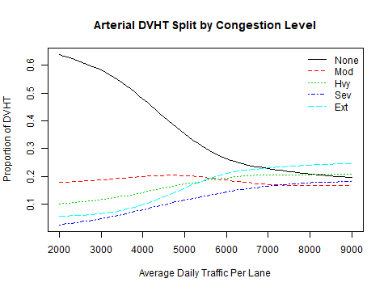

# CalculateRoadPerformance Module
### November 24, 2018

This module splits light-duty vehicle (LDV) daily vehicle miles of travel DVHT between freeways and arterials as a function of relative speeds and congestion prices. Speeds and prices are combined to calculate an average 'effective' speed for freeways and for arterials. The ratio of freeway and arterial 'effective' speeds and a split factor calculated for the metropolitan area are used to split the LDV DVMT. Iteration is used to find an equilibrium split value. In addition to the LDV freeway DVMT and arterial DVMT, the following performance measures are saved to the datastore:

* Average freeway speed by congestion level;

* Average arterial speed by congestion level;

* Average freeway delay by congestion level;

* Average arterial delay by congestion level;

* Freeway DVMT proportions by congestion level;

* Arterial DVMT proportions by congestion level;

* Average amount paid per mile in congestion pricing fees; and,

* Vehicle hours of delay by vehicle type.

## Model Parameter Estimation

Several models are estimated

### Estimate Congestion Lookup Table

 Lookup tables are created that are used by the module to calculate the proportions of freeway and arterial daily vehicle miles of travel (DVMT) and daily vehicle hours of travel (DVHT) in each of 5 congestion levels (none, moderate, heavy, severe, extreme) as a function of freeway average daily traffic (ADT) per lane and arterial ADT per lane respectively. The lookup tables are created using the following Urban Mobility Study (UMS) data for 90 urbanized areas that are used in the calculations:

* Average daily freeway vehicle miles traveled in thousands;

* Average daily arterial vehicle miles traveled in thousands;

* Freeway lane miles

* Arterial lane miles

* Percentages of freeway DVMT occurring in 5 congestion levels

* Percentages of arterial DVMT occurring in 5 congestion levels

* Average freeway speeds for travel at each of the 5 congestion levels

* Average arterial speeds for travel at each of the 5 congestion levels

The steps for creating the

## How the Module Works

## User Inputs
This module has no user input requirements.

## Datasets Used by the Module
The following table documents each dataset that is retrieved from the datastore and used by the module. Each row in the table describes a dataset. All the datasets must be present in the datastore. One or more of these datasets may be entered into the datastore from the user input files. The table names and their meanings are as follows:

NAME - The dataset name.

TABLE - The table in the datastore that the data is retrieved from.

GROUP - The group in the datastore where the table is located. Note that the datastore has a group named 'Global' and groups for every model run year. For example, if the model run years are 2010 and 2050, then the datastore will have a group named '2010' and a group named '2050'. If the value for 'GROUP' is 'Year', then the dataset will exist in each model run year group. If the value for 'GROUP' is 'BaseYear' then the dataset will only exist in the base year group (e.g. '2010'). If the value for 'GROUP' is 'Global' then the dataset will only exist in the 'Global' group.

TYPE - The data type. The framework uses the type to check units and inputs. Refer to the model system design and users guide for information on allowed types.

UNITS - The units that input values need to represent. Some data types have defined units that are represented as abbreviations or combinations of abbreviations. For example 'MI/HR' means miles per hour. Many of these abbreviations are self evident, but the VisionEval model system design and users guide should be consulted.

PROHIBIT - Values that are prohibited. Values in the datastore do not meet any of the listed conditions.

ISELEMENTOF - Categorical values that are permitted. Values in the datastore are one or more of the listed values.

|NAME                  |TABLE                 |GROUP  |TYPE      |UNITS      |PROHIBIT   |ISELEMENTOF              |
|:---------------------|:---------------------|:------|:---------|:----------|:----------|:------------------------|
|Marea                 |Marea                 |Year   |character |ID         |           |                         |
|UrbanPop              |Marea                 |Year   |people    |PRSN       |NA, < 0    |                         |
|FwyLaneMi             |Marea                 |Year   |distance  |MI         |NA, < 0    |                         |
|ArtLaneMi             |Marea                 |Year   |distance  |MI         |NA, < 0    |                         |
|RampMeterDeployProp   |Marea                 |Year   |double    |proportion |< 0, > 1   |                         |
|IncidentMgtDeployProp |Marea                 |Year   |double    |proportion |< 0, > 1   |                         |
|SignalCoordDeployProp |Marea                 |Year   |double    |proportion |< 0, > 1   |                         |
|AccessMgtDeployProp   |Marea                 |Year   |double    |proportion |< 0, > 1   |                         |
|OtherFwyOpsDeployProp |Marea                 |Year   |double    |proportion |< 0, > 1   |                         |
|OtherArtOpsDeployProp |Marea                 |Year   |double    |proportion |< 0, > 1   |                         |
|Level                 |OtherOpsEffectiveness |Global |character |category   |           |None, Mod, Hvy, Sev, Ext |
|Art_Rcr               |OtherOpsEffectiveness |Global |double    |proportion |< 0, > 100 |                         |
|Art_NonRcr            |OtherOpsEffectiveness |Global |double    |proportion |< 0, > 100 |                         |
|Fwy_Rcr               |OtherOpsEffectiveness |Global |double    |proportion |< 0, > 100 |                         |
|Fwy_NonRcr            |OtherOpsEffectiveness |Global |double    |proportion |< 0, > 100 |                         |
|LdvFwyArtDvmt         |Marea                 |Year   |compound  |MI/DAY     |NA, < 0    |                         |
|LdvOthDvmt            |Marea                 |Year   |compound  |MI/DAY     |NA, < 0    |                         |
|HvyTrkFwyDvmt         |Marea                 |Year   |compound  |MI/DAY     |NA, < 0    |                         |
|HvyTrkArtDvmt         |Marea                 |Year   |compound  |MI/DAY     |NA, < 0    |                         |
|HvyTrkOthDvmt         |Marea                 |Year   |compound  |MI/DAY     |NA, < 0    |                         |
|BusFwyDvmt            |Marea                 |Year   |compound  |MI/DAY     |NA, < 0    |                         |
|BusArtDvmt            |Marea                 |Year   |compound  |MI/DAY     |NA, < 0    |                         |
|BusOthDvmt            |Marea                 |Year   |compound  |MI/DAY     |NA, < 0    |                         |
|FwyNoneCongChg        |Marea                 |Year   |currency  |USD        |< 0        |                         |
|FwyModCongChg         |Marea                 |Year   |currency  |USD        |< 0        |                         |
|FwyHvyCongChg         |Marea                 |Year   |currency  |USD        |< 0        |                         |
|FwySevCongChg         |Marea                 |Year   |currency  |USD        |< 0        |                         |
|FwyExtCongChg         |Marea                 |Year   |currency  |USD        |< 0        |                         |
|ArtNoneCongChg        |Marea                 |Year   |currency  |USD        |< 0        |                         |
|ArtModCongChg         |Marea                 |Year   |currency  |USD        |< 0        |                         |
|ArtHvyCongChg         |Marea                 |Year   |currency  |USD        |< 0        |                         |
|ArtSevCongChg         |Marea                 |Year   |currency  |USD        |< 0        |                         |
|ArtExtCongChg         |Marea                 |Year   |currency  |USD        |< 0        |                         |
|ValueOfTime           |Model                 |Global |currency  |USD        |<= 0       |                         |
|UrbanArea             |Bzone                 |Year   |area      |SQMI       |NA, < 0    |                         |

## Datasets Produced by the Module
The following table documents each dataset that is retrieved from the datastore and used by the module. Each row in the table describes a dataset. All the datasets must be present in the datastore. One or more of these datasets may be entered into the datastore from the user input files. The table names and their meanings are as follows:

NAME - The dataset name.

TABLE - The table in the datastore that the data is retrieved from.

GROUP - The group in the datastore where the table is located. Note that the datastore has a group named 'Global' and groups for every model run year. For example, if the model run years are 2010 and 2050, then the datastore will have a group named '2010' and a group named '2050'. If the value for 'GROUP' is 'Year', then the dataset will exist in each model run year. If the value for 'GROUP' is 'BaseYear' then the dataset will only exist in the base year group (e.g. '2010'). If the value for 'GROUP' is 'Global' then the dataset will only exist in the 'Global' group.

TYPE - The data type. The framework uses the type to check units and inputs. Refer to the model system design and users guide for information on allowed types.

UNITS - The units that input values need to represent. Some data types have defined units that are represented as abbreviations or combinations of abbreviations. For example 'MI/HR' means miles per hour. Many of these abbreviations are self evident, but the VisionEval model system design and users guide should be consulted.

PROHIBIT - Values that are prohibited. Values in the datastore do not meet any of the listed conditions.

ISELEMENTOF - Categorical values that are permitted. Values in the datastore are one or more of the listed values.

DESCRIPTION - A description of the data.

|NAME                |TABLE |GROUP |TYPE     |UNITS      |PROHIBIT |ISELEMENTOF |DESCRIPTION                                                                                                                |
|:-------------------|:-----|:-----|:--------|:----------|:--------|:-----------|:--------------------------------------------------------------------------------------------------------------------------|
|LdvFwyDvmt          |Marea |Year  |distance |MI         |< 0      |            |Light-duty daily vehicle miles of travel in the urbanized portion of the Marea occurring on freeways                       |
|LdvArtDvmt          |Marea |Year  |distance |MI         |< 0      |            |Light-duty daily vehicle miles of travel in the urbanized portion of the Marea occurring on arterial roadways              |
|FwyNoneCongSpeed    |Marea |Year  |compound |MI/HR      |< 0      |            |Average freeway speed (miles per hour) when there is no congestion                                                         |
|FwyModCongSpeed     |Marea |Year  |compound |MI/HR      |< 0      |            |Average freeway speed (miles per hour) when congestion is moderate                                                         |
|FwyHvyCongSpeed     |Marea |Year  |compound |MI/HR      |< 0      |            |Average freeway speed (miles per hour) when congestion is heavy                                                            |
|FwySevCongSpeed     |Marea |Year  |compound |MI/HR      |< 0      |            |Average freeway speed (miles per hour) when congestion is severe                                                           |
|FwyExtCongSpeed     |Marea |Year  |compound |MI/HR      |< 0      |            |Average freeway speed (miles per hour) when congestion is extreme                                                          |
|ArtNoneCongSpeed    |Marea |Year  |compound |MI/HR      |< 0      |            |Average arterial speed (miles per hour) when there is no congestion                                                        |
|ArtModCongSpeed     |Marea |Year  |compound |MI/HR      |< 0      |            |Average arterial speed (miles per hour) when congestion is moderate                                                        |
|ArtHvyCongSpeed     |Marea |Year  |compound |MI/HR      |< 0      |            |Average arterial speed (miles per hour) when congestion is heavy                                                           |
|ArtSevCongSpeed     |Marea |Year  |compound |MI/HR      |< 0      |            |Average arterial speed (miles per hour) when congestion is severe                                                          |
|ArtExtCongSpeed     |Marea |Year  |compound |MI/HR      |< 0      |            |Average arterial speed (miles per hour) when congestion is extreme                                                         |
|OthSpd              |Marea |Year  |compound |MI/HR      |< 0      |            |Average speed (miles per hour) on other roadways                                                                           |
|AveLdvSpd           |Marea |Year  |compound |MI/HR      |< 0      |            |Average light-duty vehicle speed (miles per hour) on all roadways weighted by the proportions of light-duty vehicle travel |
|FwyNoneCongDelay    |Marea |Year  |compound |HR/MI      |< 0      |            |Average freeway delay (hours per mile) occurring when there is no congestion                                               |
|FwyModCongDelay     |Marea |Year  |compound |HR/MI      |< 0      |            |Average freeway delay (hours per mile) occurring when congestion is moderate                                               |
|FwyHvyCongDelay     |Marea |Year  |compound |HR/MI      |< 0      |            |Average freeway delay (hours per mile) occurring when congestion is heavy                                                  |
|FwySevCongDelay     |Marea |Year  |compound |HR/MI      |< 0      |            |Average freeway delay (hours per mile) occurring when congestion is severe                                                 |
|FwyExtCongDelay     |Marea |Year  |compound |HR/MI      |< 0      |            |Average freeway delay (hours per mile) occurring when congestion is extreme                                                |
|ArtNoneCongDelay    |Marea |Year  |compound |HR/MI      |< 0      |            |Average arterial delay (hours per mile) occurring when there is no congestion                                              |
|ArtModCongDelay     |Marea |Year  |compound |HR/MI      |< 0      |            |Average arterial delay (hours per mile) occurring when congestion is moderate                                              |
|ArtHvyCongDelay     |Marea |Year  |compound |HR/MI      |< 0      |            |Average arterial delay (hours per mile) occurring when congestion is heavy                                                 |
|ArtSevCongDelay     |Marea |Year  |compound |HR/MI      |< 0      |            |Average arterial delay (hours per mile) occurring when congestion is severe                                                |
|ArtExtCongDelay     |Marea |Year  |compound |HR/MI      |< 0      |            |Average arterial delay (hours per mile) occurring when congestion is extreme                                               |
|FwyDvmtPropNoneCong |Marea |Year  |double   |proportion |< 0, > 1 |            |Proportion of freeway DVMT occurring when there is no congestion                                                           |
|FwyDvmtPropModCong  |Marea |Year  |double   |proportion |< 0, > 1 |            |Proportion of freeway DVMT occurring when congestion is moderate                                                           |
|FwyDvmtPropHvyCong  |Marea |Year  |double   |proportion |< 0, > 1 |            |Proportion of freeway DVMT occurring when congestion is heavy                                                              |
|FwyDvmtPropSevCong  |Marea |Year  |double   |proportion |< 0, > 1 |            |Proportion of freeway DVMT occurring when congestion is severe                                                             |
|FwyDvmtPropExtCong  |Marea |Year  |double   |proportion |< 0, > 1 |            |Proportion of freeway DVMT occurring when congestion is extreme                                                            |
|ArtDvmtPropNoneCong |Marea |Year  |double   |proportion |< 0, > 1 |            |Proportion of arterial DVMT occurring when there is no congestion                                                          |
|ArtDvmtPropModCong  |Marea |Year  |double   |proportion |< 0, > 1 |            |Proportion of arterial DVMT occurring when congestion is moderate                                                          |
|ArtDvmtPropHvyCong  |Marea |Year  |double   |proportion |< 0, > 1 |            |Proportion of arterial DVMT occurring when congestion is heavy                                                             |
|ArtDvmtPropSevCong  |Marea |Year  |double   |proportion |< 0, > 1 |            |Proportion of arterial DVMT occurring when congestion is severe                                                            |
|ArtDvmtPropExtCong  |Marea |Year  |double   |proportion |< 0, > 1 |            |Proportion of arterial DVMT occurring when congestion is extreme                                                           |
|AveCongPrice        |Marea |Year  |currency |USD        |< 0      |            |Average price paid (dollars per mile) in congestion fees                                                                   |
