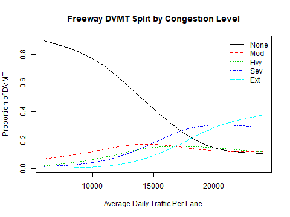
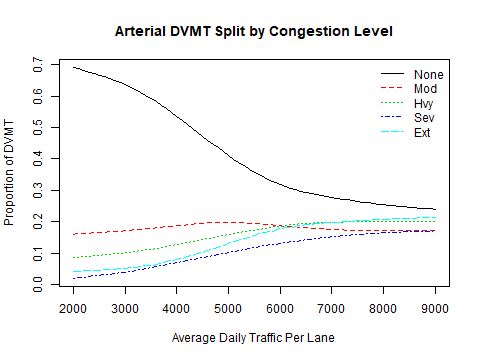
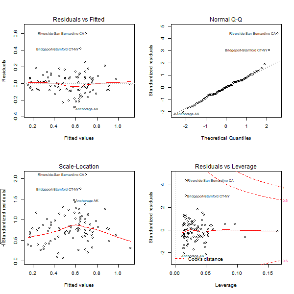
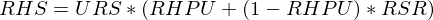
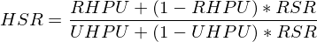
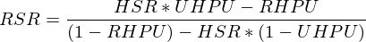

# CalculateRoadPerformance Module
### January 23, 2019

This module calculates freeway and arterial congestion level and the amounts of DVMT by congestion level. It also calculates the average speed and delay at each congestion level. In addition, it splits light-duty vehicle (LDV) DVMT between freeways and arterials as a function of relative speeds and congestion prices. The following performance measures are saved to the datastore:

* Average freeway speed by congestion level;

* Average arterial speed by congestion level;

* Average freeway delay by congestion level;

* Average arterial delay by congestion level;

* Freeway DVMT proportions by congestion level;

* Arterial DVMT proportions by congestion level;

* Average amount paid per mile in congestion pricing fees; and,

* Vehicle hours of delay by vehicle type.

## Model Parameter Estimation

The module uses several estimated models to perform all the calculations. Following are brief descriptions of each model.

### Model of Congestion as a Function of Daily Demand

 This module predicts the proportions of freeway DVMT at each of the 5 congestion levels as a function of the ratio of the ratio of total freeway DVMT and total freeway lane-miles. Lookup tables (one for freeways and another for arterials) are created which specify DVMT proportions by congestion level at different aggregate demand-supply ratios. The lookup tables are created using data from the 2009 Urban Mobility Study (UMS) for 90 urbanized areas including the following. These data are included in the inst/extdata directory of the package:

* Average daily freeway vehicle miles traveled in thousands;

* Average daily arterial vehicle miles traveled in thousands;

* Freeway lane miles

* Arterial lane miles

* Percentages of freeway DVMT occurring in each of the 5 congestion levels

* Percentages of arterial DVMT occurring in each of the 5 congestion levels

The steps for creating the lookup tables are as follows:

1. The freeway demand levels and arterial demand levels are calculated for each urbanized area by dividing the respective value of DVMT by the respective number of lane miles. The result is the average daily traffic volume per lane-mile.

2. A lookup table relating the proportions of freeway DVMT by congestion level to freeway demand level is created using a weighted moving averages method. Values are calculated for freeway demand-supply ratios ranging from 6000 vehicles per lane to 24,000 vehicles per lane in 100 vehicle increments. For each demand level, the data for the 10 urbanized areas whose demand-supply ratio is nearest the target level -- 5 below and 5 above -- are chosen. If there are less than 5 below the target then the sample includes all that are below and 5 above. Similarly if there are less then 5 above the sample target. The DVMT proportions for each congestion level are computed as a weighted average of the proportions in the sample where the weights measure how close the demand level of each sample urbanized area is to the target demand level. After weighted averages have been calculated for all freeway demand levels, smoothing splines (5 degrees of freedom) are used to smooth out the values for each congestion level over the range of demand levels. The freeway lookup table is created from the result.

3. A lookup table relating the proportions of arterial DVMT by congestion level to arterial demand-supply ratio is created by the same method used to create the freeway table.

The following figures illustrate the freeway and arterial lookup tables respectively:



**Figure 1. Freeway DVMT Proportions by Congestion Level and ADT per Lane Ratio**



**Figure 2. Arterial DVMT Proportions by Congestion Level and ADT per Lane Ratio**

### Model of Congested Speeds and the Effects of Operations Programs (e.g. ramp metering, signal coordination)

The module calculates expected average speed and delay at each congestion level for freeways and for arterials considering the effects of deploying 4 standards operations programs (freeway ramp metering, freeway incident management, arterial signal coordination, arterial access control) and optional user-defined operations programs (e.g. freeway active traffic management). Several lookup tables are used to estimate speeds, delays, and delay reductions due to operations programs. These tables are based on research by Bigazzi and Clifton documented in the 'Bigazzi_Task-2_Final_Report.pdf' file in the inst/extdata/sources directory of this package.

The following table maps base speeds for freeways and for arterials by congestion level. Base speeds are the expected speeds with no operations program deployments. The columns labeled 'Fwy' and 'Art' in the table show expected base speeds considering both recurring and non-recurring congestion effects. The columns labeled 'Fwy_Rcr' and 'Art_Rcr' show base speeds considering only recurring congestion effects. Recurring congestion effects are the effects of increased traffic density on travel speed not considering the effect of crashes or other incidents that may also occur. Non-recurring congestion effects are the effects of crashes or other incidents on travel speed.


|     |      Fwy|      Art|  Fwy_Rcr|  Art_Rcr|
|:----|--------:|--------:|--------:|--------:|
|None | 60.00000| 30.00000| 60.00000| 30.00000|
|Mod  | 50.36256| 24.86768| 56.20333| 29.41128|
|Hvy  | 44.03690| 23.48946| 53.16871| 28.46025|
|Sev  | 34.34616| 22.30139| 47.35065| 27.66319|
|Ext  | 23.51623| 20.64814| 38.80756| 26.43484|

**Table 1. Base Average Traffic Speed (miles/hour) by Congestion Level**

Average vehicle delay is calculated for each congestion level from the base speeds table. Delay is the difference between the travel rate (the inverse of travel speed) when the roadway is congested and the travel rate when there is no congestion. The following table shows travel delay (hours per mile) by congestion level. Note that this table is laid out differently than the speed table. In the delay table the 'Fwy_Rcr' and 'Art_Rcr' columns show estimated freeway and arterial delays due only to recurring congestion effects. The 'Fwy_NonRcr' and 'Art_NonRcr' columns show estimated delays due only to non-recurring congestion effects. The non-recurring congestion delays are calculated by subtracting the recurring congestion delays from total delay calculated from the speeds table.


|     |   Fwy_Rcr| Fwy_NonRcr|   Art_Rcr| Art_NonRcr|
|:----|---------:|----------:|---------:|----------:|
|None | 0.0000000|  0.0000000| 0.0000000|  0.0000000|
|Mod  | 0.0011259|  0.0020635| 0.0006672|  0.0062123|
|Hvy  | 0.0021414|  0.0039002| 0.0018034|  0.0074356|
|Sev  | 0.0044524|  0.0079963| 0.0028158|  0.0086911|
|Ext  | 0.0091015|  0.0167557| 0.0044955|  0.0106016|

**Table 2. Base Travel Delay (hours/mile) by Congestion Type and Level**

The model calculates the effects of operations programs on congested speeds by adjusting the recurring and non-recurring delays and then translating delay values back into speeds. The effectiveness of the four common operations programs on reducing recurring and non-recurring delay is documented in the report by Bigazzi and Clifton. The following table shows the average percentage reduction in recurring and non-recurring freeway delay with full deployment of freeway ramp metering.


|     | Fwy_Rcr| Fwy_NonRcr| Art_Rcr| Art_NonRcr|
|:----|-------:|----------:|-------:|----------:|
|None |     0.0|        0.0|       0|          0|
|Mod  |     0.0|        0.0|       0|          0|
|Hvy  |     2.8|        2.8|       0|          0|
|Sev  |     5.6|        5.6|       0|          0|
|Ext  |     6.3|        6.3|       0|          0|

**Table 3. Percentage Reduction in Delay with Full Deployment of Freeway Ramp Metering**

The following table shows the average percentage reduction in non-recurring freeway delay with full deployment of incident management.


|     | Fwy_Rcr| Fwy_NonRcr| Art_Rcr| Art_NonRcr|
|:----|-------:|----------:|-------:|----------:|
|None |       0|        0.0|       0|          0|
|Mod  |       0|       13.2|       0|          0|
|Hvy  |       0|       14.9|       0|          0|
|Sev  |       0|       16.5|       0|          0|
|Ext  |       0|       18.9|       0|          0|

**Table 4. Percentage Reduction in Delay with Full Deployment of Freeway Incident Management**

The following table shows the average percentage reduction in arterial recurring delay with full deployment of signal coordination.


|     | Fwy_Rcr| Fwy_NonRcr| Art_Rcr| Art_NonRcr|
|:----|-------:|----------:|-------:|----------:|
|None |       0|          0|     0.0|          0|
|Mod  |       0|          0|    10.3|          0|
|Hvy  |       0|          0|    10.1|          0|
|Sev  |       0|          0|     7.7|          0|
|Ext  |       0|          0|     5.2|          0|

**Table 5. Percentage Reduction in Delay with Full Deployment of Arterial Signal Coordination**

The following table shows the average percentage reduction in arterial recurring and non-recurring delay with full deployment of access management. Note that recurring delay increases due to increased out-of-direction travel caused by barrier medians but non-recurring delay decreases due to the prevention of crashes by those same barrier medians.


|     | Fwy_Rcr| Fwy_NonRcr| Art_Rcr| Art_NonRcr|
|:----|-------:|----------:|-------:|----------:|
|None |       0|          0|     0.0|        0.0|
|Mod  |       0|          0|     0.0|        8.0|
|Hvy  |       0|          0|    -2.2|        8.0|
|Sev  |       0|          0|    -4.5|        9.8|
|Ext  |       0|          0|    -6.7|        9.8|

**Table 6. Percentage Reduction in Delay with Full Deployment of Arterial Access Management**

In addition to these four standard operations programs, the user may specify the deployment of other custom operations programs such as freeway and arterial active traffic management using the 'other_ops_effectiveness.csv' file to specify the percentage reduction in recurring and non-recurring delays expected with full deployment.

In application, the percentage reductions shown in each of these tables is multiplied by the extent of deployment of the respective operations programs (i.e. the proportion of freeway or arterial DVMT affected) to calculate the percentage reductions at the deployment levels specified in the 'marea_operations_deployment.csv' file. The resulting percentage reductions are converted into proportions of base delay (e.g. 10% reduction means delay is 0.9 times base delay). The total effect of all operations programs is calculated by multiplying their respective delay proportions by congestion type and level. For example, the combined effect of a 5% reduction in extreme non-recurring congestion delay due to ramp metering and a 10% reduction in extreme non-recurring congestion delay due to incident management is not 15%. The delay is `0.95 * 0.9` times the base delay, meaning that the percentage reduction is 14.5%.

### Model of the Split of Light-duty Vehicle (LDV) DVMT between Freeways and Arterials

Unlike heavy truck DVMT or bus DVMT, LDV DVMT is not split between freeways and arterials using a fixed ratio. Instead, it is split dynamically as a function of the ratio of the respective average travel speeds and an urbanized area specific factor (lambda).

 `FwyDvmt / ArtDvmt = lambda * FwySpeed / ArtSpeed`

A linear model is estimated to calculate the value of lambda that is representative for an urbanized area. The aforementioned Urban Mobility Study data were used to estimate this model. These data include estimates of average freeway speed and average arterial speed by congestion level for each of the 90 urbanized areas as well as freeway and arterial DVMT by congestion level. Overall average freeway speed (and likewise average arterial speed) for each urbanized area is calculated as a weighted average of the speeds by congestion level where the weights are the DVMT by congestion level. From these data, the ratios of freeway and arterial DVMT and freeway and arterial speeds are computed for each of the urbanized areas. The ratios of those ratios is the lambda value for the urbanized area which satisfies the relationship. A model is estimated to predict the likely value of lambda given a few characteristics of the urbanized area. Following is a summary of the estimated model where `LogPop`is the natural log of the urbanized area population and `LnMiRatio` is the ratio of freeway and arterial lane-miles:

```

Call:
lm(formula = Lambda ~ LogPop + LnMiRatio, data = Lambda_df)

Residuals:
     Min       1Q   Median       3Q      Max 
-0.28926 -0.08072 -0.00253  0.06787  0.59899 

Coefficients:
            Estimate Std. Error t value Pr(>|t|)    
(Intercept)  -1.5179     0.2145  -7.077 3.56e-10 ***
LogPop        0.1156     0.0154   7.511 4.83e-11 ***
LnMiRatio     1.3207     0.1138  11.602  < 2e-16 ***
---
Signif. codes:  0 ‘***’ 0.001 ‘**’ 0.01 ‘*’ 0.05 ‘.’ 0.1 ‘ ’ 1

Residual standard error: 0.1367 on 87 degrees of freedom
Multiple R-squared:  0.7048,	Adjusted R-squared:  0.698 
F-statistic: 103.9 on 2 and 87 DF,  p-value: < 2.2e-16

```

**Figure 3. Summary Statistics for LDV DVMT Split Model**

As can be seen, both of the independent variables are highly significant. The proportion of DVMT occurring on freeways increases with the urbanized area population and the relative supply of freeway capacity. The following set of plots show the several indicators of model fit.



**Figure 4. Diagnostic Plots for LDV DVMT Split Model**

The estimated LDV DVMT split model predicts the average lambda relationship given a simple set of predictors. The model accounts for about 70% of the observed variation. As can be seen in Figure 4, there is a substantial amount of residual variation due to relevant attributes unaccounted for in the model (e.g. interchange density) and inaccuracies in the estimation dataset. If the model is applied as is to split freeway and arterial DVMT for an urbanized area, the results will not correspond to observed measurements in almost all cases. This is compensated for by calculating an additive lambda adjustment factor for the urbanized area in the base year so that the modeled LDV DVMT split is the same as the base year split processed by the Initialize module. The process for calculating the lambda adjustment factor is described in the next section. The additive lambda adjustment is equivalent to an additive adjustment to the constant in the model equation to account for other factors not accounted for in the model equation and data inaccuracies.

### Model to Calculate Average Non-urban Road Speed from Average Urban Road Speed

The speed models presented above only address travel on urbanized area roads, but speeds are needed as well for roads outside of urbanized areas because not all household vehicle travel occurs on urbanized area roads. The portion of household travel on urbanized area roadways is calculated by the 'CalculateRoadDvmt' module. This section describes the model developed to calculate the ratio of roadway speeds in non-urbanized (rural) areas and urbanized (urban) areas.

Unfortunately, and surprisingly given the amount of vehicle speed data being collected nowadays, there appears to be no current sources of urban and rural roadway average speeds for the U.S. that can be used to calculate the rural to urban roadway speed ratio. The only source that the author could find to compare average rural and urban speeds is the National Household Travel Survey (NHTS) which provides information on average vehicle trip distances and durations for households living inside and outside of urbanized areas. Table 7 shows the 2017 distance and duration data by census region.


|Region    | UrbanTripLength| RuralTripLength| UrbanTripDuration| RuralTripDuration|
|:---------|---------------:|---------------:|-----------------:|-----------------:|
|Northeast |            8.61|           11.00|             20.62|             21.12|
|Midwest   |            8.18|           12.47|             18.41|             22.22|
|South     |            9.51|           13.17|             20.64|             23.66|
|West      |            8.65|           13.19|             20.38|             23.23|
|All       |            8.87|           12.65|             20.10|             22.83|

**Table 7. 2017 NHTS Average Urban and Rural Household Vehicle Trip Distances (miles) and Durations (minutes)

Average urban and rural household vehicle trip speeds (miles per hour) and the ratio of rural and urban speed averages are calculated from these data. The results are in Table 8. The overall national average ratio is used in the model. Advanced users may customize the module for their region by changing this script to select the ratio for one of the listed regions.


|          | UrbanSpeed| RuralSpeed| SpeedRatio|
|:---------|----------:|----------:|----------:|
|Northeast |   25.05335|   31.25000|   1.247338|
|Midwest   |   26.65942|   33.67237|   1.263057|
|South     |   27.64535|   33.39814|   1.208093|
|West      |   25.46614|   34.06802|   1.337777|
|All       |   26.47761|   33.24573|   1.255617|

**Table 8. Average Urban and Rural Household Vehicle Trip Speeds (miles per hour) and Speed Ratio**

Unfortunately, the average household vehicle speed ratio is not a clean representation of the rural and urban road speed ratio because rural households travel some on urban roads and urban households travel some on rural roads. However, since the urban road travel proportions of households are calculated by the 'CalculateRoadDvmt' module it is possible to estimate the road speed ratio using the household speed ratio. This is done in the following equations. Equation 1 shows the calculation of rural household speed from the urban travel proportion of rural households, urban road speed, and ratio of rural to urban road speed.



**Equation 1. Calculation of Rural Household Speed**

Where:

* *RHS* = rural household speed
* *URS* = urban road speed
* *RHPU* = rural household proportion urban DVMT
* *RSR* = road speed ratio

If a similar equation is formulated for calculating urban household average vehicle speed and that equation is divided into Equation 1, we get the equation for calculating the ratio of rural to urban household average vehicle speed as shown in Equation 2.



**Equation 2. Calculation of Household Speed Ratio**

Where:

* *HSR* = household speed ratio
* *UHPU* = urban household proportion of urban DVMT

Solving for the road speed ratio (RSR) yields Equation 3.



**Equation 3. Calculation of Road Speed Ratio**

Where:

* *RSR* = road speed ratio

The module applies this function to calculate the rural to urban road speed ratio from the rural to urban household speed ratio derived from the NHTS and the respective proportions of household DVMT on urban roadways for rural and urban households. The ratio, calculated by marea, is then applied to the average urban LDV speed calculated for the marea to derive the average rural LDV speed. Some guards are applied to assure that the results are sensible because some combinations of rural and urban household DVMT proportions (however unlikely) can produce road speed ratios that result in unlikely average rural road speeds.

## How the Module Works

This module models traffic congestion in urbanized areas and the effects of congestion on vehicle speeds and delays. In the process, it splits the freeway-arterial light-duty vehicle (LDV) DVMT forecast into freeway and arterial components as a function of the respective speeds and congestion charges on freeways and arterials. Outputs of the module include the following:

* Average speed by marea and vehicle type (LDV, heavy truck, bus) for urban areas

* Total delay by marea and vehicle type for urban areas

* Average congestion charge by marea per vehicle mile

Following are the procedures the module caries out:

* **Calculate lambda**: The model for determining the value of lambda (described above) is applied for each metropolitan area. In addition, if the model run year is not the base year, the marea lambda adjustment values are also loaded. The procedures for calculating the lambda adjustment values in the base year are described below.

* **Calculate speed and delay by congestion level**: The speed and delay models described above are applied to calculate speed and delay by congestion level on urban freeways and arterials in the urban portion of each marea (i.e. the urbanized area) considering the deployment of operations programs.

* **Load and structure data on DVMT and prices**: Urban DVMT data by vehicle type (LDV, heavy truck, bus) and marea is loaded from the datastore and structured to facilitate computation. Similarly congestion pricing data is loaded and structured.

* **Define function to calculate average equivalent speed**: Since both average speeds and pricing affect the balance of LDV DVMT on freeways and arterials, the two need to be represented in equivalent terms. The function which does this does the following to create a composite value for freeways or arterials when supplied the necessary data:

 * Daily vehicle hours of travel (DVHT) is calculated by dividing the DVMT by congestion level by the average speed by congestion level and summing the result.

 * Congestion pricing is converted into a vehicle time equivalent (i.e. DVHT) by multiplying the DVMT by congestion level by the congestion price by congestion level, summing to calculate total paid by vehicles, and dividing by the value-of-time model parameter.

 * The sum of DVHT and the DVHT equivalent of congestion pricing is divided into the DVMT to arrive at the equivalent average speed.

* **Define function to calculate freeway and arterial congestion and split LDV DVMT**: Since relative speeds affect the split of LDV DVMT between freeways and arterials and since those speeds are affected by how the split effects congestion, the calculations are performed iteratively until an equilibrium condition is achieved. That is determined to have happened when the freeway to arterial DVMT ratio changes by less than 0.01% from iteration to iteration. The iterations are started with the assumption that average freeway speeds and average arterial speeds are the respective uncongested speeds (Table 1). The steps in each iteration are as follows:

 * The LDV DVMT split model is applied to calculate the freeway and arterial components of LDV DVMT.

 * Heavy truck DVMT by road type and bus DVMT by road type are added to the LDV DVMT by road type to calculate total freeway DVMT and total arterial DVMT.

 * The freeway-arterial DVMT ratio is calculated and compared with the ratio calculated in the previous iteration. If it differs by less than 0.01% the iterations stop. In the first iteration, the DVMT ratio is compared to 1.

 * The freeway and arterial congestion models are used to split freeway DVMT by congestion level and split arterial DVMT by congestion level.

 * The average equivalent freeway speed and the average equivalent arterial speed are calculated using the function described above.

* **Calculate lamba adjustment factor if base year**: If the model is being run for the base year, a lambda adjustment factor must be calculated for each marea to calibrate the LDV DVMT split model so that the LDV DVMT split for the base year (see Initialize module) is replicated. A binary search procedure is used to calculate the lambda adjustment factor for each marea. In each iteration of the binary search process, the previously described function to calculate congestion and split LDV DVMT is run and the resulting freeway-arterial ratio of LDV DVMT is compared with the observed base year ratio. The search process continues until the two ratios closely match.

* **Calculate freeway and arterial congestion**: The function to calculate freeway and arterial congestion (described above) is run to calculate freeway and arterial DVMT by congestion level and DVMT by vehicle type and road class.

* **Calculate performance measures**: The module computes several performance measures for each marea. These include average speed by vehicle type, total vehicle hours of delay by vehicle type, and average congestion charge per vehicle mile. These performance measures are module outputs that are written to the datastore. Additional module outputs are freeway LDV DVMT and arterial LDV DVMT for each marea, and the lambda adjustment factors. In addition, the module outputs proportions of freeway and arterial DVMT by congestion level and freeway and arterials speeds by congestion level. Those data are used by the 'CalculateMpgMpkwhAdjustments' module to calculate the effects of urban area congestion on fuel economy and electric vehicle efficiency.


## User Inputs
This module has no user input requirements.

## Datasets Used by the Module
The following table documents each dataset that is retrieved from the datastore and used by the module. Each row in the table describes a dataset. All the datasets must be present in the datastore. One or more of these datasets may be entered into the datastore from the user input files. The table names and their meanings are as follows:

NAME - The dataset name.

TABLE - The table in the datastore that the data is retrieved from.

GROUP - The group in the datastore where the table is located. Note that the datastore has a group named 'Global' and groups for every model run year. For example, if the model run years are 2010 and 2050, then the datastore will have a group named '2010' and a group named '2050'. If the value for 'GROUP' is 'Year', then the dataset will exist in each model run year group. If the value for 'GROUP' is 'BaseYear' then the dataset will only exist in the base year group (e.g. '2010'). If the value for 'GROUP' is 'Global' then the dataset will only exist in the 'Global' group.

TYPE - The data type. The framework uses the type to check units and inputs. Refer to the model system design and users guide for information on allowed types.

UNITS - The units that input values need to represent. Some data types have defined units that are represented as abbreviations or combinations of abbreviations. For example 'MI/HR' means miles per hour. Many of these abbreviations are self evident, but the VisionEval model system design and users guide should be consulted.

PROHIBIT - Values that are prohibited. Values in the datastore do not meet any of the listed conditions.

ISELEMENTOF - Categorical values that are permitted. Values in the datastore are one or more of the listed values.

|NAME                    |TABLE                 |GROUP  |TYPE      |UNITS      |PROHIBIT     |ISELEMENTOF                                                                                                                                                                                                        |
|:-----------------------|:---------------------|:------|:---------|:----------|:------------|:------------------------------------------------------------------------------------------------------------------------------------------------------------------------------------------------------------------|
|StateAbbrLookup         |Region                |Global |character |ID         |             |AL, AK, AZ, AR, CA, CO, CT, DE, FL, GA, HI, ID, IL, IN, IA, KS, KY, LA, ME, MD, MA, MI, MN, MS, MO, MT, NE, NV, NH, NJ, NM, NY, NC, ND, OH, OK, OR, PA, RI, SC, SD, TN, TX, UT, VT, VA, WA, WV, WI, WY, DC, PR, NA |
|Marea                   |Marea                 |Year   |character |ID         |             |                                                                                                                                                                                                                   |
|UrbanPop                |Marea                 |Year   |people    |PRSN       |NA, < 0      |                                                                                                                                                                                                                   |
|FwyLaneMi               |Marea                 |Year   |distance  |MI         |NA, < 0      |                                                                                                                                                                                                                   |
|ArtLaneMi               |Marea                 |Year   |distance  |MI         |NA, < 0      |                                                                                                                                                                                                                   |
|RampMeterDeployProp     |Marea                 |Year   |double    |proportion |< 0, > 1     |                                                                                                                                                                                                                   |
|IncidentMgtDeployProp   |Marea                 |Year   |double    |proportion |< 0, > 1     |                                                                                                                                                                                                                   |
|SignalCoordDeployProp   |Marea                 |Year   |double    |proportion |< 0, > 1     |                                                                                                                                                                                                                   |
|AccessMgtDeployProp     |Marea                 |Year   |double    |proportion |< 0, > 1     |                                                                                                                                                                                                                   |
|OtherFwyOpsDeployProp   |Marea                 |Year   |double    |proportion |< 0, > 1     |                                                                                                                                                                                                                   |
|OtherArtOpsDeployProp   |Marea                 |Year   |double    |proportion |< 0, > 1     |                                                                                                                                                                                                                   |
|Level                   |OtherOpsEffectiveness |Global |character |category   |             |None, Mod, Hvy, Sev, Ext                                                                                                                                                                                           |
|Art_Rcr                 |OtherOpsEffectiveness |Global |double    |proportion |< 0, > 100   |                                                                                                                                                                                                                   |
|Art_NonRcr              |OtherOpsEffectiveness |Global |double    |proportion |< 0, > 100   |                                                                                                                                                                                                                   |
|Fwy_Rcr                 |OtherOpsEffectiveness |Global |double    |proportion |< 0, > 100   |                                                                                                                                                                                                                   |
|Fwy_NonRcr              |OtherOpsEffectiveness |Global |double    |proportion |< 0, > 100   |                                                                                                                                                                                                                   |
|LdvFwyArtDvmt           |Marea                 |Year   |compound  |MI/DAY     |NA, < 0      |                                                                                                                                                                                                                   |
|LdvOthDvmt              |Marea                 |Year   |compound  |MI/DAY     |NA, < 0      |                                                                                                                                                                                                                   |
|HvyTrkFwyDvmt           |Marea                 |Year   |compound  |MI/DAY     |NA, < 0      |                                                                                                                                                                                                                   |
|HvyTrkArtDvmt           |Marea                 |Year   |compound  |MI/DAY     |NA, < 0      |                                                                                                                                                                                                                   |
|HvyTrkOthDvmt           |Marea                 |Year   |compound  |MI/DAY     |NA, < 0      |                                                                                                                                                                                                                   |
|BusFwyDvmt              |Marea                 |Year   |compound  |MI/DAY     |NA, < 0      |                                                                                                                                                                                                                   |
|BusArtDvmt              |Marea                 |Year   |compound  |MI/DAY     |NA, < 0      |                                                                                                                                                                                                                   |
|BusOthDvmt              |Marea                 |Year   |compound  |MI/DAY     |NA, < 0      |                                                                                                                                                                                                                   |
|FwyNoneCongChg          |Marea                 |Year   |currency  |USD        |< 0          |                                                                                                                                                                                                                   |
|FwyModCongChg           |Marea                 |Year   |currency  |USD        |< 0          |                                                                                                                                                                                                                   |
|FwyHvyCongChg           |Marea                 |Year   |currency  |USD        |< 0          |                                                                                                                                                                                                                   |
|FwySevCongChg           |Marea                 |Year   |currency  |USD        |< 0          |                                                                                                                                                                                                                   |
|FwyExtCongChg           |Marea                 |Year   |currency  |USD        |< 0          |                                                                                                                                                                                                                   |
|ArtNoneCongChg          |Marea                 |Year   |currency  |USD        |< 0          |                                                                                                                                                                                                                   |
|ArtModCongChg           |Marea                 |Year   |currency  |USD        |< 0          |                                                                                                                                                                                                                   |
|ArtHvyCongChg           |Marea                 |Year   |currency  |USD        |< 0          |                                                                                                                                                                                                                   |
|ArtSevCongChg           |Marea                 |Year   |currency  |USD        |< 0          |                                                                                                                                                                                                                   |
|ArtExtCongChg           |Marea                 |Year   |currency  |USD        |< 0          |                                                                                                                                                                                                                   |
|ValueOfTime             |Model                 |Global |currency  |USD        |<= 0         |                                                                                                                                                                                                                   |
|UrbanArea               |Bzone                 |Year   |area      |SQMI       |NA, < 0      |                                                                                                                                                                                                                   |
|LdvFwyDvmtProp          |Marea                 |Global |double    |proportion |< 0, > 1     |                                                                                                                                                                                                                   |
|LdvArtDvmtProp          |Marea                 |Global |double    |proportion |< 0, > 1     |                                                                                                                                                                                                                   |
|LambdaAdj               |Marea                 |Global |double    |constant   |             |                                                                                                                                                                                                                   |
|UrbanHhPropUrbanDvmt    |Marea                 |Year   |double    |proportion |NA, < 0, > 1 |                                                                                                                                                                                                                   |
|NonUrbanHhPropUrbanDvmt |Marea                 |Year   |double    |proportion |NA, < 0, > 1 |                                                                                                                                                                                                                   |

## Datasets Produced by the Module
The following table documents each dataset that is retrieved from the datastore and used by the module. Each row in the table describes a dataset. All the datasets must be present in the datastore. One or more of these datasets may be entered into the datastore from the user input files. The table names and their meanings are as follows:

NAME - The dataset name.

TABLE - The table in the datastore that the data is retrieved from.

GROUP - The group in the datastore where the table is located. Note that the datastore has a group named 'Global' and groups for every model run year. For example, if the model run years are 2010 and 2050, then the datastore will have a group named '2010' and a group named '2050'. If the value for 'GROUP' is 'Year', then the dataset will exist in each model run year. If the value for 'GROUP' is 'BaseYear' then the dataset will only exist in the base year group (e.g. '2010'). If the value for 'GROUP' is 'Global' then the dataset will only exist in the 'Global' group.

TYPE - The data type. The framework uses the type to check units and inputs. Refer to the model system design and users guide for information on allowed types.

UNITS - The units that input values need to represent. Some data types have defined units that are represented as abbreviations or combinations of abbreviations. For example 'MI/HR' means miles per hour. Many of these abbreviations are self evident, but the VisionEval model system design and users guide should be consulted.

PROHIBIT - Values that are prohibited. Values in the datastore do not meet any of the listed conditions.

ISELEMENTOF - Categorical values that are permitted. Values in the datastore are one or more of the listed values.

DESCRIPTION - A description of the data.

|NAME                |TABLE |GROUP  |TYPE     |UNITS      |PROHIBIT |ISELEMENTOF |DESCRIPTION                                                                                                   |
|:-------------------|:-----|:------|:--------|:----------|:--------|:-----------|:-------------------------------------------------------------------------------------------------------------|
|LdvFwyDvmt          |Marea |Year   |compound |MI/DAY     |< 0      |            |Light-duty daily vehicle miles of travel in the urbanized portion of the Marea occurring on freeways          |
|LdvArtDvmt          |Marea |Year   |compound |MI/DAY     |< 0      |            |Light-duty daily vehicle miles of travel in the urbanized portion of the Marea occurring on arterial roadways |
|LdvAveSpeed         |Marea |Year   |compound |MI/HR      |< 0      |            |Average speed (miles per hour) of light-duty vehicle travel on urban area roads                               |
|HvyTrkAveSpeed      |Marea |Year   |compound |MI/HR      |< 0      |            |Average speed (miles per hour) of heavy truck travel on urban area roads                                      |
|BusAveSpeed         |Marea |Year   |compound |MI/HR      |< 0      |            |Average speed (miles per hour) of bus travel on urban area roads                                              |
|NonUrbanAveSpeed    |Marea |Year   |compound |MI/HR      |< 0      |            |Average speed (miles per hour) of vehicle travel on non-urban area roads                                      |
|LdvTotDelay         |Marea |Year   |compound |HR/MI      |< 0      |            |Total light-duty vehicle delay (hours per mile) on urban area roads                                           |
|HvyTrkTotDelay      |Marea |Year   |compound |HR/MI      |< 0      |            |Total urban light-duty vehicle delay (hours per mile) on urban area roads                                     |
|BusTotDelay         |Marea |Year   |compound |HR/MI      |< 0      |            |Total urban light-duty vehicle delay (hours per mile) on urban area roads                                     |
|AveCongPrice        |Marea |Year   |currency |USD        |< 0      |            |Average price paid (dollars per mile) in congestion fees                                                      |
|FwyDvmtPropNoneCong |Marea |Year   |double   |proportion |< 0, > 1 |            |Proportion of freeway DVMT occurring when there is no congestion                                              |
|FwyDvmtPropModCong  |Marea |Year   |double   |proportion |< 0, > 1 |            |Proportion of freeway DVMT occurring when congestion is moderate                                              |
|FwyDvmtPropHvyCong  |Marea |Year   |double   |proportion |< 0, > 1 |            |Proportion of freeway DVMT occurring when congestion is heavy                                                 |
|FwyDvmtPropSevCong  |Marea |Year   |double   |proportion |< 0, > 1 |            |Proportion of freeway DVMT occurring when congestion is severe                                                |
|FwyDvmtPropExtCong  |Marea |Year   |double   |proportion |< 0, > 1 |            |Proportion of freeway DVMT occurring when congestion is extreme                                               |
|ArtDvmtPropNoneCong |Marea |Year   |double   |proportion |< 0, > 1 |            |Proportion of arterial DVMT occurring when there is no congestion                                             |
|ArtDvmtPropModCong  |Marea |Year   |double   |proportion |< 0, > 1 |            |Proportion of arterial DVMT occurring when congestion is moderate                                             |
|ArtDvmtPropHvyCong  |Marea |Year   |double   |proportion |< 0, > 1 |            |Proportion of arterial DVMT occurring when congestion is heavy                                                |
|ArtDvmtPropSevCong  |Marea |Year   |double   |proportion |< 0, > 1 |            |Proportion of arterial DVMT occurring when congestion is severe                                               |
|ArtDvmtPropExtCong  |Marea |Year   |double   |proportion |< 0, > 1 |            |Proportion of arterial DVMT occurring when congestion is extreme                                              |
|FwyNoneCongSpeed    |Marea |Year   |compound |MI/HR      |< 0      |            |Average freeway speed (miles per hour) when there is no congestion                                            |
|FwyModCongSpeed     |Marea |Year   |compound |MI/HR      |< 0      |            |Average freeway speed (miles per hour) when congestion is moderate                                            |
|FwyHvyCongSpeed     |Marea |Year   |compound |MI/HR      |< 0      |            |Average freeway speed (miles per hour) when congestion is heavy                                               |
|FwySevCongSpeed     |Marea |Year   |compound |MI/HR      |< 0      |            |Average freeway speed (miles per hour) when congestion is severe                                              |
|FwyExtCongSpeed     |Marea |Year   |compound |MI/HR      |< 0      |            |Average freeway speed (miles per hour) when congestion is extreme                                             |
|ArtNoneCongSpeed    |Marea |Year   |compound |MI/HR      |< 0      |            |Average arterial speed (miles per hour) when there is no congestion                                           |
|ArtModCongSpeed     |Marea |Year   |compound |MI/HR      |< 0      |            |Average arterial speed (miles per hour) when congestion is moderate                                           |
|ArtHvyCongSpeed     |Marea |Year   |compound |MI/HR      |< 0      |            |Average arterial speed (miles per hour) when congestion is heavy                                              |
|ArtSevCongSpeed     |Marea |Year   |compound |MI/HR      |< 0      |            |Average arterial speed (miles per hour) when congestion is severe                                             |
|ArtExtCongSpeed     |Marea |Year   |compound |MI/HR      |< 0      |            |Average arterial speed (miles per hour) when congestion is extreme                                            |
|OthSpd              |Marea |Year   |compound |MI/HR      |< 0      |            |Average speed (miles per hour) on other roadways                                                              |
|LambdaAdj           |Marea |Global |double   |constant   |         |            |Constant to adjust the modeled lambda parameter to match base year freeway and arterial LDV proportions       |
