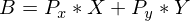
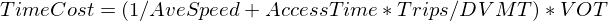
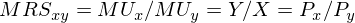
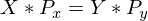
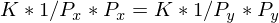
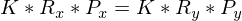
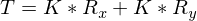
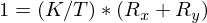
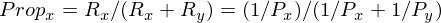

# CalculateHhVehicleOperatingCosts Module
### January 23, 2019

This module calculates vehicle operating costs per mile of travel and uses those costs to determine the proportional split of DVMT among household vehicles. The module also calculates the average out-of-pocket costs per mile of vehicle travel by household, as well as the cost of social and environmental impacts, and road use taxes per mile of vehicle travel.

## Model Parameter Estimation

This section describes the model for splitting household DVMT among household vehicles as a function of the unit cost of using each vehicle. It also describes the estimation of model parameters for calculating cost components.

### Model for Splitting DVMT among Household Vehicles

The model for splitting DVMT among household vehicles is assumed to be a Cobb-Douglas utility function where the total utility is as follows for a household owning 2 vehicles:

**Equation 1. Cobb-Douglas Utility for 2-Vehicle Household**

Where:
*  *U* is the utility
*  *X* and *Y* are the miles driven in vehicles *X* and *Y*
*  *a* and *b* are exponents that determine the relative utilities of miles driven in vehicles *X* and *Y*

The values of *X* and *Y* are subject to the following budget constraint:

**Equation 2. Budget Constraint for 2-Vehicle Household**

Where:
*  *B* is the vehicle travel budget
*  *Px* and *Py* are the prices (i.e. unit costs) of travel by vehicles *X* and *Y* respectively

The prices (unit costs) of travel by each vehicle are calculated as composite costs which combine out-of-pocket costs and travel time costs. The out-of-pocket unit costs for households (dollars / mile) are calculated as the sum of the unit costs for the following:

*  Fuel (energy),
*  Mainance, tires and repairs,
*  Road use taxes,
*  Pollution taxes (e.g. carbon tax),
*  Parking charges, and
*  Pay-as-you-drive insurance cost.

The out-of-pocket costs for using high and low level car services are the assumed rates (dollars / mile) which are user inputs.

The equivalent travel time unit cost is calculated as follows:

**Equation 3. Calculation of Equivalent Time Cost Per Mile**

Where:
*  *TimeCost* is the equivalent time unit cost in dollars per mile
*  *AveSpeed* is the average vehicle travel speed (miles per hour) calculated for the household
*  *AccessTime* is the average amount of time spent on each end of the vehicle trip to get from the origin to the vehicle and from the vehicle to the destination (user input for household vehicles and car service vehicles by service level)
*  *Trips* is the average number of daily vehicle trips of the household
*  *DVMT* is the average daily vehicle miles traveled of the household
*  *VOT* is the value-of-time (a model parameter)

The values of *X* and *Y*, the miles traveled by each vehicle, are calculated by determining the values that maximize utility subject to the budget constraint. The calculation is simplified by assuming that the values of *a* and *b* are 1. In other words, it is assumed that all household vehicles provide that same travel utility to the household independent of price. Factors like comfort, convenience, performance, dependability, and style that may affect percieved utility are not considered for the following reasons:

*  The model includes a limited number of vehicle characteristics (auto or light truck, age, powertrain) that may be weakly related to the vehicle attributes that affect perceived vehicle utility; and,

*  Estimation vehicle utility is complicated by how vehicles may be allocated among household members. For example, an older and less valuable vehicle may be primarily used by a young adult in the household who drives a lot whereas a newer and more valuable vehicle might be driven by an older adult who drives less.

Future researchers may be able to determine reasonable exponents which better represent perceived household utility (independent of price) but until that is done, the most sensible approach is to assume that a household percieves the relative utilities of travel in their vehicles (independent of price) to be the same.

Economic theory can be applied to determine how travel is allocated between the vehicles *X* and *Y* given a budget constraint. Utility will be maximized when the marginal rate of substitution (MRS) is equal to the the price ratio. The marginal rate of substitution is the marginal utility of *X* (partial derivative of U with respect to X) divided by the marginal utility of *Y*. In the case of the asserted utility, the relationship is as follows:

**Equation 4. Marginal Rate of Substitution and Price Ratio**

The implication of Equation 4 is that the utility of using the 2 household vehicles will be maximized when the value of *X* times the price of *X* is equal to the value of *Y* times the price of *Y*:

**Equation 5. Quantity-Price Relationship Which Maximizes Utility**

The values of *X* and *Y* can be replaced by a constant *K* times the reciprocal of the price so that the equality is shown in Equation 6 and Equation 7:

**Equation 6. Utility Maximizing Quantity Replaced by Constant and Reciprocal of Price**

**Equation 7. Replacing Reciprocal of Price**

Given that the DVMT of each vehicle can be calculated as a constant multiplied by a reciprocal of price, total DVMT (*T*) is calculated as follows:

**Equation 8. Total DVMT of 2-Vehicle Household**

The proportion of DVMT allocated to each vehicle is therefore the ratio of *K* and *T* times the reciprocal of price.

**Equation 9. Proportional Allocation of DVMT**

Finally since the ratio of *K* and *T* is equal to the inverse of the sum of the price reciprocals, the utility maximixing proportion of household DVMT allocated to a household vehicle is the reciprocal of the the price (i.e. unit cost) of using that vehicle divided by the sum of the price reciprocals of all household vehicles. This relationship holds for any number of household vehicles.

**Equation 10. Utility Maximizing Proportion of Household DVMT Allocated to a Vehicle**

### Models for Calculating Out-of-pocket Costs

Most of the out-of-pocket cost calculations are simple products of rates that are user inputs and quantities consumed or produced by each vehicle. For example:

* Fuel cost per mile is the product of the input fuel cost exclusive of taxes and the vehicle fuel consumption rate (gallons per mile)

* Fuel tax per mile is the product of the input fuel tax and the vehicle fuel consumption rate

* Mileage tax is the mileage tax rate

* The pay-as-you-drive (PAYD) insurance cost rate for households which have PAYD insurance is the household vehicle insurance cost calculated by the CalculateVehicleOwnCost module divided by total household DVMT

Model cost parameters are estimated for maintenance, repair, and tire (MRT) costs and for social costs as described below.

#### Maintenance, Repair, and Tire Cost

A model is developed for calculating vehicle maintenance, repair, and tire cost as a function of the vehicle type and age using data from the American Automobile Association (AAA) and the Bureau of Labor Statistics (BLS). AAA publishes reports yearly on the cost of vehicle use by vehicle type over the first 5 years of the vehicle's life. The AAA vehicle types are small sedan, medium sedan, large sedan, small SUV, medium SUV, minivan, pickup truck, hybrid vehicle, electric vehicle. These reports, in addition to estimating the total cost per mile, split out cost estimates by category. Vehicle maintenance, repair, and tire (MRT) cost is one of the categories. The 2017 report, a copy of which is included as the '17-0013_Your-Driving-Costs-Brochure-2017-FNL-CX-1.pdf' file in the 'inst/extdata/sources' directory of this package, is used to calculate baseline MRT cost for the following vehicle and powertrain types by calculating mean values of corresponding AAA vehicle types as shown in the following table. Cost is shown to the nearest tenth of a cent.

|Vehicle Type|Powertrain|AAA Types|Cents/Mile|
|---|---|---|
|Auto|ICEV|Small Sedan, Medium Sedan, Large Sedan|7.7|
|Light Truck|ICEV|Small SUV, Medium SUV, Minivan, Pickup Truck|8.1|
|Auto, Light Truck|HEV, PHEV|Hybrid Vehicle|7.0|
|Auto, Light Truck|BEV|Electric Vehicle|6.6|

**Table 1. Correspondence Between Vehicle and Powertrain Types and AAA Vehicle Types and Average Mileage Cost (2017)**

Data from a BLS report, "Beyond the Numbers, Prices and Spending, Americans' Aging Autos, BLS, May 2014, Vol.3/No.9", are used to establish the relationship between MRT cost and vehicle age. A copy of the report is included as the 'americans-aging-autos.pdf' file in the 'inst/extdata/sources' directory of this package. This report includes estimates of average MRT cost by vehicle age category for all household vehicles. Table 2. shows the MRT costs ($2012) by vehicle age category and the ratio to the 0-5 year age group cost.

|VehicleAge | DollarsPerYear| Ratio|
|:----------|--------------:|-----:|
|Age0to5    |            437|  1.00|
|Age6to10   |            588|  1.35|
|Age11to15  |            576|  1.32|
|Age16to20  |            483|  1.11|
|Age21to25  |            457|  1.05|
|Age26Plus  |            502|  1.15|
|Average    |            546|  1.25|

**Table 2. Household Vehicle Operating Cost by Vehicle Age**

The MRT costs by vehicle type and age are calculated as the outer product of the AAA costs by vehicle type and the BLS ratio of MRT cost by vehicle age. Since the BLS data don't distinguish between vehicle types, it is assumed that the effect of age on MRT expenses is the same for all vehicle types. The results are shown in Table 3.

|          | AutoIcev| LtTrkIcev| Hev| Bev|
|:---------|--------:|---------:|---:|---:|
|Age0to5   |      7.7|       8.1| 7.0| 6.6|
|Age6to10  |     10.4|      10.9| 9.4| 8.8|
|Age11to15 |     10.2|      10.7| 9.2| 8.6|
|Age16to20 |      8.6|       9.0| 7.7| 7.2|
|Age21to25 |      8.1|       8.5| 7.3| 6.8|
|Age26Plus |      8.9|       9.3| 8.0| 7.5|

**Table 3. 2017 Household Vehicle Maintenance, Repair, and Tire Cost (Cents/Mile)**

#### Social Costs

Social costs are costs borne by present and future generations due to the impacts of transportation. For example, transportation emissions increase the incidence of asthma and other lung diseases and impose costs to affected individuals in terms of reduced life expectancy, reduced quality of life, and increased medical treatments. Typically vehicle users do not compensate society for these costs, but increasingly economists and others interested in transportation policy are proposing that social costs be included in vehicle pricing to reduce unwanted outcomes. For example, carbon pricing has been proposed at the state and federal level to reduce carbon-dioxide emissions which are increasing global temperatures and causing increased damages from extreme weather, flooding, drought, etc.

The CalculateVehicleOperatingCost module calculates social costs in two categories: climate change related costs, and other social costs. This categorization is used because carbon pricing is a policy option that is being seriously considered by many policy-makers, and so the module enables users to calculate the effects of carbon pricing by proposed carbon price as a scenario input. Although the rationale for charging users for other social costs is similar, policy proposals to do this are uncommon and so these costs are lumped together. Users may specify separately the proportions of climate change costs and social costs paid by vehicle travelers.

The module estimates default climate change costs but also allows users to provide inputs that override the default values. The default values are from "Technical Support Document: Technical Update of the Social Cost of Carbon for Regulatory Impact Analysis Under Executive Order 12866, Interagency Working Group on Social Cost of Greenhouse Gases, United States Government, August 2016". A copy of the report is included as the 'sc_co2_tsd_august_2016.pdf' file in the 'inst/extdata/sources' directory of this package. Carbon costs are estimated by year and assumed discount rate scenarios: 5%, 3%, 2.5%. In addition, they are calculated for a lower probability but higher impact scenario. Table 4 shows the estimated cost of carbon in 2007 dollars per metric ton of CO2.

| Year| DiscRate5Pct| DiscRate3Pct| DiscRate2.5Pct| HighImpact|
|----:|------------:|------------:|--------------:|----------:|
| 2010|           10|           31|             50|         86|
| 2015|           11|           36|             56|        105|
| 2020|           12|           42|             62|        123|
| 2025|           14|           46|             68|        138|
| 2030|           16|           50|             73|        152|
| 2035|           18|           55|             78|        168|
| 2040|           21|           60|             84|        183|
| 2045|           23|           64|             89|        197|
| 2050|           26|           69|             95|        212|

**Table 4. Social Cost of CO2, 2010 – 2050 (in 2007 dollars per metric ton of CO2)**

The default carbon costs used in the model are the values listed for the 3% discount rate. These are the default values recommended for use by the interagency working group. Users may provide inputs to override these values.

Values for other social costs are derived from a white paper prepared for the Oregon Department of Transportation (ODOT) to support the development of ODOT's statewide transportation strategy for reducing greenhouse gas emissions from the transportation sector. This paper is included as the 'STS_White_Paper_on_External_Costs_9-21-2011.pdf' file in the 'inst/extdata/sources' directory of this package. Table 5 shows unit costs by type in 2010 dollars.

|CostCategory   | UnitCost|Units          |
|:--------------|--------:|:--------------|
|AirPollution   |    0.014|$/vehicle mile |
|OtherResource  |    0.003|$/vehicle mile |
|EnergySecurity |    0.450|$/gallon       |
|Safety         |    0.005|$/vehicle mile |
|Noise          |    0.001|$/vehicle mile |

## How the Module Works

Following are the steps for calculating vehicle costs, allocating household DVMT among household vehicles, and calculating related performance measures.

* **Calculate maintenance, repair, and tire (MRT) cost**: The MRT cost for each vehicle is selected from Table 3 based on the vehicle type, powertrain, and age.

* **Fuel and energy cost**: The fuel energy cost per mile is calculated by multiplying the fuel cost ($/gallon) by the fuel consumption rate (gallons/mile). The electric energy cost per mile is calculated similarly; electricity cost ($/KWH) times electricity consumption rate (KWH/mile). The composite cost for each vehicle is calculated as a weighted average where the fuel and electricity costs per mile are weighted by the proportions of vehicle DVMT powered by fuel and electricity respectively.

* **Vehicle use taxes**: Fuel tax is computed by multiplying the fuel tax rate ($/gallon by the fuel consumption rate (gallons/mile)). An equivalent fuel tax for electric vehicles is calculated by calculating the average fuel tax for all vehicles and multiplying by the user input for plug-in vehicle surcharge tax proportion (can be a value between 0 and 1). The composite cost of fuel and electricity surcharge taxes is calculated as a weighted average where the weights are the proportions of DVMT powered by fuel and electricity. Mileage tax (i.e. VMT tax) is a user input. Congestion tax is calculated from the average congestion price ($/mile) calculated for travel in urban roads in the marea multiplied by the proportion of household travel occurring on urban roads. In addition, if the BalanceRoadCostsAndRevenues module is run so that an extra VMT tax is calculated to balance road costs and revenues, that tax is added.

* **Carbon tax**: The respective fuel and electricity carbon emissions rates (grams/mile) for each vehicle are averaged using the proportions of DVMT powered by fuel and by electricity as the weights. The rates are converted to tonne/mile and multiplied by the carbon price (dollars/tonne) to estimate the social cost of carbon emissions. The social cost is multiplied by the user input on the proportion paid by users to calculate the user cost per mile.

* **Other social costs**: The 'energy security' cost component (dollars/gallon) is multiplied by the vehicle fuel consumption rate (gallons/mile) and the proportion of the vehicle DVMT powered by fuel to calculate an equivalent rate per mile. This cost rate and the other social cost component rates are summed to calculate a total other social cost rate per mile. This value is multiplied by the user input for the proportion of other social costs paid by the user to calculate the user cost per mile.

* **Parking cost**: Parking cost is calculated from the household work parking cost and other parking cost. The residential parking cost is not counted because it is included in the vehicle ownership cost calculations. The total daily work parking cost for each household is the sum of parking costs of workers who pay for parking (see AssignParkingRestrictions module). The other parking cost (i.e. cost of parking for shopping) is the average daily rate assigned each household (see AssignParkingRestrictions) normalized by the ratio of household vehicle trips and the average number of trips of all households. The daily work and other parking costs for the household are summed and divided by the household DVMT to get the average cost per mile. This is applied to all household vehicles.

* **Pay-as-you-drive (PAYD) insurance**: For households who have PAYD insurance, the average rate (dollars/mile) for the household is calculated by summing the annual insurance cost for all the household vehicles and dividing by the annual VMT for the household. This rate is applied uniformly to all of the household's vehicles.

* **Car-service cost**: The cost of using a car service (dollars/mile) is a user input by car service level (low, high).

* **Cost equivalent of travel time**: An average vehicle travel rate (hours/mile) is calculated and converted into an equivalent dollar value using Equation 3.

* **Calculate composite cost rate**: The out-of-pocket cost rates are summed with the cost equivalent travel time to arrive at a composite cost rate.

* **Allocate household DVMT to vehicles**: The proportion of household DVMT allocated to each vehicle is calculated using Equation 10.

* **Calculate household averages**: Once household DVMT proportions have been computed for each vehicle, household average values can be computed. These include:

   * Average out-of-pocket travel cost rate (dollars/mile): this is used in the household travel budget model

   * Average social impacts cost (dollars/mile): this is a performance measure

   * Average road use tax rate (dollars/mile): this is used in calculations to balance road costs and revenues

   * Average fuel consumption rate (gallons/mile): this is a performance measure

   * Average electric energy consumption rate (KWH/mile): this is a performance measure

   * Average carbon emissions rate (grams CO2e/mile): this is a performance measure

## User Inputs
The following table(s) document each input file that must be provided in order for the module to run correctly. User input files are comma-separated valued (csv) formatted text files. Each row in the table(s) describes a field (column) in the input file. The table names and their meanings are as follows:

NAME - The field (column) name in the input file. Note that if the 'TYPE' is 'currency' the field name must be followed by a period and the year that the currency is denominated in. For example if the NAME is 'HHIncomePC' (household per capita income) and the input values are in 2010 dollars, the field name in the file must be 'HHIncomePC.2010'. The framework uses the embedded date information to convert the currency into base year currency amounts. The user may also embed a magnitude indicator if inputs are in thousand, millions, etc. The VisionEval model system design and users guide should be consulted on how to do that.

TYPE - The data type. The framework uses the type to check units and inputs. The user can generally ignore this, but it is important to know whether the 'TYPE' is 'currency'

UNITS - The units that input values need to represent. Some data types have defined units that are represented as abbreviations or combinations of abbreviations. For example 'MI/HR' means miles per hour. Many of these abbreviations are self evident, but the VisionEval model system design and users guide should be consulted.

PROHIBIT - Values that are prohibited. Values may not meet any of the listed conditions.

ISELEMENTOF - Categorical values that are permitted. Value must be one of the listed values.

UNLIKELY - Values that are unlikely. Values that meet any of the listed conditions are permitted but a warning message will be given when the input data are processed.

DESCRIPTION - A description of the data.

### azone_vehicle_access_times.csv
|NAME                 |TYPE |UNITS |PROHIBIT |ISELEMENTOF |UNLIKELY |DESCRIPTION                                                                                                          |
|:--------------------|:----|:-----|:--------|:-----------|:--------|:--------------------------------------------------------------------------------------------------------------------|
|Geo                  |     |      |         |Azones      |         |Must contain a record for each Azone and model run year.                                                             |
|Year                 |     |      |         |            |         |Must contain a record for each Azone and model run year.                                                             |
|OwnedVehAccessTime   |time |MIN   |NA, < 0  |            |         |Average amount of time in minutes required for access to and egress from a household-owned vehicle for a trip        |
|HighCarSvcAccessTime |time |MIN   |NA, < 0  |            |         |Average amount of time in minutes required for access to and egress from a high service level car service for a trip |
|LowCarSvcAccessTime  |time |MIN   |NA, < 0  |            |         |Average amount of time in minutes required for access to and egress from a low service level car service for a trip  |
### azone_fuel_power_cost.csv
|   |NAME      |TYPE     |UNITS |PROHIBIT |ISELEMENTOF |UNLIKELY |DESCRIPTION                                                |
|:--|:---------|:--------|:-----|:--------|:-----------|:--------|:----------------------------------------------------------|
|1  |Geo       |         |      |         |Azones      |         |Must contain a record for each Azone and model run year.   |
|11 |Year      |         |      |         |            |         |Must contain a record for each Azone and model run year.   |
|4  |FuelCost  |currency |USD   |NA, < 0  |            |         |Retail cost of fuel per gas gallon equivalent in dollars   |
|5  |PowerCost |currency |USD   |NA, < 0  |            |         |Retail cost of electric power per kilowatt-hour in dollars |
### azone_veh_use_taxes.csv
|   |NAME             |TYPE     |UNITS      |PROHIBIT     |ISELEMENTOF |UNLIKELY |DESCRIPTION                                                                                                                                                                |
|:--|:----------------|:--------|:----------|:------------|:-----------|:--------|:--------------------------------------------------------------------------------------------------------------------------------------------------------------------------|
|1  |Geo              |         |           |             |Azones      |         |Must contain a record for each Azone and model run year.                                                                                                                   |
|11 |Year             |         |           |             |            |         |Must contain a record for each Azone and model run year.                                                                                                                   |
|6  |FuelTax          |currency |USD        |NA, < 0      |            |         |Tax per gas gallon equivalent of fuel in dollars                                                                                                                           |
|7  |VmtTax           |currency |USD        |NA, < 0      |            |         |Tax per mile of vehicle travel in dollars                                                                                                                                  |
|8  |PevSurchgTaxProp |double   |proportion |NA, < 0, > 1 |            |         |Proportion of equivalent gas tax per mile paid by hydrocarbon fuel consuming vehicles to be charged to plug-in electric vehicles per mile of travel powered by electricity |
### region_prop_externalities_paid.csv
|   |NAME                 |TYPE   |UNITS      |PROHIBIT     |ISELEMENTOF |UNLIKELY |DESCRIPTION                                                                                           |
|:--|:--------------------|:------|:----------|:------------|:-----------|:--------|:-----------------------------------------------------------------------------------------------------|
|1  |Year                 |       |           |             |            |         |Must contain a record for each model run year                                                         |
|9  |PropClimateCostPaid  |double |proportion |NA, < 0, > 1 |            |         |Proportion of climate change costs paid by users (i.e. ratio of carbon taxes to climate change costs) |
|10 |PropOtherExtCostPaid |double |proportion |NA, < 0, > 1 |            |         |Proportion of other social costs paid by users                                                        |
### region_co2e_costs.csv
This input file is OPTIONAL.

|   |NAME     |TYPE     |UNITS |PROHIBIT |ISELEMENTOF |UNLIKELY |DESCRIPTION                                                    |
|:--|:--------|:--------|:-----|:--------|:-----------|:--------|:--------------------------------------------------------------|
|1  |Year     |         |      |         |            |         |Must contain a record for each model run year                  |
|11 |CO2eCost |currency |USD   |NA, < 0  |            |         |Environmental and social cost of CO2e emissions per metric ton |

## Datasets Used by the Module
The following table documents each dataset that is retrieved from the datastore and used by the module. Each row in the table describes a dataset. All the datasets must be present in the datastore. One or more of these datasets may be entered into the datastore from the user input files. The table names and their meanings are as follows:

NAME - The dataset name.

TABLE - The table in the datastore that the data is retrieved from.

GROUP - The group in the datastore where the table is located. Note that the datastore has a group named 'Global' and groups for every model run year. For example, if the model run years are 2010 and 2050, then the datastore will have a group named '2010' and a group named '2050'. If the value for 'GROUP' is 'Year', then the dataset will exist in each model run year group. If the value for 'GROUP' is 'BaseYear' then the dataset will only exist in the base year group (e.g. '2010'). If the value for 'GROUP' is 'Global' then the dataset will only exist in the 'Global' group.

TYPE - The data type. The framework uses the type to check units and inputs. Refer to the model system design and users guide for information on allowed types.

UNITS - The units that input values need to represent. Some data types have defined units that are represented as abbreviations or combinations of abbreviations. For example 'MI/HR' means miles per hour. Many of these abbreviations are self evident, but the VisionEval model system design and users guide should be consulted.

PROHIBIT - Values that are prohibited. Values in the datastore do not meet any of the listed conditions.

ISELEMENTOF - Categorical values that are permitted. Values in the datastore are one or more of the listed values.

|NAME                 |TABLE     |GROUP  |TYPE      |UNITS      |PROHIBIT     |ISELEMENTOF                |
|:--------------------|:---------|:------|:---------|:----------|:------------|:--------------------------|
|ValueOfTime          |Model     |Global |currency  |USD.2010   |<= 0         |                           |
|CO2eCost             |Region    |Year   |currency  |USD        |NA, < 0      |                           |
|PropClimateCostPaid  |Region    |Year   |double    |proportion |NA, < 0, > 1 |                           |
|PropOtherExtCostPaid |Region    |Year   |double    |proportion |NA, < 0, > 1 |                           |
|ExtraVmtTax          |Region    |Year   |currency  |USD        |NA, < 0      |                           |
|Marea                |Marea     |Year   |character |ID         |             |                           |
|LdvAveSpeed          |Marea     |Year   |compound  |MI/HR      |< 0          |                           |
|NonUrbanAveSpeed     |Marea     |Year   |compound  |MI/HR      |< 0          |                           |
|AveCongPrice         |Marea     |Year   |currency  |USD.2010   |< 0          |                           |
|Azone                |Azone     |Year   |character |ID         |             |                           |
|OwnedVehAccessTime   |Azone     |Year   |time      |MIN        |NA, < 0      |                           |
|HighCarSvcAccessTime |Azone     |Year   |time      |MIN        |NA, < 0      |                           |
|LowCarSvcAccessTime  |Azone     |Year   |time      |MIN        |NA, < 0      |                           |
|FuelCost             |Azone     |Year   |currency  |USD.2010   |NA, < 0      |                           |
|PowerCost            |Azone     |Year   |currency  |USD.2010   |NA, < 0      |                           |
|FuelTax              |Azone     |Year   |currency  |USD.2010   |NA, < 0      |                           |
|VmtTax               |Azone     |Year   |currency  |USD.2010   |NA, < 0      |                           |
|PevSurchgTaxProp     |Azone     |Year   |double    |proportion |NA, < 0, > 1 |                           |
|HighCarSvcCost       |Azone     |Year   |currency  |USD.2010   |NA, < 0      |                           |
|LowCarSvcCost        |Azone     |Year   |currency  |USD.2010   |NA, < 0      |                           |
|Marea                |Household |Year   |character |ID         |             |                           |
|Azone                |Household |Year   |character |ID         |             |                           |
|HhId                 |Household |Year   |character |ID         |             |                           |
|Income               |Household |Year   |currency  |USD.2010   |NA, < 0      |                           |
|Dvmt                 |Household |Year   |compound  |MI/DAY     |NA, < 0      |                           |
|UrbanDvmtProp        |Household |Year   |double    |proportion |NA, < 0, > 1 |                           |
|HasPaydIns           |Household |Year   |integer   |binary     |             |0, 1                       |
|VehicleTrips         |Household |Year   |compound  |TRIP/DAY   |NA, < 0      |                           |
|OtherParkingCost     |Household |Year   |currency  |USD.2010   |NA, < 0      |                           |
|Azone                |Vehicle   |Year   |character |ID         |NA           |                           |
|Marea                |Vehicle   |Year   |character |ID         |NA           |                           |
|HhId                 |Vehicle   |Year   |character |ID         |NA           |                           |
|VehId                |Vehicle   |Year   |character |ID         |NA           |                           |
|Type                 |Vehicle   |Year   |character |category   |NA           |Auto, LtTrk                |
|Age                  |Vehicle   |Year   |time      |YR         |NA, < 0      |                           |
|VehicleAccess        |Vehicle   |Year   |character |category   |             |Own, LowCarSvc, HighCarSvc |
|Powertrain           |Vehicle   |Year   |character |category   |             |ICEV, HEV, PHEV, BEV, NA   |
|GPM                  |Vehicle   |Year   |compound  |GGE/MI     |NA, < 0      |                           |
|KWHPM                |Vehicle   |Year   |compound  |KWH/MI     |NA, < 0      |                           |
|ElecDvmtProp         |Vehicle   |Year   |double    |proportion |NA, < 0, > 1 |                           |
|FuelCO2ePM           |Vehicle   |Year   |compound  |GM/MI      |NA, < 0      |                           |
|ElecCO2ePM           |Vehicle   |Year   |compound  |GM/MI      |NA, < 0      |                           |
|InsCost              |Vehicle   |Year   |currency  |USD.2010   |NA, < 0      |                           |
|HhId                 |Worker    |Year   |character |ID         |NA           |                           |
|ParkingCost          |Worker    |Year   |currency  |USD.2010   |NA, < 0      |                           |
|IsCashOut            |Worker    |Year   |integer   |binary     |             |0, 1                       |
|PaysForParking       |Worker    |Year   |integer   |binary     |             |0, 1                       |

## Datasets Produced by the Module
The following table documents each dataset that is retrieved from the datastore and used by the module. Each row in the table describes a dataset. All the datasets must be present in the datastore. One or more of these datasets may be entered into the datastore from the user input files. The table names and their meanings are as follows:

NAME - The dataset name.

TABLE - The table in the datastore that the data is retrieved from.

GROUP - The group in the datastore where the table is located. Note that the datastore has a group named 'Global' and groups for every model run year. For example, if the model run years are 2010 and 2050, then the datastore will have a group named '2010' and a group named '2050'. If the value for 'GROUP' is 'Year', then the dataset will exist in each model run year. If the value for 'GROUP' is 'BaseYear' then the dataset will only exist in the base year group (e.g. '2010'). If the value for 'GROUP' is 'Global' then the dataset will only exist in the 'Global' group.

TYPE - The data type. The framework uses the type to check units and inputs. Refer to the model system design and users guide for information on allowed types.

UNITS - The units that input values need to represent. Some data types have defined units that are represented as abbreviations or combinations of abbreviations. For example 'MI/HR' means miles per hour. Many of these abbreviations are self evident, but the VisionEval model system design and users guide should be consulted.

PROHIBIT - Values that are prohibited. Values in the datastore do not meet any of the listed conditions.

ISELEMENTOF - Categorical values that are permitted. Values in the datastore are one or more of the listed values.

DESCRIPTION - A description of the data.

|NAME            |TABLE     |GROUP |TYPE     |UNITS      |PROHIBIT     |ISELEMENTOF |DESCRIPTION                                                                                |
|:---------------|:---------|:-----|:--------|:----------|:------------|:-----------|:------------------------------------------------------------------------------------------|
|AveVehCostPM    |Household |Year  |currency |USD.2010   |NA, < 0      |            |Average out-of-pocket cost in dollars per mile of vehicle travel                           |
|AveSocEnvCostPM |Household |Year  |currency |USD.2010   |NA, < 0      |            |Average cost in dollars of the social and environmental impacts per mile of vehicle travel |
|AveRoadUseTaxPM |Household |Year  |currency |USD.2010   |NA, < 0      |            |Average road use taxes in dollars collected per mile of vehicle travel                     |
|DvmtProp        |Vehicle   |Year  |double   |proportion |NA, < 0, > 1 |            |Proportion of household DVMT allocated to vehicle                                          |
|AveGPM          |Household |Year  |compound |GGE/MI     |NA, < 0      |            |Average gasoline equivalent gallons per mile of household vehicle travel                   |
|AveKWHPM        |Household |Year  |compound |KWH/MI     |NA, < 0      |            |Average kilowatt-hours per mile of household vehicle travel                                |
|AveCO2ePM       |Household |Year  |compound |GM/MI      |NA, < 0      |            |Average grams of carbon-dioxide equivalents produced per mile of household vehicle travel  |
